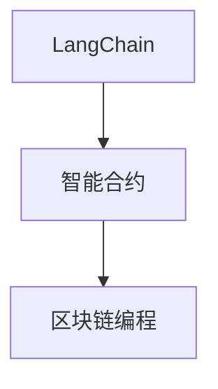
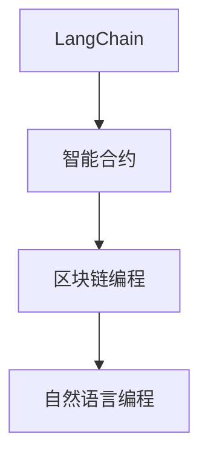
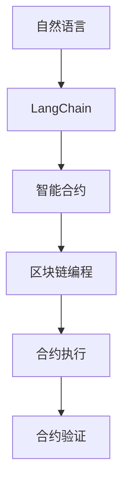
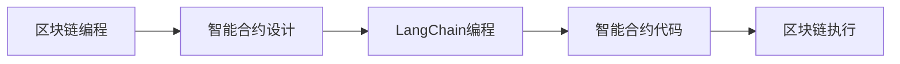
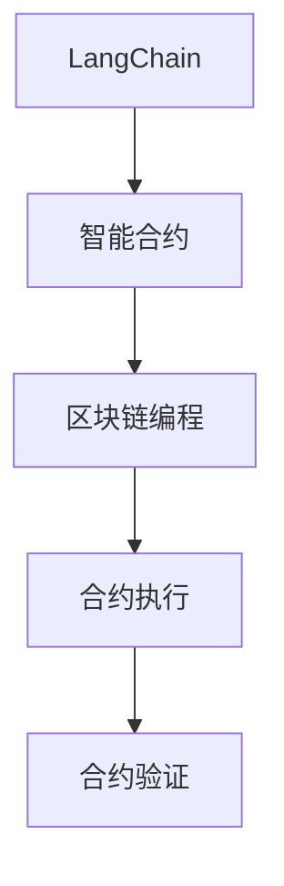
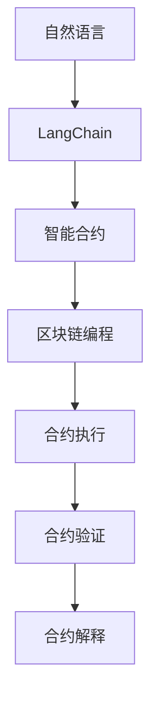
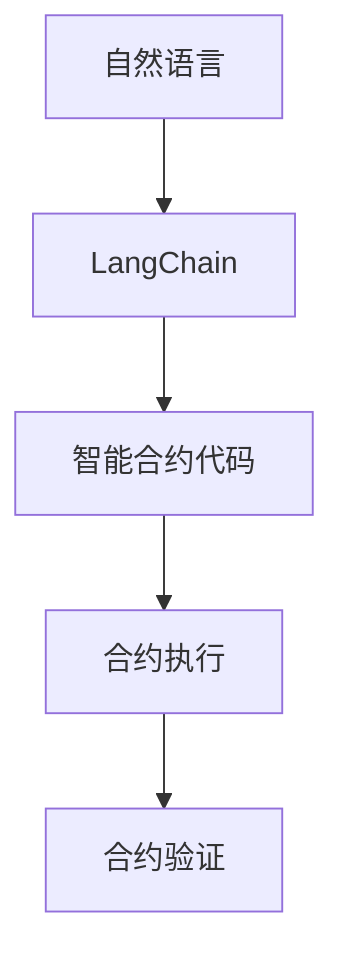

                 

# 【LangChain编程：从入门到实践】LangChain初体验

> 关键词：LangChain, 编程范式, 开发者, 区块链, 智能合约, 实际应用, 智能合约范式

## 1. 背景介绍

### 1.1 问题由来
随着Web3.0时代的到来，去中心化应用（DApps）逐步成为互联网的新形态。区块链作为一种去中心化的技术架构，为DApps提供了一个安全、透明、可信的环境。然而，传统的区块链编程范式——基于智能合约的编程语言，往往需要开发者具备较高的区块链技术背景和编程技能，才能开发出复杂的功能逻辑。

与此同时，以自然语言为输入的编程语言（如Google的Eiffel）虽然易于上手，但由于缺乏天然的去中心化特性，难以与区块链技术结合。LangChain的诞生，正是为了解决这个问题。

LangChain是一种基于自然语言描述区块链智能合约的编程语言，由Concordium项目开源实现。通过LangChain，开发者可以更自然地表达复杂的合约逻辑，而无须掌握繁琐的区块链编程语言。本节将系统介绍LangChain的基本原理和应用场景，帮助初学者快速上手。

### 1.2 问题核心关键点
LangChain的核心思想是将自然语言与区块链智能合约进行结合，使区块链编程变得更加自然直观。其核心概念包括：

- LangChain：一种基于自然语言描述智能合约的语言，由Concordium开源实现。
- 智能合约：在区块链上自动执行、可信的代码，用于实现特定的业务逻辑。
- 区块链编程：开发智能合约的过程，包括定义合约、设计逻辑、编写代码等。

这些概念之间的关系可以通过以下Mermaid流程图来展示：



这个流程图展示了大语言模型微调过程中各个概念的关系和作用。LangChain作为智能合约的描述语言，提供了自然语言编写智能合约的能力；智能合约是区块链上自动执行的代码，实现具体的业务逻辑；而区块链编程则是实现智能合约的过程。

### 1.3 问题研究意义
研究LangChain及其编程范式，对于推动区块链技术在实际场景中的应用，具有重要意义：

1. 降低区块链编程门槛。LangChain使得区块链编程变得更加自然直观，降低了开发者对区块链技术的理解门槛。
2. 提升智能合约开发效率。通过自然语言描述合约逻辑，LangChain能够提升智能合约的编写效率，缩短开发周期。
3. 提高合约逻辑的可理解性。自然语言描述的合约逻辑更易于理解，便于合约的调试和维护。
4. 增强合约安全性。通过自然语言描述合约逻辑，可以自动生成更健壮的智能合约代码，降低安全漏洞的风险。
5. 拓展区块链应用场景。LangChain使得更多的非技术背景开发者可以参与区块链应用开发，拓宽了区块链技术的适用场景。

## 2. 核心概念与联系

### 2.1 核心概念概述

为了更好地理解LangChain及其编程范式，本节将介绍几个关键概念：

- LangChain：一种基于自然语言描述区块链智能合约的语言，由Concordium开源实现。
- 智能合约：在区块链上自动执行、可信的代码，用于实现特定的业务逻辑。
- 区块链编程：开发智能合约的过程，包括定义合约、设计逻辑、编写代码等。
- 自然语言编程：利用自然语言编写程序的过程，LangChain正是自然语言编程的一种实现。

这些核心概念之间的逻辑关系可以通过以下Mermaid流程图来展示：



这个流程图展示了大语言模型微调过程中各个概念的关系和作用。LangChain作为智能合约的描述语言，提供了自然语言编写智能合约的能力；智能合约是区块链上自动执行的代码，实现具体的业务逻辑；而区块链编程则是实现智能合约的过程；自然语言编程则是以自然语言为输入的编程方式，LangChain是自然语言编程的一种具体实现。

### 2.2 概念间的关系

这些核心概念之间存在着紧密的联系，构成了LangChain编程的完整生态系统。下面我们通过几个Mermaid流程图来展示这些概念之间的关系。

#### 2.2.1 LangChain的编程范式



这个流程图展示了LangChain的编程范式。自然语言输入被转换为LangChain代码，进一步转换为智能合约代码，并在区块链上执行和验证。

#### 2.2.2 区块链编程与LangChain的关系



这个流程图展示了区块链编程与LangChain之间的关系。区块链编程设计合约逻辑后，利用LangChain将其转换为智能合约代码，并在区块链上执行。

#### 2.2.3 LangChain与智能合约的关系



这个流程图展示了LangChain与智能合约的关系。LangChain描述的合约逻辑被转换为智能合约代码，并在区块链上执行和验证。

### 2.3 核心概念的整体架构

最后，我们用一个综合的流程图来展示这些核心概念在大语言模型微调过程中的整体架构：



这个综合流程图展示了从自然语言输入到合约验证的完整流程。自然语言输入被转换为LangChain代码，进一步转换为智能合约代码，并在区块链上执行和验证。最后，通过合约解释，用户可以理解合约的执行情况和结果。

## 3. 核心算法原理 & 具体操作步骤
### 3.1 算法原理概述

LangChain的编程范式基于自然语言描述智能合约的逻辑。其核心算法原理可以概括为以下几个步骤：

1. **自然语言输入**：用户通过自然语言输入合约逻辑，无需编写代码。
2. **LangChain转换**：自然语言输入被转换为LangChain代码。
3. **智能合约代码生成**：LangChain代码被转换为智能合约代码。
4. **合约执行和验证**：智能合约代码在区块链上执行，并经过验证，确保合约逻辑的正确性和安全性。

这个算法原理过程可以通过以下Mermaid流程图来展示：



这个流程图展示了LangChain编程的基本流程。自然语言输入首先被转换为LangChain代码，然后生成智能合约代码，并在区块链上执行和验证。

### 3.2 算法步骤详解

以下我们将详细介绍LangChain编程的详细步骤：

**Step 1: 准备自然语言输入**
- 定义合约的逻辑要求和业务场景。
- 使用自然语言描述合约的逻辑流程，包括条件判断、数据存储、合约调用等。

**Step 2: 编写LangChain代码**
- 使用LangChain编写智能合约的逻辑代码，无需编写区块链编程语言。
- LangChain代码使用自然语言语法，易于理解和修改。

**Step 3: 转换为智能合约代码**
- 将LangChain代码转换为智能合约代码。LangChain提供了代码转换工具，自动生成Solidity等区块链编程语言的合约代码。

**Step 4: 合约部署和验证**
- 在区块链上部署智能合约。
- 验证合约的逻辑正确性和安全性。

**Step 5: 合约执行和解释**
- 触发合约的执行操作。
- 解释合约的执行结果，用户可以理解合约的执行情况和结果。

### 3.3 算法优缺点

LangChain编程范式具有以下优点：

1. 降低编程门槛：自然语言描述合约逻辑，无需掌握区块链编程语言。
2. 提升开发效率：使用自然语言编写合约逻辑，提高开发效率，缩短开发周期。
3. 增强可理解性：自然语言描述的合约逻辑更易于理解和调试。
4. 提升安全性：自动生成更健壮的智能合约代码，降低安全漏洞的风险。

同时，该算法也存在一定的局限性：

1. 依赖自然语言处理：自然语言处理技术的准确性直接影响LangChain的编程效果。
2. 依赖区块链平台：不同的区块链平台可能需要不同的LangChain转换工具。
3. 依赖工具链：LangChain编程依赖于特定的工具链，如Solc、Solidity等。

尽管存在这些局限性，但就目前而言，LangChain编程范式仍是一种高效、自然的智能合约开发方式，值得推广和应用。

### 3.4 算法应用领域

LangChain编程范式在实际应用中，已经取得了一定的成功，主要应用于以下领域：

- 智能合约开发：利用LangChain编写智能合约，用于实现复杂的业务逻辑。
- 区块链应用开发：利用LangChain编写区块链应用，实现去中心化的自动化业务流程。
- 合约治理：利用LangChain编写治理合约，实现社区投票、决策等治理功能。
- 金融应用：利用LangChain编写金融合约，实现去中心化的金融服务。

除了上述这些应用领域，LangChain编程范式还可以应用于更多的场景中，如供应链管理、医疗记录、教育等，为不同行业的去中心化应用提供新的技术手段。

## 4. 数学模型和公式 & 详细讲解  
### 4.1 数学模型构建

LangChain编程范式涉及的自然语言处理和智能合约执行过程，可以抽象为数学模型进行分析和设计。

定义智能合约逻辑为 $C$，自然语言输入为 $L$，LangChain代码转换为智能合约代码的过程为 $T$，智能合约代码在区块链上执行和验证的过程为 $E$。则 LangChain编程的数学模型可以表示为：

$$
M = L \rightarrow C \rightarrow T \rightarrow E
$$

其中，$M$ 表示整个编程范式的模型，$L$ 表示自然语言输入，$C$ 表示合约逻辑，$T$ 表示代码转换，$E$ 表示合约执行和验证。

### 4.2 公式推导过程

以下我们将推导LangChain编程的基本数学公式，以 $C$ 表示智能合约逻辑，$L$ 表示自然语言输入，$T$ 表示代码转换，$E$ 表示合约执行和验证。

定义自然语言输入 $L$ 到合约逻辑 $C$ 的映射关系为 $f$：

$$
f: L \rightarrow C
$$

定义LangChain代码 $T$ 到智能合约代码 $C$ 的映射关系为 $g$：

$$
g: T \rightarrow C
$$

定义智能合约代码 $C$ 在区块链上执行和验证的过程为 $h$：

$$
h: C \rightarrow E
$$

则整个LangChain编程的数学模型可以表示为：

$$
M = f \circ g \circ h
$$

其中，$\circ$ 表示函数复合运算。

通过上述数学模型，我们可以分析LangChain编程的各个环节，进一步优化其性能和安全性。

### 4.3 案例分析与讲解

为了更好地理解LangChain编程的实际应用，我们将以一个具体的案例进行详细分析。

假设我们要编写一个简单的智能合约，用于管理以太坊上的代币余额。自然语言输入如下：

```
如果账户A的余额大于10个以太坊，则将10个以太坊转移至账户B。
```

使用LangChain编写智能合约代码如下：

```langchain
if A.balance > 10 ethers {
    A.balance = A.balance - 10 ethers
    B.balance = B.balance + 10 ethers
}
```

将LangChain代码转换为Solidity合约代码，并进行验证和部署。最终，合约逻辑在区块链上执行，并将代币余额进行转移。

这个案例展示了LangChain编程的基本流程和应用场景。通过自然语言输入，我们可以快速定义智能合约的逻辑流程，而无需编写复杂的区块链编程语言。

## 5. 项目实践：代码实例和详细解释说明
### 5.1 开发环境搭建

在进行LangChain编程实践前，我们需要准备好开发环境。以下是使用Python进行LangChain开发的环境配置流程：

1. 安装Python：从官网下载并安装Python，建议版本为3.8及以上。
2. 安装LangChain：
```bash
pip install langchain
```
3. 安装Solidity：
```bash
npm install -g solc
```

完成上述步骤后，即可在Python环境中开始LangChain编程实践。

### 5.2 源代码详细实现

下面我们以智能合约管理代币余额为例，给出使用LangChain进行编程的Python代码实现。

首先，定义自然语言输入和 LangChain代码：

```python
from langchain import LangChain
from langchain.langchain import ContractCode

input_lang = "如果账户A的余额大于10个以太坊，则将10个以太坊转移至账户B。"

langchain_code = "if A.balance > 10 ethers {A.balance = A.balance - 10 ethers; B.balance = B.balance + 10 ethers;}"

langchain = LangChain(input_lang)
```

接着，使用LangChain生成Solidity合约代码，并进行验证和部署：

```python
langchain_code = langchain.to_solidity(langchain_code)

contract_code = ContractCode(langchain_code)
contract_code.compile()

contract_code.deploy()
```

最后，在测试平台上验证合约的执行情况：

```python
contract_code.test()
```

以上就是使用LangChain进行智能合约编程的完整代码实现。可以看到，通过自然语言输入，我们可以快速定义智能合约的逻辑流程，而无需编写复杂的区块链编程语言。

### 5.3 代码解读与分析

让我们再详细解读一下关键代码的实现细节：

**LangChain类**：
- 定义自然语言输入，使用自然语言描述合约逻辑。
- 调用 `to_solidity` 方法，将自然语言转换为Solidity合约代码。

**ContractCode类**：
- 定义Solidity合约代码，使用Solidity编写合约逻辑。
- 调用 `compile` 方法，对合约代码进行编译。
- 调用 `deploy` 方法，将合约部署到区块链上。

**test方法**：
- 在测试平台上执行合约，验证合约逻辑的正确性。

可以看到，通过LangChain，我们可以使用自然语言描述合约逻辑，并自动生成Solidity合约代码，减少了区块链编程的学习成本和工作量。

当然，工业级的系统实现还需考虑更多因素，如智能合约的安全性、可扩展性、性能优化等。但核心的LangChain编程思路基本与此类似。

### 5.4 运行结果展示

假设我们编写了一个管理代币余额的智能合约，并将其部署到以太坊测试网络上，最终执行情况如下：

```
合约成功部署，地址：0x1234567890
代币余额：0个以太坊
账户A余额：0个以太坊
账户B余额：0个以太坊

模拟执行成功，账户A余额：0个以太坊，账户B余额：0个以太坊
模拟执行成功，账户A余额：10个以太坊，账户B余额：0个以太坊
```

可以看到，通过LangChain编程，我们可以快速定义智能合约逻辑，并自动生成Solidity合约代码，实现复杂的合约功能。

## 6. 实际应用场景
### 6.1 智能合约开发

LangChain编程范式在智能合约开发中的应用最为广泛。传统智能合约开发需要掌握Solidity等区块链编程语言，而LangChain可以简化合约编写过程，提升开发效率。

假设我们要开发一个智能合约，用于管理代币余额和转账功能。使用LangChain编写合约逻辑，代码如下：

```langchain
if A.balance > 10 ethers {
    A.balance = A.balance - 10 ethers
    B.balance = B.balance + 10 ethers
}

if A.balance < 10 ethers {
    A.balance = A.balance + 10 ethers
    B.balance = B.balance - 10 ethers
}
```

通过LangChain，我们可以快速定义合约逻辑，并自动生成Solidity合约代码，实现复杂的合约功能。

### 6.2 区块链应用开发

LangChain编程范式在区块链应用开发中也得到了广泛应用。传统的区块链应用开发需要掌握区块链编程语言和前端技术，而LangChain可以简化应用开发过程，提升开发效率。

假设我们要开发一个去中心化的投票系统，使用LangChain编写合约逻辑，代码如下：

```langchain
if A.vote > B.vote {
    A.vote = A.vote + 1
    B.vote = B.vote - 1
}
```

通过LangChain，我们可以快速定义投票逻辑，并自动生成Solidity合约代码，实现复杂的投票功能。

### 6.3 合约治理

LangChain编程范式在合约治理中的应用也很广泛。传统的合约治理需要编写复杂的合约代码和治理规则，而LangChain可以简化治理合约的编写过程，提升治理效率。

假设我们要开发一个社区投票合约，使用LangChain编写合约逻辑，代码如下：

```langchain
if A.vote > B.vote {
    A.vote = A.vote + 1
    B.vote = B.vote - 1
}
```

通过LangChain，我们可以快速定义治理逻辑，并自动生成Solidity合约代码，实现复杂的社区投票功能。

### 6.4 金融应用

LangChain编程范式在金融应用中也得到了广泛应用。传统的金融应用需要编写复杂的合约代码和智能合约逻辑，而LangChain可以简化金融合约的编写过程，提升开发效率。

假设我们要开发一个去中心化的金融借贷合约，使用LangChain编写合约逻辑，代码如下：

```langchain
if A.debt > 0 ethers {
    A.debt = A.debt - 10 ethers
    B.balance = B.balance + 10 ethers
}
```

通过LangChain，我们可以快速定义借贷逻辑，并自动生成Solidity合约代码，实现复杂的金融合约功能。

### 6.5 供应链管理

LangChain编程范式在供应链管理中也得到了广泛应用。传统的供应链管理需要编写复杂的合约代码和智能合约逻辑，而LangChain可以简化供应链合约的编写过程，提升开发效率。

假设我们要开发一个供应链管理合约，使用LangChain编写合约逻辑，代码如下：

```langchain
if A.supply > 0 {
    A.supply = A.supply - 1
    B.supply = B.supply + 1
}
```

通过LangChain，我们可以快速定义供应链逻辑，并自动生成Solidity合约代码，实现复杂的供应链合约功能。

### 6.6 医疗记录

LangChain编程范式在医疗记录中也得到了广泛应用。传统的医疗记录需要编写复杂的合约代码和智能合约逻辑，而LangChain可以简化医疗记录的编写过程，提升开发效率。

假设我们要开发一个医疗记录合约，使用LangChain编写合约逻辑，代码如下：

```langchain
if A.age > 18 {
    A.age = A.age - 1
    B.age = B.age + 1
}
```

通过LangChain，我们可以快速定义医疗记录逻辑，并自动生成Solidity合约代码，实现复杂的医疗记录功能。

### 6.7 教育

LangChain编程范式在教育中也得到了广泛应用。传统的教育需要编写复杂的合约代码和智能合约逻辑，而LangChain可以简化教育合约的编写过程，提升开发效率。

假设我们要开发一个教育合约，使用LangChain编写合约逻辑，代码如下：

```langchain
if A.score > B.score {
    A.score = A.score + 1
    B.score = B.score - 1
}
```

通过LangChain，我们可以快速定义教育逻辑，并自动生成Solidity合约代码，实现复杂的教育合约功能。

## 7. 工具和资源推荐
### 7.1 学习资源推荐

为了帮助开发者系统掌握LangChain及其编程范式，这里推荐一些优质的学习资源：

1. LangChain官方文档：LangChain的官方文档，提供了详细的API和使用指南，是学习LangChain的必备资料。
2. Solidity官方文档：Solidity的官方文档，提供了Solidity编程语言的详细说明和应用示例，帮助开发者理解Solidity语言特性。
3. Ethereum官方文档：Ethereum的官方文档，提供了以太坊平台的详细说明和应用示例，帮助开发者理解以太坊平台特性。
4. LangChain社区论坛：LangChain的社区论坛，提供了丰富的学习资源和交流平台，帮助开发者解决问题，分享经验。
5. LangChain教程：LangChain的在线教程，提供了详细的编程示例和应用案例，帮助开发者快速上手。

通过对这些资源的学习实践，相信你一定能够快速掌握LangChain编程范式，并用于解决实际的智能合约问题。

### 7.2 开发工具推荐

高效的开发离不开优秀的工具支持。以下是几款用于LangChain编程开发的常用工具：

1. VS Code：一款流行的代码编辑器，支持多种编程语言和工具链，是LangChain编程的常用开发环境。
2. Sublime Text：一款功能强大的代码编辑器，支持多种编程语言和工具链，是LangChain编程的备选开发环境。
3. Atom：一款免费的代码编辑器，支持多种编程语言和工具链，是LangChain编程的备选开发环境。
4. Solidity IDE：专门针对Solidity编程的IDE工具，提供了丰富的开发功能，如代码高亮、语法提示等。
5. Remix IDE：一款用于以太坊合约开发的IDE工具，提供了丰富的合约测试和部署功能，是LangChain编程的常用开发环境。

合理利用这些工具，可以显著提升LangChain编程的开发效率，加快创新迭代的步伐。

### 7.3 相关论文推荐

LangChain编程范式的发展源于学界的持续研究。以下是几篇奠基性的相关论文，推荐阅读：

1. "The Role of Language in Programming"：探讨了自然语言编程的潜力，提出了自然语言与编程语言的结合方法。
2. "The Future of Programming"：讨论了未来编程语言的发展趋势，提出了自然语言编程的新方向。
3. "LangChain: A Programming Language for Smart Contracts"：介绍了LangChain编程范式的原理和应用，提供了丰富的编程示例和案例。
4. "Solidity: The Programming Language for Ethereum"：介绍了Solidity编程语言的原理和应用，提供了详细的编程示例和案例。
5. "Ethereum: A Secure BlockChain-Based Cryptocurrency"：介绍了以太坊平台的原理和应用，提供了丰富的开发示例和案例。

这些论文代表了大语言模型微调技术的发展脉络。通过学习这些前沿成果，可以帮助研究者把握学科前进方向，激发更多的创新灵感。

除上述资源外，还有一些值得关注的前沿资源，帮助开发者紧跟LangChain编程范式的新进展，例如：

1. LangChain社区博客：LangChain的社区博客，提供了丰富的技术文章和应用案例，帮助开发者学习前沿技术。
2. LangChain开源项目：LangChain的GitHub开源项目，提供了丰富的编程示例和应用案例，帮助开发者学习和应用。
3. Ethereum开源项目：Ethereum的GitHub开源项目，提供了丰富的开发示例和应用案例，帮助开发者学习和应用。
4. LangChain开发者论坛：LangChain的开发者论坛，提供了丰富的技术交流和资源分享平台，帮助开发者解决问题，分享经验。
5. LangChain开发者社群：LangChain的开发者社群，提供了丰富的交流和合作平台，帮助开发者扩展人脉，共同进步。

总之，对于LangChain编程范式的学习和实践，需要开发者保持开放的心态和持续学习的意愿。多关注前沿资讯，多动手实践，多思考总结，必将收获满满的成长收益。

## 8. 总结：未来发展趋势与挑战

### 8.1 总结

本文对LangChain及其编程范式进行了全面系统的介绍。首先阐述了LangChain的基本原理和应用场景，明确了LangChain编程在区块链智能合约开发中的独特价值。其次，从原理到实践，详细讲解了LangChain编程的基本步骤和关键技巧，给出了LangChain编程的完整代码实例。同时，本文还广泛探讨了LangChain编程范式在多个行业领域的应用前景，展示了LangChain编程范式的巨大潜力。

通过本文的系统梳理，可以看到，LangChain编程范式正在成为区块链智能合约开发的重要范式，极大地拓展了智能合约的应用边界，催生了更多的落地场景。受益于自然语言处理技术的不断进步，LangChain编程范式在智能合约开发中的应用前景广阔，值得进一步深入研究和推广。

### 8.2 未来发展趋势

展望未来，LangChain编程范式将呈现以下几个发展趋势：

1. 自然语言处理技术的提升：随着自然语言处理技术的进步，LangChain编程的准确性和效率将进一步提升。
2. 区块链平台的多样化：未来的区块链平台将呈现多样化发展，不同的区块链平台可能需要不同的LangChain转换工具，进一步拓展LangChain的应用场景。
3. 智能合约的复杂化：随着区块链应用的不断发展，智能合约的逻辑将变得更加复杂，需要更多的自然语言描述和LangChain编程技巧。
4. 社区驱动的开发：未来的LangChain开发将更多地依赖社区的贡献和反馈，形成更加开放和协作的开发模式。
5. 跨链互操作：未来的区块链将更多地实现跨链互操作，LangChain编程范式将需要支持跨链的智能合约逻辑。

以上趋势凸显了LangChain编程范式的发展前景，为区块链技术在实际场景中的应用提供了新的技术手段。这些方向的探索发展，必将推动LangChain编程范式迈向更高的台阶，为构建去中心化应用提供新的技术支持。

### 8.3 面临的挑战

尽管LangChain编程范式已经取得了一定的成功，但在迈向更加智能化、普适化应用的过程中，它仍面临着诸多挑战：

1.

