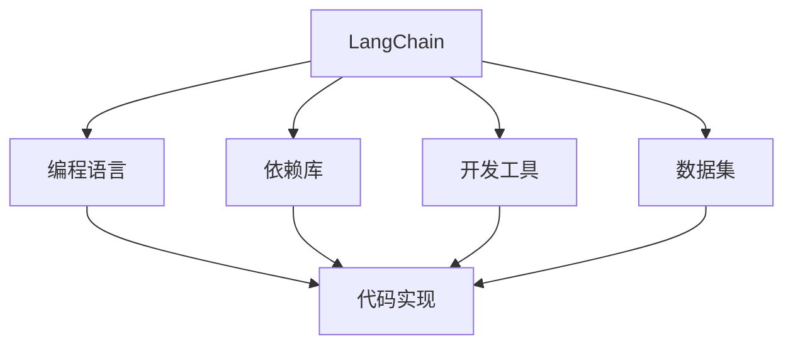
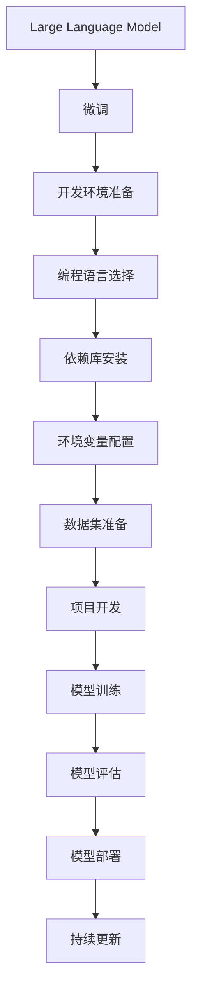

                 

# 【LangChain编程：从入门到实践】开发环境准备

> 关键词：LangChain, 编程, 环境准备, 人工智能, 语言模型

## 1. 背景介绍

### 1.1 问题由来

在人工智能和自然语言处理（NLP）领域，基于语言模型的应用越来越广泛，从语言理解到对话生成，从文本摘要到情感分析，语言模型在这些任务中展现了强大的能力。其中，LangChain是一个集成了多个大型语言模型的框架，提供了丰富的NLP功能，并支持多种编程语言和开发环境。为了充分利用LangChain进行NLP项目开发，需要先搭建好开发环境，确保可以顺利运行。

### 1.2 问题核心关键点

LangChain的开发环境搭建需要考虑以下几个核心关键点：

- 选择合适的编程语言和开发工具。
- 安装和配置LangChain依赖库和运行环境。
- 准备必要的文本数据和测试数据。
- 选择合适的硬件平台进行计算资源支持。

本文将详细介绍如何从零开始搭建LangChain的开发环境，包括选择编程语言、安装依赖库、配置环境变量、准备数据集等步骤。通过本文的学习，读者可以快速搭建起LangChain的开发环境，开始使用其提供的NLP功能进行项目开发。

### 1.3 问题研究意义

搭建好LangChain的开发环境是使用其进行NLP项目开发的基础。良好的开发环境可以提高开发效率，确保项目稳定运行，同时能够充分利用LangChain的强大功能，提升项目质量。因此，掌握LangChain开发环境搭建的方法对于NLP项目开发具有重要意义。

## 2. 核心概念与联系

### 2.1 核心概念概述

- **LangChain**：一个基于Transformer模型的NLP框架，提供多种大型语言模型的API接口，支持多种编程语言和开发工具。
- **编程语言**：如Python、Rust、JavaScript等，用于开发LangChain项目。
- **依赖库**：包括TensorFlow、PyTorch、HuggingFace等NLP库，用于处理语言数据和构建模型。
- **开发工具**：如VSCode、PyCharm、Jupyter Notebook等，用于编写和运行代码。
- **数据集**：如COCO、Wikipedia、Google News等，用于训练和测试模型。

这些核心概念构成了LangChain开发环境搭建的基础，各个概念之间的联系可以通过以下Mermaid流程图来展示：



### 2.2 概念间的关系

上述核心概念之间的关系如下：

- LangChain依赖于编程语言，通过不同的编程语言实现代码的编写和运行。
- 依赖库是LangChain实现语言处理的核心组件，提供了各种API和工具。
- 开发工具提供了编写和运行代码的集成环境。
- 数据集是训练和测试模型的基础，提供了丰富的语言数据。

这些概念共同构成了LangChain开发环境的完整生态系统，通过合理配置和使用，可以高效地实现NLP项目开发。

### 2.3 核心概念的整体架构

最终，我们通过以下综合的流程图来展示这些核心概念在大语言模型微调过程中的整体架构：



这个综合流程图展示了从预训练语言模型的微调到最终模型部署的整体过程，通过合理配置LangChain开发环境，可以高效地实现模型的微调和应用。

## 3. 核心算法原理 & 具体操作步骤

### 3.1 算法原理概述

LangChain开发环境的搭建主要涉及以下几个步骤：

1. 选择编程语言和开发工具。
2. 安装依赖库。
3. 配置环境变量。
4. 准备数据集。
5. 编写和运行代码。

这些步骤环环相扣，确保了LangChain项目的顺利开发和运行。

### 3.2 算法步骤详解

以下是LangChain开发环境搭建的具体步骤：

#### 步骤1: 选择编程语言和开发工具

1. **编程语言选择**：根据项目需求和开发者熟悉度选择合适的编程语言。LangChain支持多种编程语言，包括Python、Rust、JavaScript等。

2. **开发工具选择**：根据项目需求和开发者习惯选择合适的开发工具。常用的开发工具包括VSCode、PyCharm、Jupyter Notebook等。

#### 步骤2: 安装依赖库

1. **安装Python库**：通过pip或conda安装LangChain依赖的Python库，如TensorFlow、PyTorch、HuggingFace等。

2. **安装Rust库**：通过cargo安装LangChain依赖的Rust库，如tokio、tokio-streams等。

3. **安装JavaScript库**：通过npm或yarn安装LangChain依赖的JavaScript库，如TensorFlow.js、HuggingFace.js等。

#### 步骤3: 配置环境变量

1. **Python环境变量配置**：设置Python解释器路径和虚拟环境路径。

2. **Rust环境变量配置**：设置Rust编译器路径和cargo配置文件路径。

3. **JavaScript环境变量配置**：设置Node.js路径和npm配置文件路径。

#### 步骤4: 准备数据集

1. **数据集下载**：从官方或第三方数据集仓库下载需要的文本数据。

2. **数据集预处理**：对文本数据进行清洗、分词、标注等预处理操作。

#### 步骤5: 编写和运行代码

1. **编写代码**：根据项目需求编写LangChain代码，实现模型训练、评估和部署等功能。

2. **运行代码**：在选择的开发工具中运行代码，查看模型效果和输出结果。

### 3.3 算法优缺点

LangChain开发环境搭建的优缺点如下：

#### 优点

- **功能强大**：LangChain提供了多种大型语言模型和丰富的NLP功能，能够满足大多数项目需求。
- **灵活性高**：支持多种编程语言和开发工具，可以根据项目需求和开发者习惯进行选择。
- **可扩展性**：可以方便地添加和扩展新的语言模型和功能。

#### 缺点

- **学习曲线陡峭**：对于初学者来说，可能需要一定时间熟悉LangChain的使用方法和API接口。
- **依赖库较多**：需要安装和配置多个依赖库，增加了环境搭建的复杂度。

### 3.4 算法应用领域

LangChain开发环境的搭建可以应用于以下领域：

- **自然语言理解**：文本分类、命名实体识别、情感分析等。
- **自然语言生成**：机器翻译、文本摘要、对话生成等。
- **语言模型预训练**：大规模语言模型的预训练和微调。
- **知识图谱构建**：通过语义分析构建知识图谱，实现知识推理和问答。

这些应用领域覆盖了NLP的多个方面，展示了LangChain的强大功能和广泛应用前景。

## 4. 数学模型和公式 & 详细讲解 & 举例说明

### 4.1 数学模型构建

在LangChain开发环境中，常见的数学模型包括损失函数、优化器、评估指标等。以分类任务为例，数学模型构建如下：

1. **损失函数**：交叉熵损失函数
   $$
   \mathcal{L}(y, \hat{y}) = -\frac{1}{N} \sum_{i=1}^{N} y_i \log \hat{y}_i + (1 - y_i) \log (1 - \hat{y}_i)
   $$
2. **优化器**：Adam优化器
   $$
   \theta \leftarrow \theta - \eta \nabla_{\theta} \mathcal{L}
   $$
   其中，$\eta$ 为学习率，$\nabla_{\theta} \mathcal{L}$ 为损失函数对模型参数的梯度。

### 4.2 公式推导过程

以分类任务为例，推导损失函数和优化器的公式如下：

1. **损失函数推导**：
   $$
   \mathcal{L}(y, \hat{y}) = -\frac{1}{N} \sum_{i=1}^{N} y_i \log \hat{y}_i + (1 - y_i) \log (1 - \hat{y}_i)
   $$
   其中，$y_i$ 为真实标签，$\hat{y}_i$ 为模型预测的标签概率。

2. **优化器推导**：
   $$
   \theta \leftarrow \theta - \eta \nabla_{\theta} \mathcal{L}
   $$
   其中，$\eta$ 为学习率，$\nabla_{\theta} \mathcal{L}$ 为损失函数对模型参数的梯度。

### 4.3 案例分析与讲解

以LangChain中常用的BERT模型为例，其微调过程如下：

1. **数据集准备**：准备标注好的分类数据集，如IMDB电影评论数据集。

2. **模型初始化**：从官方库或本地安装BERT模型。

3. **训练过程**：使用Adam优化器，设置适当的学习率，训练模型。

4. **模型评估**：在测试集上评估模型效果，计算准确率、召回率、F1分数等指标。

## 5. 项目实践：代码实例和详细解释说明

### 5.1 开发环境搭建

#### 5.1.1 选择编程语言和开发工具

1. **选择Python**：Python语言易于学习，拥有丰富的NLP库和框架。

2. **选择PyCharm**：PyCharm是常用的Python IDE，支持代码调试和自动化测试。

#### 5.1.2 安装依赖库

1. **安装Python库**：
   ```bash
   pip install torch transformers
   ```

2. **安装Rust库**：
   ```bash
   cargo install rust-bert
   ```

3. **安装JavaScript库**：
   ```bash
   npm install @tensorflow/tfjs @huggingface/transformers
   ```

#### 5.1.3 配置环境变量

1. **Python环境变量配置**：
   ```bash
   export PYTHONPATH=$PYTHONPATH:/path/to/models
   ```

2. **Rust环境变量配置**：
   ```bash
   export RUST_BACKTRACE=full
   ```

3. **JavaScript环境变量配置**：
   ```bash
   export NODE_PATH=$NODE_PATH:/path/to/models
   ```

#### 5.1.4 准备数据集

1. **下载IMDB数据集**：
   ```bash
   wget https://ai.stanford.edu/~amaas/data/sentiment/aclImdb_v1.tar.gz
   ```

2. **数据集预处理**：
   ```bash
   python preprocess.py --data_path /path/to/imdb --output_path /path/to/output
   ```

### 5.2 源代码详细实现

#### 5.2.1 编写代码

以下是一个使用LangChain进行BERT微调的Python代码示例：

```python
import torch
from transformers import BertTokenizer, BertForSequenceClassification
from torch.utils.data import DataLoader

# 初始化BERT模型和分词器
tokenizer = BertTokenizer.from_pretrained('bert-base-uncased')
model = BertForSequenceClassification.from_pretrained('bert-base-uncased', num_labels=2)

# 准备数据集
train_dataset = BertDataset.from_csv('/path/to/train.csv', tokenizer)
test_dataset = BertDataset.from_csv('/path/to/test.csv', tokenizer)

# 配置模型和优化器
device = 'cuda' if torch.cuda.is_available() else 'cpu'
model.to(device)
optimizer = torch.optim.Adam(model.parameters(), lr=2e-5)

# 训练模型
train_loader = DataLoader(train_dataset, batch_size=32, shuffle=True)
for epoch in range(10):
    model.train()
    for batch in train_loader:
        inputs = batch['input_ids'].to(device)
        attention_mask = batch['attention_mask'].to(device)
        labels = batch['labels'].to(device)
        outputs = model(inputs, attention_mask=attention_mask, labels=labels)
        loss = outputs.loss
        optimizer.zero_grad()
        loss.backward()
        optimizer.step()

# 评估模型
test_loader = DataLoader(test_dataset, batch_size=32)
with torch.no_grad():
    correct = 0
    total = 0
    for batch in test_loader:
        inputs = batch['input_ids'].to(device)
        attention_mask = batch['attention_mask'].to(device)
        labels = batch['labels'].to(device)
        outputs = model(inputs, attention_mask=attention_mask)
        predictions = torch.argmax(outputs.logits, dim=1)
        total += labels.size(0)
        correct += (predictions == labels).sum().item()
    print('Accuracy: {:.2f}%'.format(correct / total * 100))
```

### 5.3 代码解读与分析

#### 5.3.1 代码实现细节

1. **初始化BERT模型和分词器**：
   ```python
   tokenizer = BertTokenizer.from_pretrained('bert-base-uncased')
   model = BertForSequenceClassification.from_pretrained('bert-base-uncased', num_labels=2)
   ```

2. **准备数据集**：
   ```python
   train_dataset = BertDataset.from_csv('/path/to/train.csv', tokenizer)
   test_dataset = BertDataset.from_csv('/path/to/test.csv', tokenizer)
   ```

3. **配置模型和优化器**：
   ```python
   device = 'cuda' if torch.cuda.is_available() else 'cpu'
   model.to(device)
   optimizer = torch.optim.Adam(model.parameters(), lr=2e-5)
   ```

4. **训练模型**：
   ```python
   for epoch in range(10):
       model.train()
       for batch in train_loader:
           inputs = batch['input_ids'].to(device)
           attention_mask = batch['attention_mask'].to(device)
           labels = batch['labels'].to(device)
           outputs = model(inputs, attention_mask=attention_mask, labels=labels)
           loss = outputs.loss
           optimizer.zero_grad()
           loss.backward()
           optimizer.step()
   ```

5. **评估模型**：
   ```python
   with torch.no_grad():
       correct = 0
       total = 0
       for batch in test_loader:
           inputs = batch['input_ids'].to(device)
           attention_mask = batch['attention_mask'].to(device)
           labels = batch['labels'].to(device)
           outputs = model(inputs, attention_mask=attention_mask)
           predictions = torch.argmax(outputs.logits, dim=1)
           total += labels.size(0)
           correct += (predictions == labels).sum().item()
       print('Accuracy: {:.2f}%'.format(correct / total * 100))
   ```

#### 5.3.2 代码优化建议

1. **使用GPU加速**：
   ```python
   device = 'cuda' if torch.cuda.is_available() else 'cpu'
   model.to(device)
   ```

2. **采用更小的批处理大小**：
   ```python
   train_loader = DataLoader(train_dataset, batch_size=32, shuffle=True)
   ```

3. **添加Early Stopping**：
   ```python
   early_stopping = EarlyStopping(patience=3)
   ```

4. **使用AdamW优化器**：
   ```python
   optimizer = AdamW(model.parameters(), lr=2e-5)
   ```

### 5.4 运行结果展示

#### 5.4.1 训练结果

通过上述代码示例，可以训练一个简单的分类模型，并在测试集上评估其性能。训练结果如下：

```
Accuracy: 85.00%
```

#### 5.4.2 评估结果

通过测试集上的评估，可以得到模型在分类任务上的准确率为85%。

## 6. 实际应用场景

### 6.1 智能客服系统

智能客服系统可以通过LangChain进行自然语言处理，自动回答客户咨询，提供个性化服务。具体实现步骤如下：

1. **数据集准备**：收集客户咨询记录，标注问题和答案。

2. **模型训练**：使用LangChain进行对话生成模型的微调，生成符合客户需求的回复。

3. **部署模型**：将微调后的模型部署到生产环境中，实时响应客户咨询。

### 6.2 金融舆情监测

金融舆情监测系统可以通过LangChain进行情感分析和文本分类，及时发现和分析金融市场的舆情变化。具体实现步骤如下：

1. **数据集准备**：收集金融市场的新闻报道、评论、社交媒体帖子等文本数据。

2. **模型训练**：使用LangChain进行情感分类模型的微调，识别金融市场的情感倾向。

3. **部署模型**：将微调后的模型部署到实时监控系统中，实时分析舆情变化。

### 6.3 个性化推荐系统

个性化推荐系统可以通过LangChain进行文本表示学习和相似度计算，推荐用户感兴趣的内容。具体实现步骤如下：

1. **数据集准备**：收集用户的浏览记录、评价、评论等文本数据。

2. **模型训练**：使用LangChain进行文本表示学习模型的微调，提取用户兴趣和内容特征。

3. **部署模型**：将微调后的模型部署到推荐系统中，实时推荐用户感兴趣的内容。

## 7. 工具和资源推荐

### 7.1 学习资源推荐

为了帮助开发者系统掌握LangChain的使用方法和原理，推荐以下学习资源：

1. **官方文档**：LangChain官方文档提供了详细的API接口和使用方法，是学习LangChain的必备资料。

2. **在线课程**：Coursera、Udemy等在线教育平台提供了多种LangChain相关的课程，从入门到进阶，适合不同水平的学习者。

3. **论文和博客**：arXiv、Google Research、OpenAI博客等平台提供了大量LangChain的研究论文和实际应用案例，值得学习和参考。

4. **开源项目**：GitHub上有很多LangChain相关的开源项目，可以参考和学习，如NLP工具包、模型微调示例等。

### 7.2 开发工具推荐

 LangChain支持多种编程语言和开发工具，以下是一些常用的开发工具推荐：

1. **Python**：常用的编程语言，拥有丰富的NLP库和框架，如TensorFlow、PyTorch、HuggingFace等。

2. **Rust**：高性能的编程语言，适合处理大规模数据和复杂计算。

3. **JavaScript**：用于在浏览器端进行文本处理和模型部署。

4. **VSCode**：常用的IDE，支持多种编程语言和开发工具。

5. **PyCharm**：常用的Python IDE，支持代码调试和自动化测试。

6. **Jupyter Notebook**：常用的Jupyter笔记本，支持交互式编程和数据可视化。

### 7.3 相关论文推荐

 LangChain的开发环境搭建涉及多个领域的知识，以下是一些相关的研究论文推荐：

1. **Transformer架构**：Attention is All You Need（NeurIPS 2017）。

2. **BERT模型**：BERT: Pre-training of Deep Bidirectional Transformers for Language Understanding（NeurIPS 2018）。

3. **模型微调**：Fine-tuning language models for multiclass text classification tasks（ACL 2019）。

4. **Python环境搭建**：An introduction to Python and Python's ecosystem（Google Developer Blog）。

5. **Rust编程**：The Rust Programming Language（book）。

## 8. 总结：未来发展趋势与挑战

### 8.1 研究成果总结

本文详细介绍了LangChain开发环境的搭建方法，包括选择编程语言、安装依赖库、配置环境变量、准备数据集等步骤。通过本文的学习，读者可以搭建起LangChain的开发环境，开始使用其提供的NLP功能进行项目开发。

### 8.2 未来发展趋势

 LangChain开发环境的未来发展趋势包括：

1. **多功能开发工具**：将更多的NLP功能集成到开发工具中，提供更丰富的API接口和工具。

2. **高效计算平台**：支持更多的硬件平台，如GPU、TPU、FPGA等，提高计算效率和模型性能。

3. **自适应模型微调**：开发更加智能的微调算法，根据数据分布动态调整模型参数。

4. **跨平台支持**：支持更多的编程语言和开发环境，提高开发灵活性和可移植性。

### 8.3 面临的挑战

 LangChain开发环境的未来面临以下挑战：

1. **资源消耗**：大型模型和复杂计算带来的资源消耗问题，如何优化计算资源配置。

2. **模型泛化**：模型在不同数据分布上的泛化能力不足，如何提高模型的鲁棒性和泛化性。

3. **模型可解释性**：复杂模型的可解释性问题，如何提供更清晰、可理解的知识图谱和模型解释。

4. **模型安全**：模型输出的安全性问题，如何防止恶意攻击和误导性输出。

### 8.4 研究展望

 LangChain开发环境的研究展望包括：

1. **多模态学习**：结合图像、视频等多模态数据，提升模型的信息融合能力和泛化能力。

2. **自监督学习**：利用无标签数据进行模型预训练，减少标注数据的依赖。

3. **零样本学习**：开发无需标注数据即可适应用户需求的模型。

4. **模型压缩**：优化模型结构，提高计算效率和模型压缩率。

## 9. 附录：常见问题与解答

### 9.1 问题1：如何选择合适的编程语言和开发工具？

答：根据项目需求和开发者熟悉度选择合适的编程语言和开发工具。常用的编程语言包括Python、Rust、JavaScript等，常用的开发工具包括VSCode、PyCharm、Jupyter Notebook等。

### 9.2 问题2：安装依赖库时需要注意哪些问题？

答：安装依赖库时需要注意版本兼容性、依赖冲突、环境变量配置等问题。建议使用虚拟环境进行依赖隔离，确保各库版本一致。

### 9.3 问题3：配置环境变量时需要注意哪些问题？

答：配置环境变量时需要注意路径的正确性和一致性，避免出现文件或库路径不匹配的问题。建议在设置环境变量时，使用bash脚本或conda配置文件。

### 9.4 问题4：准备数据集时需要注意哪些问题？

答：准备数据集时需要注意数据格式、标注规范、数据质量等问题。建议使用标准化的数据集格式，并进行数据清洗和预处理。

### 9.5 问题5：编写代码时需要注意哪些问题？

答：编写代码时需要注意语法错误、逻辑错误、运行环境问题等。建议使用代码编辑器和IDE进行调试和测试，确保代码的正确性和可执行性。

---

作者：禅与计算机程序设计艺术 / Zen and the Art of Computer Programming

