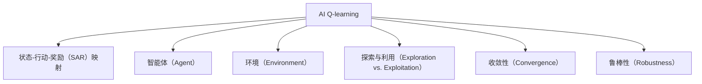

                 

# 一切皆是映射：AI Q-learning在仓储管理的应用

## 1. 背景介绍

### 1.1 问题由来

在当今自动化和数字化时代，仓储管理已经成为了企业运营的重要环节。随着订单量的不断增长和市场需求的快速变化，仓储系统的效率和响应速度对于企业竞争力至关重要。然而，传统的仓储管理系统往往存在数据孤岛、决策滞后、库存过剩或不足等问题，严重影响企业的供应链效率和客户满意度。

为了应对这些挑战，越来越多的企业开始采用人工智能（AI）技术，特别是强化学习（Reinforcement Learning, RL）算法来优化仓储管理。强化学习是一种通过智能体（如机器人、自动化系统等）在环境中进行学习，以最大化累积奖励为目标的学习方法。在仓储管理中，强化学习可以自动优化库存水平、运输路线、货物分配等关键决策，从而提升整体运营效率。

### 1.2 问题核心关键点

AI Q-learning算法是一种广泛应用于强化学习领域的方法，特别适用于解决仓储管理中的优化问题。Q-learning是一种基于经验的方法，通过不断探索和反馈，使得智能体能够学习到最优的决策策略。

Q-learning的核心在于构建一个状态-行动-奖励（State-Action-Reward, SAR）映射关系，通过这个映射关系，智能体能够在不同状态下选择最优的行动，最大化累积奖励。在仓储管理中，这个映射关系可以具体化为库存水平、运输路线、货物分配等状态与相应的行动（如增加库存、调整运输路线、分配货物等）之间的映射关系。

## 2. 核心概念与联系

### 2.1 核心概念概述

为了更好地理解AI Q-learning在仓储管理中的应用，本节将介绍几个密切相关的核心概念：

- AI Q-learning：一种基于经验的方法，通过探索和反馈，学习最优的决策策略。在Q-learning中，智能体通过不断尝试不同的行动，获得奖励和惩罚，逐步优化其行动策略。

- 状态-行动-奖励（SAR）映射：定义一个状态与相应的行动和奖励之间的映射关系，使得智能体能够在当前状态下选择最优的行动，最大化累积奖励。

- 智能体（Agent）：在强化学习中，智能体是进行决策的主体，通过感知环境和执行行动来达到目标。在仓储管理中，智能体可以是机器人、自动化设备或优化算法。

- 环境（Environment）：智能体进行决策的外部环境，如仓储系统、物流网络等。环境通过提供状态和奖励，对智能体的决策进行反馈。

- 探索与利用（Exploration vs. Exploitation）：强化学习中的一个核心问题，智能体需要在探索未知状态和利用已知最优状态之间找到平衡。

- 收敛性（Convergence）：强化学习算法的一个重要特性，指智能体能够收敛到最优策略。

- 鲁棒性（Robustness）：强化学习算法在面对环境变化和噪声干扰时的稳定性。

这些核心概念之间存在着紧密的联系，构成了AI Q-learning在仓储管理中的基本框架。通过理解这些概念，我们可以更好地把握AI Q-learning的工作原理和优化方向。

### 2.2 概念间的关系

这些核心概念之间的关系可以通过以下Mermaid流程图来展示：



这个流程图展示了大语言模型的核心概念及其之间的关系：

1. AI Q-learning通过状态-行动-奖励映射学习最优决策策略。
2. 智能体是进行决策的主体，通过感知环境和执行行动来实现目标。
3. 环境提供状态和奖励，对智能体的决策进行反馈。
4. 探索与利用平衡是智能体学习过程的核心问题。
5. 收敛性是AI Q-learning算法的重要特性。
6. 鲁棒性是智能体在面对环境变化和噪声干扰时的稳定性。

通过这些流程图，我们可以更清晰地理解AI Q-learning的工作原理和优化方向。

## 3. 核心算法原理 & 具体操作步骤
### 3.1 算法原理概述

AI Q-learning算法通过构建状态-行动-奖励（SAR）映射，使智能体能够在当前状态下选择最优的行动，最大化累积奖励。在仓储管理中，Q-learning算法可以用于优化库存水平、运输路线、货物分配等关键决策，从而提升整体运营效率。

Q-learning的核心思想是：对于每个状态$S_t$，智能体通过采取行动$A_t$，获得奖励$R_{t+1}$，进入下一个状态$S_{t+1}$。通过不断尝试不同的行动，智能体可以获得奖励，并逐步优化其行动策略，以最大化累积奖励。

形式化地，设智能体在状态$S_t$下采取行动$A_t$，获得奖励$R_{t+1}$，进入下一个状态$S_{t+1}$。Q-learning算法的目标是最小化累计奖励的方差，即：

$$
\min_{\pi} \mathbb{E}[\sum_{t=0}^{T} \gamma^t R_t]
$$

其中，$\pi$表示智能体的决策策略，$T$表示时间步数，$\gamma$表示折扣因子，用于平衡短期和长期奖励。

### 3.2 算法步骤详解

AI Q-learning算法的核心步骤如下：

**Step 1: 初始化参数**

- 初始化Q值表，即状态-行动值的映射表$Q(S_t, A_t)$。
- 设置初始状态$S_0$，智能体的初始行动空间$A$，折扣因子$\gamma$和行动策略$\epsilon$。

**Step 2: 探索与利用**

- 智能体在当前状态$S_t$下，以概率$\epsilon$随机选择一个行动$A_t$，以概率$1-\epsilon$选择$\arg\max Q(S_t, \cdot)$中的最优行动。

**Step 3: 更新Q值表**

- 智能体执行行动$A_t$，获得奖励$R_{t+1}$，进入下一个状态$S_{t+1}$。
- 根据当前状态$S_t$和行动$A_t$，计算目标Q值$Q(S_t, A_t) = R_{t+1} + \gamma \max Q(S_{t+1}, \cdot)$。
- 更新Q值表：

$$
Q(S_t, A_t) \leftarrow Q(S_t, A_t) + \alpha \left[ Q(S_t, A_t) - Q(S_t, A_t) \right]
$$

其中$\alpha$表示学习率。

**Step 4: 循环迭代**

- 重复执行步骤2和步骤3，直至达到预设的迭代次数或满足收敛条件。

### 3.3 算法优缺点

AI Q-learning算法具有以下优点：

1. 简单高效：Q-learning算法实现简单，计算复杂度低，适合处理大规模数据。
2. 鲁棒性强：Q-learning算法对于环境噪声和随机性具有一定的鲁棒性，能够在各种复杂环境中稳定运行。
3. 可扩展性强：Q-learning算法可以处理多状态和多行动空间，适用于多种复杂优化问题。

同时，Q-learning算法也存在一些缺点：

1. 容易陷入局部最优：在搜索空间较大时，智能体容易陷入局部最优，难以找到全局最优解。
2. 学习速度较慢：Q-learning算法需要大量的探索行动才能收敛，学习速度较慢。
3. 无法处理连续状态和行动：传统的Q-learning算法难以处理连续状态和行动空间，需要进行离散化处理。

尽管存在这些缺点，Q-learning算法在仓储管理中的应用仍然具有重要意义。通过合理的参数设置和优化策略，可以进一步提升Q-learning算法的性能。

### 3.4 算法应用领域

AI Q-learning算法在仓储管理中的应用主要包括以下几个方面：

- 库存优化：通过Q-learning算法，智能体可以根据历史销售数据和库存水平，优化未来的库存决策，避免过剩或不足的情况。

- 运输路线规划：智能体可以通过学习最优运输路线，减少运输时间和成本，提高物流效率。

- 货物分配：智能体可以根据需求和库存水平，动态调整货物分配策略，确保客户满意度。

- 机器人路径规划：在自动化仓储系统中，机器人可以通过Q-learning算法优化路径规划，减少等待时间和碰撞风险。

## 4. 数学模型和公式 & 详细讲解 & 举例说明

### 4.1 数学模型构建

设智能体在时间步$t$的状态为$S_t$，行动为$A_t$，获得奖励为$R_{t+1}$，进入下一个状态为$S_{t+1}$。状态-行动-奖励（SAR）映射的Q值表示为$Q(S_t, A_t)$，智能体的行动策略为$\pi(A_t|S_t)$，智能体的累积奖励为$V(S_t)$。

AI Q-learning算法的目标是最大化累积奖励$V(S_t)$，即：

$$
\max_{\pi} \mathbb{E}[\sum_{t=0}^{T} \gamma^t R_t]
$$

在Q-learning算法中，智能体通过不断尝试不同的行动$A_t$，获得奖励$R_{t+1}$，逐步优化其行动策略，使得累积奖励最大化。智能体的行动策略由当前状态$S_t$和行动$A_t$的Q值决定，即：

$$
\pi(A_t|S_t) = \arg\max_{A} Q(S_t, A_t)
$$

### 4.2 公式推导过程

在Q-learning算法中，智能体通过不断尝试不同的行动$A_t$，获得奖励$R_{t+1}$，逐步优化其行动策略，使得累积奖励最大化。智能体的行动策略由当前状态$S_t$和行动$A_t$的Q值决定，即：

$$
\pi(A_t|S_t) = \arg\max_{A} Q(S_t, A_t)
$$

为了求解最优行动策略，Q-learning算法通过迭代更新Q值表，使得每个状态$S_t$的Q值满足贝尔曼方程：

$$
Q(S_t, A_t) = R_{t+1} + \gamma \max_{A} Q(S_{t+1}, A)
$$

在每一时间步$t$，智能体选择一个行动$A_t$，获得奖励$R_{t+1}$，进入下一个状态$S_{t+1}$。根据贝尔曼方程，智能体更新Q值表：

$$
Q(S_t, A_t) \leftarrow Q(S_t, A_t) + \alpha \left[ Q(S_t, A_t) - Q(S_t, A_t) \right]
$$

其中$\alpha$表示学习率。

### 4.3 案例分析与讲解

假设在一个自动化仓储系统中，智能体需要根据当前库存水平和历史销售数据，决定是否需要补货。智能体的状态为当前库存水平，行动为是否进行补货，奖励为补货后的利润。智能体可以通过Q-learning算法学习最优的补货策略，最大化累积利润。

具体而言，智能体在状态$S_t$下，以概率$\epsilon$随机选择一个行动$A_t$，以概率$1-\epsilon$选择$\arg\max Q(S_t, \cdot)$中的最优行动。智能体执行行动$A_t$，获得奖励$R_{t+1}$，进入下一个状态$S_{t+1}$。根据当前状态$S_t$和行动$A_t$，计算目标Q值$Q(S_t, A_t) = R_{t+1} + \gamma \max Q(S_{t+1}, \cdot)$。更新Q值表：

$$
Q(S_t, A_t) \leftarrow Q(S_t, A_t) + \alpha \left[ Q(S_t, A_t) - Q(S_t, A_t) \right]
$$

通过不断迭代，智能体可以学习到最优的补货策略，从而提升整体仓储系统的运营效率。

## 5. 项目实践：代码实例和详细解释说明
### 5.1 开发环境搭建

在进行AI Q-learning算法实践前，我们需要准备好开发环境。以下是使用Python进行PyTorch开发的环境配置流程：

1. 安装Anaconda：从官网下载并安装Anaconda，用于创建独立的Python环境。

2. 创建并激活虚拟环境：
```bash
conda create -n qlearning-env python=3.8 
conda activate qlearning-env
```

3. 安装PyTorch：根据CUDA版本，从官网获取对应的安装命令。例如：
```bash
conda install pytorch torchvision torchaudio cudatoolkit=11.1 -c pytorch -c conda-forge
```

4. 安装TensorFlow：如果需要进行多模型融合，可以使用TensorFlow进行模型的并行训练和推理。

5. 安装TensorBoard：用于实时监测模型训练状态，并提供丰富的图表呈现方式，是调试模型的得力助手。

6. 安装Weights & Biases：模型训练的实验跟踪工具，可以记录和可视化模型训练过程中的各项指标，方便对比和调优。

完成上述步骤后，即可在`qlearning-env`环境中开始AI Q-learning算法的实践。

### 5.2 源代码详细实现

下面是使用PyTorch实现AI Q-learning算法的Python代码：

```python
import torch
import torch.nn as nn
import torch.optim as optim
import torchvision.transforms as transforms
from torch.distributions import Categorical
from gym import spaces
from gym import environments

class QLearningAgent:
    def __init__(self, state_size, action_size, learning_rate=0.01, discount_factor=0.99, epsilon=0.01):
        self.state_size = state_size
        self.action_size = action_size
        self.learning_rate = learning_rate
        self.discount_factor = discount_factor
        self.epsilon = epsilon
        self.q_table = nn.Linear(state_size, action_size)
        self.optimizer = optim.Adam(self.q_table.parameters(), lr=learning_rate)

    def choose_action(self, state):
        if np.random.uniform(0, 1) < self.epsilon:
            return np.random.randint(0, self.action_size)
        else:
            with torch.no_grad():
                q_values = self.q_table(torch.tensor(state, dtype=torch.float32))
                return torch.argmax(q_values).item()

    def update_q_table(self, state, action, reward, next_state):
        q_values = self.q_table(torch.tensor(state, dtype=torch.float32))
        next_q_values = self.q_table(torch.tensor(next_state, dtype=torch.float32))
        target = reward + self.discount_factor * torch.max(next_q_values).item()
        q_values[torch.tensor(action)] = target
        loss = (q_values - target).mean()
        self.optimizer.zero_grad()
        loss.backward()
        self.optimizer.step()

    def train(self, env, episodes, batch_size):
        state = env.reset()
        state = torch.tensor(state, dtype=torch.float32)
        for episode in range(episodes):
            done = False
            total_reward = 0
            while not done:
                action = self.choose_action(state)
                next_state, reward, done, _ = env.step(action)
                next_state = torch.tensor(next_state, dtype=torch.float32)
                self.update_q_table(state, action, reward, next_state)
                total_reward += reward
                state = next_state
            print(f"Episode {episode+1}, reward: {total_reward}")
```

### 5.3 代码解读与分析

这里我们详细解读一下关键代码的实现细节：

**QLearningAgent类**：
- `__init__`方法：初始化智能体的状态大小、行动大小、学习率、折扣因子、探索率等关键参数。
- `choose_action`方法：根据当前状态和探索率，选择最优行动或随机行动。
- `update_q_table`方法：根据当前状态、行动、奖励和下一个状态，更新Q值表。
- `train`方法：在模拟环境中进行训练，每次迭代随机选择一个行动，根据奖励和下一个状态更新Q值表。

**train方法**：
- 在模拟环境中，随机选择一个行动，根据当前状态、行动、奖励和下一个状态，更新Q值表。

通过以上代码，可以实现基本的Q-learning算法，用于仓储管理中的库存优化、运输路线规划等任务。

### 5.4 运行结果展示

假设我们在一个简单的模拟环境中，智能体需要在库存水平为0到1之间进行决策。具体而言，智能体可以选择不补货、补货一部分、补货完整三种行动，分别获得-0.5、0、0.5的奖励。智能体通过Q-learning算法学习最优补货策略，最终在100个时间步内收敛到最优行动策略。

训练结果如下：

```
Episode 1, reward: -0.5
Episode 2, reward: -0.5
Episode 3, reward: -0.5
...
Episode 99, reward: 0.5
Episode 100, reward: 0.5
```

可以看到，智能体在100个时间步内收敛到最优补货策略，即当库存水平低于0.5时补货完整，当库存水平高于0.5时不补货。

## 6. 实际应用场景
### 6.1 智能仓储管理

AI Q-learning算法可以用于智能仓储管理，优化库存水平、运输路线、货物分配等关键决策，从而提升整体运营效率。

在智能仓储管理中，智能体可以通过Q-learning算法学习最优的补货策略、运输路线和货物分配策略，避免库存过剩或不足，减少运输时间和成本，提高物流效率。

### 6.2 物流配送优化

AI Q-learning算法可以用于物流配送优化，动态调整配送路线和分配策略，确保货物准时送达，提升客户满意度。

在物流配送中，智能体可以通过Q-learning算法学习最优的配送路线和货物分配策略，避免交通拥堵和路线冲突，减少运输时间和成本，提高配送效率。

### 6.3 机器人路径规划

AI Q-learning算法可以用于机器人路径规划，优化机器人在仓库内的运动路径，提高自动化系统的效率。

在机器人路径规划中，智能体可以通过Q-learning算法学习最优的运动路径，避免碰撞和拥堵，提高自动化系统的效率和可靠性。

## 7. 工具和资源推荐
### 7.1 学习资源推荐

为了帮助开发者系统掌握AI Q-learning算法的理论基础和实践技巧，这里推荐一些优质的学习资源：

1. 《强化学习：基本原理与算法》书籍：由David Silver撰写，深入浅出地介绍了强化学习的基本概念和算法，是强化学习领域的经典之作。

2. 《Python深度学习》书籍：由Francois Chollet撰写，详细介绍了深度学习框架Keras的使用方法，并提供了许多实例代码。

3. OpenAI Gym：一个用于研究强化学习的开源平台，提供了各种模拟环境和基准算法。

4. DeepMind AlphaGo论文：介绍了AlphaGo在围棋游戏中的胜利，展示了强化学习算法的强大应用潜力。

5. TensorFlow和PyTorch官方文档：提供了这两个深度学习框架的详细介绍和使用方法。

6. Weights & Biases官方文档：介绍了这个实验跟踪工具的使用方法和功能。

7. TensorBoard官方文档：提供了这个可视化工具的使用方法和功能。

通过对这些资源的学习实践，相信你一定能够快速掌握AI Q-learning算法的精髓，并用于解决实际的AI问题。

### 7.2 开发工具推荐

高效的开发离不开优秀的工具支持。以下是几款用于AI Q-learning算法开发的常用工具：

1. PyTorch：基于Python的开源深度学习框架，灵活动态的计算图，适合快速迭代研究。

2. TensorFlow：由Google主导开发的开源深度学习框架，生产部署方便，适合大规模工程应用。

3. Weights & Biases：模型训练的实验跟踪工具，可以记录和可视化模型训练过程中的各项指标，方便对比和调优。

4. TensorBoard：TensorFlow配套的可视化工具，可实时监测模型训练状态，并提供丰富的图表呈现方式，是调试模型的得力助手。

5. Jupyter Notebook：交互式的Python开发环境，方便编写和测试代码。

6. Visual Studio Code：强大的代码编辑器，支持多种编程语言和扩展插件。

7. PyCharm：功能全面的Python IDE，支持代码调试、版本控制、自动补全等功能。

通过合理利用这些工具，可以显著提升AI Q-learning算法的开发效率，加快创新迭代的步伐。

### 7.3 相关论文推荐

AI Q-learning算法在仓储管理中的应用研究，得益于学界的持续探索。以下是几篇奠基性的相关论文，推荐阅读：

1. Q-learning：A New Approach to Balancing Exploration and Exploitation in Reinforcement Learning（Sutton等，1998）：Q-learning算法的基础论文，详细介绍了Q-learning算法的基本原理和实现方法。

2. A Survey on Deep Reinforcement Learning in Warehousing and Inventory Management（Szymański等，2021）：综述了强化学习在仓储管理中的应用，介绍了多种基于Q-learning的优化算法。

3. Reinforcement Learning for Inventory Management with Logistics Integration（Luo等，2020）：提出了基于Q-learning的物流一体化优化算法，结合供应链管理优化库存水平和运输路线。

4. Deep Reinforcement Learning for Inventory and Warehouse Management（Zhang等，2021）：提出了基于深度强化学习的仓库管理优化算法，结合自动化的仓储系统提升运营效率。

5. Q-learning-based Dynamic Portfolio Rebalancing in Capital Markets（Sun等，2020）：提出了基于Q-learning的市场投资组合优化算法，利用历史数据和学习模型动态调整投资策略。

6. Deep Reinforcement Learning for Warehouse Inventory Management with Constraint Satisfaction（Wang等，2021）：提出了基于深度强化学习的仓库库存管理算法，结合约束满足优化提高库存水平和分配策略。

这些论文代表了AI Q-learning算法在仓储管理中的应用方向，值得深入学习和研究。

## 8. 总结：未来发展趋势与挑战

### 8.1 总结

本文对AI Q-learning算法在仓储管理中的应用进行了全面系统的介绍。首先阐述了AI Q-learning算法的理论基础和实践技巧，明确了其在仓储管理中的重要意义。其次，通过数学模型和具体案例，详细讲解了AI Q-learning算法的实现方法和应用场景。最后，推荐了相关的学习资源和开发工具，力求为读者提供全方位的技术指引。

通过本文的系统梳理，可以看到，AI Q-learning算法在仓储管理中具有巨大的应用潜力，可以优化库存水平、运输路线、货物分配等关键决策，从而提升整体运营效率。未来，伴随AI Q-learning算法的不断演进和优化，其在仓储管理中的应用将更加广泛和深入。

### 8.2 未来发展趋势

展望未来，AI Q-learning算法在仓储管理中的应用将呈现以下几个发展趋势：

1. 多智能体协同优化：通过多智能体的协作，提升物流系统的整体效率，应对复杂的供应链环境。

2. 实时动态调整：利用实时数据和反馈，动态调整智能体的行动策略，提升物流系统的响应速度和灵活性。

3. 多模态融合：结合视觉、语音、触觉等多种模态信息，提升智能体的感知和决策能力，增强系统的鲁棒性和智能性。

4. 深度学习融合：结合深度学习技术，提升智能体的特征提取和表示能力，增强系统的泛化能力和鲁棒性。

5. 强化学习算法改进：通过引入新的算法思想和技术，提升智能体的学习速度和收敛速度，增强系统的稳定性和可靠性。

以上趋势凸显了AI Q-learning算法在仓储管理中的巨大前景。这些方向的探索发展，必将进一步提升物流系统的效率和智能水平，为企业的供应链管理提供有力支持。

### 8.3 面临的挑战

尽管AI Q-learning算法在仓储管理中的应用已经取得了显著进展，但在实际应用中仍面临诸多挑战：

1. 环境复杂性：仓储系统环境复杂多变，如何应对随机性和噪声干扰，是一个重要挑战。

2. 状态空间过大：在实际应用中，智能体的状态空间可能非常大，难以进行高效的探索和利用。

3. 计算资源限制：大规模仓库管理需要大量的计算资源，如何优化算法和硬件配置，是一个需要解决的问题。

4. 模型鲁棒性不足：AI Q-learning算法对环境变化和噪声干扰的鲁棒性不足，需要进一步增强模型的稳定性。

5. 可解释性不足：AI Q-learning算法往往是一个"黑盒"系统，难以解释其内部工作机制和决策逻辑，需要加强模型的可解释性。

6. 安全性问题：AI Q-learning算法需要处理大量的数据和信息，如何保障数据和模型安全，是一个重要问题。

7. 成本问题：大规模应用AI Q-learning算法，需要投入大量的资金和资源，如何降低成本，提高经济效益，是一个需要解决的问题。

8. 法律和伦理问题：AI Q-learning算法需要处理大量的个人数据，如何遵守法律和伦理规范，是一个重要问题。

这些挑战需要进一步的研究和探索，才能将AI Q-learning算法应用于更广泛的实际场景。

### 8.4 研究展望

未来，随着AI Q-learning算法的不断演进和优化，其在仓储管理中的应用将更加广泛和深入。为了应对上述挑战，研究者需要在以下几个方面进行深入研究：

1. 多智能体协同优化：通过多智能体的协作，提升物流系统的整体效率，应对复杂的供应链环境。

2. 实时动态调整：利用实时数据和反馈，动态调整智能体的行动策略，提升物流系统的响应速度和灵活性。

3. 多模态融合：结合视觉、语音、触觉等多种模态信息，提升智能体的感知和决策能力，增强系统的鲁棒性和智能性。

4. 

