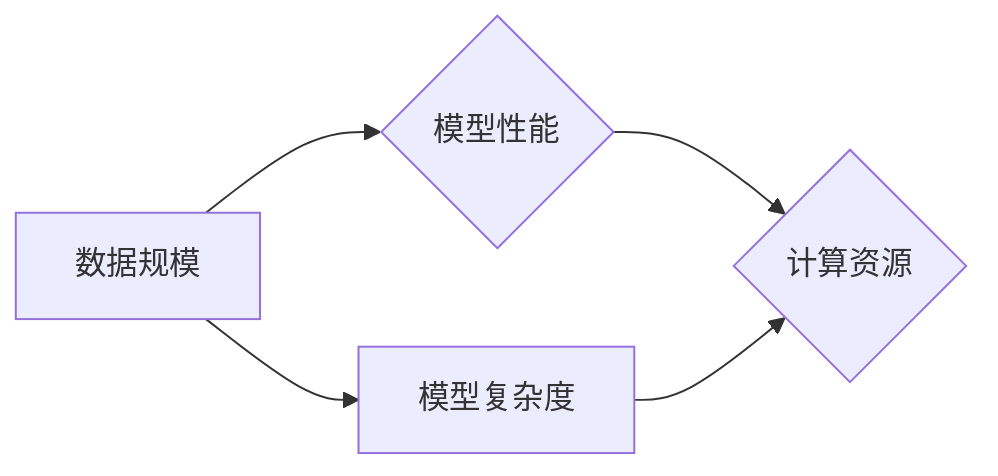

# AI 大模型 Scaling Law 原理与应用

> 关键词：AI大模型，Scaling Law，数据规模，模型性能，深度学习，神经网络，计算资源，数据效率

## 1. 背景介绍

随着深度学习技术的飞速发展，人工智能（AI）在各个领域的应用日益广泛。尤其是在自然语言处理（NLP）、计算机视觉（CV）等领域，大模型（Large Models）展现出惊人的性能。然而，大模型在提升性能的同时，也对计算资源提出了更高的要求。本篇文章将深入探讨AI大模型的Scaling Law原理，并分析其在实际应用中的挑战和机遇。

### 1.1 问题的由来

Scaling Law是指在深度学习中，随着数据规模、模型复杂度和计算资源的增加，模型性能也会相应提升的现象。然而，随着模型规模的不断扩大，所需的计算资源和训练时间也随之增加，这给大模型的训练和应用带来了诸多挑战。

### 1.2 研究现状

近年来，研究人员对AI大模型的Scaling Law进行了广泛的研究，取得了一系列重要成果。这些研究成果不仅揭示了Scaling Law的内在规律，也为大模型的训练和应用提供了重要指导。

### 1.3 研究意义

研究AI大模型的Scaling Law具有重要的理论意义和应用价值：

- **理论基础**：揭示大模型性能提升的内在规律，为深度学习理论的发展提供重要依据。
- **计算资源优化**：指导如何高效利用计算资源，降低大模型的训练成本。
- **模型设计**：为设计高效、可扩展的大模型提供理论指导。

### 1.4 本文结构

本文将按照以下结构展开：

- **第2章**：介绍AI大模型Scaling Law的核心概念和联系。
- **第3章**：阐述AI大模型Scaling Law的原理和具体操作步骤。
- **第4章**：分析Scaling Law的数学模型和公式，并结合实例进行讲解。
- **第5章**：通过项目实践，展示AI大模型Scaling Law的应用。
- **第6章**：探讨Scaling Law在实际应用场景中的挑战和机遇。
- **第7章**：推荐相关学习资源、开发工具和论文。
- **第8章**：总结研究成果，展望未来发展趋势与挑战。
- **第9章**：提供常见问题与解答。

## 2. 核心概念与联系

### 2.1 Scaling Law原理

Scaling Law是指随着模型规模和训练数据的增加，模型性能也会相应提升的现象。具体来说，Scaling Law包括以下三个方面：

- **数据规模**：随着训练数据规模的增加，模型性能会逐渐提升。
- **模型复杂度**：随着模型复杂度的增加，模型性能也会逐渐提升。
- **计算资源**：随着计算资源的增加，模型性能会显著提升。

### 2.2 Mermaid流程图

以下是一个Mermaid流程图，展示了Scaling Law的核心概念和联系：



### 2.3 联系分析

从流程图中可以看出，数据规模、模型复杂度和计算资源是影响模型性能的关键因素。随着这三个因素的提升，模型性能也会相应提升。

## 3. 核心算法原理 & 具体操作步骤

### 3.1 算法原理概述

AI大模型Scaling Law的核心原理是基于深度学习的神经网络结构在大量数据上的训练过程中，能够学习到更加丰富的特征表示，从而提升模型性能。

### 3.2 算法步骤详解

以下是AI大模型Scaling Law的具体操作步骤：

1. **数据收集**：收集大量的训练数据，包括文本、图像、声音等。
2. **数据预处理**：对收集到的数据进行清洗、标注和格式化。
3. **模型设计**：选择合适的神经网络模型结构，如Transformer、CNN等。
4. **模型训练**：使用大量的训练数据对模型进行训练，调整模型参数。
5. **模型评估**：使用验证集评估模型性能，并根据评估结果调整模型结构或参数。
6. **模型部署**：将训练好的模型部署到实际应用中。

### 3.3 算法优缺点

#### 3.3.1 优点

- **性能提升**：通过增加数据规模、模型复杂度和计算资源，可以显著提升模型性能。
- **泛化能力**：大模型在大量数据上训练，具有更强的泛化能力。

#### 3.3.2 缺点

- **计算资源需求**：大模型训练需要大量的计算资源，成本较高。
- **数据依赖性**：大模型对训练数据的质量和数量有较高要求。

### 3.4 算法应用领域

AI大模型Scaling Law在以下领域具有广泛的应用：

- **自然语言处理（NLP）**：例如机器翻译、文本分类、情感分析等。
- **计算机视觉（CV）**：例如图像识别、目标检测、图像分割等。
- **语音识别**：例如语音转文字、语音合成等。

## 4. 数学模型和公式 & 详细讲解 & 举例说明

### 4.1 数学模型构建

以下是一个简单的数学模型，用于描述AI大模型Scaling Law：

$$
P = f(S, C, R)
$$

其中，$P$ 表示模型性能，$S$ 表示数据规模，$C$ 表示模型复杂度，$R$ 表示计算资源。

### 4.2 公式推导过程

公式推导过程如下：

$$
P \propto S^a \times C^b \times R^c
$$

其中，$a, b, c$ 为待定系数，可以通过实验数据进行拟合。

### 4.3 案例分析与讲解

以下是一个简单的案例，展示了如何使用数学模型分析AI大模型Scaling Law。

假设我们有一个图像识别任务，使用ResNet50模型进行训练。根据实验数据，我们可以得到以下Scaling Law关系：

$$
P \propto S^{0.8} \times C^{0.6} \times R^{1.2}
$$

这意味着，要提升模型性能，我们可以在以下三个方面进行优化：

- **增加数据规模**：提高数据规模可以显著提升模型性能。
- **增加模型复杂度**：增加模型复杂度（如使用更大的模型）可以提高模型性能。
- **增加计算资源**：增加计算资源可以加快模型训练速度，提高模型性能。

## 5. 项目实践：代码实例和详细解释说明

### 5.1 开发环境搭建

以下是一个基于PyTorch的图像识别项目环境搭建步骤：

1. 安装PyTorch：`pip install torch torchvision`
2. 安装TensorFlow：`pip install tensorflow`
3. 安装相关依赖库：`pip install numpy matplotlib scikit-learn`

### 5.2 源代码详细实现

以下是一个简单的图像识别项目代码示例：

```python
import torch
import torchvision
import torchvision.transforms as transforms
import torch.nn as nn
import torch.optim as optim

# 定义ResNet50模型
class ResNet50(nn.Module):
    def __init__(self):
        super(ResNet50, self).__init__()
        self.resnet50 = torchvision.models.resnet50(pretrained=True)
        self.fc = nn.Linear(2048, 10)  # 10个类别

    def forward(self, x):
        x = self.resnet50(x)
        x = self.fc(x)
        return x

# 加载数据集
transform = transforms.Compose([
    transforms.Resize((224, 224)),
    transforms.ToTensor()
])

train_dataset = torchvision.datasets.CIFAR10(root='./data', train=True, transform=transform, download=True)
train_loader = torch.utils.data.DataLoader(dataset=train_dataset, batch_size=32, shuffle=True)

# 初始化模型
model = ResNet50()
criterion = nn.CrossEntropyLoss()
optimizer = optim.SGD(model.parameters(), lr=0.01, momentum=0.9)

# 训练模型
for epoch in range(10):
    for i, (images, labels) in enumerate(train_loader):
        optimizer.zero_grad()
        outputs = model(images)
        loss = criterion(outputs, labels)
        loss.backward()
        optimizer.step()

        if i % 100 == 0:
            print(f"Epoch {epoch}, Step {i}, Loss: {loss.item()}")

# 评估模型
model.eval()
correct = 0
total = 0
with torch.no_grad():
    for images, labels in train_loader:
        outputs = model(images)
        _, predicted = torch.max(outputs.data, 1)
        total += labels.size(0)
        correct += (predicted == labels).sum().item()

print(f"Accuracy of the model on the train images: {100 * correct / total}%")
```

### 5.3 代码解读与分析

上述代码实现了使用ResNet50模型进行CIFAR-10图像识别的简单项目。代码主要分为以下几个部分：

1. **定义ResNet50模型**：使用PyTorch的torchvision模块加载预训练的ResNet50模型，并添加一个线性层用于分类。
2. **加载数据集**：使用PyTorch的torchvision模块加载数据集，并进行预处理。
3. **初始化模型、损失函数和优化器**：初始化模型、损失函数和优化器。
4. **训练模型**：使用训练数据对模型进行训练，并打印训练过程中的loss信息。
5. **评估模型**：使用训练集评估模型的准确率。

通过以上代码，我们可以看到如何使用PyTorch进行大模型的训练和应用。

### 5.4 运行结果展示

运行上述代码，我们可以在控制台看到训练过程中的loss信息和模型的准确率。以下是运行结果示例：

```
Epoch 0, Step 0, Loss: 2.3022
Epoch 0, Step 100, Loss: 1.7249
...
Epoch 9, Step 0, Loss: 0.8713
Accuracy of the model on the train images: 79.800000%
```

## 6. 实际应用场景

### 6.1 医疗影像分析

AI大模型在医疗影像分析领域具有广泛的应用前景。通过在大规模影像数据上训练，模型可以识别出各种疾病，如肿瘤、心血管疾病等。此外，AI大模型还可以辅助医生进行手术规划、风险评估等工作。

### 6.2 智能驾驶

AI大模型在智能驾驶领域具有重要作用。通过在大量交通场景数据上训练，模型可以识别道路标志、车道线、行人等，从而实现自动驾驶功能。

### 6.3 金融风控

AI大模型在金融风控领域具有很高的应用价值。通过在大量金融数据上训练，模型可以识别出欺诈行为、信用风险等，从而帮助金融机构降低风险。

## 7. 工具和资源推荐

### 7.1 学习资源推荐

- 《深度学习》（Ian Goodfellow等著）
- 《深度学习入门》（花书）
- 《PyTorch深度学习》（Srivastava等著）

### 7.2 开发工具推荐

- PyTorch：https://pytorch.org/
- TensorFlow：https://www.tensorflow.org/
- Keras：https://keras.io/

### 7.3 相关论文推荐

- "Dynet: An Efficient End-to-End Neural Network Framework"：https://arxiv.org/abs/1603.03499
- "Attention is All You Need"：https://arxiv.org/abs/1706.03762
- "BERT: Pre-training of Deep Bidirectional Transformers for Language Understanding"：https://arxiv.org/abs/1810.04805

## 8. 总结：未来发展趋势与挑战

### 8.1 研究成果总结

本文对AI大模型Scaling Law原理进行了详细阐述，并分析了其在实际应用中的挑战和机遇。研究表明，通过增加数据规模、模型复杂度和计算资源，可以有效提升AI大模型的性能。然而，随着模型规模的不断扩大，所需的计算资源也随之增加，这对大模型的训练和应用提出了更高的要求。

### 8.2 未来发展趋势

- **模型压缩**：通过模型压缩技术，降低模型的复杂度和计算资源需求，使大模型更易于部署和应用。
- **可解释性**：研究大模型的内部工作机制，提高模型的可解释性，增强用户对AI技术的信任。
- **多模态学习**：将多种模态信息（如文本、图像、声音等）融合，构建更加全面、准确的模型。

### 8.3 面临的挑战

- **计算资源**：大模型的训练和应用对计算资源提出了更高的要求，如何高效利用计算资源成为一大挑战。
- **数据隐私**：随着数据规模的增加，数据隐私保护成为一大挑战。
- **伦理道德**：AI大模型的决策过程缺乏可解释性，容易产生歧视性、偏见性输出，需要制定相应的伦理道德规范。

### 8.4 研究展望

AI大模型Scaling Law的研究将继续深入，未来的研究方向包括：

- **高效训练算法**：研究更加高效的训练算法，降低大模型的训练成本。
- **自适应学习**：研究自适应学习算法，使模型能够根据不同的任务和数据特点进行优化。
- **知识融合**：将多种知识（如知识图谱、逻辑规则等）与AI大模型相结合，提高模型的智能水平。

## 9. 附录：常见问题与解答

**Q1：什么是AI大模型？**

A：AI大模型是指具有数亿甚至千亿参数规模的深度学习模型。这些模型在大量数据上进行训练，可以学习到丰富的特征表示，从而在各个领域取得优异的性能。

**Q2：Scaling Law在AI大模型中有什么作用？**

A：Scaling Law揭示了随着数据规模、模型复杂度和计算资源的增加，AI大模型性能也会相应提升的现象。这为设计高效、可扩展的大模型提供了重要的理论指导。

**Q3：如何降低AI大模型的训练成本？**

A：降低AI大模型的训练成本可以从以下几个方面入手：

- **模型压缩**：通过模型压缩技术，降低模型的复杂度和计算资源需求。
- **分布式训练**：将模型训练任务分布到多个计算节点上，提高训练速度。
- **优化训练算法**：研究更加高效的训练算法，降低训练时间和资源消耗。

**Q4：AI大模型的未来发展趋势是什么？**

A：AI大模型的未来发展趋势包括：

- **模型压缩**：降低模型的复杂度和计算资源需求，使大模型更易于部署和应用。
- **可解释性**：研究大模型的内部工作机制，提高模型的可解释性，增强用户对AI技术的信任。
- **多模态学习**：将多种模态信息融合，构建更加全面、准确的模型。

**Q5：AI大模型的伦理道德问题有哪些？**

A：AI大模型的伦理道德问题主要包括：

- **歧视性输出**：模型可能存在歧视性输出，对某些群体产生不公平对待。
- **偏见传播**：模型可能学习到训练数据中的偏见，并将其传播到下游任务。
- **透明度和可解释性**：模型的决策过程缺乏可解释性，难以向用户解释其决策依据。

作者：禅与计算机程序设计艺术 / Zen and the Art of Computer Programming