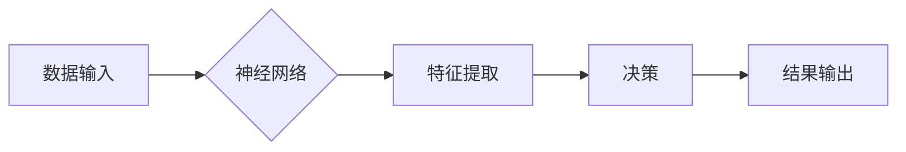

## AI 神经网络计算艺术之禅：人类智能是地球环境培育出的最美丽的花朵

> 关键词：神经网络、深度学习、人工智能、计算艺术、生物启发、进化算法、机器学习

### 1. 背景介绍

人类文明的进步离不开对自然规律的探索和理解。从古希腊哲学家对宇宙的思考，到现代科学的蓬勃发展，我们始终试图用理性思维去解读世界。而人工智能（AI）的出现，则标志着人类迈向一个新的认知阶段，试图用计算的方式模拟和超越人类智能。

神经网络作为AI领域的核心技术之一，以其强大的学习能力和模式识别能力，在图像识别、自然语言处理、语音识别等领域取得了突破性的进展。然而，神经网络的本质并非简单的算法，而是一种对生物神经系统结构和功能的抽象模拟。它蕴含着深刻的哲学思考，将计算艺术与自然之美完美融合。

### 2. 核心概念与联系

#### 2.1 神经网络的结构与功能

神经网络由大量相互连接的神经元组成，这些神经元按照生物神经元的结构和功能进行模拟。每个神经元接收来自其他神经元的输入信号，并对其进行处理，最终输出一个信号。神经元之间的连接权重决定了信号的传递强度，而学习过程则是通过调整这些权重来实现。

#### 2.2 人类大脑与神经网络的异同

人类大脑拥有数十亿的神经元，其复杂度远超任何人工构建的神经网络。然而，神经网络的结构和功能与人类大脑存在着显著的相似之处。

* **结构相似性:**  神经网络的层级结构与大脑皮层的层级结构类似，神经元之间的连接方式也与大脑神经元之间的连接方式相似。
* **功能相似性:**  神经网络能够学习和识别模式，类似于人类大脑的认知功能。

#### 2.3  计算艺术与自然之美

神经网络的学习过程是一种“计算艺术”，它将数据作为原料，通过算法的演算，最终生成出具有创造性的结果。

* **数据驱动:**  神经网络的学习过程依赖于大量数据的输入，数据是神经网络的“灵感来源”。
* **算法演算:**  算法是神经网络的“工具”，它将数据进行处理和转换，最终生成出新的知识和模式。
* **结果呈现:**  神经网络的输出结果可以是图像、文本、音乐等多种形式，这些结果体现了神经网络的“创造力”。

**Mermaid 流程图**



### 3. 核心算法原理 & 具体操作步骤

#### 3.1 算法原理概述

深度学习算法的核心是多层神经网络，它通过多个隐藏层来提取数据的特征，最终实现对数据的学习和预测。

* **前馈神经网络:**  信息只沿着单向传播，从输入层到输出层。
* **反向传播算法:**  通过调整神经网络的权重，最小化预测误差。

#### 3.2 算法步骤详解

1. **数据预处理:**  将原始数据进行清洗、转换和标准化，使其适合神经网络的训练。
2. **网络结构设计:**  根据任务需求，设计神经网络的层数、神经元数量和激活函数等参数。
3. **权重初始化:**  随机初始化神经网络的权重，为训练提供初始值。
4. **前向传播:**  将输入数据通过神经网络进行前向传播，得到输出结果。
5. **损失函数计算:**  计算预测结果与真实结果之间的误差，即损失函数的值。
6. **反向传播:**  根据损失函数的梯度，反向传播误差信息，更新神经网络的权重。
7. **迭代训练:**  重复步骤4-6，直到损失函数达到最小值。
8. **模型评估:**  使用测试数据评估模型的性能，并进行调优。

#### 3.3 算法优缺点

**优点:**

* **强大的学习能力:**  深度学习算法能够学习到数据的复杂特征，实现高精度预测。
* **自动化特征提取:**  无需人工提取特征，算法能够自动学习特征。
* **泛化能力强:**  训练好的模型能够应用于新的数据，具有较强的泛化能力。

**缺点:**

* **数据依赖性强:**  深度学习算法需要大量的数据进行训练，否则性能会下降。
* **训练时间长:**  深度学习模型的训练时间较长，需要强大的计算资源。
* **可解释性差:**  深度学习模型的内部机制复杂，难以解释其决策过程。

#### 3.4 算法应用领域

深度学习算法在各个领域都有广泛的应用，例如:

* **图像识别:**  人脸识别、物体检测、图像分类
* **自然语言处理:**  机器翻译、文本摘要、情感分析
* **语音识别:**  语音转文本、语音助手
* **医疗诊断:**  疾病预测、图像分析
* **金融预测:**  股票预测、风险评估

### 4. 数学模型和公式 & 详细讲解 & 举例说明

#### 4.1 数学模型构建

神经网络的数学模型基于线性代数和微积分。

* **激活函数:**  将神经元的输入信号转换为输出信号，常用的激活函数包括 sigmoid 函数、ReLU 函数等。
* **损失函数:**  衡量预测结果与真实结果之间的误差，常用的损失函数包括均方误差、交叉熵损失等。
* **梯度下降算法:**  通过迭代更新权重，最小化损失函数的值。

#### 4.2 公式推导过程

* **前向传播公式:**  

$$
y = f(W x + b)
$$

其中：

* $y$ 是神经元的输出
* $x$ 是神经元的输入
* $W$ 是权重矩阵
* $b$ 是偏置项
* $f$ 是激活函数

* **损失函数公式:**

$$
L = \frac{1}{n} \sum_{i=1}^{n} (y_i - \hat{y}_i)^2
$$

其中：

* $L$ 是损失函数值
* $n$ 是样本数量
* $y_i$ 是真实值
* $\hat{y}_i$ 是预测值

* **梯度下降公式:**

$$
W = W - \alpha \frac{\partial L}{\partial W}
$$

其中：

* $\alpha$ 是学习率

#### 4.3 案例分析与讲解

**图像分类案例:**

假设我们训练一个神经网络来识别猫和狗的图像。

* **输入数据:**  猫和狗的图像数据
* **网络结构:**  多层卷积神经网络
* **损失函数:**  交叉熵损失
* **训练过程:**  通过反向传播算法，调整神经网络的权重，使模型能够准确地识别猫和狗的图像。

### 5. 项目实践：代码实例和详细解释说明

#### 5.1 开发环境搭建

* **操作系统:**  Windows、macOS、Linux
* **编程语言:**  Python
* **深度学习框架:**  TensorFlow、PyTorch

#### 5.2 源代码详细实现

```python
import tensorflow as tf

# 定义模型结构
model = tf.keras.models.Sequential([
    tf.keras.layers.Conv2D(32, (3, 3), activation='relu', input_shape=(28, 28, 1)),
    tf.keras.layers.MaxPooling2D((2, 2)),
    tf.keras.layers.Conv2D(64, (3, 3), activation='relu'),
    tf.keras.layers.MaxPooling2D((2, 2)),
    tf.keras.layers.Flatten(),
    tf.keras.layers.Dense(10, activation='softmax')
])

# 编译模型
model.compile(optimizer='adam',
              loss='sparse_categorical_crossentropy',
              metrics=['accuracy'])

# 训练模型
model.fit(x_train, y_train, epochs=10)

# 评估模型
loss, accuracy = model.evaluate(x_test, y_test)
print('Test loss:', loss)
print('Test accuracy:', accuracy)
```

#### 5.3 代码解读与分析

* **模型结构:**  代码定义了一个简单的卷积神经网络，用于图像分类任务。
* **编译模型:**  使用 Adam 优化器、交叉熵损失函数和准确率作为评估指标。
* **训练模型:**  使用训练数据训练模型，迭代次数为 10 次。
* **评估模型:**  使用测试数据评估模型的性能。

#### 5.4 运行结果展示

运行代码后，会输出模型在测试集上的损失值和准确率。

### 6. 实际应用场景

#### 6.1 图像识别

* **人脸识别:**  用于解锁手机、身份验证等场景。
* **物体检测:**  用于自动驾驶、安防监控等场景。
* **图像分类:**  用于医疗诊断、电商商品分类等场景。

#### 6.2 自然语言处理

* **机器翻译:**  将一种语言翻译成另一种语言。
* **文本摘要:**  自动生成文本的简要摘要。
* **情感分析:**  分析文本的情感倾向，用于市场调研、用户反馈分析等场景。

#### 6.3 语音识别

* **语音转文本:**  将语音转换为文本，用于语音助手、听写软件等场景。
* **语音识别:**  识别语音中的特定指令，用于智能家居、语音控制等场景。

#### 6.4 未来应用展望

* **个性化推荐:**  根据用户的行为数据，推荐个性化的商品、服务等。
* **自动写作:**  自动生成新闻报道、小说等文本内容。
* **智能医疗:**  辅助医生诊断疾病、预测患者风险等。

### 7. 工具和资源推荐

#### 7.1 学习资源推荐

* **书籍:**  
    * 《深度学习》
    * 《神经网络与深度学习》
* **在线课程:**  
    * Coursera
    * edX
    * fast.ai

#### 7.2 开发工具推荐

* **深度学习框架:**  TensorFlow、PyTorch
* **编程语言:**  Python
* **云计算平台:**  AWS、Google Cloud、Azure

#### 7.3 相关论文推荐

* **《ImageNet Classification with Deep Convolutional Neural Networks》**
* **《Attention Is All You Need》**
* **《Generative Adversarial Networks》**

### 8. 总结：未来发展趋势与挑战

#### 8.1 研究成果总结

深度学习算法取得了令人瞩目的成就，在各个领域都展现出强大的应用潜力。

* **图像识别:**  准确率已接近人类水平。
* **自然语言处理:**  机器翻译、文本摘要等任务取得了显著进步。
* **语音识别:**  语音助手、听写软件等应用日益普及。

#### 8.2 未来发展趋势

* **模型规模与效率:**  追求更大规模、更高效的模型，以提高性能和降低计算成本。
* **数据增强与合成:**  利用数据增强和合成技术，解决数据稀缺问题。
* **可解释性与信任:**  提高模型的可解释性，增强用户对模型的信任。
* **边缘计算与部署:**  将深度学习模型部署到边缘设备，实现实时推理。

#### 8.3 面临的挑战

* **数据安全与隐私:**  深度学习算法对数据依赖性强，数据安全和隐私保护面临挑战。
* **算法偏见与公平性:**  深度学习模型可能存在算法偏见，需要解决公平性问题。
* **伦理与社会影响:**  深度学习技术的发展可能带来伦理和社会问题，需要进行深入思考和探讨。

#### 8.4 研究展望

未来，深度学习技术将继续发展，在更多领域发挥