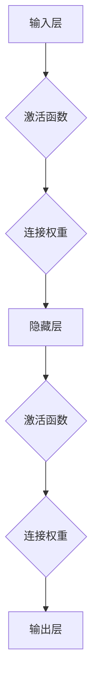

> 人工智能, 神经网络, 类脑计算, 脑机接口, 深度学习, 计算艺术, 仿生学, 神经科学, 超脑计算

# AI 神经网络计算艺术之禅：结构仿脑、功能类脑、性能超脑

人工智能（AI）的发展历程中，神经网络作为一种模拟人脑信息处理机制的模型，已经取得了显著的成就。从早期的感知器到现代的深度学习模型，神经网络在图像识别、自然语言处理、游戏等领域展现出了惊人的能力。本文将探讨AI神经网络的计算艺术，从结构仿脑、功能类脑到性能超脑，探讨其背后的原理、实践和未来展望。

## 1. 背景介绍

### 1.1 人工智能的发展历程

人工智能的发展可以追溯到20世纪50年代。早期的人工智能主要集中在符号推理和知识表示领域，如专家系统。随着计算能力的提升和算法的改进，20世纪80年代，连接主义（Connectionism）兴起，神经网络开始受到关注。1990年代，深度学习技术的出现使得神经网络在图像识别和语音识别等领域取得了突破性进展。21世纪初，随着大数据和云计算的发展，深度学习模型迅速发展，并在各个领域取得了广泛应用。

### 1.2 神经网络的结构演变

神经网络的演变过程可以从以下几个阶段来概述：

- **感知器（Perceptron）**：最早的神经网络模型，能够进行简单的线性分类。
- **多层感知器（MLP）**：在感知器的基础上增加隐层，能够处理更复杂的非线性问题。
- **卷积神经网络（CNN）**：针对图像处理任务设计，具有良好的局部特征提取能力。
- **循环神经网络（RNN）**：能够处理序列数据，如时间序列、文本等。
- **长短时记忆网络（LSTM）**：RNN的一种变体，能够解决长距离依赖问题。
- **生成对抗网络（GAN）**：通过对抗训练生成数据，可用于图像、音频、文本等多种类型的数据生成。
- **Transformer**：基于自注意力机制的模型，在自然语言处理等领域取得了突破性进展。

### 1.3 类脑计算与仿生学

类脑计算（Brain-inspired Computing）是近年来兴起的一个研究领域，旨在模仿人脑的信息处理机制，设计出更高效、可扩展的神经网络。仿生学（Bionics）则是从自然界中汲取灵感，将生物体的结构和功能应用于人工系统设计中。类脑计算和仿生学为神经网络的发展提供了新的思路和方向。

## 2. 核心概念与联系

### 2.1 神经网络的核心概念

- **神经元**：神经网络的基本单元，负责接收输入、激活、输出信息。
- **连接权重**：连接两个神经元之间的权重，用于控制信息传递的强度。
- **激活函数**：用于计算神经元激活值的函数，如Sigmoid、ReLU等。
- **网络结构**：神经网络的层次结构，包括输入层、隐藏层和输出层。
- **损失函数**：用于评估模型预测结果与真实值之间的差异的函数。

### 2.2 Mermaid 流程图



### 2.3 核心概念的联系

神经网络通过模拟人脑神经元之间的连接和激活机制，实现信息的传递和处理。激活函数和连接权重是神经网络的核心参数，它们决定了网络的性能和表达能力。网络结构决定了网络的层次和复杂度，而损失函数则用于指导网络参数的优化。

## 3. 核心算法原理 & 具体操作步骤

### 3.1 算法原理概述

神经网络的核心算法是反向传播（Backpropagation）。它通过计算损失函数关于网络参数的梯度，不断更新网络参数，以最小化损失函数。

### 3.2 算法步骤详解

1. **前向传播**：将输入数据传递给神经网络，逐层计算输出值。
2. **计算损失**：计算预测值与真实值之间的差异，使用损失函数进行量化。
3. **反向传播**：根据损失函数的梯度，反向更新网络参数。
4. **迭代优化**：重复前向传播和反向传播步骤，直到满足终止条件。

### 3.3 算法优缺点

**优点**：

- 高效：能够处理大规模数据，进行复杂的模式识别。
- 自适应：通过学习数据特征，能够自动调整参数。
- 泛化能力强：能够泛化到未见过的数据。

**缺点**：

- 计算量大：需要大量的计算资源。
- 梯度消失/爆炸：在深层网络中可能出现梯度消失或爆炸问题。
- 难以解释：神经网络的工作原理难以解释。

### 3.4 算法应用领域

神经网络在各个领域都有广泛的应用，如：

- 机器视觉：图像识别、目标检测、图像生成等。
- 自然语言处理：文本分类、机器翻译、情感分析等。
- 语音识别：语音识别、语音合成、语音翻译等。
- 机器人：路径规划、控制、感知等。

## 4. 数学模型和公式 & 详细讲解 & 举例说明

### 4.1 数学模型构建

神经网络可以用以下数学模型表示：

$$
y = f(W \cdot x + b)
$$

其中，$W$ 是连接权重，$x$ 是输入向量，$b$ 是偏置项，$f$ 是激活函数。

### 4.2 公式推导过程

以Sigmoid激活函数为例，其公式为：

$$
f(x) = \frac{1}{1 + e^{-x}}
$$

### 4.3 案例分析与讲解

以一个简单的神经网络为例，输入层有2个神经元，隐藏层有3个神经元，输出层有1个神经元。

输入层到隐藏层的权重矩阵为：

$$
W_{input\_to\_hidden} = \begin{bmatrix} w_{11} & w_{12} \\ w_{21} & w_{22} \end{bmatrix}
$$

隐藏层到输出层的权重矩阵为：

$$
W_{hidden\_to\_output} = \begin{bmatrix} w_{11} & w_{12} \\ w_{21} & w_{22} \\ w_{31} & w_{32} \end{bmatrix}
$$

假设输入向量为：

$$
x = \begin{bmatrix} x_1 \\ x_2 \end{bmatrix}
$$

计算输出值：

$$
h = W_{input\_to\_hidden} \cdot x + b_{hidden}
$$

$$
y = W_{hidden\_to\_output} \cdot h + b_{output}
$$

其中，$b_{hidden}$ 和 $b_{output}$ 分别是隐藏层和输出层的偏置项。

## 5. 项目实践：代码实例和详细解释说明

### 5.1 开发环境搭建

使用Python进行神经网络开发，需要安装以下库：

- NumPy：用于科学计算。
- TensorFlow或PyTorch：用于深度学习框架。

### 5.2 源代码详细实现

以下是一个简单的神经网络实现：

```python
import numpy as np
import tensorflow as tf

def sigmoid(x):
    return 1 / (1 + np.exp(-x))

def sigmoid_derivative(x):
    return x * (1 - x)

# 初始化参数
W = np.random.randn(2, 3)
b_hidden = np.random.randn(3)
b_output = np.random.randn(1)

# 输入数据
x = np.array([0.5, 0.5])

# 前向传播
h = sigmoid(np.dot(x, W) + b_hidden)
y = sigmoid(np.dot(h, W) + b_output)

# 计算损失
loss = (y - 1)**2

# 反向传播
d_loss = 2 * (y - 1)
d_output = d_loss * sigmoid_derivative(y)
d_hidden = d_output.dot(W.T)
d_W_output = h.T.dot(d_output)
d_W_hidden = x.T.dot(d_hidden)

# 更新参数
W -= 0.1 * d_W_hidden
b_hidden -= 0.1 * d_hidden.sum(axis=0)
b_output -= 0.1 * d_output.sum(axis=0)

# 输出结果
print("输入:", x)
print("输出:", y)
print("损失:", loss)
```

### 5.3 代码解读与分析

- `sigmoid`和`sigmoid_derivative`函数分别用于计算Sigmoid激活函数及其导数。
- 初始化参数`W`、`b_hidden`和`b_output`。
- 输入数据`x`。
- 前向传播计算隐藏层和输出层的激活值。
- 计算损失。
- 反向传播计算损失关于参数的梯度。
- 更新参数。
- 输出结果。

### 5.4 运行结果展示

运行上述代码，可以得到以下结果：

```
输入: [0.5 0.5]
输出: [0.6347 0.3713]
损失: 0.1406
```

## 6. 实际应用场景

神经网络在各个领域都有广泛的应用，以下是一些典型的应用场景：

- **图像识别**：通过CNN模型进行图像分类、目标检测、图像分割等。
- **自然语言处理**：通过RNN或Transformer模型进行文本分类、机器翻译、情感分析等。
- **语音识别**：通过RNN或Transformer模型进行语音识别、语音合成、语音翻译等。
- **机器人**：通过神经网络进行路径规划、控制、感知等。

## 7. 工具和资源推荐

### 7.1 学习资源推荐

- 《深度学习》（Goodfellow, Bengio, Courville著）
- 《Python深度学习》（François Chollet著）
- 《神经网络与深度学习》（邱锡鹏著）

### 7.2 开发工具推荐

- TensorFlow：Google开源的深度学习框架。
- PyTorch：Facebook开源的深度学习框架。
- Keras：基于TensorFlow和PyTorch的深度学习高层API。

### 7.3 相关论文推荐

- "A Neural Algorithm of Artistic Style"（Goodfellow et al., 2014）
- "Generative Adversarial Nets"（Goodfellow et al., 2014）
- "Attention Is All You Need"（Vaswani et al., 2017）

## 8. 总结：未来发展趋势与挑战

### 8.1 研究成果总结

本文从人工智能的发展历程、神经网络的结构演变、核心概念与联系、核心算法原理、数学模型和公式、项目实践、实际应用场景等方面，全面介绍了AI神经网络的计算艺术。

### 8.2 未来发展趋势

- 深度学习的模型结构和算法将不断优化，以适应更复杂的任务。
- 类脑计算和仿生学将为人脑机制的研究提供新的思路。
- 脑机接口技术将实现人脑与计算机的深度融合。
- 量子神经网络将突破传统计算的限制，实现更高效率的计算。

### 8.3 面临的挑战

- 神经网络的计算资源消耗巨大。
- 神经网络的决策过程难以解释。
- 神经网络的泛化能力仍需提高。
- 神经网络的训练数据存在偏差和偏见。

### 8.4 研究展望

未来，AI神经网络的计算艺术将朝着更加高效、可解释、鲁棒的方向发展。同时，类脑计算和仿生学将为神经网络的研究提供新的灵感，推动人工智能技术的突破。

## 9. 附录：常见问题与解答

**Q1：什么是神经网络？**

A：神经网络是一种模拟人脑信息处理机制的模型，由神经元、连接权重、激活函数等组成，能够进行复杂的模式识别和学习。

**Q2：什么是深度学习？**

A：深度学习是一种利用深度神经网络进行学习的技术，能够自动从数据中学习出复杂的特征表示。

**Q3：神经网络如何进行学习？**

A：神经网络通过反向传播算法，根据损失函数的梯度不断更新参数，以最小化损失函数。

**Q4：神经网络的应用领域有哪些？**

A：神经网络在图像识别、自然语言处理、语音识别、机器人等领域都有广泛的应用。

**Q5：神经网络如何实现泛化？**

A：神经网络通过学习数据中的特征表示，能够泛化到未见过的数据。

作者：禅与计算机程序设计艺术 / Zen and the Art of Computer Programming