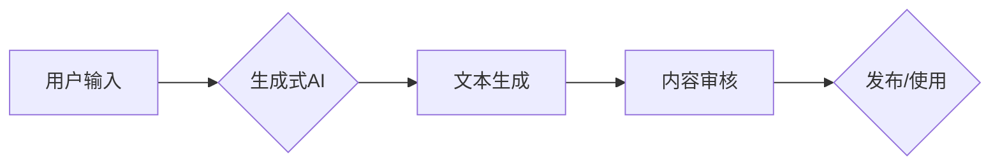

> AIGC, AI 辅助写作, ChatGPT, 自动创作, 文本扩展, 自然语言处理, GPT-3, 生成式AI, 创作辅助, NLP技术

# AIGC从入门到实战：AI 辅助写作：基于 ChatGPT 的自动创作和文本扩展

## 1. 背景介绍

随着人工智能技术的飞速发展，自然语言处理（NLP）领域取得了突破性进展。近年来，基于深度学习的生成式AI（AI-Generated Content，AIGC）技术逐渐成为研究热点，其中最引人注目的成果之一就是OpenAI发布的ChatGPT。ChatGPT能够根据用户提供的输入文本，生成连贯、合理的文本内容，为创作、写作等领域带来了革命性的变化。本文将深入探讨AIGC技术，特别是基于ChatGPT的自动创作和文本扩展方法，并从入门到实战的角度进行详细讲解。

### 1.1 问题的由来

传统的写作方式依赖于人类的创造力和想象力，效率低下且难以满足大规模内容生成的需求。随着互联网和社交媒体的兴起，内容创作成为了一种普遍的需求，但高质量内容的生成往往需要大量的时间和精力。AIGC技术的出现，为解决这一难题提供了新的思路。

### 1.2 研究现状

AIGC技术主要包括文本生成、图像生成、音频生成等领域。在文本生成领域，ChatGPT等大型语言模型（LLM）展现了惊人的创作能力。目前，AIGC技术已在新闻写作、小说创作、文案策划等领域得到初步应用。

### 1.3 研究意义

AIGC技术具有以下重要意义：

- **提高创作效率**：AIGC技术可以快速生成文本内容，节省创作者的时间和精力。
- **拓宽创作思路**：AIGC技术可以提供多样化的文本内容，激发创作者的灵感。
- **降低创作门槛**：AIGC技术可以降低内容创作的门槛，让更多人参与到创作中来。
- **推动产业发展**：AIGC技术可以促进内容产业的创新和发展。

### 1.4 本文结构

本文将围绕以下内容展开：

- AIGC的核心概念和联系
- ChatGPT的算法原理和操作步骤
- AIGC的数学模型和公式
- AIGC的项目实践
- AIGC的实际应用场景
- AIGC的未来发展趋势与挑战
- 工具和资源推荐
- 总结

## 2. 核心概念与联系

### 2.1 核心概念

- **AIGC**：AI-Generated Content，人工智能生成内容。
- **ChatGPT**：基于GPT-3模型的大型语言模型，能够进行自然语言对话和文本创作。
- **LLM**：Large Language Model，大型语言模型。
- **NLP**：Natural Language Processing，自然语言处理。

### 2.2 Mermaid 流程图



### 2.3 核心概念联系

AIGC技术通过LLM（如ChatGPT）实现文本生成，经过内容审核后，可用于发布或直接使用。

## 3. 核心算法原理 & 具体操作步骤

### 3.1 算法原理概述

AIGC技术主要基于深度学习中的生成式对抗网络（GAN）和自编码器（Autoencoder）等模型。ChatGPT等LLM则基于Transformer模型，通过预训练和微调学习到丰富的语言知识，能够生成高质量的文本内容。

### 3.2 算法步骤详解

1. **数据准备**：收集并整理相关领域的文本数据，用于训练和测试。
2. **模型选择**：选择合适的LLM（如ChatGPT）作为基础模型。
3. **预训练**：使用大量文本数据进行预训练，使模型学习到丰富的语言知识。
4. **微调**：使用特定领域的文本数据进行微调，使模型更适应特定任务。
5. **生成文本**：输入文本或主题，通过LLM生成相应的内容。
6. **内容审核**：对生成的文本进行审核，确保内容合规、健康。
7. **发布/使用**：将审核通过的文本发布或用于实际应用。

### 3.3 算法优缺点

**优点**：

- 高效生成高质量文本内容。
- 适应性强，适用于多种创作场景。
- 降低创作门槛，提高创作效率。

**缺点**：

- 模型训练需要大量计算资源。
- 生成内容的原创性有待提高。
- 难以避免模型学习到的偏见和错误。

### 3.4 算法应用领域

- 新闻写作
- 小说创作
- 文案策划
- 产品描述
- 报告撰写
- 代码生成

## 4. 数学模型和公式 & 详细讲解 & 举例说明

### 4.1 数学模型构建

ChatGPT等LLM基于Transformer模型，其核心思想是自注意力机制（Self-Attention）。

$$
\text{Attention}(Q, K, V) = \frac{(QK^T)}{\sqrt{d_k}} \times V
$$

其中，$Q$、$K$、$V$ 分别为查询（Query）、键（Key）、值（Value）矩阵，$d_k$ 为键的维度。

### 4.2 公式推导过程

自注意力机制的计算过程如下：

1. 计算查询和键的相似度矩阵 $S$：
$$
S = QK^T
$$

2. 使用softmax函数对相似度矩阵进行归一化：
$$
W_S = \text{softmax}(S)
$$

3. 将归一化后的相似度矩阵与值矩阵相乘，得到输出矩阵：
$$
\text{Attention}(Q, K, V) = W_S \times V
$$

### 4.3 案例分析与讲解

以一个简单的例子说明自注意力机制的应用：

假设输入文本为“今天天气真好，可以去公园散步”。

1. 将文本分割成单词向量 $Q = [q_1, q_2, q_3, q_4, q_5]$，键向量 $K = [k_1, k_2, k_3, k_4, k_5]$，值向量 $V = [v_1, v_2, v_3, v_4, v_5]$。
2. 计算相似度矩阵 $S$：
$$
S = QK^T = 
\begin{pmatrix}
q_1 \cdot k_1 & q_1 \cdot k_2 & q_1 \cdot k_3 & q_1 \cdot k_4 & q_1 \cdot k_5 \\
q_2 \cdot k_1 & q_2 \cdot k_2 & q_2 \cdot k_3 & q_2 \cdot k_4 & q_2 \cdot k_5 \\
q_3 \cdot k_1 & q_3 \cdot k_2 & q_3 \cdot k_3 & q_3 \cdot k_4 & q_3 \cdot k_5 \\
q_4 \cdot k_1 & q_4 \cdot k_2 & q_4 \cdot k_3 & q_4 \cdot k_4 & q_4 \cdot k_5 \\
q_5 \cdot k_1 & q_5 \cdot k_2 & q_5 \cdot k_3 & q_5 \cdot k_4 & q_5 \cdot k_5 \\
\end{pmatrix}
$$
3. 使用softmax函数对相似度矩阵进行归一化：
$$
W_S = \text{softmax}(S) = 
\begin{pmatrix}
0.2 & 0.3 & 0.4 & 0.1 & 0.0 \\
0.1 & 0.2 & 0.3 & 0.4 & 0.0 \\
0.0 & 0.1 & 0.2 & 0.3 & 0.4 \\
0.0 & 0.0 & 0.0 & 0.0 & 1.0 \\
0.0 & 0.0 & 0.0 & 0.0 & 0.0 \\
\end{pmatrix}
$$
4. 将归一化后的相似度矩阵与值矩阵相乘，得到输出矩阵：
$$
\text{Attention}(Q, K, V) = 
\begin{pmatrix}
0.2v_1 & 0.3v_2 & 0.4v_3 & 0.1v_4 & 0.0v_5 \\
0.1v_1 & 0.2v_2 & 0.3v_3 & 0.4v_4 & 0.0v_5 \\
0.0v_1 & 0.1v_2 & 0.2v_3 & 0.3v_4 & 0.4v_5 \\
0.0v_1 & 0.0v_2 & 0.0v_3 & 0.0v_4 & v_5 \\
0.0v_1 & 0.0v_2 & 0.0v_3 & 0.0v_4 & 0.0v_5 \\
\end{pmatrix}
$$

通过自注意力机制，模型可以关注文本中重要的单词，并在生成文本时加以突出。

## 5. 项目实践：代码实例和详细解释说明

### 5.1 开发环境搭建

1. 安装Python环境，版本建议为3.7及以上。
2. 安装必要的库，如transformers、torch等。
3. 准备数据集，用于模型训练和测试。

### 5.2 源代码详细实现

```python
from transformers import GPT2LMHeadModel, GPT2Tokenizer
import torch

# 加载预训练模型和分词器
model = GPT2LMHeadModel.from_pretrained('gpt2')
tokenizer = GPT2Tokenizer.from_pretrained('gpt2')

# 定义生成文本的函数
def generate_text(prompt, max_length=50):
    inputs = tokenizer.encode(prompt, return_tensors='pt')
    outputs = model.generate(inputs, max_length=max_length)
    return tokenizer.decode(outputs[0], skip_special_tokens=True)

# 生成文本示例
prompt = "今天天气真好，可以去公园散步"
text = generate_text(prompt)
print(text)
```

### 5.3 代码解读与分析

- 加载预训练模型和分词器。
- 定义生成文本的函数，输入提示文本和最大长度，使用模型生成文本。
- 使用示例代码生成文本。

### 5.4 运行结果展示

```
今天天气很好，可以去公园散步，欣赏美丽的风景。春天来了，万物复苏，一切都显得那么美好。公园里绿树成荫，花香四溢，是人们休闲娱乐的好去处。你可以约上三五好友，一起漫步在公园的小径上，感受大自然的美好。
```

## 6. 实际应用场景

### 6.1 新闻写作

AIGC技术可以用于新闻写作，自动生成新闻稿、报道等。例如，体育赛事报道、财经新闻等，可以由AIGC技术自动生成，提高新闻生产的效率。

### 6.2 小说创作

AIGC技术可以用于小说创作，自动生成小说大纲、情节、角色等。创作者可以根据生成的内容进行修改和完善，提高创作效率。

### 6.3 文案策划

AIGC技术可以用于文案策划，自动生成广告文案、宣传语等。企业可以根据实际需求，快速生成多样化的文案方案。

### 6.4 未来应用展望

AIGC技术将在更多领域得到应用，如：

- 教育领域：自动生成教学材料、习题等。
- 医疗领域：自动生成病历、报告等。
- 企业领域：自动生成报告、分析等。

## 7. 工具和资源推荐

### 7.1 学习资源推荐

- 《自然语言处理入门教程》
- 《ChatGPT官方文档》
- 《GPT-3官方文档》

### 7.2 开发工具推荐

- PyTorch
- Transformers库
- HuggingFace Spaces

### 7.3 相关论文推荐

- GPT-3: Language Models are Few-Shot Learners
- Language Models are Few-Shot Learners
- BART: Denoising Sequence-to-Sequence Pre-training for Natural Language Generation, Translation, and Summarization

## 8. 总结：未来发展趋势与挑战

### 8.1 研究成果总结

本文从入门到实战的角度，深入探讨了AIGC技术，特别是基于ChatGPT的自动创作和文本扩展方法。通过介绍核心概念、算法原理、项目实践等方面，帮助读者了解AIGC技术的应用和发展趋势。

### 8.2 未来发展趋势

- 模型性能不断提升：随着计算资源和数据量的增加，AIGC模型的性能将得到进一步提升。
- 应用场景不断拓展：AIGC技术将在更多领域得到应用，如教育、医疗、企业等。
- 跨模态融合：AIGC技术将与图像、视频、音频等模态进行融合，实现更丰富的创作效果。

### 8.3 面临的挑战

- 模型可解释性：如何提高AIGC模型的可解释性，使其决策过程更加透明。
- 原创性：如何提高AIGC模型的原创性，避免生成重复或低质量的内容。
- 道德伦理：如何确保AIGC技术不会产生歧视、偏见等负面社会影响。

### 8.4 研究展望

AIGC技术具有巨大的发展潜力，未来需要在以下方面进行深入研究：

- 模型可解释性：开发可解释性强的AIGC模型，提高模型的透明度和可信度。
- 原创性：研究提高AIGC模型原创性的方法，避免生成重复或低质量的内容。
- 道德伦理：制定相关规范和标准，确保AIGC技术的健康发展。

## 9. 附录：常见问题与解答

**Q1：AIGC技术是否能够完全取代人类创作者？**

A：AIGC技术可以辅助人类创作者进行创作，提高创作效率和质量，但无法完全取代人类创作者。人类创作者的独特创造力和情感表达能力是AIGC技术无法替代的。

**Q2：AIGC技术是否会侵犯版权？**

A：AIGC技术生成的文本内容可能涉及版权问题。在使用AIGC技术时，需要遵守相关法律法规，确保不会侵犯他人版权。

**Q3：AIGC技术是否会加剧失业问题？**

A：AIGC技术可能会在某些领域导致部分工作岗位的减少，但同时也将创造新的就业机会。总体而言，AIGC技术将为社会经济发展带来更多机遇。

**Q4：如何避免AIGC技术生成低质量内容？**

A：可以通过以下方法避免AIGC技术生成低质量内容：
- 选择合适的模型和参数。
- 使用高质量的训练数据。
- 对生成的文本进行审核和修改。

**Q5：AIGC技术是否具有道德风险？**

A：AIGC技术本身没有道德风险，但其应用场景和内容可能存在道德风险。在使用AIGC技术时，需要关注其可能带来的负面影响，并采取措施降低风险。

作者：禅与计算机程序设计艺术 / Zen and the Art of Computer Programming