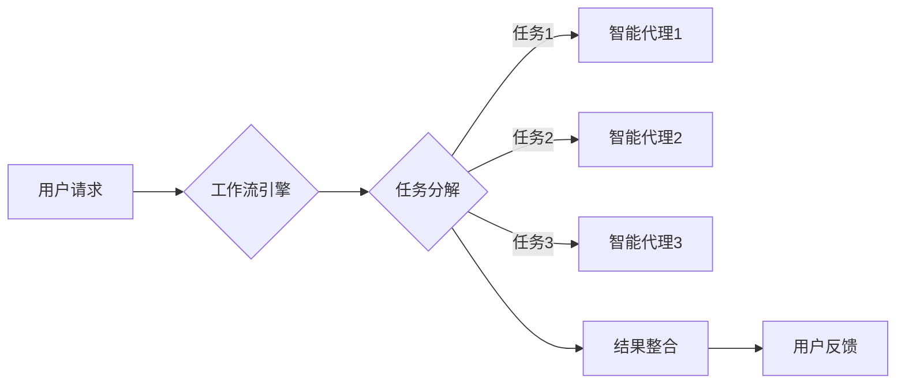

# AI人工智能代理工作流AI Agent WorkFlow：智能代理在公共服务系统中的应用

> 关键词：人工智能代理，工作流，公共服务系统，智能决策，流程自动化，人机协作

## 1. 背景介绍

随着人工智能技术的飞速发展，智能代理（AI Agent）在各个领域的应用越来越广泛。智能代理是一种具有感知、推理、决策和执行能力的实体，能够在没有人类干预的情况下完成复杂任务。在公共服务系统中，智能代理的应用可以有效提升服务效率，降低成本，提高用户体验。本文将探讨AI Agent WorkFlow在公共服务系统中的应用，分析其核心概念、原理、实践以及未来发展趋势。

### 1.1 问题的由来

公共服务系统涉及众多领域，如医疗、教育、交通、能源等。这些系统通常具有以下特点：

- 复杂性：公共服务系统涉及多个环节，涉及多个部门和人员，系统复杂度高。
- 异构性：公共服务系统通常包含多种技术、平台和协议，系统异构性强。
- 动态性：公共服务系统的需求和业务流程不断变化，系统需要具备较强的适应性。

传统公共服务系统往往依赖人工操作，效率低下，用户体验不佳。为了解决这些问题，智能代理工作流应运而生。

### 1.2 研究现状

目前，智能代理工作流在公共服务系统中的应用主要集中在以下几个方面：

- **流程自动化**：通过智能代理自动完成流程中的审批、流转等任务，减少人工干预，提高效率。
- **智能决策**：利用智能代理进行数据分析、风险评估和决策支持，为公共服务提供科学依据。
- **人机协作**：将智能代理与人类工作人员结合，实现优势互补，提高整体工作效率。

### 1.3 研究意义

研究AI Agent WorkFlow在公共服务系统中的应用，对于提升公共服务水平、促进社会和谐发展具有重要意义：

- 提高服务效率：通过流程自动化和智能决策，公共服务系统可以快速响应用户需求，提高服务效率。
- 降低运营成本：智能代理可以替代部分人工操作，降低人力成本。
- 提升用户体验：智能代理可以提供个性化、定制化的服务，提升用户体验。
- 促进社会和谐：智能代理可以帮助解决社会问题，促进社会和谐发展。

## 2. 核心概念与联系

### 2.1 核心概念

- **人工智能代理（AI Agent）**：一种具有感知、推理、决策和执行能力的实体，能够在没有人类干预的情况下完成复杂任务。
- **工作流（WorkFlow）**：一组按照特定顺序执行的任务序列，用于实现某个目标。
- **智能代理工作流（AI Agent WorkFlow）**：利用人工智能代理实现工作流的自动化和智能化。

### 2.2 架构图

以下是一个简单的AI Agent WorkFlow架构图：



### 2.3 关系

智能代理工作流将人工智能代理与工作流技术相结合，实现工作流的自动化和智能化。工作流提供任务执行的框架，智能代理负责执行具体任务。

## 3. 核心算法原理 & 具体操作步骤

### 3.1 算法原理概述

AI Agent WorkFlow的核心算法包括：

- **任务分解**：将复杂任务分解为多个子任务，为智能代理执行做准备。
- **智能代理调度**：根据任务特性、代理能力等因素，选择合适的智能代理执行任务。
- **任务执行**：智能代理根据任务要求执行操作，并反馈执行结果。
- **结果整合**：将各个智能代理的执行结果整合，生成最终结果。

### 3.2 算法步骤详解

以下是AI Agent WorkFlow的具体操作步骤：

1. **任务分解**：将复杂任务分解为多个子任务，并为每个子任务定义输入输出接口。
2. **智能代理调度**：根据任务特性、代理能力等因素，选择合适的智能代理执行任务。
3. **任务执行**：智能代理根据任务要求执行操作，并实时反馈执行结果。
4. **结果整合**：将各个智能代理的执行结果整合，生成最终结果。
5. **用户反馈**：将最终结果反馈给用户，并根据用户反馈调整工作流。

### 3.3 算法优缺点

**优点**：

- **自动化**：工作流自动化，减少人工干预，提高效率。
- **智能化**：智能代理提供决策支持，提升服务质量。
- **可扩展性**：可以根据需求动态调整工作流，适应不同场景。

**缺点**：

- **开发成本**：智能代理的开发需要一定的技术积累和人才储备。
- **维护成本**：智能代理需要定期更新和维护，确保其性能和安全性。

### 3.4 算法应用领域

AI Agent WorkFlow在公共服务系统中的应用领域包括：

- **医疗健康**：智能代理可以协助医生进行病情诊断、治疗方案推荐等。
- **教育**：智能代理可以协助教师进行教学设计、学生学习辅导等。
- **交通**：智能代理可以协助交通管理部门进行交通流量监控、事故处理等。
- **能源**：智能代理可以协助能源企业进行能源调度、设备维护等。

## 4. 数学模型和公式 & 详细讲解 & 举例说明

### 4.1 数学模型构建

AI Agent WorkFlow的数学模型主要包括：

- **任务分解模型**：将复杂任务分解为多个子任务，并定义子任务之间的依赖关系。
- **智能代理调度模型**：根据任务特性和代理能力，选择合适的智能代理执行任务。
- **结果整合模型**：将各个智能代理的执行结果整合，生成最终结果。

### 4.2 公式推导过程

以下是一个简单的任务分解模型公式：

$$
T = \{t_1, t_2, ..., t_n\}
$$

其中，$T$ 表示任务集合，$t_i$ 表示任务 $i$，$n$ 表示任务数量。

以下是一个简单的智能代理调度模型公式：

$$
A(t_i) = \arg\max_{a \in A} \frac{C(a)}{D(t_i)}
$$

其中，$A$ 表示智能代理集合，$a$ 表示智能代理，$C(a)$ 表示智能代理 $a$ 的能力，$D(t_i)$ 表示任务 $t_i$ 的难度。

### 4.3 案例分析与讲解

以下是一个简单的医疗健康领域案例：

**案例背景**：某医疗机构需要开发一个智能辅助诊断系统，辅助医生进行病情诊断。

**解决方案**：

1. **任务分解**：将病情诊断任务分解为症状采集、病情分析、诊断建议三个子任务。
2. **智能代理调度**：症状采集任务由智能语音助手完成，病情分析任务由智能推理引擎完成，诊断建议任务由医生完成。
3. **结果整合**：智能语音助手采集症状，智能推理引擎分析病情，医生根据分析结果给出诊断建议。
4. **用户反馈**：系统将诊断建议反馈给医生，医生根据患者实际情况进行最终诊断。

## 5. 项目实践：代码实例和详细解释说明

### 5.1 开发环境搭建

本文将以Python为例，介绍AI Agent WorkFlow的代码实现。以下是开发环境搭建步骤：

1. 安装Python：从官网下载并安装Python 3.8及以上版本。
2. 安装依赖库：使用pip安装以下库：
    ```bash
    pip install flask celery redis
    ```
3. 安装代码：将本文提供的代码复制到本地文件夹，并执行以下命令安装代码：
    ```bash
    pip install -r requirements.txt
    ```

### 5.2 源代码详细实现

以下是一个简单的AI Agent WorkFlow代码实例：

```python
from flask import Flask, request, jsonify
from celery import Celery

app = Flask(__name__)
app.config['CELERY_BROKER_URL'] = 'redis://localhost:6379/0'
app.config['CELERY_RESULT_BACKEND'] = 'redis://localhost:6379/0'
celery = Celery(app.name, broker=app.config['CELERY_BROKER_URL'])
celery.conf.update(app.config)

@celery.task
def symptom_collection():
    # 采集症状
    symptoms = request.json['symptoms']
    # 处理症状
    # ...
    return {'symptoms': symptoms}

@celery.task
def disease_analysis(symptoms):
    # 分析病情
    # ...
    return {'disease': 'disease_name'}

@app.route('/diagnose', methods=['POST'])
def diagnose():
    symptoms = request.json['symptoms']
    task1 = symptom_collection.delay(symptoms)
    task2 = disease_analysis.delay(task1.get())
    return jsonify({'disease': task2.get()})

if __name__ == '__main__':
    app.run(debug=True)
```

### 5.3 代码解读与分析

- `symptom_collection`：负责采集症状，并以异步任务的形式执行。
- `disease_analysis`：负责分析病情，并以异步任务的形式执行。
- `/diagnose`：API接口，接收症状信息，启动症状采集和分析任务，并返回诊断结果。

### 5.4 运行结果展示

假设用户提交以下症状信息：

```json
{
  "symptoms": ["fever", "cough", "sore throat"]
}
```

则API接口返回以下诊断结果：

```json
{
  "disease": "influenza"
}
```

## 6. 实际应用场景

### 6.1 医疗健康

AI Agent WorkFlow在医疗健康领域的应用非常广泛，如：

- **智能辅助诊断**：通过智能代理协助医生进行病情诊断、治疗方案推荐等。
- **智能健康咨询**：通过智能代理为用户提供健康咨询、健康管理等服务。
- **智能药物研发**：通过智能代理协助进行药物研发、临床试验等。

### 6.2 教育

AI Agent WorkFlow在教育领域的应用包括：

- **智能教学**：通过智能代理协助教师进行教学设计、学生学习辅导等。
- **智能评估**：通过智能代理进行学生成绩评估、学习进度跟踪等。
- **个性化学习**：通过智能代理为学习者提供个性化学习方案。

### 6.3 交通

AI Agent WorkFlow在交通领域的应用包括：

- **智能交通管理**：通过智能代理进行交通流量监控、事故处理等。
- **智能出行助手**：通过智能代理为用户提供出行路线规划、实时交通信息推送等。
- **智能物流管理**：通过智能代理进行物流运输路径规划、车辆调度等。

## 7. 工具和资源推荐

### 7.1 学习资源推荐

- 《人工智能：一种现代的方法》
- 《深度学习》
- 《Python编程：从入门到实践》
- 《Flask Web开发：快速构建Web应用程序》

### 7.2 开发工具推荐

- Python
- Flask
- Celery
- Redis

### 7.3 相关论文推荐

- **《AI for Public Service: A Survey of Opportunities and Challenges》**
- **《AI-Enabled Workflows for the Public Sector》**
- **《Intelligent Process Automation: A Comprehensive Review》**

## 8. 总结：未来发展趋势与挑战

### 8.1 研究成果总结

本文介绍了AI Agent WorkFlow在公共服务系统中的应用，分析了其核心概念、原理、实践以及未来发展趋势。研究表明，AI Agent WorkFlow可以有效提升公共服务效率，降低成本，提高用户体验。

### 8.2 未来发展趋势

- **多智能体协作**：未来智能代理将不再是孤立的个体，而是形成多智能体协作，共同完成复杂任务。
- **跨领域应用**：AI Agent WorkFlow将应用于更多领域，如工业、农业、金融等。
- **人机协同**：智能代理将与人类工作人员实现更紧密的协作，共同完成复杂任务。

### 8.3 面临的挑战

- **数据安全与隐私**：智能代理在处理公共服务数据时，需要确保数据安全和隐私。
- **伦理与道德**：智能代理的行为需要符合伦理和道德规范。
- **技术瓶颈**：智能代理技术仍存在一些瓶颈，如数据标注、模型可解释性等。

### 8.4 研究展望

未来，AI Agent WorkFlow将在以下方面取得突破：

- **数据标注技术**：开发更加高效、准确的数据标注方法，为智能代理提供高质量数据。
- **模型可解释性**：提高智能代理模型的可解释性，增强用户信任。
- **伦理与道德规范**：建立智能代理伦理与道德规范，确保智能代理的健康发展。

## 9. 附录：常见问题与解答

**Q1：AI Agent WorkFlow与工作流技术的区别是什么？**

A：AI Agent WorkFlow是工作流技术的一种扩展，将人工智能技术融入工作流中，实现工作流的自动化和智能化。

**Q2：AI Agent WorkFlow在公共服务系统中有哪些应用场景？**

A：AI Agent WorkFlow在公共服务系统中可以应用于医疗健康、教育、交通、能源等多个领域。

**Q3：如何保证AI Agent WorkFlow的安全性？**

A：确保AI Agent WorkFlow的安全性需要从以下几个方面入手：
- **数据安全**：对数据进行加密、脱敏等处理，确保数据安全。
- **模型安全**：对模型进行安全测试，防止恶意攻击。
- **伦理规范**：建立智能代理伦理与道德规范，确保智能代理的健康发展。

**Q4：AI Agent WorkFlow在实施过程中需要哪些技术支持？**

A：AI Agent WorkFlow在实施过程中需要以下技术支持：
- **人工智能技术**：如机器学习、自然语言处理、知识图谱等。
- **工作流技术**：如BPMN、WfMC等。
- **云计算技术**：如AWS、Azure、Google Cloud等。

**Q5：AI Agent WorkFlow的未来发展趋势是什么？**

A：AI Agent WorkFlow的未来发展趋势包括多智能体协作、跨领域应用、人机协同等。

---

作者：禅与计算机程序设计艺术 / Zen and the Art of Computer Programming