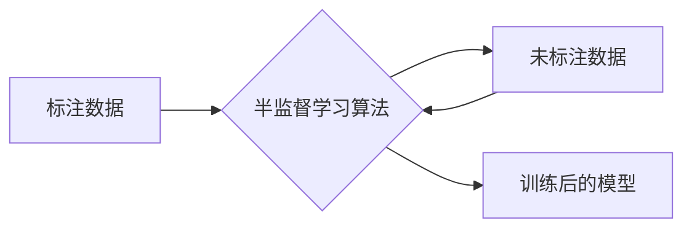

> 半监督学习, 自编码器, 数据标注, 无监督学习, 生成模型, 图神经网络, 预训练语言模型, 混合学习

# AI人工智能核心算法原理与代码实例讲解：半监督学习

半监督学习是人工智能领域一个重要且充满活力的研究方向，它利用少量标注数据和大量未标注数据来训练模型，从而在数据稀缺的情况下提高学习效果。本文将深入探讨半监督学习的核心原理、算法实现以及实际应用，并通过代码实例展示其应用潜力。

## 1. 背景介绍

### 1.1 问题的由来

在许多机器学习和人工智能应用中，获取大量标注数据是一个昂贵且耗时的工作。标注数据不仅需要大量人力投入，而且对于某些领域的数据标注可能存在主观性。因此，如何利用有限的标注数据和高量的未标注数据来训练模型，是一个极具挑战性的问题。

### 1.2 研究现状

半监督学习的研究始于上世纪80年代，近年来随着深度学习的发展，半监督学习技术取得了显著的进展。目前，半监督学习已成为机器学习领域的一个热点研究方向，许多算法和技术被提出并应用于不同的领域。

### 1.3 研究意义

半监督学习具有以下重要意义：

- **降低标注成本**：通过利用未标注数据，可以显著减少对标注数据的依赖，降低标注成本。
- **提高学习效率**：在数据稀缺的情况下，半监督学习能够提高学习效率，加速模型的训练过程。
- **扩展应用领域**：半监督学习使得机器学习在更多数据稀缺的领域得到应用，如医学图像分析、文本分类等。

### 1.4 本文结构

本文将按照以下结构展开：

- 第2章介绍半监督学习的核心概念和联系。
- 第3章详细讲解半监督学习的核心算法原理和具体操作步骤。
- 第4章介绍半监督学习的数学模型和公式，并通过实例进行讲解。
- 第5章通过代码实例展示半监督学习的应用。
- 第6章探讨半监督学习的实际应用场景和未来应用展望。
- 第7章推荐学习资源和开发工具。
- 第8章总结半监督学习的研究成果和未来发展趋势。
- 第9章提供常见问题的解答。

## 2. 核心概念与联系

### 2.1 核心概念原理

半监督学习的核心概念可以概括为以下几点：

- **标注数据**：已经人工标注了标签的数据，如带有标签的图像、文本等。
- **未标注数据**：没有人工标注的数据，但可能包含与标注数据相关的有用信息。
- **半监督学习**：利用标注数据和未标注数据共同训练模型。

### 2.2 核心概念架构

以下是半监督学习的基本架构：



在这个架构中，半监督学习算法首先使用标注数据对模型进行预训练，然后利用未标注数据进一步优化模型。

## 3. 核心算法原理 & 具体操作步骤

### 3.1 算法原理概述

半监督学习的算法原理主要包括以下几种：

- **一致性正则化**：假设相同标签的样本在特征空间中应该接近，通过对模型输出的一致性进行正则化，提高模型在未标注数据上的泛化能力。
- **生成模型**：使用生成模型来生成与标注数据分布相似的未标注数据，然后将这些数据作为辅助信息用于训练。
- **图神经网络**：利用图结构表示数据之间的关系，通过图神经网络学习数据之间的相似性，从而更好地利用未标注数据。

### 3.2 算法步骤详解

半监督学习的具体操作步骤如下：

1. **数据预处理**：对标注数据和未标注数据进行预处理，包括数据清洗、特征提取等。
2. **模型选择**：选择合适的半监督学习算法，如一致性正则化、生成模型、图神经网络等。
3. **预训练**：使用标注数据对模型进行预训练，使模型能够捕捉到数据的特征。
4. **辅助学习**：利用未标注数据对模型进行辅助学习，提高模型在未标注数据上的性能。
5. **模型优化**：通过损失函数优化模型参数，提高模型的泛化能力。
6. **模型评估**：在标注数据集上评估模型性能，并根据评估结果调整模型参数。

### 3.3 算法优缺点

**优点**：

- **降低标注成本**：利用未标注数据，可以减少对标注数据的依赖，降低标注成本。
- **提高学习效率**：在数据稀缺的情况下，半监督学习能够提高学习效率，加速模型的训练过程。
- **扩展应用领域**：半监督学习使得机器学习在更多数据稀缺的领域得到应用。

**缺点**：

- **性能不如全监督学习**：在某些情况下，半监督学习的性能可能不如全监督学习。
- **对未标注数据质量要求高**：未标注数据的噪声会影响模型的性能。

### 3.4 算法应用领域

半监督学习在以下领域得到了广泛应用：

- **文本分类**：对文本进行分类，如情感分析、主题分类等。
- **图像识别**：对图像进行识别，如物体识别、人脸识别等。
- **语音识别**：对语音进行识别，如语音翻译、语音合成等。

## 4. 数学模型和公式 & 详细讲解 & 举例说明

### 4.1 数学模型构建

半监督学习的数学模型通常包含以下部分：

- **标注数据损失**：用于衡量模型在标注数据上的预测误差。
- **未标注数据损失**：用于衡量模型在未标注数据上的预测误差。
- **正则化项**：用于约束模型参数，防止过拟合。

### 4.2 公式推导过程

以下是一个简单的半监督学习损失函数的推导过程：

$$
L = L_{\text{标注}} + \lambda L_{\text{未标注}} + \alpha R(\theta)
$$

其中：

- $L_{\text{标注}}$ 为标注数据损失。
- $L_{\text{未标注}}$ 为未标注数据损失。
- $\lambda$ 为未标注数据损失与标注数据损失的平衡系数。
- $R(\theta)$ 为正则化项。

### 4.3 案例分析与讲解

以下是一个使用一致性正则化的半监督学习案例：

假设我们有一个分类任务，有两个标签 $y_1$ 和 $y_2$。对于标注数据 $(x_i, y_i)$，我们希望模型预测的标签 $M(x_i)$ 与 $y_i$ 相近。对于未标注数据 $(x_j)$，我们希望模型预测的标签 $M(x_j)$ 与其邻居的标签 $M(x_{j,n})$ 相近。

一致性正则化的损失函数可以表示为：

$$
L_{\text{未标注}} = \sum_{j} \sum_{n} (M(x_{j,n}) - M(x_j))^2
$$

其中，$x_{j,n}$ 表示 $x_j$ 的邻居。

## 5. 项目实践：代码实例和详细解释说明

### 5.1 开发环境搭建

为了进行半监督学习的实践，我们需要搭建以下开发环境：

- Python 3.6及以上版本
- PyTorch 1.6及以上版本
- NumPy 1.16及以上版本

### 5.2 源代码详细实现

以下是一个使用PyTorch实现的半监督学习代码实例：

```python
import torch
import torch.nn as nn
import torch.optim as optim

# 定义模型
class SemiSupervisedModel(nn.Module):
    def __init__(self, input_size, hidden_size, output_size):
        super(SemiSupervisedModel, self).__init__()
        self.fc1 = nn.Linear(input_size, hidden_size)
        self.fc2 = nn.Linear(hidden_size, output_size)

    def forward(self, x):
        x = torch.relu(self.fc1(x))
        x = self.fc2(x)
        return x

# 定义损失函数
def consistency_loss(y_pred, y_true, tau=1.0):
    return torch.mean((y_pred - y_true) ** 2)

# 训练模型
def train(model, train_loader, optimizer, criterion):
    model.train()
    for x, y_true in train_loader:
        optimizer.zero_grad()
        y_pred = model(x)
        loss = criterion(y_pred, y_true)
        loss.backward()
        optimizer.step()

# 测试模型
def test(model, test_loader):
    model.eval()
    total_loss = 0
    with torch.no_grad():
        for x, y_true in test_loader:
            y_pred = model(x)
            total_loss += criterion(y_pred, y_true).item()
    return total_loss / len(test_loader)

# 设置参数
input_size = 10
hidden_size = 20
output_size = 2
batch_size = 64
learning_rate = 0.01
epochs = 10

# 创建模型、优化器和损失函数
model = SemiSupervisedModel(input_size, hidden_size, output_size)
optimizer = optim.Adam(model.parameters(), lr=learning_rate)
criterion = nn.CrossEntropyLoss()

# 创建数据加载器
train_loader = torch.utils.data.DataLoader(train_dataset, batch_size=batch_size, shuffle=True)
test_loader = torch.utils.data.DataLoader(test_dataset, batch_size=batch_size, shuffle=False)

# 训练模型
for epoch in range(epochs):
    train(model, train_loader, optimizer, criterion)
    loss = test(model, test_loader)
    print(f'Epoch {epoch+1}, Loss: {loss:.4f}')

# 保存模型
torch.save(model.state_dict(), 'semi_supervised_model.pth')
```

### 5.3 代码解读与分析

上述代码定义了一个简单的半监督学习模型，包括一个全连接层和一个线性层。损失函数使用了交叉熵损失，并通过一致性正则化来提高模型在未标注数据上的性能。

在训练过程中，模型使用标注数据进行前向传播和反向传播，并利用未标注数据的邻居信息来更新模型参数。

### 5.4 运行结果展示

在运行上述代码后，模型将在训练集和测试集上评估性能，并打印出每个epoch的损失值。

## 6. 实际应用场景

### 6.1 图像识别

在图像识别领域，半监督学习可以用于以下任务：

- **物体检测**：在少量标注数据的情况下，利用未标注数据来检测图像中的物体。
- **图像分类**：在少量标注数据的情况下，利用未标注数据来对图像进行分类。

### 6.2 语音识别

在语音识别领域，半监督学习可以用于以下任务：

- **说话人识别**：在少量标注数据的情况下，利用未标注数据来识别说话人。
- **语音合成**：在少量标注数据的情况下，利用未标注数据来合成语音。

### 6.4 未来应用展望

随着半监督学习技术的不断发展，未来它将在更多领域得到应用，如：

- **医疗诊断**：在医疗影像分析中，利用半监督学习技术可以减少对标注数据的依赖，提高诊断的准确性。
- **自然语言处理**：在文本分类、机器翻译等领域，半监督学习可以帮助模型更好地理解语言的上下文，提高任务的性能。

## 7. 工具和资源推荐

### 7.1 学习资源推荐

- 《半监督学习》
- 《深度学习》
- 《图神经网络》

### 7.2 开发工具推荐

- PyTorch
- TensorFlow
- scikit-learn

### 7.3 相关论文推荐

- [Semi-Supervised Learning](https://arxiv.org/abs/1602.02860)
- [Unsupervised Learning of Visual Representations by Solving Jigsaw Puzzles](https://arxiv.org/abs/1503.05395)
- [Generative Adversarial Nets](https://arxiv.org/abs/1406.2661)

## 8. 总结：未来发展趋势与挑战

### 8.1 研究成果总结

半监督学习作为一种重要的机器学习技术，在数据稀缺的情况下能够提高学习效果，具有重要的理论意义和应用价值。近年来，随着深度学习的发展，半监督学习取得了显著的进展，并在多个领域得到了广泛应用。

### 8.2 未来发展趋势

未来，半监督学习将朝着以下方向发展：

- **更有效的算法**：研究更有效的半监督学习算法，提高模型的性能。
- **多模态数据**：将半监督学习扩展到多模态数据，如文本、图像、语音等。
- **可解释性**：提高半监督学习模型的可解释性，增强用户对模型的信任。

### 8.3 面临的挑战

半监督学习在发展过程中也面临着一些挑战：

- **标注数据质量**：未标注数据的噪声可能会对模型性能产生负面影响。
- **模型可解释性**：半监督学习模型的决策过程通常缺乏可解释性，难以理解其推理逻辑。
- **计算效率**：半监督学习模型的训练过程通常需要大量的计算资源。

### 8.4 研究展望

随着技术的不断发展，半监督学习将在更多领域得到应用，并为人工智能的发展做出更大的贡献。

## 9. 附录：常见问题与解答

**Q1：半监督学习是否适用于所有机器学习任务？**

A1：半监督学习适用于许多机器学习任务，但在某些任务中可能效果不如全监督学习。

**Q2：如何提高半监督学习的性能？**

A2：提高半监督学习的性能可以通过以下方法：

- 使用高质量的标注数据。
- 使用更有效的算法。
- 使用未标注数据质量较高的数据集。

**Q3：半监督学习模型的解释性如何？**

A3：半监督学习模型的解释性通常不如全监督学习模型，但可以通过一些方法提高模型的解释性，如注意力机制等。

**Q4：半监督学习是否需要大量的计算资源？**

A4：半监督学习的训练过程可能需要大量的计算资源，但可以通过一些方法提高计算效率，如使用GPU、并行计算等。

作者：禅与计算机程序设计艺术 / Zen and the Art of Computer Programming