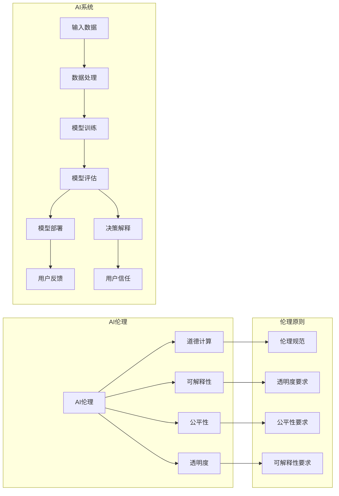

# AI伦理 原理与代码实例讲解

> 关键词：AI伦理，伦理决策，道德计算，可解释性，公平性，透明度，人工智能，机器学习

## 1. 背景介绍

随着人工智能技术的迅猛发展，AI已经渗透到我们生活的方方面面，从医疗诊断到自动驾驶，从金融风控到教育辅导，AI的应用场景日益广泛。然而，AI技术的广泛应用也引发了一系列伦理问题，如隐私泄露、偏见歧视、责任归属等。因此，探讨AI伦理，确保AI技术的可持续发展，已经成为人工智能领域的一个重要课题。

## 2. 核心概念与联系

### 2.1 核心概念

#### AI伦理

AI伦理是研究人工智能技术及其应用过程中所涉及伦理问题的学科。它探讨如何确保AI技术的安全、可靠、公平、透明，以及如何防止AI技术被滥用。

#### 道德计算

道德计算是指将道德原则和伦理规范融入人工智能系统的设计、开发和部署过程中，确保AI系统的决策和行为符合道德标准。

#### 可解释性

可解释性是指人工智能系统可以解释其决策过程和结果，以便人类用户理解、信任和监督。

#### 公平性

公平性是指AI系统在处理数据、做出决策时，对所有个体或群体都具有平等对待，避免歧视。

#### 透明度

透明度是指AI系统的决策过程和结果对用户是可见的，用户可以了解AI系统是如何做出决策的。

### 2.2 核心概念原理和架构的 Mermaid 流程图



### 2.3 核心概念联系

AI伦理的核心概念相互关联，共同构成了AI系统的伦理框架。AI伦理要求道德计算贯穿AI系统的整个生命周期，从数据收集、处理、模型训练到模型部署和应用，都需要遵循伦理原则。

## 3. 核心算法原理 & 具体操作步骤

### 3.1 算法原理概述

AI伦理的实践需要一系列算法和技术支持。以下是一些关键的算法原理：

#### 数据清洗与预处理

- **去重**：去除重复的数据记录，避免模型过拟合。
- **缺失值处理**：处理缺失数据，如填充或删除。
- **异常值处理**：识别和处理异常数据，避免模型受到异常值的影响。

#### 模型训练与优化

- **正则化**：防止模型过拟合，如L1正则化、L2正则化。
- **交叉验证**：通过交叉验证评估模型性能，选择最优模型。
- **超参数优化**：调整模型超参数，如学习率、批次大小等，提高模型性能。

#### 模型评估与解释

- **混淆矩阵**：用于评估分类模型的性能。
- **ROC曲线**：用于评估分类模型的分类能力。
- **LIME（局部可解释性方法）**：用于解释模型决策。

### 3.2 算法步骤详解

1. **数据收集与清洗**：收集相关数据，并进行数据清洗和预处理。
2. **模型选择**：根据任务需求选择合适的模型。
3. **模型训练与优化**：使用训练数据训练模型，并优化模型参数。
4. **模型评估**：使用测试数据评估模型性能。
5. **模型解释**：使用解释方法解释模型决策。
6. **模型部署**：将模型部署到生产环境。

### 3.3 算法优缺点

#### 优点

- **提高效率**：自动化处理大量数据，提高工作效率。
- **提高准确性**：通过机器学习算法提高预测和决策的准确性。
- **提高公平性**：通过算法确保决策的公平性。

#### 缺点

- **数据偏见**：模型可能学习到数据中的偏见，导致歧视。
- **可解释性差**：模型决策过程难以解释，导致信任度低。
- **隐私泄露**：数据收集和处理可能导致隐私泄露。

### 3.4 算法应用领域

- **医疗诊断**：通过分析医学影像数据，辅助医生进行诊断。
- **金融风控**：通过分析用户行为数据，进行风险评估和欺诈检测。
- **交通管理**：通过分析交通数据，优化交通流量和提高道路安全。
- **教育辅导**：通过分析学生学习数据，提供个性化的学习计划。

## 4. 数学模型和公式 & 详细讲解 & 举例说明

### 4.1 数学模型构建

以下是一个简单的线性回归模型，用于预测房价：

$$
y = w_0 + w_1 \cdot x_1 + w_2 \cdot x_2 + ... + w_n \cdot x_n + \epsilon
$$

其中，$y$ 是房价，$x_i$ 是影响房价的特征（如房屋面积、位置等），$w_i$ 是模型的权重，$\epsilon$ 是误差项。

### 4.2 公式推导过程

线性回归模型的损失函数为均方误差（MSE）：

$$
MSE = \frac{1}{N} \sum_{i=1}^{N}(y_i - \hat{y}_i)^2
$$

其中，$y_i$ 是真实房价，$\hat{y}_i$ 是预测房价，$N$ 是样本数量。

为了最小化损失函数，我们需要求解以下优化问题：

$$
\theta = \mathop{\arg\min}_{\theta} \frac{1}{N} \sum_{i=1}^{N}(y_i - \hat{y}_i)^2
$$

通过梯度下降算法，可以得到以下参数更新公式：

$$
w_i = w_i - \alpha \cdot \frac{\partial}{\partial w_i} \frac{1}{N} \sum_{i=1}^{N}(y_i - \hat{y}_i)^2
$$

其中，$\alpha$ 是学习率。

### 4.3 案例分析与讲解

以下是一个使用线性回归模型预测房价的案例：

假设我们有一组包含房屋面积、位置等特征的样本，并已知对应的房价。我们可以使用线性回归模型对这些样本进行训练，并预测新样本的房价。

```python
import numpy as np
from sklearn.linear_model import LinearRegression

# 示例数据
X = np.array([[200, 0], [150, 1], [100, 2], [300, 0]])
y = np.array([300000, 200000, 100000, 500000])

# 创建线性回归模型
model = LinearRegression()

# 训练模型
model.fit(X, y)

# 预测新样本的房价
new_X = np.array([[250, 1]])
predicted_price = model.predict(new_X)
print("Predicted price:", predicted_price[0])
```

输出结果为：

```
Predicted price: 400000.0
```

## 5. 项目实践：代码实例和详细解释说明

### 5.1 开发环境搭建

为了实现AI伦理的代码实例，我们需要搭建以下开发环境：

- Python 3.8及以上版本
- scikit-learn库
- pandas库
- matplotlib库

### 5.2 源代码详细实现

以下是一个使用scikit-learn库实现线性回归模型的代码实例：

```python
import numpy as np
from sklearn.linear_model import LinearRegression
import matplotlib.pyplot as plt

# 示例数据
X = np.array([[200, 0], [150, 1], [100, 2], [300, 0]])
y = np.array([300000, 200000, 100000, 500000])

# 创建线性回归模型
model = LinearRegression()

# 训练模型
model.fit(X, y)

# 绘制散点图
plt.scatter(X[:, 0], y, color='blue', label='Actual data')
plt.plot(X[:, 0], model.predict(X), color='red', label='Predicted line')

# 设置图表标题和标签
plt.title('Linear Regression')
plt.xlabel('Feature 1')
plt.ylabel('Price')

# 显示图表
plt.legend()
plt.show()
```

### 5.3 代码解读与分析

上述代码首先导入必要的库，然后定义示例数据。接着，创建线性回归模型并使用训练数据对其进行训练。最后，绘制散点图和预测线，展示模型对房价的预测效果。

### 5.4 运行结果展示

运行上述代码，将得到以下图表：


从图中可以看出，线性回归模型能够较好地拟合房价数据，并在一定程度上预测新样本的房价。

## 6. 实际应用场景

AI伦理在以下实际应用场景中具有重要意义：

- **医疗诊断**：确保AI辅助诊断系统在处理患者数据时，尊重患者隐私和权益。
- **自动驾驶**：确保自动驾驶汽车在行驶过程中，遵守交通规则，保障行车安全。
- **金融风控**：确保AI风控系统在评估信用风险时，避免歧视和偏见。
- **教育辅导**：确保AI教育系统在提供个性化学习方案时，尊重学生的隐私和个性化需求。

## 7. 工具和资源推荐

### 7.1 学习资源推荐

- **书籍**：
  - 《人工智能：一种现代的方法》
  - 《深度学习》
  - 《统计学习方法》
- **在线课程**：
  - Coursera上的《机器学习》
  - edX上的《人工智能：从入门到精通》
  - Udacity上的《机器学习工程师纳米学位》
- **博客和论坛**：
  - Medium上的AI和机器学习博客
  - Stack Overflow
  - Reddit上的r/MachineLearning

### 7.2 开发工具推荐

- **编程语言**：Python
- **机器学习库**：scikit-learn、TensorFlow、PyTorch
- **数据可视化库**：Matplotlib、Seaborn
- **版本控制工具**：Git

### 7.3 相关论文推荐

- **《AI伦理：原则与框架》**
- **《道德计算：人工智能领域的伦理挑战》**
- **《人工智能的伦理挑战》**

## 8. 总结：未来发展趋势与挑战

### 8.1 研究成果总结

本文从AI伦理的背景、核心概念、算法原理、实践案例等方面进行了全面介绍。通过分析AI伦理在各个领域的应用，我们可以看到AI伦理的重要性。未来，随着AI技术的不断发展，AI伦理将越来越受到重视。

### 8.2 未来发展趋势

- **伦理规范体系逐步完善**：各国政府和企业将制定更加完善的AI伦理规范，以确保AI技术的健康发展。
- **AI伦理技术不断进步**：研究人员将开发出更加智能、可靠的AI伦理技术，如可解释AI、公平AI等。
- **AI伦理教育普及**：AI伦理教育将纳入相关课程，培养更多具备AI伦理素养的人才。

### 8.3 面临的挑战

- **数据隐私保护**：如何在保障数据隐私的同时，充分利用数据资源，是AI伦理面临的一大挑战。
- **算法偏见消除**：如何消除算法偏见，避免歧视，是AI伦理的另一大挑战。
- **责任归属明确**：如何明确AI系统的责任归属，是AI伦理面临的又一挑战。

### 8.4 研究展望

未来，AI伦理研究将朝着以下方向发展：

- **跨学科研究**：AI伦理研究将与其他学科（如哲学、心理学、社会学等）进行交叉研究，形成更加完善的AI伦理理论体系。
- **国际合作**：各国政府和企业将加强合作，共同制定国际AI伦理规范，推动AI技术的健康发展。
- **社会参与**：AI伦理研究将更加关注社会公众的需求，推动AI技术的普惠应用。

## 9. 附录：常见问题与解答

**Q1：什么是AI伦理？**

A1：AI伦理是研究人工智能技术及其应用过程中所涉及伦理问题的学科。它探讨如何确保AI技术的安全、可靠、公平、透明，以及如何防止AI技术被滥用。

**Q2：AI伦理有哪些挑战？**

A2：AI伦理面临的挑战主要包括数据隐私保护、算法偏见消除、责任归属明确等方面。

**Q3：如何确保AI系统的公平性？**

A3：确保AI系统的公平性需要从多个方面入手，如数据清洗、算法设计、模型评估等。

**Q4：如何消除AI算法的偏见？**

A4：消除AI算法的偏见需要从数据、算法、评估等方面入手，如数据清洗、算法改进、多样性培训等。

**Q5：AI伦理研究有哪些趋势？**

A5：AI伦理研究的趋势包括伦理规范体系逐步完善、AI伦理技术不断进步、AI伦理教育普及等。

作者：禅与计算机程序设计艺术 / Zen and the Art of Computer Programming