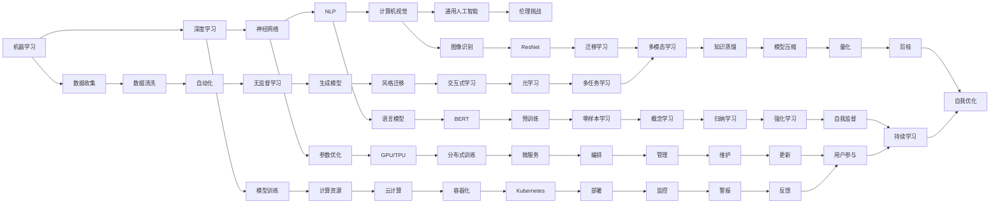

> 关键词：Andrej Karpathy，人工智能，机器学习，神经网络，深度学习，自然语言处理，计算机视觉，未来趋势，伦理挑战

# Andrej Karpathy：人工智能的未来发展机遇

## 1. 背景介绍

在人工智能领域，Andrej Karpathy是一位备受尊敬的专家和思想家。作为OpenAI的首席工程师和前研究科学家，他的工作在自然语言处理（NLP）和深度学习领域产生了深远的影响。本文将探讨Andrej Karpathy关于人工智能未来发展的见解，分析其在机器学习、神经网络、深度学习和自然语言处理等领域的机遇和挑战。

## 2. 核心概念与联系

### 2.1 Mermaid 流程图

以下是基于Andrej Karpathy思想的Mermaid流程图，展示了人工智能发展的一些关键节点和联系：



### 2.2 核心概念解析

- **机器学习**：使计算机通过数据学习并做出决策或预测的技术。
- **深度学习**：一种机器学习方法，使用具有多层处理单元的神经网络来学习数据中的复杂模式。
- **神经网络**：模仿人脑神经元连接的结构，用于处理和分类数据。
- **自然语言处理（NLP）**：使计算机能够理解和生成人类语言的技术。
- **计算机视觉**：使计算机能够“看到”和理解视觉信息的技术。
- **通用人工智能**：一种能够在各种任务中表现出人类智能水平的人工智能。
- **伦理挑战**：随着人工智能技术的发展，如何在确保安全和公平的同时，利用其潜力成为关键问题。

## 3. 核心算法原理 & 具体操作步骤

### 3.1 算法原理概述

Andrej Karpathy的工作主要集中在深度学习和NLP领域，以下是一些核心算法的概述：

- **神经网络**：通过学习数据中的模式，通过层的堆叠和激活函数，实现特征提取和分类。
- **深度学习框架**：如TensorFlow和PyTorch，提供了构建和训练深度学习模型所需的工具和库。
- **预训练语言模型**：如BERT，通过在大规模文本语料库上进行训练，学习通用语言表示。
- **迁移学习**：将预训练模型应用于新任务，以减少训练数据需求和提高性能。
- **生成模型**：如GANs，能够生成新的数据，如文本、图像等。

### 3.2 算法步骤详解

1. **数据收集**：收集用于训练和测试的数据集。
2. **数据预处理**：清洗、标注和转换数据以适应模型。
3. **模型构建**：选择合适的深度学习框架和模型结构。
4. **模型训练**：使用训练数据训练模型，并调整参数以优化性能。
5. **模型评估**：使用测试数据评估模型性能。
6. **模型部署**：将模型部署到生产环境，用于实际应用。

### 3.3 算法优缺点

- **优点**：深度学习模型能够处理复杂的数据和模式，并在各种任务中取得优异的性能。
- **缺点**：需要大量的数据和计算资源，模型的可解释性有限，存在潜在的伦理和社会影响。

### 3.4 算法应用领域

- **自然语言处理**：文本分类、机器翻译、情感分析、问答系统。
- **计算机视觉**：图像识别、物体检测、图像分割、视频分析。
- **语音识别**：语音转文本、语音合成、语音搜索。
- **推荐系统**：个性化推荐、广告投放、内容推荐。

## 4. 数学模型和公式 & 详细讲解 & 举例说明

### 4.1 数学模型构建

以下是一个简单的神经网络数学模型示例：

$$
y = f(W \cdot x + b)
$$

其中，$y$ 是输出，$x$ 是输入，$W$ 是权重，$b$ 是偏置，$f$ 是激活函数。

### 4.2 公式推导过程

神经网络的推导过程涉及微积分、线性代数和概率论等多个数学领域。

### 4.3 案例分析与讲解

以BERT模型为例，它是一种基于Transformer的预训练语言模型。BERT通过自监督学习任务在大量无标注文本上学习通用的语言表示。

## 5. 项目实践：代码实例和详细解释说明

### 5.1 开发环境搭建

为了进行深度学习项目，需要以下开发环境：

- 操作系统：Windows、macOS或Linux
- 编程语言：Python
- 深度学习框架：TensorFlow或PyTorch
- 依赖管理：pip或conda

### 5.2 源代码详细实现

以下是一个使用PyTorch构建简单神经网络的代码示例：

```python
import torch
import torch.nn as nn

class SimpleNet(nn.Module):
    def __init__(self):
        super(SimpleNet, self).__init__()
        self.fc1 = nn.Linear(784, 128)
        self.relu = nn.ReLU()
        self.fc2 = nn.Linear(128, 10)

    def forward(self, x):
        x = self.fc1(x)
        x = self.relu(x)
        x = self.fc2(x)
        return x

model = SimpleNet()
```

### 5.3 代码解读与分析

这段代码定义了一个简单的神经网络模型，包含一个线性层（fc1）、ReLU激活函数和另一个线性层（fc2）。模型通过前向传播函数（forward）接收输入并输出预测结果。

### 5.4 运行结果展示

在训练和测试模型后，可以在控制台查看模型的性能指标，如损失和准确率。

## 6. 实际应用场景

Andrej Karpathy的工作在多个领域都有实际应用，以下是一些例子：

- **自然语言处理**：使用BERT进行文本分类、问答系统和机器翻译。
- **计算机视觉**：使用深度学习模型进行图像识别和物体检测。
- **语音识别**：使用深度学习模型进行语音转文本和语音合成。

## 7. 工具和资源推荐

### 7.1 学习资源推荐

- 《深度学习》系列书籍
- Coursera上的深度学习课程
- Hugging Face的Transformers库

### 7.2 开发工具推荐

- PyTorch或TensorFlow
- Jupyter Notebook
- Google Colab

### 7.3 相关论文推荐

- "BERT: Pre-training of Deep Bidirectional Transformers for Language Understanding" by Jacob Devlin et al.
- "Attention is All You Need" by Ashish Vaswani et al.

## 8. 总结：未来发展趋势与挑战

### 8.1 研究成果总结

Andrej Karpathy在深度学习和NLP领域的研究成果，推动了人工智能技术的发展和应用。

### 8.2 未来发展趋势

- 大规模预训练模型将变得更加常见。
- 模型将变得更加高效和可解释。
- 人工智能将与其他技术（如量子计算、边缘计算）结合。

### 8.3 面临的挑战

- 数据隐私和安全。
- 伦理和社会影响。
- 计算资源需求。

### 8.4 研究展望

人工智能将不断进步，为人类带来更多的机遇和挑战。

## 9. 附录：常见问题与解答

**Q1：什么是深度学习？**

A1：深度学习是一种机器学习方法，使用具有多层处理单元的神经网络来学习数据中的复杂模式。

**Q2：什么是预训练语言模型？**

A2：预训练语言模型是在大规模文本语料库上训练的语言模型，可以用于各种自然语言处理任务。

**Q3：什么是BERT？**

A3：BERT是一种基于Transformer的预训练语言模型，由Google Research开发。

**Q4：人工智能的挑战有哪些？**

A4：人工智能的挑战包括数据隐私和安全、伦理和社会影响、计算资源需求等。

---

作者：禅与计算机程序设计艺术 / Zen and the Art of Computer Programming