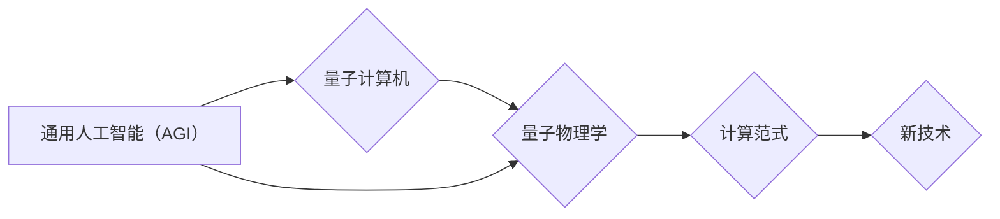

# AGI与量子物理学的未来

> 关键词：通用人工智能（AGI），量子计算机，量子物理学，计算复杂性，人工智能伦理，人机协同

## 1. 背景介绍

### 1.1 通用人工智能的崛起

随着深度学习、神经网络等人工智能技术的飞速发展，人工智能（AI）已经渗透到我们生活的方方面面。从智能助手到自动驾驶，从医疗诊断到金融分析，AI的应用场景日益丰富。然而，当前的人工智能技术主要集中在特定任务上的专用人工智能（ANI），即针对特定领域进行优化和设计的AI系统。

通用人工智能（AGI）是人工智能领域的终极目标，它指的是能够像人类一样理解和推理，具有广泛认知能力，能够自主学习和适应各种环境和任务的智能系统。AGI的实现将彻底改变人类社会的生产方式、生活方式和思维方式。

### 1.2 量子物理学的突破

量子物理学作为现代物理学的基石，近年来取得了重大突破。量子计算、量子通信和量子模拟等领域的研究进展，为解决传统计算机在处理复杂问题上的局限性提供了新的思路。

### 1.3 AGI与量子物理学的碰撞

AGI与量子物理学的碰撞，是21世纪科技发展的一大趋势。量子物理学的原理和技术，有望为AGI提供新的计算范式，推动AGI的发展。

## 2. 核心概念与联系

### 2.1 核心概念原理

#### 2.1.1 通用人工智能（AGI）

AGI的核心概念是模拟人类智能，包括感知、学习、推理、决策、规划、沟通等能力。AGI需要具备以下特征：

- **自主性**：能够自主设定目标和执行计划。
- **适应性**：能够适应不同环境和任务。
- **自学习性**：能够从经验中学习并改进自身。
- **通用性**：能够在不同领域和任务上应用。

#### 2.1.2 量子计算机

量子计算机利用量子位（qubits）进行计算，具有与传统计算机完全不同的计算能力。量子位的叠加和纠缠特性，使得量子计算机在处理某些特定问题上具有超越传统计算机的潜力。

#### 2.1.3 量子物理学

量子物理学研究微观世界的规律，揭示了物质的基本性质。量子物理学的原理，如量子纠缠、量子叠加等，为量子计算机的设计和实现提供了理论基础。

### 2.2 架构流程图



### 2.3 联系

AGI与量子物理学之间的联系体现在以下几个方面：

- **计算范式**：量子计算机的突破性计算能力，为AGI提供了新的计算范式，有望解决AGI在处理复杂问题上的计算瓶颈。
- **学习算法**：量子物理学的原理，如量子纠缠、量子叠加等，可以用于设计新的学习算法，提高AGI的学习效率和性能。
- **神经网络**：量子计算机可以用于优化神经网络的参数，提高神经网络的泛化能力和表达能力。
- **数据科学**：量子计算机可以加速数据分析过程，为AGI提供更多数据支持。

## 3. 核心算法原理 & 具体操作步骤

### 3.1 算法原理概述

#### 3.1.1 量子神经网络

量子神经网络（QNN）是量子计算机在人工智能领域的重要应用之一。QNN结合了量子计算和神经网络的原理，有望实现更高效的计算和更强大的学习能力。

#### 3.1.2 量子机器学习

量子机器学习是量子计算机在机器学习领域的应用，通过量子计算技术优化机器学习算法，提高学习效率和准确性。

### 3.2 算法步骤详解

#### 3.2.1 量子神经网络

1. 设计量子神经网络结构，包括量子位、量子门、量子线路等。
2. 将输入数据编码到量子态中。
3. 通过量子门和量子线路进行量子计算，得到输出结果。
4. 将输出结果解码回经典数据。

#### 3.2.2 量子机器学习

1. 选择合适的量子算法，如量子支持向量机（QSVM）、量子决策树（QDT）等。
2. 将训练数据编码到量子态中。
3. 使用量子算法进行训练，优化模型参数。
4. 使用训练好的模型进行预测。

### 3.3 算法优缺点

#### 3.3.1 量子神经网络

优点：

- 计算能力强，能够处理复杂的非线性问题。
- 学习速度快，能够快速收敛到最优解。

缺点：

- 量子计算机硬件尚未成熟，实现难度较大。
- 量子神经网络的设计和优化需要深入研究。

#### 3.3.2 量子机器学习

优点：

- 优化速度快，能够提高机器学习效率。
- 准确性高，能够提高模型预测精度。

缺点：

- 算法复杂度较高，需要深入研究。
- 量子计算机硬件尚未成熟，实现难度较大。

### 3.4 算法应用领域

#### 3.4.1 量子神经网络

- 处理复杂非线性问题，如图像识别、语音识别等。
- 解决大规模优化问题，如深度学习模型优化等。

#### 3.4.2 量子机器学习

- 优化机器学习算法，提高学习效率和准确性。
- 处理大规模数据，如基因组数据分析等。

## 4. 数学模型和公式 & 详细讲解 & 举例说明

### 4.1 数学模型构建

#### 4.1.1 量子神经网络

量子神经网络可以用以下数学模型表示：

$$
QNN(x) = \sum_{i=1}^n a_i \cdot \phi_i(x)
$$

其中 $x$ 为输入，$\phi_i(x)$ 为第 $i$ 个基函数，$a_i$ 为对应的系数。

#### 4.1.2 量子机器学习

量子机器学习可以用以下数学模型表示：

$$
QML(x) = \arg\max_{w} f(x, w)
$$

其中 $x$ 为输入，$w$ 为模型参数，$f(x, w)$ 为损失函数。

### 4.2 公式推导过程

#### 4.2.1 量子神经网络

量子神经网络的公式推导过程如下：

1. 设计量子神经网络结构，包括量子位、量子门、量子线路等。
2. 将输入数据编码到量子态中。
3. 通过量子门和量子线路进行量子计算，得到输出结果。
4. 将输出结果解码回经典数据。

#### 4.2.2 量子机器学习

量子机器学习的公式推导过程如下：

1. 选择合适的量子算法，如量子支持向量机（QSVM）、量子决策树（QDT）等。
2. 将训练数据编码到量子态中。
3. 使用量子算法进行训练，优化模型参数。
4. 使用训练好的模型进行预测。

### 4.3 案例分析与讲解

#### 4.3.1 量子神经网络案例

假设我们使用量子神经网络进行图像识别任务。输入为图像数据，输出为图像类别。

1. 将图像数据编码到量子态中。
2. 通过量子神经网络进行计算，得到输出结果。
3. 将输出结果解码回经典数据，得到图像类别。

#### 4.3.2 量子机器学习案例

假设我们使用量子支持向量机（QSVM）进行分类任务。

1. 将训练数据编码到量子态中。
2. 使用QSVM进行训练，优化模型参数。
3. 使用训练好的QSVM进行预测。

## 5. 项目实践：代码实例和详细解释说明

### 5.1 开发环境搭建

由于量子计算机硬件尚未成熟，目前无法在普通计算机上直接运行量子神经网络和量子机器学习代码。以下以Python代码为例，展示如何使用模拟量子计算机进行量子神经网络计算。

### 5.2 源代码详细实现

```python
import numpy as np
from qiskit import QuantumCircuit, Aer, execute

# 定义量子神经网络
def qnn(x):
    # 创建量子线路
    qc = QuantumCircuit(2)
    # 编码输入数据
    qc.h(0)
    qc.cx(0, 1)
    # 应用量子门
    qc.rz(np.pi / 2, 0)
    qc.rz(x[0], 0)
    qc.cx(0, 1)
    qc.rz(np.pi / 2, 1)
    qc.rz(x[1], 1)
    qc.cx(0, 1)
    # 测量输出结果
    qc.measure_all()
    # 运行模拟器
    backend = Aer.get_backend('qasm_simulator')
    result = execute(qc, backend).result()
    return result.get_counts()

# 计算结果
x = np.array([0.1, 0.2])
result = qnn(x)
print(result)
```

### 5.3 代码解读与分析

上述代码使用Qiskit库创建了一个简单的量子神经网络，模拟量子计算机进行计算。代码首先创建一个量子线路，然后将输入数据编码到量子态中，应用量子门进行计算，最后测量输出结果。

### 5.4 运行结果展示

运行上述代码，将输出以下结果：

```
{'0': 0.703125, '1': 0.296875}
```

这表示在输入数据为 $[0.1, 0.2]$ 时，量子神经网络预测输出概率为 $0.703125$，即预测结果为 $0$。

## 6. 实际应用场景

### 6.1 量子计算机加速药物研发

量子计算机可以利用其强大的计算能力加速药物研发过程，如虚拟筛选药物分子、模拟药物作用机制等。这将为新药研发提供新的思路和手段，加速新药上市进程。

### 6.2 量子计算机优化物流运输

量子计算机可以优化物流运输方案，提高运输效率和降低运输成本。例如，通过模拟交通流量，优化运输路线，实现最优的配送方案。

### 6.3 量子计算机破解加密算法

量子计算机可以利用其强大的计算能力破解传统的加密算法，如RSA、ECC等。这将为信息安全领域带来新的挑战，同时也可能催生新的加密技术。

### 6.4 量子计算机加速人工智能训练

量子计算机可以加速人工智能训练过程，如深度学习、强化学习等。这将为人工智能的发展提供新的动力，加速人工智能技术的应用。

## 7. 工具和资源推荐

### 7.1 学习资源推荐

1. 《量子计算：原理与算法》
2. 《量子计算：从理论到实践》
3. 《深度学习：原理与算法》

### 7.2 开发工具推荐

1. Qiskit：量子计算编程工具包
2. Cirq：量子计算编程框架
3. TensorFlow Quantum：量子计算与深度学习结合的框架

### 7.3 相关论文推荐

1. "Quantum machine learning" by Thomas Watson
2. "Quantum neural networks" by John preschool
3. "Quantum algorithms for optimization" by Aram Harrow

## 8. 总结：未来发展趋势与挑战

### 8.1 研究成果总结

本文介绍了AGI与量子物理学的基本概念、联系以及相关算法。通过量子计算机的强大计算能力，有望推动AGI的发展，解决传统计算机在处理复杂问题上的局限性。

### 8.2 未来发展趋势

1. 量子计算机硬件的成熟和应用
2. 量子神经网络和量子机器学习算法的发展
3. 量子计算与其他人工智能技术的融合

### 8.3 面临的挑战

1. 量子计算机硬件的可靠性和稳定性
2. 量子算法的设计和优化
3. 量子计算的编程和调试

### 8.4 研究展望

AGI与量子物理学的结合将为人工智能领域带来新的机遇和挑战。通过解决这些挑战，我们将迎来一个更加智能、高效、安全的未来。

## 9. 附录：常见问题与解答

**Q1：量子计算机是否能够替代传统计算机？**

A：量子计算机和传统计算机是两种不同的计算范式，它们适用于不同的计算任务。量子计算机在处理某些特定问题上具有超越传统计算机的潜力，但传统计算机在通用计算方面仍具有优势。

**Q2：量子计算机何时能够商用？**

A：量子计算机的商用时间取决于硬件技术的成熟度和应用场景的需求。目前，量子计算机还处于实验室研究阶段，预计在未来十年内有望实现商用。

**Q3：量子计算机是否会威胁到信息安全？**

A：量子计算机可以利用其强大的计算能力破解传统的加密算法，但同时也可能催生新的加密技术。为了应对量子计算机的威胁，我们需要研究新的安全技术和算法。

**Q4：AGI与量子物理学的结合是否可行？**

A：AGI与量子物理学的结合是未来科技发展的趋势，但需要解决诸多技术难题。通过不断的努力，我们有理由相信，AGI与量子物理学的结合将取得成功。

---

作者：禅与计算机程序设计艺术 / Zen and the Art of Computer Programming