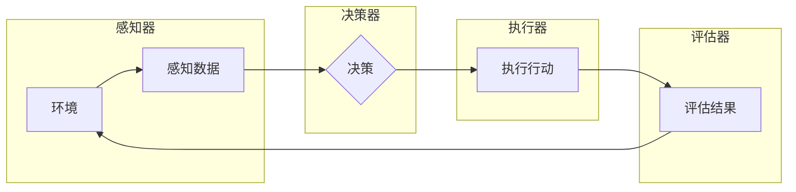

# AI Agent: AI的下一个风口 交互式学习与决策优化

> 关键词：AI Agent，交互式学习，决策优化，强化学习，深度学习，智能体，环境交互，智能决策

## 1. 背景介绍

随着人工智能技术的不断发展，AI Agent（智能体）已经成为AI领域的研究热点。AI Agent是指能够感知环境、自主决策并采取行动以实现目标的实体。在游戏、机器人、自动驾驶、智能推荐等领域，AI Agent展现出强大的应用潜力。本文将探讨AI Agent的核心概念、交互式学习与决策优化方法，以及其在实际应用中的挑战和未来发展趋势。

## 2. 核心概念与联系

### 2.1 AI Agent概述

AI Agent是一种具有自主决策能力的智能实体，它可以感知环境、分析信息、学习经验并采取行动。AI Agent由以下几个关键组件组成：

- **感知器**：负责从环境中获取信息，如视觉、听觉、触觉等。
- **决策器**：根据感知到的信息，生成行动策略。
- **执行器**：将决策器生成的行动策略转化为实际操作。
- **评估器**：评估行动的结果，为后续决策提供反馈。

以下是一个简化的Mermaid流程图，展示了AI Agent的基本架构：



### 2.2 交互式学习

交互式学习是AI Agent提升自身智能水平的重要途径。通过与环境进行交互，AI Agent可以获取反馈，不断调整和优化决策策略。交互式学习可以分为以下几种类型：

- **强化学习**：通过奖励信号指导AI Agent学习最佳行动策略。
- **模仿学习**：通过观察人类或其他AI Agent的行为进行学习。
- **人机协作学习**：人与AI Agent协同完成任务，共同提升性能。

### 2.3 决策优化

决策优化是AI Agent的核心功能之一。优化方法包括：

- **搜索算法**：如深度优先搜索、广度优先搜索等。
- **启发式算法**：如贪心算法、A*搜索等。
- **强化学习算法**：如Q-learning、SARSA等。

## 3. 核心算法原理 & 具体操作步骤

### 3.1 算法原理概述

### 3.2 算法步骤详解

#### 3.2.1 强化学习

强化学习是一种交互式学习范式，通过奖励信号指导AI Agent学习最佳行动策略。以下是强化学习的基本步骤：

1. 初始化状态空间 $S$、行动空间 $A$、奖励函数 $R$ 和价值函数 $V$。
2. AI Agent随机选择初始状态 $s_0$。
3. AI Agent根据当前状态 $s_t$ 和策略 $\pi$ 选择行动 $a_t$。
4. 环境根据行动 $a_t$ 返回新的状态 $s_{t+1}$ 和奖励 $R(s_t, a_t, s_{t+1})$。
5. AI Agent更新价值函数 $V$，采用如下公式：

   $$
   V(s_t) \leftarrow V(s_t) + \alpha [R(s_t, a_t, s_{t+1}) + \gamma V(s_{t+1}) - V(s_t)]
   $$

   其中，$\alpha$ 为学习率，$\gamma$ 为折扣因子。
6. 重复步骤2-5，直至达到终止条件。

#### 3.2.2 模仿学习

模仿学习是一种通过观察他人行为进行学习的方法。以下是模仿学习的基本步骤：

1. 收集人类或其他AI Agent的行动数据。
2. 提取行动特征，如关键动作、时间序列等。
3. 使用监督学习方法，如神经网络，对行动特征进行分类或回归。
4. AI Agent根据提取的特征，选择最佳行动。

#### 3.2.3 人机协作学习

人机协作学习是一种人与AI Agent协同完成任务的方法。以下是人机协作学习的基本步骤：

1. 设计协作协议，如任务分配、信息共享、决策机制等。
2. 人或AI Agent执行任务，并根据协议共享信息。
3. 使用强化学习、模仿学习等方法，优化协作策略。

### 3.3 算法优缺点

#### 3.3.1 强化学习

**优点**：

- 能够学习到复杂、动态的环境。
- 适用于需要探索和适应的环境。
- 可以处理连续和离散行动空间。

**缺点**：

- 学习速度较慢，需要大量样本。
- 容易陷入局部最优。

#### 3.3.2 模仿学习

**优点**：

- 学习速度快，只需少量样本。
- 能够学习到复杂的行为。

**缺点**：

- 需要高质量的行为数据。
- 难以处理动态环境。

#### 3.3.3 人机协作学习

**优点**：

- 结合了人类经验和AI Agent的能力。
- 可以解决单智能体难以解决的问题。

**缺点**：

- 协作协议设计困难。
- 需要大量人机交互数据。

### 3.4 算法应用领域

AI Agent和交互式学习与决策优化方法在以下领域具有广泛的应用：

- 游戏AI：如国际象棋、围棋、电子竞技等。
- 机器人：如自主导航、路径规划、环境交互等。
- 自动驾驶：如感知、决策、规划等。
- 智能推荐：如新闻推荐、商品推荐、视频推荐等。
- 金融风控：如信用评估、欺诈检测、投资策略等。

## 4. 数学模型和公式 & 详细讲解 & 举例说明

### 4.1 数学模型构建

以下以强化学习中的Q-learning为例，介绍数学模型和公式。

#### 4.1.1 Q-learning

Q-learning是一种基于值函数的强化学习算法。其目标是学习一个策略 $\pi$，使得值函数 $Q(s, a)$ 最大。

#### 4.1.2 数学模型

状态空间 $S$、行动空间 $A$、奖励函数 $R$ 和价值函数 $Q(s, a)$ 构成Q-learning的数学模型。

- **状态空间 $S$**：所有可能状态构成的集合。
- **行动空间 $A$**：在状态 $s$ 下可采取的行动集合。
- **奖励函数 $R$**：定义在状态-行动空间上的实值函数，表示采取行动 $a$ 后获得的奖励。
- **价值函数 $Q(s, a)$**：在状态 $s$ 下采取行动 $a$ 的期望回报，表示为：

  $$
  Q(s, a) = \sum_{s' \in S} R(s, a, s')P(s'|s, a)Q(s', a)
  $$

  其中，$P(s'|s, a)$ 为在状态 $s$ 下采取行动 $a$ 转移到状态 $s'$ 的概率。

#### 4.1.3 公式推导

Q-learning的更新公式如下：

$$
Q(s_t, a_t) \leftarrow Q(s_t, a_t) + \alpha [R(s_t, a_t, s_{t+1}) + \gamma Q(s_{t+1}, a_{t+1}) - Q(s_t, a_t)]
$$

其中，$\alpha$ 为学习率，$\gamma$ 为折扣因子。

### 4.2 公式推导过程

Q-learning的推导过程如下：

1. 初始化 $Q(s, a)$ 为一个小的正数。
2. 对于每个状态 $s$ 和行动 $a$，随机选择初始状态 $s_0$。
3. AI Agent根据策略 $\pi$ 选择行动 $a_t$。
4. 环境根据行动 $a_t$ 返回新的状态 $s_{t+1}$ 和奖励 $R(s_t, a_t, s_{t+1})$。
5. 根据更新公式，更新 $Q(s_t, a_t)$。

### 4.3 案例分析与讲解

以下以围棋AI AlphaGo为例，分析Q-learning在围棋领域的应用。

AlphaGo是一种基于深度学习和强化学习的围棋AI。其核心思想是使用深度神经网络学习围棋策略网络和值网络，并使用强化学习优化策略网络。

- **策略网络**：预测给定状态下采取每个行动的概率。
- **值网络**：预测给定状态下采取每个行动的期望回报。

通过不断训练和优化，AlphaGo在2017年击败了世界围棋冠军李世石，成为围棋史上的里程碑。

## 5. 项目实践：代码实例和详细解释说明

### 5.1 开发环境搭建

以下以Python为例，介绍围棋AI的开发环境搭建。

1. 安装Anaconda：从Anaconda官网下载并安装Anaconda。
2. 创建虚拟环境：

   ```bash
   conda create -n go-playing python=3.7
   conda activate go-playing
   ```

3. 安装依赖包：

   ```bash
   pip install numpy pandas scikit-learn matplotlib gym
   ```

4. 安装Go-playing环境：从GitHub下载Go-playing库，并安装。

### 5.2 源代码详细实现

以下是一个简单的围棋AI示例代码：

```python
import numpy as np
import gym
from gym import spaces

class GoAgent(gym.Agent):
    def __init__(self, env):
        super(GoAgent, self).__init__()
        self.env = env
        self.observation_space = env.observation_space
        self.action_space = env.action_space
        self.q_table = np.zeros((self.observation_space.n, self.action_space.n))

    def choose_action(self, state):
        action = np.argmax(self.q_table[state])
        return action

    def train(self, num_episodes=1000):
        for episode in range(num_episodes):
            state = self.env.reset()
            while True:
                action = self.choose_action(state)
                next_state, reward, done, _ = self.env.step(action)
                self.q_table[state, action] += 0.01 * (reward + 0.99 * np.max(self.q_table[next_state]) - self.q_table[state, action])
                if done:
                    break
                state = next_state

    def play(self):
        state = self.env.reset()
        while True:
            action = self.choose_action(state)
            state, reward, done, _ = self.env.step(action)
            print(f"Action: {action}, Reward: {reward}")
            if done:
                break

if __name__ == '__main__':
    env = gym.make('gym_go:GymGo-v0')
    agent = GoAgent(env)
    agent.train()
    agent.play()
```

### 5.3 代码解读与分析

以上代码实现了一个基于Q-learning的围棋AI。其主要步骤如下：

1. 初始化Q-table，用于存储状态-行动值。
2. 定义choose_action函数，根据Q-table选择最佳行动。
3. 定义train函数，进行Q-learning训练。
4. 定义play函数，进行交互式游戏。

## 6. 实际应用场景

### 6.1 游戏AI

AI Agent在游戏AI领域具有广泛的应用，如：

- 国际象棋、围棋、电子竞技等。
- 桌面游戏、手机游戏、网页游戏等。

### 6.2 机器人

AI Agent在机器人领域具有广泛的应用，如：

- 自主导航、路径规划、环境交互等。
- 工业机器人、服务机器人、家用机器人等。

### 6.3 自动驾驶

AI Agent在自动驾驶领域具有广泛的应用，如：

- 感知、决策、规划等。
- 自动驾驶汽车、无人机、自动驾驶巴士等。

### 6.4 智能推荐

AI Agent在智能推荐领域具有广泛的应用，如：

- 新闻推荐、商品推荐、视频推荐等。
- 智能客服、智能搜索、智能广告等。

### 6.5 金融风控

AI Agent在金融风控领域具有广泛的应用，如：

- 信用评估、欺诈检测、投资策略等。

## 7. 工具和资源推荐

### 7.1 学习资源推荐

1. 《深度学习》系列书籍：介绍深度学习的基本概念、原理和算法。
2. 《机器学习》系列书籍：介绍机器学习的基本概念、原理和算法。
3. OpenAI Gym：提供多种环境供AI Agent进行训练和测试。
4. Gym Go：提供围棋环境供AI Agent进行训练和测试。

### 7.2 开发工具推荐

1. TensorFlow：一个开源的深度学习框架，支持多种深度学习模型。
2. PyTorch：一个开源的深度学习框架，具有动态计算图，易于上手。
3. Gym：一个开源的强化学习库，提供多种环境供AI Agent进行训练和测试。

### 7.3 相关论文推荐

1. "Deep Reinforcement Learning: An Overview"：介绍深度强化学习的基本概念、原理和算法。
2. "Playing Atari with Deep Reinforcement Learning"：介绍Deep Q-Network在Atari游戏中的应用。
3. "Mastering Chess and Shogi by Self-Play with a General Reinforcement Learning Algorithm"：介绍AlphaZero算法在围棋中的应用。

## 8. 总结：未来发展趋势与挑战

### 8.1 研究成果总结

AI Agent和交互式学习与决策优化方法在游戏AI、机器人、自动驾驶、智能推荐、金融风控等领域取得了显著的成果。这些研究成果为AI Agent的应用提供了强大的技术支持。

### 8.2 未来发展趋势

未来，AI Agent和交互式学习与决策优化方法将呈现以下发展趋势：

1. 模型规模持续增大，性能不断提升。
2. 交互式学习范式更加多样化，适应更多复杂环境。
3. 决策优化方法更加高效，降低学习成本。
4. AI Agent在更多领域得到应用，如医疗、教育、法律等。

### 8.3 面临的挑战

AI Agent和交互式学习与决策优化方法仍面临着以下挑战：

1. 学习效率和样本效率问题。
2. 模型可解释性和可解释性。
3. 安全性和可靠性问题。
4. 跨领域迁移能力问题。

### 8.4 研究展望

未来，我们需要进一步研究以下方向：

1. 开发更加高效、鲁棒的交互式学习算法。
2. 提高模型的可解释性和可解释性。
3. 提高模型的适应性和泛化能力。
4. 研究AI Agent的伦理和道德问题。

相信通过不断的努力，AI Agent和交互式学习与决策优化方法将为人类创造更加美好的未来。

## 9. 附录：常见问题与解答

**Q1：什么是AI Agent？**

A：AI Agent是一种具有自主决策能力的智能实体，它可以感知环境、自主决策并采取行动以实现目标。

**Q2：交互式学习有哪些类型？**

A：交互式学习包括强化学习、模仿学习、人机协作学习等类型。

**Q3：强化学习有哪些常见算法？**

A：强化学习常见的算法包括Q-learning、SARSA、Deep Q-Network等。

**Q4：如何选择合适的强化学习算法？**

A：选择合适的强化学习算法需要考虑以下因素：环境特点、样本效率、可解释性等。

**Q5：如何评估AI Agent的性能？**

A：评估AI Agent的性能可以从以下方面进行：学习效率、样本效率、准确性、鲁棒性等。

**Q6：AI Agent在哪些领域具有应用价值？**

A：AI Agent在游戏AI、机器人、自动驾驶、智能推荐、金融风控等领域具有广泛的应用。

**Q7：如何提高AI Agent的可解释性？**

A：提高AI Agent的可解释性可以从以下方面进行：模型简化、可视化、解释性增强等。

**Q8：如何解决AI Agent的伦理和道德问题？**

A：解决AI Agent的伦理和道德问题需要从法律法规、道德伦理、社会责任等方面进行综合考虑。

作者：禅与计算机程序设计艺术 / Zen and the Art of Computer Programming