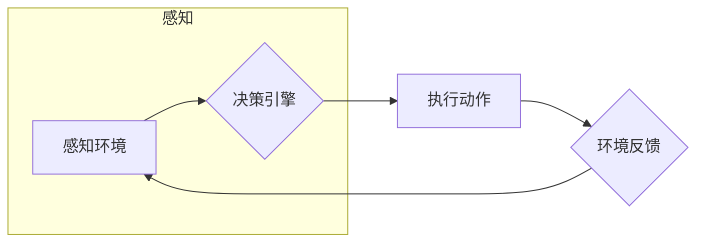

# AI Agent: AI的下一个风口 对未来的启示

> 关键词：AI Agent，智能体，强化学习，自主决策，人机协同，未来展望

## 1. 背景介绍

随着人工智能技术的飞速发展，从简单的计算任务到复杂的决策任务，AI的应用范围越来越广泛。从早期的专家系统到现代的深度学习模型，人工智能已经取得了令人瞩目的成就。然而，尽管AI在特定领域展现出了强大的能力，但它们仍然面临着一些挑战，如缺乏自主决策能力、难以适应动态环境等。在这样的背景下，AI Agent作为一种新型的智能体，成为了AI领域的一个新兴热点。本文将深入探讨AI Agent的概念、原理、应用以及未来发展趋势。

## 2. 核心概念与联系

### 2.1 AI Agent的定义

AI Agent，即人工智能代理，是指能够感知环境、自主决策并采取行动以实现目标的人工智能实体。它是一个具有自主意识和行动能力的系统，能够在复杂的动态环境中进行学习和适应。

### 2.2 AI Agent的核心特征

- **感知能力**：AI Agent能够从环境中获取信息，如视觉、听觉、触觉等。
- **决策能力**：基于感知到的信息，AI Agent能够自主选择合适的行动方案。
- **行动能力**：AI Agent能够根据决策执行具体的操作，如移动、操作设备等。
- **学习与适应能力**：AI Agent能够从经验中学习，并适应环境的变化。

### 2.3 AI Agent与相关概念的联系

- **机器学习**：AI Agent的学习与适应能力依赖于机器学习技术，如监督学习、无监督学习、强化学习等。
- **自然语言处理**：AI Agent的感知和决策过程可能涉及自然语言处理技术，以处理和理解人类语言。
- **机器人学**：AI Agent的行动能力与机器人学密切相关，需要考虑物理交互和机器人控制等问题。

下面是AI Agent的核心概念原理和架构的Mermaid流程图：



## 3. 核心算法原理 & 具体操作步骤

### 3.1 算法原理概述

AI Agent的核心算法原理主要包括以下几个部分：

- **感知算法**：用于从环境中获取信息，如图像识别、声音识别等。
- **决策算法**：基于感知到的信息，选择最优的行动方案，如Q学习、深度强化学习等。
- **执行算法**：根据决策执行具体的操作，如机器人控制、自动驾驶等。

### 3.2 算法步骤详解

1. **感知**：AI Agent通过传感器感知环境，获取环境状态信息。
2. **决策**：根据感知到的环境状态，利用决策算法选择最优的行动方案。
3. **执行**：执行选择的行动方案，并对环境产生影响。
4. **反馈**：环境对AI Agent的行动做出反馈，更新AI Agent的感知信息。
5. **学习**：AI Agent根据反馈信息，调整感知、决策和执行算法，提高性能。

### 3.3 算法优缺点

**优点**：

- **自主性**：AI Agent能够自主感知环境、做出决策和执行行动，无需人工干预。
- **适应性**：AI Agent能够从经验中学习，适应环境的变化。
- **高效性**：AI Agent能够在复杂环境中高效地完成任务。

**缺点**：

- **计算复杂度**：AI Agent的算法通常计算复杂度高，需要大量的计算资源。
- **数据依赖**：AI Agent的性能很大程度上依赖于训练数据的质量和数量。
- **安全风险**：AI Agent的行动可能会带来安全风险，需要严格的安全控制。

### 3.4 算法应用领域

AI Agent的应用领域非常广泛，包括：

- **机器人**：工业机器人、服务机器人、医疗机器人等。
- **自动驾驶**：自动驾驶汽车、无人驾驶飞机等。
- **游戏**：智能游戏角色、游戏AI等。
- **人机交互**：虚拟助手、智能客服等。

## 4. 数学模型和公式 & 详细讲解 & 举例说明

### 4.1 数学模型构建

AI Agent的数学模型主要包括以下几个部分：

- **状态空间**：描述AI Agent所处环境的所有可能状态。
- **动作空间**：描述AI Agent可以采取的所有可能行动。
- **奖励函数**：描述AI Agent在不同状态和动作下的奖励。

### 4.2 公式推导过程

以下是一个简单的Q学习模型的公式推导过程：

假设状态空间为 $S$，动作空间为 $A$，状态-动作值函数为 $Q(s,a)$，奖励函数为 $R(s,a)$，学习率为 $\alpha$，折扣因子为 $\gamma$。

Q学习的目标是学习一个策略 $\pi$，使得 $Q(s,a) = \max_{a'} Q(s,a') + \gamma R(s,a')$。

根据Q学习的更新公式：

$$
Q(s,a) \leftarrow Q(s,a) + \alpha [R(s,a) + \gamma \max_{a'} Q(s',a') - Q(s,a)]
$$

通过不断迭代更新 $Q(s,a)$，可以学习到最优策略 $\pi$。

### 4.3 案例分析与讲解

以下是一个简单的AI Agent在迷宫中的案例：

假设迷宫为一个4x4的网格，起点为左上角，终点为右下角。AI Agent需要从起点走到终点，并获得奖励。

状态空间为 $S = \{(0,0), (0,1), \ldots, (3,3)\}$，动作空间为 $A = \{上下左右\}$。

奖励函数为：

$$
R(s,a) = \begin{cases} 
10 & \text{if } s=(3,3) \\
-1 & \text{otherwise}
\end{cases}
$$

学习率为 $\alpha = 0.1$，折扣因子 $\gamma = 0.9$。

通过Q学习算法，AI Agent可以在迷宫中找到最优路径，并获得最大的奖励。

## 5. 项目实践：代码实例和详细解释说明

### 5.1 开发环境搭建

为了实现AI Agent，我们需要搭建以下开发环境：

- 操作系统：Windows、Linux或macOS
- 编程语言：Python
- 库：PyTorch、OpenAI Gym

### 5.2 源代码详细实现

以下是一个简单的AI Agent在OpenAI Gym中的迷宫环境中的实现：

```python
import gym
import numpy as np
import random

# 创建迷宫环境
env = gym.make('CartPole-v0')

# 初始化Q学习参数
Q = np.zeros([env.observation_space.n, env.action_space.n])
alpha = 0.1
gamma = 0.9

# Q学习算法
def q_learning(env, Q, alpha, gamma, episodes=1000):
    for episode in range(episodes):
        state = env.reset()
        done = False
        while not done:
            action = np.argmax(Q[state])  # 选择最优行动
            next_state, reward, done, _ = env.step(action)
            next_max = np.max(Q[next_state])
            Q[state, action] = Q[state, action] + alpha * (reward + gamma * next_max - Q[state, action])
            state = next_state

    return Q

# 运行Q学习
q_learning(env, Q, alpha, gamma)

# 打印最优策略
print(np.argmax(Q, axis=1))
```

### 5.3 代码解读与分析

这段代码首先导入了必要的库，并创建了迷宫环境。接着初始化了Q学习参数，包括状态-动作值函数Q、学习率alpha、折扣因子gamma和迭代次数episodes。

q_learning函数实现了Q学习算法，包括以下步骤：

1. 初始化Q矩阵。
2. 遍历episodes个回合。
3. 在每个回合中，从初始状态开始，根据Q矩阵选择最优行动。
4. 执行行动，获取下一状态、奖励和是否结束的标志。
5. 更新Q矩阵。

最后，打印出最优策略，即在每个状态下应该采取的行动。

### 5.4 运行结果展示

运行上述代码，可以得到一个在迷宫中找到最优路径的AI Agent。通过观察输出结果，可以看到AI Agent在每个状态下采取的行动，从而了解其学习到的策略。

## 6. 实际应用场景

AI Agent在实际应用场景中具有广泛的应用，以下是一些典型案例：

- **自动驾驶**：AI Agent可以用于控制自动驾驶汽车，实现自动驾驶功能。
- **工业机器人**：AI Agent可以用于控制工业机器人，实现自动化生产。
- **游戏AI**：AI Agent可以用于设计智能游戏角色，增强游戏体验。
- **智能家居**：AI Agent可以用于控制智能家居设备，实现自动化家居生活。

## 7. 工具和资源推荐

### 7.1 学习资源推荐

- 《Artificial Intelligence: A Modern Approach》
- 《Reinforcement Learning: An Introduction》
- 《Deep Reinforcement Learning for Autonomous Robots》

### 7.2 开发工具推荐

- OpenAI Gym
- TensorFlow
- PyTorch

### 7.3 相关论文推荐

- "Deep Q-Networks" by Volodymyr Mnih et al.
- "Asynchronous Advantage Actor-Critic" by John Schulman et al.
- "Proximal Policy Optimization Algorithms" by Sergey Levine et al.

## 8. 总结：未来发展趋势与挑战

### 8.1 研究成果总结

本文深入探讨了AI Agent的概念、原理、应用以及未来发展趋势。通过分析AI Agent的核心特征、算法原理、应用领域，我们了解到AI Agent作为一种新型的智能体，在人工智能领域具有重要的应用价值。

### 8.2 未来发展趋势

- **多智能体协作**：AI Agent将与其他AI Agent进行协作，共同完成复杂任务。
- **人机协同**：AI Agent将与人类进行协同工作，提高工作效率。
- **跨领域应用**：AI Agent将应用于更多领域，如金融、医疗、教育等。

### 8.3 面临的挑战

- **数据依赖**：AI Agent的性能很大程度上依赖于训练数据的质量和数量。
- **算法复杂度**：AI Agent的算法通常计算复杂度高，需要大量的计算资源。
- **伦理和安全问题**：AI Agent的行动可能会带来伦理和安全问题，需要严格的安全控制。

### 8.4 研究展望

为了应对AI Agent面临的挑战，未来的研究需要在以下方面取得突破：

- **开发更加高效的学习算法**：降低算法复杂度，提高学习效率。
- **探索新的数据获取方法**：减少对大规模标注数据的依赖。
- **加强伦理和安全研究**：确保AI Agent的行为符合伦理和安全要求。

相信在未来的发展中，AI Agent将会在各个领域发挥越来越重要的作用，为人类社会创造更多价值。

## 9. 附录：常见问题与解答

**Q1：AI Agent与机器人有什么区别？**

A1：AI Agent是一种抽象的概念，泛指具有自主意识、感知能力、决策能力和行动能力的人工智能实体。机器人是一种具体的AI Agent，通常具有物理形态，能够在物理环境中进行操作。

**Q2：AI Agent在哪些领域有应用前景？**

A2：AI Agent在自动驾驶、工业机器人、游戏AI、智能家居、金融、医疗、教育等多个领域都有广泛的应用前景。

**Q3：如何开发AI Agent？**

A3：开发AI Agent需要掌握机器学习、自然语言处理、机器人学等相关知识。常用的开发工具包括OpenAI Gym、TensorFlow、PyTorch等。

**Q4：AI Agent是否会产生安全风险？**

A4：是的，AI Agent在特定情况下可能会产生安全风险。因此，需要加强AI Agent的安全控制，确保其行为符合伦理和安全要求。

**Q5：AI Agent的未来发展趋势是什么？**

A5：AI Agent的未来发展趋势包括多智能体协作、人机协同、跨领域应用等。

作者：禅与计算机程序设计艺术 / Zen and the Art of Computer Programming