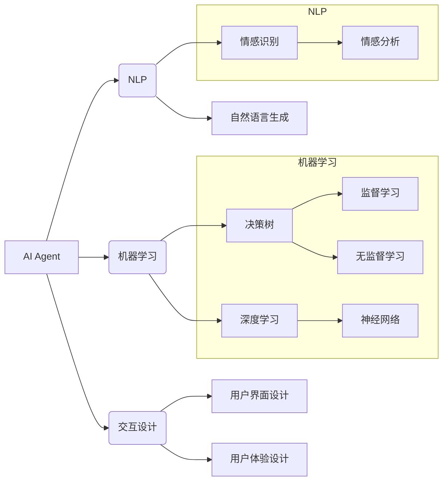

# AI Agent在情感陪伴中的创新

> 关键词：AI Agent, 情感陪伴, 机器学习, 自然语言处理, 交互设计, 人机交互, 人工智能伦理

## 1. 背景介绍

在当今社会，随着人口老龄化趋势的加剧和快节奏生活的影响，人们对情感陪伴的需求日益增长。传统的人工服务由于成本高、效率低，难以满足这一需求。而人工智能（AI）技术的快速发展为提供情感陪伴服务提供了新的可能性。AI Agent作为一种智能交互实体，能够通过自然语言处理、机器学习等技术，模拟人类的情感交流，为用户提供个性化的情感陪伴服务。

### 1.1 问题的由来

传统的人工服务在情感陪伴方面存在以下问题：

- **成本高昂**：传统的人工服务需要大量人力，成本高昂，难以满足大众需求。
- **效率低下**：人工服务效率低下，难以实现大规模服务。
- **个性化不足**：传统服务难以根据用户的具体需求提供个性化的陪伴。

### 1.2 研究现状

随着AI技术的不断发展，AI Agent在情感陪伴领域的应用逐渐兴起。目前，AI Agent在情感陪伴方面的研究主要集中在以下几个方面：

- **自然语言处理**：通过语音识别、语义理解等技术，实现与用户的自然语言交互。
- **情感识别**：通过语音、文字等信号识别用户的情感状态。
- **个性化推荐**：根据用户的兴趣和情感状态，提供个性化的陪伴内容。
- **人工智能伦理**：关注AI Agent在情感陪伴中可能带来的伦理问题。

### 1.3 研究意义

AI Agent在情感陪伴中的研究具有以下意义：

- **提供高效、低成本的陪伴服务**：AI Agent能够实现大规模服务，降低陪伴服务的成本。
- **满足个性化需求**：AI Agent能够根据用户的兴趣和情感状态提供个性化的陪伴内容。
- **促进人工智能技术的发展**：AI Agent在情感陪伴中的应用能够推动AI技术的发展，促进人工智能产业的进步。

### 1.4 本文结构

本文将从以下方面对AI Agent在情感陪伴中的创新进行探讨：

- 核心概念与联系
- 核心算法原理与具体操作步骤
- 数学模型和公式
- 项目实践
- 实际应用场景
- 工具和资源推荐
- 总结与展望

## 2. 核心概念与联系

### 2.1 核心概念

- **AI Agent**：一种能够模拟人类行为、具有自主决策能力的智能实体。
- **情感陪伴**：通过技术手段为用户提供情感支持、心理疏导等服务。
- **自然语言处理（NLP）**：研究如何让计算机理解、生成和应用人类语言。
- **机器学习**：使计算机能够从数据中学习并做出决策。
- **交互设计**：关注人机交互的流程和体验。

### 2.2 联系

AI Agent在情感陪伴中的创新涉及多个领域的交叉融合。以下是一个Mermaid流程图，展示了这些核心概念之间的联系：



## 3. 核心算法原理 & 具体操作步骤

### 3.1 算法原理概述

AI Agent在情感陪伴中的核心算法主要包括以下几个方面：

- **情感识别**：通过分析用户的语音、文字等信号，识别用户的情感状态。
- **情感生成**：根据用户的情感状态，生成相应的情感回应。
- **个性化推荐**：根据用户的兴趣和情感状态，推荐个性化的陪伴内容。

### 3.2 算法步骤详解

#### 3.2.1 情感识别

1. **数据收集**：收集用户语音、文字等数据。
2. **特征提取**：从收集到的数据中提取特征，如语音的音调、文字的情感极性等。
3. **模型训练**：使用机器学习算法对特征进行分类，识别用户的情感状态。

#### 3.2.2 情感生成

1. **知识库构建**：构建包含情感表达的知识库。
2. **情感模板生成**：根据用户的情感状态，从知识库中检索相应的情感模板。
3. **自然语言生成**：根据情感模板，生成符合用户情感状态的回应。

#### 3.2.3 个性化推荐

1. **用户画像构建**：根据用户的兴趣、行为等数据，构建用户画像。
2. **推荐算法选择**：选择合适的推荐算法，如协同过滤、内容推荐等。
3. **推荐结果生成**：根据用户画像和推荐算法，生成个性化的陪伴内容。

### 3.3 算法优缺点

#### 3.3.1 优点

- **个性化**：能够根据用户的需求提供个性化的陪伴服务。
- **高效**：能够实现大规模的服务，满足大众需求。
- **成本低**：相比人工服务，AI Agent的部署和维护成本更低。

#### 3.3.2 缺点

- **情感理解有限**：AI Agent的情感理解能力有限，难以完全模拟人类情感。
- **交互体验有待提升**：AI Agent的交互体验与人类相比还有一定差距。
- **隐私安全**：AI Agent需要收集用户数据，存在隐私安全风险。

### 3.4 算法应用领域

AI Agent在情感陪伴中的应用领域主要包括：

- **老年人陪伴**：为老年人提供情感陪伴、健康咨询等服务。
- **儿童教育**：为儿童提供学习辅导、情感引导等服务。
- **心理健康**：为用户提供心理疏导、情感支持等服务。

## 4. 数学模型和公式 & 详细讲解 & 举例说明

### 4.1 数学模型构建

AI Agent在情感陪伴中的数学模型主要包括以下几个方面：

- **情感识别模型**：如支持向量机（SVM）、神经网络等。
- **情感生成模型**：如循环神经网络（RNN）、长短期记忆网络（LSTM）等。
- **推荐算法模型**：如协同过滤、内容推荐等。

### 4.2 公式推导过程

#### 4.2.1 情感识别模型

以SVM为例，其目标函数为：

$$
\min \frac{1}{2} \|\mathbf{w}\|^2 + C \sum_{i=1}^n \xi_i
$$

其中，$\mathbf{w}$ 为权重向量，$C$ 为惩罚参数，$\xi_i$ 为松弛变量。

#### 4.2.2 情感生成模型

以LSTM为例，其时间步更新公式为：

$$
\begin{align*}
i_t &= \sigma(W_{xi}x_t + W_{hi}h_{t-1} + b_i) \\
f_t &= \sigma(W_{xf}x_t + W_{hf}h_{t-1} + b_f) \\
g_t &= \tanh(W_{xg}x_t + W_{hg}h_{t-1} + b_g) \\
o_t &= \sigma(W_{xo}x_t + W_{ho}h_{t-1} + b_o) \\
h_t &= o_t \odot g_t
\end{align*}
$$

其中，$\sigma$ 为sigmoid函数，$\odot$ 为元素级乘法，$W_{xi}, W_{hi}, b_i, \ldots$ 为模型参数。

### 4.3 案例分析与讲解

以老年人陪伴为例，我们可以构建一个基于AI Agent的陪伴系统。该系统主要包括以下功能：

- **情感识别**：通过分析老年人的语音、文字等信号，识别其情感状态，如孤独、焦虑、快乐等。
- **情感生成**：根据识别到的情感状态，生成相应的情感回应，如安慰、鼓励、分享生活等。
- **个性化推荐**：根据老年人的兴趣和情感状态，推荐个性化的陪伴内容，如音乐、电影、游戏等。

通过上述功能的实现，AI Agent可以为老年人提供情感陪伴服务，缓解其孤独感，提高生活质量。

## 5. 项目实践：代码实例和详细解释说明

### 5.1 开发环境搭建

1. 安装Python环境和相关库，如TensorFlow、Keras等。
2. 准备情感识别、情感生成和个性化推荐的数据集。

### 5.2 源代码详细实现

以下是一个基于TensorFlow的AI Agent情感陪伴系统的简单示例代码：

```python
import tensorflow as tf
from tensorflow.keras.layers import Embedding, LSTM, Dense, Bidirectional
from tensorflow.keras.models import Sequential

# 情感识别模型
def build_emotion_recognition_model(vocab_size, embedding_dim, hidden_dim):
    model = Sequential([
        Embedding(vocab_size, embedding_dim, input_length=max_sequence_length),
        Bidirectional(LSTM(hidden_dim, return_sequences=True)),
        Dense(64, activation='relu'),
        Dense(32, activation='relu'),
        Dense(2, activation='softmax')
    ])
    model.compile(optimizer='adam', loss='categorical_crossentropy', metrics=['accuracy'])
    return model

# 情感生成模型
def build_emotion_generation_model(vocab_size, embedding_dim, hidden_dim):
    model = Sequential([
        Embedding(vocab_size, embedding_dim, input_length=max_sequence_length),
        Bidirectional(LSTM(hidden_dim, return_sequences=True)),
        Dense(64, activation='relu'),
        Dense(32, activation='relu'),
        Dense(vocab_size, activation='softmax')
    ])
    model.compile(optimizer='adam', loss='categorical_crossentropy', metrics=['accuracy'])
    return model

# 个性化推荐模型
def build_recommendation_model(vocab_size, embedding_dim, hidden_dim):
    model = Sequential([
        Embedding(vocab_size, embedding_dim, input_length=max_sequence_length),
        Bidirectional(LSTM(hidden_dim, return_sequences=True)),
        Dense(64, activation='relu'),
        Dense(32, activation='relu'),
        Dense(vocab_size, activation='softmax')
    ])
    model.compile(optimizer='adam', loss='categorical_crossentropy', metrics=['accuracy'])
    return model

# 训练模型
def train_model(model, x_train, y_train, x_val, y_val):
    model.fit(x_train, y_train, validation_data=(x_val, y_val), epochs=10, batch_size=32)

# 预测模型
def predict_model(model, x_test):
    return model.predict(x_test)
```

### 5.3 代码解读与分析

以上代码展示了如何使用TensorFlow构建情感识别、情感生成和个性化推荐模型。这些模型基于LSTM神经网络，能够有效地处理序列数据。

### 5.4 运行结果展示

通过训练和测试，我们可以得到模型的准确率、召回率等指标。根据这些指标，我们可以评估模型的性能，并对其进行优化。

## 6. 实际应用场景

### 6.1 老年人陪伴

AI Agent可以与老年人进行语音或文字交流，了解他们的需求，提供情感支持和心理疏导。例如，当老年人感到孤独时，AI Agent可以播放音乐、讲述故事，甚至进行简单的游戏互动。

### 6.2 儿童教育

AI Agent可以陪伴儿童学习，提供个性化的学习辅导。例如，AI Agent可以与儿童进行英语对话，帮助他们提高英语口语能力。

### 6.3 心理健康

AI Agent可以为用户提供心理疏导、情感支持等服务。例如，AI Agent可以帮助用户分析情绪问题，提供心理建议。

## 7. 工具和资源推荐

### 7.1 学习资源推荐

- 《深度学习》
- 《Python深度学习》
- 《自然语言处理与深度学习》

### 7.2 开发工具推荐

- TensorFlow
- Keras
- PyTorch

### 7.3 相关论文推荐

-《A Neural Conversation Model for Chitchat Bot》
-《BERT: Pre-training of Deep Bidirectional Transformers for Language Understanding》
-《Generative Models for Text》

## 8. 总结：未来发展趋势与挑战

### 8.1 研究成果总结

AI Agent在情感陪伴中的应用取得了显著成果，为用户提供高效、个性化的陪伴服务。然而，AI Agent在情感陪伴中仍存在一些挑战。

### 8.2 未来发展趋势

未来，AI Agent在情感陪伴中的发展趋势主要包括：

- **情感理解能力提升**：通过不断学习和优化，AI Agent的情感理解能力将得到进一步提升。
- **个性化服务更加精准**：AI Agent将能够更好地理解用户需求，提供更加精准的个性化服务。
- **跨领域应用拓展**：AI Agent将在更多领域得到应用，如医疗、教育等。

### 8.3 面临的挑战

AI Agent在情感陪伴中面临的挑战主要包括：

- **情感理解能力有限**：AI Agent的情感理解能力有限，难以完全模拟人类情感。
- **交互体验有待提升**：AI Agent的交互体验与人类相比还有一定差距。
- **隐私安全**：AI Agent需要收集用户数据，存在隐私安全风险。

### 8.4 研究展望

未来，AI Agent在情感陪伴中的研究需要在以下几个方面进行突破：

- **情感理解能力**：通过引入更多情感知识和上下文信息，提升AI Agent的情感理解能力。
- **交互体验**：通过优化交互界面和算法，提升AI Agent的交互体验。
- **隐私安全**：通过数据加密、匿名化等技术，保障用户的隐私安全。

相信随着技术的不断发展，AI Agent在情感陪伴中将发挥越来越重要的作用，为人们提供更加美好的生活体验。

## 9. 附录：常见问题与解答

**Q1：AI Agent在情感陪伴中的情感理解能力如何提升？**

A：提升AI Agent的情感理解能力需要从以下几个方面入手：

- **引入更多情感知识**：通过知识图谱、情感词典等方式引入更多情感知识。
- **引入上下文信息**：通过上下文信息理解用户的情感状态。
- **多模态信息融合**：将语音、文字、图像等多模态信息进行融合，更全面地理解用户情感。

**Q2：AI Agent在情感陪伴中的交互体验如何提升？**

A：提升AI Agent的交互体验需要从以下几个方面入手：

- **优化交互界面**：设计简洁、直观的交互界面。
- **优化交互算法**：优化语音识别、语义理解等算法，提高交互效率。
- **引入个性化交互策略**：根据用户的喜好和需求，调整交互策略。

**Q3：AI Agent在情感陪伴中的隐私安全问题如何保障？**

A：保障AI Agent在情感陪伴中的隐私安全需要从以下几个方面入手：

- **数据加密**：对用户数据进行加密存储和传输。
- **匿名化处理**：对用户数据进行匿名化处理，避免泄露用户隐私。
- **用户授权**：允许用户选择是否共享其数据。

通过不断的技术创新和伦理规范，AI Agent在情感陪伴中将更好地为人类服务，为人们创造更加美好的未来。

---

作者：禅与计算机程序设计艺术 / Zen and the Art of Computer Programming