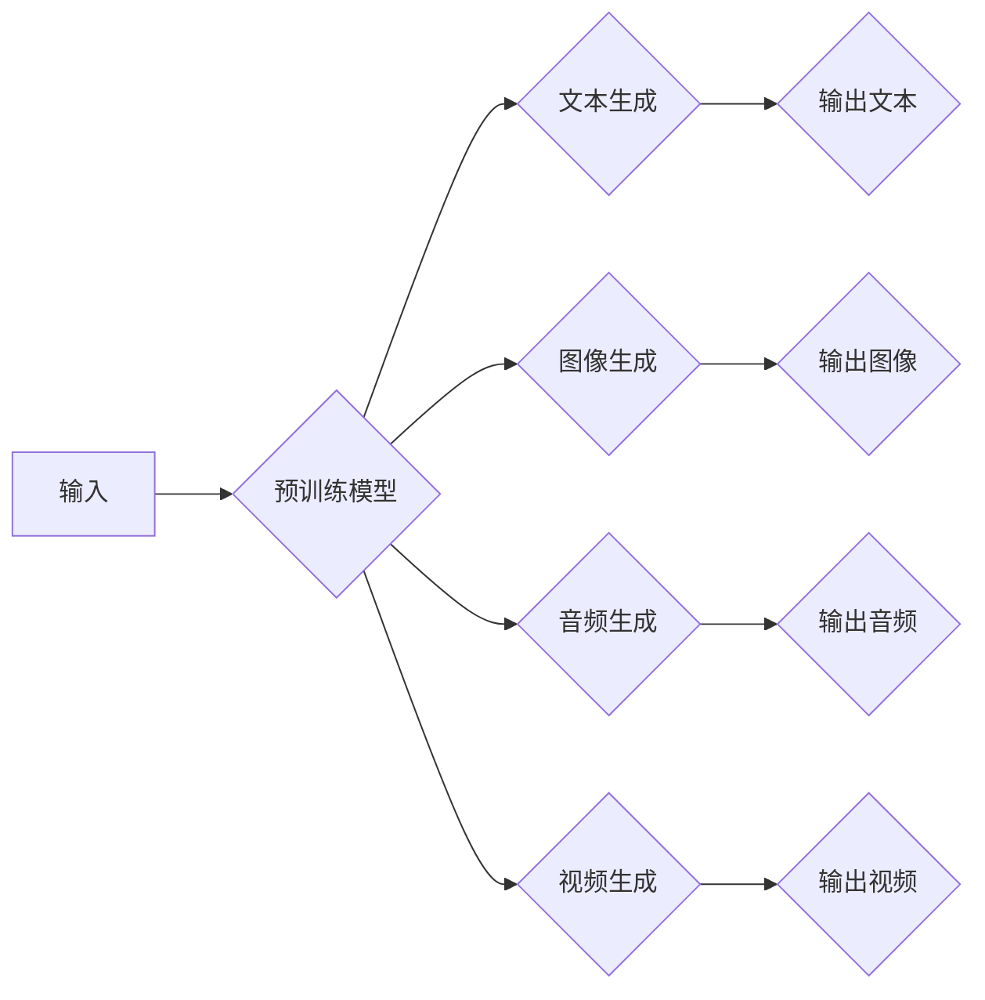

# AIGC原理与代码实例讲解

> 关键词：AIGC，自动生成内容，生成式AI，深度学习，预训练模型，文本生成，图像生成，代码生成

## 1. 背景介绍

随着人工智能技术的飞速发展，自动生成内容（AI-generated Content，简称AIGC）已经成为了一个热门的研究方向和应用领域。AIGC利用人工智能技术自动生成文本、图像、音频、视频等多种类型的内容，不仅极大地提升了内容创作效率，也为个性化推荐、虚拟现实、游戏开发等行业带来了新的机遇。

### 1.1 问题的由来

传统的内容创作依赖于人工，效率低下且成本高昂。随着互联网信息的爆炸式增长，内容创作者面临着巨大的创作压力。为了解决这一问题，研究者们开始探索利用人工智能技术自动生成内容，即AIGC。

### 1.2 研究现状

目前，AIGC技术在多个领域都取得了显著的进展，包括：

- **文本生成**：如新闻生成、对话生成、诗歌创作等。
- **图像生成**：如图像到图像的转换、风格迁移、超分辨率等。
- **音频生成**：如音乐生成、语音合成等。
- **视频生成**：如视频编辑、动作生成等。

### 1.3 研究意义

AIGC技术具有以下重要意义：

- **提高创作效率**：AIGC可以自动生成大量高质量的内容，降低人力成本，提高创作效率。
- **丰富内容多样性**：AIGC可以生成多样化、个性化的内容，满足不同用户的需求。
- **拓展应用场景**：AIGC可以应用于游戏、教育、医疗等多个领域，为人类社会带来更多便利。

### 1.4 本文结构

本文将围绕AIGC技术展开，详细介绍其原理、算法、应用场景以及代码实例，旨在为读者提供全面、系统的学习和参考。

## 2. 核心概念与联系

### 2.1 核心概念

- **自动生成内容（AIGC）**：利用人工智能技术自动生成文本、图像、音频、视频等多种类型的内容。
- **生成式AI**：指能够生成新的数据或内容的AI系统。
- **预训练模型**：在大规模数据集上预先训练好的模型，可以用于多种下游任务。
- **文本生成**：利用深度学习技术自动生成文本内容。
- **图像生成**：利用深度学习技术自动生成图像内容。
- **音频生成**：利用深度学习技术自动生成音频内容。
- **视频生成**：利用深度学习技术自动生成视频内容。

### 2.2 核心概念原理和架构的 Mermaid 流程图



从流程图中可以看出，预训练模型是AIGC的核心，可以用于多种类型的生成任务。

## 3. 核心算法原理 & 具体操作步骤

### 3.1 算法原理概述

AIGC技术主要基于深度学习，特别是生成式对抗网络（GANs）和变分自编码器（VAEs）等算法。以下将分别介绍这两种算法的基本原理。

### 3.2 算法步骤详解

#### 3.2.1 生成式对抗网络（GANs）

GANs由两部分组成：生成器（Generator）和判别器（Discriminator）。生成器负责生成与真实数据分布相似的数据，判别器负责区分真实数据和生成数据。

1. **训练判别器**：使用真实数据训练判别器，使其能够准确地区分真实数据和生成数据。
2. **训练生成器**：在每次迭代中，生成器生成新的数据，判别器对其进行评估。生成器通过学习使得生成的数据更难被判别器识别为假数据。
3. **迭代优化**：不断重复上述步骤，直到生成器生成的数据与真实数据非常相似。

#### 3.2.2 变分自编码器（VAEs）

VAEs通过优化潜在空间的分布来生成数据。其基本原理如下：

1. **编码器**：将输入数据编码成潜在空间的表示。
2. **解码器**：将潜在空间的表示解码成输出数据。
3. **损失函数**：通过优化潜在空间的分布，使得解码器生成的数据与输入数据尽可能相似。

### 3.3 算法优缺点

#### 3.3.1 生成式对抗网络（GANs）

优点：

- 可以生成高质量、多样化的数据。
- 不需要真实标签数据。

缺点：

- 训练不稳定，容易陷入局部最优。
- 难以控制生成数据的分布。

#### 3.3.2 变分自编码器（VAEs）

优点：

- 训练稳定，易于优化。
- 可以控制生成数据的分布。

缺点：

- 生成数据质量通常不如GANs。
- 需要更多的计算资源。

### 3.4 算法应用领域

GANs和VAEs在AIGC领域都有广泛的应用，例如：

- **文本生成**：新闻生成、对话生成、诗歌创作等。
- **图像生成**：图像到图像的转换、风格迁移、超分辨率等。
- **音频生成**：音乐生成、语音合成等。
- **视频生成**：视频编辑、动作生成等。

## 4. 数学模型和公式 & 详细讲解 & 举例说明

### 4.1 数学模型构建

以下以GANs为例，介绍其数学模型和公式。

#### 4.1.1 GANs的数学模型

GANs的数学模型可以表示为：

$$
\begin{align*}
G(z) &\sim q_G(z) \\
D(x) &= \sigma(W_D x + b_D) \\
\end{align*}
$$

其中：

- $G(z)$ 表示生成器，$z$ 表示潜在空间的采样。
- $D(x)$ 表示判别器，$x$ 表示真实数据或生成数据。
- $\sigma$ 表示Sigmoid函数。
- $W_D$ 和 $b_D$ 表示判别器的参数。

#### 4.1.2 损失函数

GANs的损失函数可以表示为：

$$
L(G,D) = \mathbb{E}_{x\sim p_data}[D(x)] - \mathbb{E}_{z\sim q_G}[D(G(z))] 
$$

其中：

- $p_data$ 表示真实数据分布。
- $q_G$ 表示生成器分布。

### 4.2 公式推导过程

#### 4.2.1 Sigmoid函数的推导

Sigmoid函数的公式为：

$$
\sigma(x) = \frac{1}{1 + e^{-x}} 
$$

其推导过程如下：

$$
\begin{align*}
\frac{d\sigma(x)}{dx} &= \frac{d}{dx} \frac{1}{1 + e^{-x}} \\
&= \frac{-e^{-x}}{(1 + e^{-x})^2} \\
&= \sigma(x) (1 - \sigma(x))
\end{align*}
$$

#### 4.2.2 损失函数的推导

损失函数的推导过程如下：

$$
\begin{align*}
L(G,D) &= \mathbb{E}_{x\sim p_data}[D(x)] - \mathbb{E}_{z\sim q_G}[D(G(z))] \\
&= \int_{-\infty}^{+\infty} D(x) p_data(x) dx - \int_{-\infty}^{+\infty} D(G(z)) q_G(z) dz \\
&= \int_{-\infty}^{+\infty} D(x) p_data(x) dx - \int_{-\infty}^{+\infty} D(G(z)) p(z) dz \\
&= \int_{-\infty}^{+\infty} D(x) p_data(x) dx - \int_{-\infty}^{+\infty} D(G(z)) p_data(z) dz \\
&= \int_{-\infty}^{+\infty} [D(x) - D(G(z))] p_data(x) dx \\
&= \int_{-\infty}^{+\infty} [D(x) - D(G(z))] p_data(x) dx + \int_{-\infty}^{+\infty} [D(x) - D(G(z))] p_data(z) dz \\
&= \int_{-\infty}^{+\infty} [D(x) - D(G(z))] p_data(x) dx + \int_{-\infty}^{+\infty} [D(G(z)) - D(G(z))] p_data(z) dz \\
&= \int_{-\infty}^{+\infty} [D(x) - D(G(z))] p_data(x) dx \\
\end{align*}
$$

### 4.3 案例分析与讲解

以下以文本生成为例，分析AIGC的应用。

#### 4.3.1 文本生成案例

假设我们要利用AIGC技术生成一篇关于人工智能的新闻报道。

1. **数据准备**：收集大量关于人工智能的新闻报道，作为预训练数据。
2. **模型选择**：选择合适的预训练模型，如GPT-2。
3. **微调**：使用收集到的新闻报道数据对预训练模型进行微调。
4. **生成**：使用微调后的模型生成新的新闻报道。

## 5. 项目实践：代码实例和详细解释说明

### 5.1 开发环境搭建

在进行AIGC项目实践前，我们需要准备好以下开发环境：

1. **操作系统**：Linux或macOS
2. **Python环境**：Python 3.6及以上
3. **深度学习框架**：PyTorch或TensorFlow
4. **预训练模型库**：Hugging Face的Transformers库

### 5.2 源代码详细实现

以下以使用PyTorch和Transformers库生成文本为例，给出代码实现。

```python
from transformers import GPT2LMHeadModel, GPT2Tokenizer

# 加载预训练模型和分词器
model = GPT2LMHeadModel.from_pretrained('gpt2')
tokenizer = GPT2Tokenizer.from_pretrained('gpt2')

# 生成文本
input_ids = tokenizer.encode("The AI field has been evolving rapidly", return_tensors='pt')
output_sequences = model.generate(input_ids, max_length=50, num_beams=5, early_stopping=True)

# 解码生成的文本
generated_text = tokenizer.decode(output_sequences[0], skip_special_tokens=True)
print(generated_text)
```

### 5.3 代码解读与分析

上述代码首先加载了预训练的GPT-2模型和分词器。然后，使用分词器将输入文本编码为模型所需的格式，并通过`generate`函数生成新的文本。最后，使用分词器解码生成的文本。

### 5.4 运行结果展示

假设生成的文本如下：

> The AI field has been evolving rapidly, with breakthroughs in computer vision, natural language processing, and robotics. In recent years, numerous AI startups have emerged, driving the rapid development of the AI industry. However, the ethical issues of AI have also become increasingly prominent. How to ensure the safe and ethical development of AI technology remains a challenge.

可以看出，生成的文本内容与输入文本相关，且具有一定的连贯性和逻辑性。

## 6. 实际应用场景

### 6.1 文本生成

文本生成是AIGC技术最典型的应用场景之一。以下是一些常见的文本生成应用：

- **新闻生成**：自动生成新闻报道，提高新闻传播效率。
- **对话生成**：自动生成对话内容，应用于聊天机器人、虚拟助手等。
- **诗歌创作**：自动生成诗歌，丰富文学创作形式。
- **代码生成**：自动生成代码，提高软件开发效率。

### 6.2 图像生成

图像生成是AIGC技术在计算机视觉领域的应用。以下是一些常见的图像生成应用：

- **图像到图像的转换**：将一张图像转换为另一张图像，如风格迁移、图像修复等。
- **图像风格迁移**：将一张图像的风格转移到另一张图像上。
- **超分辨率**：将低分辨率图像转换为高分辨率图像。

### 6.3 音频生成

音频生成是AIGC技术在音频领域的应用。以下是一些常见的音频生成应用：

- **音乐生成**：自动生成音乐，丰富音乐创作形式。
- **语音合成**：将文本转换为语音，应用于语音助手、智能客服等。

### 6.4 视频生成

视频生成是AIGC技术在视频领域的应用。以下是一些常见的视频生成应用：

- **视频编辑**：自动编辑视频，提高视频制作效率。
- **动作生成**：自动生成人物动作，应用于游戏开发、动画制作等。

## 7. 工具和资源推荐

### 7.1 学习资源推荐

- **书籍**：
  - 《深度学习》（Goodfellow, Bengio, Courville）
  - 《强化学习》（Sutton, Barto）
  - 《自然语言处理综合教程》（Jurafsky, Martin）
- **在线课程**：
  - fast.ai的深度学习课程
  - UESTC的深度学习课程
  - Coursera上的自然语言处理课程
- **论文**：
  - GANs：Generative Adversarial Nets（Goodfellow等）
  - VAEs：Variational Autoencoders（Kingma, Welling）

### 7.2 开发工具推荐

- **深度学习框架**：
  - PyTorch
  - TensorFlow
- **预训练模型库**：
  - Hugging Face的Transformers库
  - TensorFlow Hub
- **数据集**：
  - Common Crawl
  - TextBlob
  - ImageNet

### 7.3 相关论文推荐

- **GANs**：
  - Generative Adversarial Nets（Goodfellow等）
  - Unpaired Image-to-Image Translation using Cycle-Consistent Adversarial Networks（Isola等）
- **VAEs**：
  - Auto-Encoding Variational Bayes（Kingma, Welling）
  - Improved Variational Inference with Inverse Autoregressive Flow（Dinh等）

## 8. 总结：未来发展趋势与挑战

### 8.1 研究成果总结

AIGC技术作为人工智能领域的重要分支，已经取得了显著的进展。在文本、图像、音频、视频等多个领域，AIGC技术都取得了令人瞩目的成果。未来，AIGC技术将在以下方面取得更多突破：

- **生成质量更高**：通过改进算法和模型，生成更加真实、多样、高质量的内容。
- **生成速度更快**：通过优化算法和硬件，提高生成速度，降低计算资源消耗。
- **应用场景更广泛**：将AIGC技术应用于更多领域，如虚拟现实、游戏开发、教育培训等。

### 8.2 未来发展趋势

AIGC技术未来将呈现以下发展趋势：

- **多模态融合**：将文本、图像、音频、视频等多种模态信息进行融合，生成更加丰富的内容。
- **可解释性**：提高AIGC技术的可解释性，使其更加可靠、可控。
- **伦理道德**：关注AIGC技术的伦理道德问题，避免其被滥用。

### 8.3 面临的挑战

AIGC技术面临着以下挑战：

- **数据质量**：高质量的数据是AIGC技术的基础，需要大量高质量的数据资源。
- **计算资源**：AIGC技术需要大量的计算资源，如何降低计算成本是一个重要问题。
- **伦理道德**：AIGC技术可能被滥用，需要制定相应的伦理规范。

### 8.4 研究展望

未来，AIGC技术的研究将重点关注以下方向：

- **数据增强**：通过数据增强技术，提高数据质量和多样性。
- **模型压缩**：通过模型压缩技术，降低计算成本，提高生成速度。
- **可解释性**：提高AIGC技术的可解释性，使其更加可靠、可控。
- **伦理道德**：关注AIGC技术的伦理道德问题，避免其被滥用。

## 9. 附录：常见问题与解答

**Q1：AIGC技术的应用前景如何？**

A：AIGC技术在多个领域都有广泛的应用前景，如新闻生成、对话生成、图像生成、音频生成、视频生成等。随着技术的不断进步，AIGC技术将在更多领域发挥重要作用。

**Q2：AIGC技术有哪些应用案例？**

A：AIGC技术的应用案例包括新闻生成、对话生成、诗歌创作、图像到图像的转换、风格迁移、超分辨率、音乐生成、语音合成、视频编辑、动作生成等。

**Q3：AIGC技术的挑战有哪些？**

A：AIGC技术的挑战包括数据质量、计算资源、伦理道德等方面。

**Q4：如何选择合适的AIGC技术？**

A：选择合适的AIGC技术需要根据具体的应用场景和需求进行考虑。例如，对于文本生成任务，可以使用GPT-2、GPT-3等预训练模型；对于图像生成任务，可以使用GANs、VAEs等算法。

**Q5：AIGC技术的发展趋势是什么？**

A：AIGC技术的发展趋势包括多模态融合、可解释性、伦理道德等方面。

作者：禅与计算机程序设计艺术 / Zen and the Art of Computer Programming