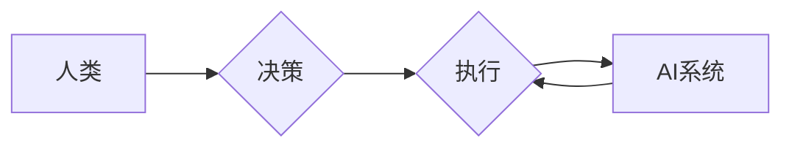

# AI与人类社会的未来发展

> 关键词：人工智能，未来趋势，社会变革，技术伦理，人机协作，可持续发展

## 1. 背景介绍

人工智能（AI）作为21世纪最前沿的科技领域之一，正以前所未有的速度发展。从简单的语音识别到复杂的机器学习算法，AI技术已经渗透到人类社会的各个角落。本文将探讨AI技术的未来发展趋势，以及其对人类社会可能带来的深远影响。

### 1.1 问题的由来

随着AI技术的快速发展，人们开始思考：AI将如何改变我们的生活方式、工作方式和思维方式？AI是否会取代人类的工作？AI的伦理问题如何解决？这些问题引发了广泛的讨论和关注。

### 1.2 研究现状

目前，AI技术已经取得了显著的进展，例如：

- **深度学习**：通过神经网络模型实现了在图像识别、语音识别、自然语言处理等领域的突破。
- **计算机视觉**：在自动驾驶、机器人视觉等领域取得了重要进展。
- **自然语言处理**：在机器翻译、智能客服、智能助手等领域得到了广泛应用。

然而，AI技术也带来了一系列挑战，例如：

- **就业问题**：AI可能取代一些简单重复的工作，导致失业问题。
- **隐私问题**：AI系统收集和处理大量个人信息，可能侵犯隐私。
- **伦理问题**：AI的决策过程可能不透明，引发伦理争议。

### 1.3 研究意义

研究AI与人类社会的未来发展，有助于：

- **预测AI技术发展趋势**：为政策制定者、企业用户提供决策依据。
- **应对AI带来的挑战**：制定相应的政策和措施，减少负面影响。
- **促进人机协作**：推动AI技术更好地服务于人类。

## 2. 核心概念与联系

### 2.1 核心概念

- **人工智能（AI）**：模拟、延伸和扩展人的智能的理论、方法、技术和应用。
- **机器学习（ML）**：使计算机能够从数据中学习并做出决策或预测。
- **深度学习（DL）**：一种特殊的机器学习方法，使用深层神经网络模拟人脑处理信息的方式。
- **自然语言处理（NLP）**：使计算机能够理解、解释和生成人类语言。
- **人机协作**：人类与人工智能系统协同工作，共同完成任务。

### 2.2 架构流程图



在这个流程图中，人类做出决策，AI系统执行任务，并在执行过程中不断学习和优化，最终人类和AI系统共同完成任务。

## 3. 核心算法原理 & 具体操作步骤

### 3.1 算法原理概述

AI的核心是算法，包括：

- **监督学习**：通过标注数据训练模型，使模型能够对新的数据进行预测。
- **无监督学习**：通过未标注数据学习数据的内在规律。
- **强化学习**：通过奖励和惩罚来指导模型学习最优策略。

### 3.2 算法步骤详解

1. **数据收集**：收集相关数据，用于训练和测试模型。
2. **数据预处理**：对收集到的数据进行清洗、转换等操作，以便模型训练。
3. **模型选择**：选择合适的算法和模型架构。
4. **模型训练**：使用训练数据训练模型，使模型能够学习到数据的特征。
5. **模型评估**：使用测试数据评估模型的性能，并进行调整优化。
6. **模型部署**：将模型部署到实际应用中。

### 3.3 算法优缺点

- **优点**：能够自动处理大量数据，提高效率和准确性。
- **缺点**：需要大量标注数据，训练过程耗时，可能存在过拟合问题。

### 3.4 算法应用领域

AI技术广泛应用于各个领域，例如：

- **医疗健康**：辅助诊断、个性化治疗、药物研发等。
- **金融科技**：风险管理、欺诈检测、智能投顾等。
- **智能制造**：生产线自动化、智能物流等。
- **交通出行**：自动驾驶、智能交通管理等。
- **教育**：个性化学习、智能辅导等。

## 4. 数学模型和公式 & 详细讲解 & 举例说明

### 4.1 数学模型构建

AI模型通常基于数学模型构建，例如：

- **神经网络**：由多个神经元组成的网络，通过权重矩阵和激活函数进行计算。
- **支持向量机（SVM）**：通过找到一个超平面将数据分类。
- **决策树**：通过一系列规则进行分类或回归。

### 4.2 公式推导过程

以神经网络为例，假设有一个输入层、一个隐藏层和一个输出层，每个层由多个神经元组成。每个神经元通过权重矩阵和偏置项与上一层神经元连接。

$$
y_i = \sigma(W_i \cdot a_{i-1} + b_i)
$$

其中，$y_i$ 表示第 $i$ 个神经元的输出，$W_i$ 表示权重矩阵，$a_{i-1}$ 表示上一层神经元的输出，$b_i$ 表示偏置项，$\sigma$ 表示激活函数。

### 4.3 案例分析与讲解

以图像识别为例，使用卷积神经网络（CNN）对图片进行分类。

1. **数据收集**：收集大量图片数据，并标注为不同的类别。
2. **数据预处理**：对图片进行缩放、裁剪等操作，以便模型训练。
3. **模型训练**：使用训练数据训练CNN模型，使模型能够识别不同类别的图片。
4. **模型评估**：使用测试数据评估模型的性能，并进行调整优化。
5. **模型部署**：将模型部署到实际应用中，例如手机应用或网站。

## 5. 项目实践：代码实例和详细解释说明

### 5.1 开发环境搭建

1. 安装Python编程语言。
2. 安装TensorFlow或PyTorch等深度学习框架。
3. 安装相关库，例如NumPy、Pandas等。

### 5.2 源代码详细实现

以下是一个简单的CNN图像识别模型示例：

```python
import tensorflow as tf
from tensorflow.keras import datasets, layers, models

# 加载数据
(train_images, train_labels), (test_images, test_labels) = datasets.cifar10.load_data()

# 数据预处理
train_images = train_images.reshape((60000, 32, 32, 3)).astype('float32') / 255
test_images = test_images.reshape((10000, 32, 32, 3)).astype('float32') / 255

# 构建模型
model = models.Sequential()
model.add(layers.Conv2D(32, (3, 3), activation='relu', input_shape=(32, 32, 3)))
model.add(layers.MaxPooling2D((2, 2)))
model.add(layers.Conv2D(64, (3, 3), activation='relu'))
model.add(layers.MaxPooling2D((2, 2)))
model.add(layers.Conv2D(64, (3, 3), activation='relu'))
model.add(layers.Flatten())
model.add(layers.Dense(64, activation='relu'))
model.add(layers.Dense(10))

# 编译模型
model.compile(optimizer='adam',
              loss=tf.keras.losses.SparseCategoricalCrossentropy(from_logits=True),
              metrics=['accuracy'])

# 训练模型
history = model.fit(train_images, train_labels, epochs=10, 
                    validation_data=(test_images, test_labels))

# 评估模型
test_loss, test_acc = model.evaluate(test_images,  test_labels, verbose=2)
print('
Test accuracy:', test_acc)
```

### 5.3 代码解读与分析

- 加载CIFAR-10数据集。
- 数据预处理，将图像数据归一化。
- 构建卷积神经网络模型。
- 编译模型，指定优化器、损失函数和评估指标。
- 训练模型，使用训练数据训练模型10个epoch。
- 评估模型，在测试集上评估模型性能。

## 6. 实际应用场景

### 6.1 医疗健康

AI在医疗健康领域的应用包括：

- **辅助诊断**：通过图像识别技术，帮助医生进行疾病诊断。
- **个性化治疗**：根据患者的基因信息，制定个性化的治疗方案。
- **药物研发**：通过模拟药物分子与生物分子的相互作用，加速新药研发。

### 6.2 金融科技

AI在金融科技领域的应用包括：

- **风险管理**：通过分析历史数据，预测市场风险。
- **欺诈检测**：通过识别异常交易模式，预防金融欺诈。
- **智能投顾**：根据投资者的风险偏好，提供个性化的投资建议。

### 6.3 智能制造

AI在智能制造领域的应用包括：

- **生产线自动化**：通过机器人自动化生产过程。
- **智能物流**：通过优化物流路线，提高物流效率。

### 6.4 未来应用展望

未来，AI将在更多领域得到应用，例如：

- **教育**：个性化学习、智能辅导。
- **交通出行**：自动驾驶、智能交通管理。
- **环境监测**：通过卫星图像识别，监测环境变化。

## 7. 工具和资源推荐

### 7.1 学习资源推荐

- 《Python机器学习》
- 《深度学习》
- 《人工智能：一种现代的方法》

### 7.2 开发工具推荐

- TensorFlow
- PyTorch
- Keras

### 7.3 相关论文推荐

- "Deep Learning" by Ian Goodfellow, Yoshua Bengio, and Aaron Courville
- "Neural Networks and Deep Learning" by Michael A. Nielsen
- "Reinforcement Learning: An Introduction" by Richard S. Sutton and Andrew G. Barto

## 8. 总结：未来发展趋势与挑战

### 8.1 研究成果总结

本文探讨了AI与人类社会的未来发展，介绍了AI的核心概念、算法原理、应用场景，并展望了AI的未来发展趋势。

### 8.2 未来发展趋势

- AI技术将进一步发展和完善，应用领域将更加广泛。
- 人机协作将成为主流，AI将与人类共同工作。
- AI的伦理问题将得到重视，并制定相应的法规和标准。

### 8.3 面临的挑战

- AI可能取代一些简单重复的工作，导致失业问题。
- AI的决策过程可能不透明，引发伦理争议。
- AI的安全性和可靠性问题需要解决。

### 8.4 研究展望

未来，AI研究需要在以下方面取得突破：

- 提高AI的透明度和可解释性。
- 解决AI的伦理和安全问题。
- 促进AI的可持续发展。

## 9. 附录：常见问题与解答

**Q1：AI是否会取代人类？**

A: AI可以取代一些简单重复的工作，但无法完全取代人类的创造力和情感。

**Q2：AI的伦理问题如何解决？**

A: 需要制定相应的法规和标准，并加强对AI技术的伦理教育。

**Q3：AI如何影响就业？**

A: AI可能取代一些简单重复的工作，但也创造了许多新的就业机会。

**Q4：AI如何影响教育？**

A: AI可以提供个性化学习，提高教育效率。

**Q5：AI如何影响医疗健康？**

A: AI可以辅助医生进行诊断和治疗，提高医疗水平。

---

作者：禅与计算机程序设计艺术 / Zen and the Art of Computer Programming