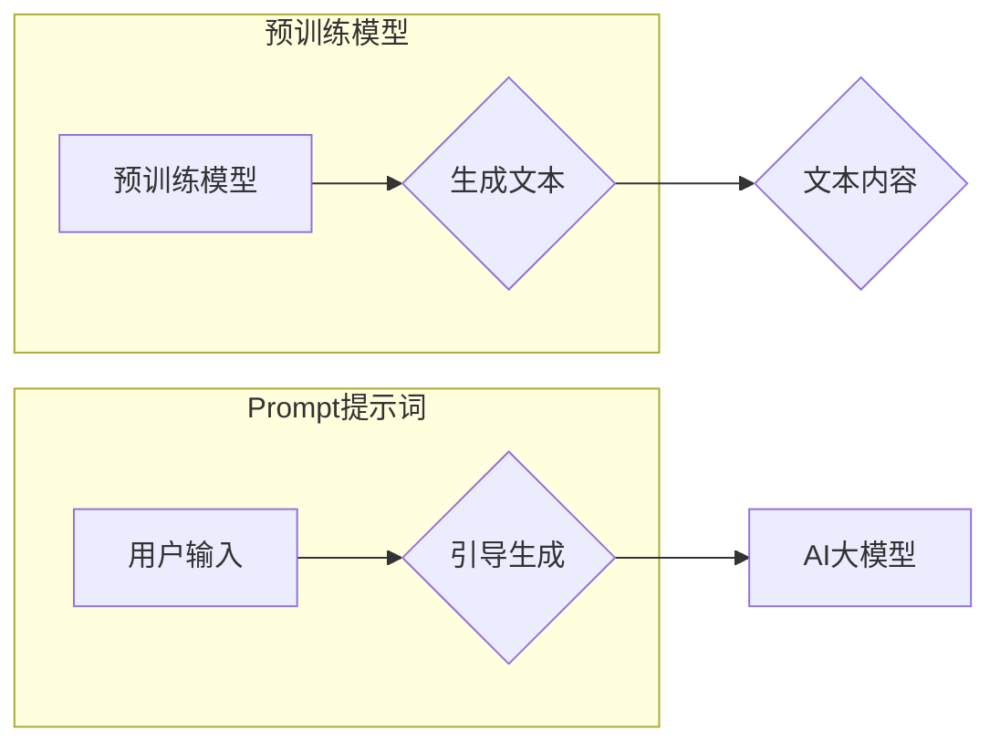

> AI大模型, Prompt提示词, 自然语言生成, 预训练模型, 迁移学习, 用户体验, 效果优化

# AI大模型Prompt提示词最佳实践：向我解释，就像我是新手一样

> 关键词：
AI大模型, Prompt提示词, 自然语言生成, 预训练模型, 迁移学习, 用户体验, 效果优化

## 1. 背景介绍

随着人工智能技术的飞速发展，自然语言生成（Natural Language Generation, NLG）技术逐渐成为研究和应用的热点。AI大模型，如GPT-3、BERT等，通过在海量文本数据上预训练，能够生成高质量的文本内容，广泛应用于聊天机器人、内容创作、自动摘要等领域。然而，如何有效地使用AI大模型生成高质量的文本，成为了用户和开发者面临的重要问题。本文将深入探讨AI大模型Prompt提示词的最佳实践，以帮助新手更好地理解和运用这一技术。

### 1.1 问题的由来

AI大模型的生成能力虽然强大，但往往需要用户输入精确的提示词（Prompt）来引导模型的生成方向。对于新手来说，如何编写有效的Prompt提示词，以及如何根据不同的场景选择合适的Prompt，是一个挑战。本文旨在通过详细的解释和实例，帮助新手理解和掌握AI大模型Prompt提示词的最佳实践。

### 1.2 研究现状

目前，关于AI大模型Prompt提示词的研究主要集中在以下几个方面：

- **Prompt设计原则**：研究如何设计能够有效引导模型生成特定内容的Prompt。
- **Prompt优化方法**：研究如何优化Prompt，提高模型生成文本的质量和多样性。
- **Prompt生成工具**：开发辅助用户生成Prompt的工具和平台。

### 1.3 研究意义

掌握AI大模型Prompt提示词的最佳实践，对于以下方面具有重要意义：

- **提升用户体验**：通过优化Prompt，生成更符合用户需求的文本内容，提升用户体验。
- **提高效率**：减少用户在生成文本过程中的努力，提高效率。
- **促进AI大模型的应用**：推动AI大模型在更多领域的应用。

### 1.4 本文结构

本文将按照以下结构展开：

- 第2章：介绍AI大模型Prompt提示词的核心概念与联系。
- 第3章：阐述AI大模型Prompt提示词的核心算法原理和具体操作步骤。
- 第4章：讲解数学模型和公式，并结合实例进行分析。
- 第5章：通过代码实例和详细解释说明AI大模型Prompt提示词的应用。
- 第6章：探讨AI大模型Prompt提示词的实际应用场景。
- 第7章：推荐相关的学习资源、开发工具和参考文献。
- 第8章：总结未来发展趋势与挑战。
- 第9章：提供常见问题与解答。

## 2. 核心概念与联系

### 2.1 核心概念

- **AI大模型**：指通过在大量数据上进行预训练，具备强大语言理解和生成能力的深度学习模型。
- **Prompt提示词**：指用于引导AI大模型生成特定内容的文本输入。
- **自然语言生成**：指利用人工智能技术生成自然语言文本的过程。

### 2.2 Mermaid流程图



### 2.3 核心概念联系

如图所示，用户通过输入Prompt提示词，引导AI大模型生成文本内容。预训练模型通过学习大量数据，能够理解Prompt并生成高质量的文本。

## 3. 核心算法原理 & 具体操作步骤

### 3.1 算法原理概述

AI大模型Prompt提示词的核心算法原理是利用预训练模型对用户输入的Prompt进行理解，并在此基础上生成符合要求的文本内容。

### 3.2 算法步骤详解

1. **接收Prompt输入**：用户输入Prompt提示词。
2. **理解Prompt**：AI大模型对Prompt进行解析，理解其含义和意图。
3. **生成文本**：AI大模型根据Prompt生成符合要求的文本内容。
4. **输出结果**：将生成的文本内容输出给用户。

### 3.3 算法优缺点

#### 优点：

- **简单易用**：用户只需输入简单的文本即可生成高质量文本。
- **通用性强**：适用于各种文本生成任务。

#### 缺点：

- **对Prompt质量要求高**：生成文本质量受Prompt质量影响较大。
- **难以理解生成文本**：对于复杂的Prompt，AI大模型可能生成难以理解的文本。

### 3.4 算法应用领域

AI大模型Prompt提示词广泛应用于以下领域：

- **聊天机器人**：生成自然、流畅的对话内容。
- **内容创作**：自动生成文章、故事、诗歌等。
- **自动摘要**：生成文章、报告的摘要。
- **翻译**：辅助翻译工作，提高翻译效率。

## 4. 数学模型和公式 & 详细讲解 & 举例说明

### 4.1 数学模型构建

AI大模型Prompt提示词的数学模型可以表示为：

$$
\text{生成文本} = f(\text{Prompt}, \theta)
$$

其中，$f$ 为模型生成文本的函数，$\theta$ 为模型参数，$\text{Prompt}$ 为用户输入的提示词。

### 4.2 公式推导过程

AI大模型的生成过程可以分解为以下几个步骤：

1. **编码Prompt**：将文本形式的Prompt转换为模型可理解的向量表示。
2. **生成文本**：根据Prompt向量，生成文本的序列。
3. **解码**：将生成的文本序列转换为可读的自然语言文本。

### 4.3 案例分析与讲解

假设用户输入的Prompt为："请写一篇关于人工智能的短文，描述人工智能的发展历程和未来趋势。"

AI大模型首先将Prompt编码为向量表示，然后根据向量生成文本的序列，最后将序列解码为自然语言文本。

## 5. 项目实践：代码实例和详细解释说明

### 5.1 开发环境搭建

为了实现AI大模型Prompt提示词，我们需要搭建以下开发环境：

- Python 3.8及以上版本
- Transformers库
- PyTorch或TensorFlow

### 5.2 源代码详细实现

以下是一个使用Transformers库和PyTorch实现AI大模型Prompt提示词的示例代码：

```python
from transformers import GPT2LMHeadModel, GPT2Tokenizer

# 加载预训练模型和分词器
model = GPT2LMHeadModel.from_pretrained('gpt2')
tokenizer = GPT2Tokenizer.from_pretrained('gpt2')

# 用户输入Prompt
prompt = "请写一篇关于人工智能的短文，描述人工智能的发展历程和未来趋势。"

# 加载Prompt并生成文本
inputs = tokenizer.encode(prompt, return_tensors="pt")
outputs = model.generate(inputs, max_length=100, num_return_sequences=1)

# 解码生成文本
generated_text = tokenizer.decode(outputs[0], skip_special_tokens=True)

print(generated_text)
```

### 5.3 代码解读与分析

上述代码首先加载预训练的GPT-2模型和分词器，然后接收用户的Prompt输入，使用模型生成文本，并最终将生成的文本解码为自然语言输出。

### 5.4 运行结果展示

假设运行上述代码后，生成的文本内容如下：

> 人工智能是计算机科学的一个分支，致力于使计算机能够模拟人类的智能行为。自20世纪50年代诞生以来，人工智能经历了多个发展阶段。在20世纪80年代，专家系统成为人工智能领域的热门研究方向。进入21世纪，随着深度学习技术的快速发展，人工智能取得了重大突破。未来，人工智能将向通用人工智能（AGI）方向发展，为人类社会带来更多变革。

## 6. 实际应用场景

AI大模型Prompt提示词在以下实际应用场景中具有显著优势：

- **聊天机器人**：通过优化Prompt，生成更符合用户需求的聊天内容，提升用户体验。
- **内容创作**：辅助用户生成文章、故事、诗歌等，提高创作效率。
- **自动摘要**：自动生成文章、报告的摘要，节省用户时间。
- **翻译**：辅助翻译工作，提高翻译效率。

### 6.1 聊天机器人

在聊天机器人中，通过优化Prompt，可以使机器人更好地理解用户意图，生成更自然、流畅的对话内容。

### 6.2 内容创作

在内容创作中，AI大模型Prompt提示词可以帮助用户快速生成文章、故事、诗歌等，提高创作效率。

### 6.3 自动摘要

在自动摘要中，AI大模型Prompt提示词可以自动生成文章、报告的摘要，节省用户时间。

### 6.4 翻译

在翻译中，AI大模型Prompt提示词可以辅助翻译工作，提高翻译效率。

## 7. 工具和资源推荐

### 7.1 学习资源推荐

- 《深度学习自然语言处理》
- 《Natural Language Processing with Transformers》
- HuggingFace官网

### 7.2 开发工具推荐

- Transformers库
- PyTorch
- TensorFlow

### 7.3 相关论文推荐

- "Attention is All You Need"
- "BERT: Pre-training of Deep Bidirectional Transformers for Language Understanding"
- "Generative Language Models: A Survey"

## 8. 总结：未来发展趋势与挑战

### 8.1 研究成果总结

本文深入探讨了AI大模型Prompt提示词的核心概念、原理、操作步骤和应用场景。通过实例和代码，帮助新手理解和掌握AI大模型Prompt提示词的最佳实践。

### 8.2 未来发展趋势

- **Prompt设计自动化**：开发更智能的Prompt设计工具，帮助用户自动生成高质量的Prompt。
- **多模态Prompt**：支持多模态输入，如图像、视频等，生成更丰富的文本内容。
- **跨语言Prompt**：支持跨语言Prompt，生成多种语言的文本内容。

### 8.3 面临的挑战

- **Prompt设计复杂性**：如何设计能够有效引导模型生成特定内容的Prompt，仍是一个挑战。
- **模型可解释性**：如何提高模型生成文本的可解释性，让用户更好地理解生成过程。

### 8.4 研究展望

AI大模型Prompt提示词技术将不断发展，未来将在更多领域得到应用，为人类带来更多便利。

## 9. 附录：常见问题与解答

### 9.1 常见问题

**Q1：如何设计有效的Prompt提示词？**

A1：设计有效的Prompt提示词需要考虑以下因素：

- **明确意图**：确保Prompt清晰表达用户的意图。
- **提供上下文**：提供足够的上下文信息，帮助模型更好地理解Prompt。
- **控制长度**：避免Prompt过长，以免影响模型生成效果。

**Q2：如何评估Prompt提示词的效果？**

A2：评估Prompt提示词的效果可以从以下几个方面进行：

- **文本质量**：评估生成的文本是否符合用户需求，是否自然流畅。
- **多样性**：评估生成的文本是否具有多样性，避免重复。
- **准确性**：评估生成的文本是否准确无误。

### 9.2 解答

**A1**：设计有效的Prompt提示词需要根据具体任务和场景进行。以下是一些设计Prompt提示词的技巧：

- **使用关键词**：使用与任务相关的关键词，引导模型生成相关内容。
- **提供示例**：提供一些示例，帮助模型理解生成内容的要求。
- **使用模板**：使用模板，将Prompt分解为多个部分，提高可读性。

**A2**：评估Prompt提示词的效果可以通过以下方法：

- **人工评估**：由人类评估生成的文本质量。
- **自动化评估**：使用自动化的评估指标，如BLEU、ROUGE等，评估文本质量。
- **用户反馈**：收集用户对生成的文本的反馈，评估用户满意度。

---

作者：禅与计算机程序设计艺术 / Zen and the Art of Computer Programming