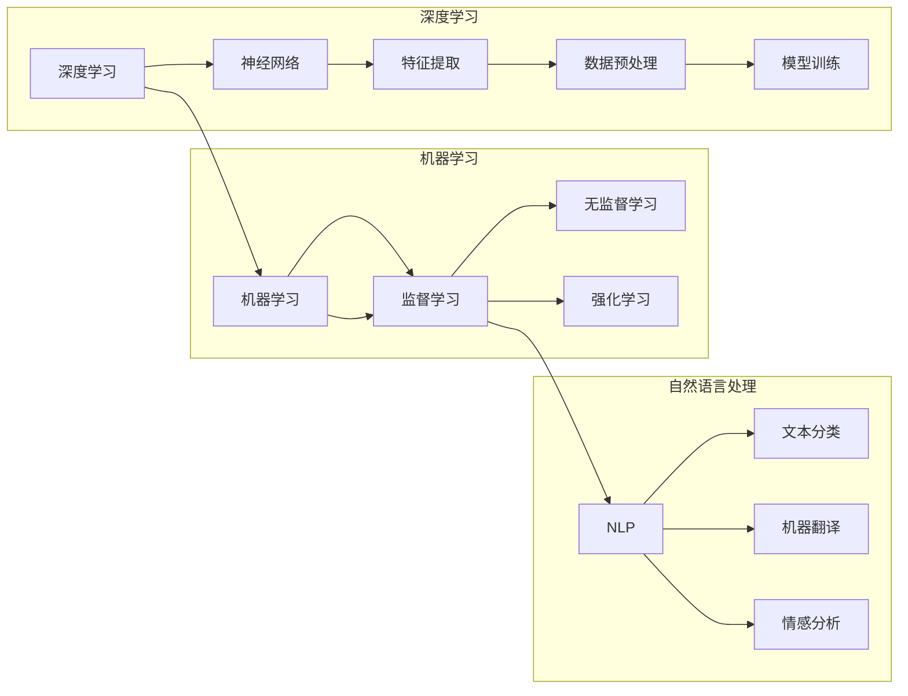

> 人工智能，机器学习，深度学习，神经网络，自然语言处理，未来趋势，Andrej Karpathy，策略

# Andrej Karpathy：人工智能的未来发展策略

## 1. 背景介绍

人工智能（AI）作为当今科技领域的前沿，正在以前所未有的速度发展。Andrej Karpathy，作为一位杰出的计算机科学家和深度学习领域的领军人物，他的工作对于AI社区产生了深远的影响。本文将深入探讨Andrej Karpathy对人工智能未来发展的策略，并分析其背后的原理和操作步骤。

### 1.1 问题的由来

随着深度学习的兴起，AI技术取得了突破性的进展。然而，如何确保AI技术的可持续发展和伦理使用，成为了业界和学术界关注的焦点。Andrej Karpathy的思考为我们提供了宝贵的视角。

### 1.2 研究现状

当前，AI技术已经渗透到生活的方方面面，从自动驾驶到自然语言处理，从医疗诊断到金融分析。然而，AI的发展也带来了一系列挑战，包括数据隐私、算法偏见、技术可解释性等。

### 1.3 研究意义

Andrej Karpathy的研究对于理解AI的未来发展方向、应对挑战以及制定有效策略具有重要意义。

### 1.4 本文结构

本文将分为以下几个部分：
- 介绍Andrej Karpathy的核心概念与联系。
- 探讨AI的核心算法原理和操作步骤。
- 分析数学模型和公式，并提供案例讲解。
- 通过代码实例和详细解释说明AI的应用实践。
- 探讨AI的实际应用场景和未来应用展望。
- 推荐相关工具和资源。
- 总结AI的未来发展趋势与挑战。
- 提供附录，包括常见问题与解答。

## 2. 核心概念与联系

### 2.1 核心概念

- **深度学习**：一种利用神经网络进行学习和建模的技术，通过多层非线性变换处理复杂数据。
- **神经网络**：由大量相互连接的简单计算单元组成，能够通过学习数据集自动提取特征。
- **自然语言处理（NLP）**：使计算机能够理解和生成人类语言的技术。
- **机器学习**：使计算机能够从数据中学习，并做出决策或预测的技术。

### 2.2 Mermaid 流程图



## 3. 核心算法原理 & 具体操作步骤

### 3.1 算法原理概述

深度学习算法的核心是神经网络，通过多层非线性变换对数据进行特征提取和模型学习。常见的神经网络包括卷积神经网络（CNN）、循环神经网络（RNN）和Transformer。

### 3.2 算法步骤详解

1. 数据预处理：对数据进行清洗、标准化等处理，为模型训练做好准备。
2. 构建模型：选择合适的神经网络结构，如CNN、RNN或Transformer。
3. 模型训练：使用标注数据训练模型，不断调整模型参数，使模型输出逼近真实标签。
4. 模型评估：使用验证集评估模型性能，调整超参数，优化模型结构。
5. 模型部署：将训练好的模型部署到实际应用中，进行推理预测。

### 3.3 算法优缺点

- 优点：能够处理复杂问题，泛化能力强，学习效果好。
- 缺点：计算资源消耗大，需要大量标注数据，模型可解释性差。

### 3.4 算法应用领域

深度学习算法广泛应用于图像识别、语音识别、自然语言处理等领域。

## 4. 数学模型和公式 & 详细讲解 & 举例说明

### 4.1 数学模型构建

深度学习中的数学模型主要包括神经网络、损失函数和优化算法。

### 4.2 公式推导过程

以神经网络为例，其基本结构如下：

$$
y = f(W \cdot x + b)
$$

其中，$W$ 是权重矩阵，$x$ 是输入向量，$b$ 是偏置向量，$f$ 是激活函数。

### 4.3 案例分析与讲解

以图像识别任务为例，使用卷积神经网络进行图像分类。

```python
import torch
import torch.nn as nn

class CNN(nn.Module):
    def __init__(self):
        super(CNN, self).__init__()
        self.conv1 = nn.Conv2d(3, 32, kernel_size=3, stride=1, padding=1)
        self.relu = nn.ReLU()
        self.pool = nn.MaxPool2d(kernel_size=2, stride=2)
        self.fc = nn.Linear(32*7*7, 10)

    def forward(self, x):
        x = self.pool(self.relu(self.conv1(x)))
        x = x.view(-1, 32*7*7)
        x = self.fc(x)
        return x

model = CNN()
```

## 5. 项目实践：代码实例和详细解释说明

### 5.1 开发环境搭建

使用Python和PyTorch框架进行深度学习项目开发。

### 5.2 源代码详细实现

以下是一个简单的图像识别模型实现：

```python
import torch
import torch.nn as nn
import torch.optim as optim

class CNN(nn.Module):
    # ... (与上文相同)

# 训练模型
def train_model(model, train_loader, optimizer, criterion):
    model.train()
    for data, target in train_loader:
        optimizer.zero_grad()
        output = model(data)
        loss = criterion(output, target)
        loss.backward()
        optimizer.step()

# 评估模型
def evaluate_model(model, test_loader, criterion):
    model.eval()
    with torch.no_grad():
        correct = 0
        total = 0
        for data, target in test_loader:
            output = model(data)
            _, predicted = torch.max(output.data, 1)
            total += target.size(0)
            correct += (predicted == target).sum().item()
    return correct / total

# ... (与上文相同)
```

### 5.3 代码解读与分析

上述代码实现了一个简单的卷积神经网络模型，用于图像识别任务。通过训练模型，使其能够识别图像中的类别。

### 5.4 运行结果展示

在训练过程中，可以观察到损失函数的下降趋势，以及模型在测试集上的准确率。

## 6. 实际应用场景

深度学习在图像识别、语音识别、自然语言处理等领域有着广泛的应用。

### 6.1 图像识别

使用深度学习模型进行人脸识别、物体检测、场景分类等。

### 6.2 语音识别

使用深度学习模型进行语音转文字、语音合成等。

### 6.3 自然语言处理

使用深度学习模型进行文本分类、情感分析、机器翻译等。

## 7. 工具和资源推荐

### 7.1 学习资源推荐

- Coursera的《机器学习》课程
- Deep Learning with PyTorch by fast.ai
- TensorFlow官方文档

### 7.2 开发工具推荐

- PyTorch
- TensorFlow
- Keras

### 7.3 相关论文推荐

- "A Guide to Convolutional Neural Networks for Computer Vision" by Aravind Srinivas
- "Sequence to Sequence Learning with Neural Networks" by Ilya Sutskever et al.
- "Attention is All You Need" by Ashish Vaswani et al.

## 8. 总结：未来发展趋势与挑战

### 8.1 研究成果总结

本文介绍了Andrej Karpathy对人工智能未来发展的策略，并分析了其背后的原理和操作步骤。深度学习作为一种强大的学习范式，在AI领域取得了显著的成果。

### 8.2 未来发展趋势

- 模型小型化：为了降低计算资源消耗，模型小型化将成为重要趋势。
- 可解释性：提高模型的可解释性，增强用户信任。
- 多模态学习：融合不同模态的数据，提高模型的泛化能力。

### 8.3 面临的挑战

- 数据隐私：确保数据隐私和安全。
- 算法偏见：避免算法偏见，确保公平性。
- 计算资源：降低计算资源消耗，提高效率。

### 8.4 研究展望

未来，人工智能将在更多领域发挥重要作用，推动社会进步。

## 9. 附录：常见问题与解答

### 9.1 人工智能的定义是什么？

人工智能是一种使计算机能够模拟人类智能行为的技术。

### 9.2 深度学习和机器学习的区别是什么？

深度学习是机器学习的一个子集，使用神经网络进行学习和建模。

### 9.3 如何选择合适的神经网络结构？

根据具体任务和数据特点选择合适的神经网络结构。

### 9.4 如何优化深度学习模型？

通过调整超参数、改进模型结构、使用正则化技术等方法优化深度学习模型。

### 9.5 如何评估深度学习模型？

使用测试集评估模型的性能，包括准确率、召回率、F1值等指标。

---

作者：禅与计算机程序设计艺术 / Zen and the Art of Computer Programming