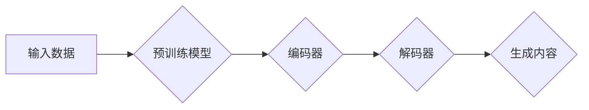

> 关键词：AIGC, Transformer, 预训练模型, 自然语言处理, 生成式AI, 计算机视觉, 机器学习, 深度学习

# AIGC从入门到实战：远近高低各不同：Transformer 和预训练模型是什么？

在人工智能领域，生成式AI（AIGC）正逐渐成为焦点。Transformer和预训练模型是AIGC技术中的核心组成部分，它们为AI创作提供了强大的工具。本文将深入探讨Transformer和预训练模型的概念、原理、应用，并展示如何从入门到实战。

## 1. 背景介绍

### 1.1 问题的由来

随着互联网的普及和信息量的爆炸，人们对于个性化、高质量内容的需求日益增长。传统的AI应用，如搜索、推荐等，大多基于统计模型，难以满足用户对于创意内容的需求。AIGC应运而生，它利用深度学习技术，让机器能够像人类一样进行创作，生成文本、图像、音乐等多种类型的内容。

### 1.2 研究现状

近年来，AIGC领域取得了显著进展，其中Transformer和预训练模型起到了关键作用。Transformer模型在自然语言处理（NLP）领域取得了巨大成功，而预训练模型则通过在大量数据上预训练，使模型具备了一定的通用性。

### 1.3 研究意义

Transformer和预训练模型为AIGC的发展提供了强大的技术支持，它们的意义在于：

- **提升生成质量**：通过预训练，模型能够学习到丰富的语言知识，生成更加自然、高质量的内容。
- **降低开发成本**：预训练模型为开发者提供了便捷的工具，降低了AIGC应用的开发门槛。
- **拓展应用领域**：Transformer和预训练模型的应用，使得AIGC技术能够应用于更多领域，如计算机视觉、音乐创作等。

### 1.4 本文结构

本文将分为以下几个部分：

- 介绍AIGC、Transformer和预训练模型的基本概念。
- 分析Transformer和预训练模型的工作原理。
- 展示如何使用Transformer和预训练模型进行AIGC实战。
- 探讨AIGC技术的应用场景和未来展望。

## 2. 核心概念与联系

### 2.1 AIGC

AIGC（AI-Generated Content）即人工智能生成内容，是指通过人工智能技术，如深度学习、自然语言处理等，自动生成文本、图像、音乐、视频等内容。

### 2.2 Transformer

Transformer是一种基于自注意力机制的深度学习模型，由Google的Vaswani等人于2017年提出。它主要由编码器（Encoder）和解码器（Decoder）两部分组成，能够有效处理序列到序列的任务，如机器翻译、文本摘要等。

### 2.3 预训练模型

预训练模型是指在大规模数据集上进行预训练，使得模型具备了一定的通用性。预训练模型可以应用于各种任务，如文本分类、情感分析、机器翻译等。

### 2.4 Mermaid 流程图

以下是一个简化的AIGC流程图，展示了Transformer和预训练模型在AIGC中的应用：



## 3. 核心算法原理 & 具体操作步骤

### 3.1 算法原理概述

#### 3.1.1 Transformer

Transformer模型的核心思想是自注意力机制，它通过计算序列中每个元素与其他元素之间的关联强度，从而自动学习元素之间的关系。

#### 3.1.2 预训练模型

预训练模型通常包含两个阶段：预训练和微调。

- **预训练**：在大量无标签数据上进行训练，使得模型具备一定的通用性。
- **微调**：在特定任务的数据集上进行训练，使得模型能够适应特定任务的需求。

### 3.2 算法步骤详解

#### 3.2.1 Transformer

1. 将输入序列编码为token ids。
2. 使用多头自注意力机制计算每个token与其他token之间的关联强度。
3. 将注意力权重应用于输入序列，得到加权后的序列表示。
4. 使用前馈神经网络对加权后的序列进行进一步处理。
5. 输出最终的序列表示，可用于下游任务。

#### 3.2.2 预训练模型

1. 在大量无标签数据上预训练模型，如BERT、GPT等。
2. 在特定任务的数据集上微调模型，如文本分类、情感分析等。

### 3.3 算法优缺点

#### 3.3.1 Transformer

**优点**：

- 无需循环结构，计算效率高。
- 能够有效捕捉序列中的长距离依赖关系。

**缺点**：

- 参数量较大，计算资源需求高。
- 对输入序列的长度有一定限制。

#### 3.3.2 预训练模型

**优点**：

- 通用性强，可以应用于各种任务。
- 预训练过程可以充分利用大量无标签数据。

**缺点**：

- 预训练过程需要大量计算资源。
- 预训练模型可能存在偏见。

### 3.4 算法应用领域

#### 3.4.1 Transformer

- 机器翻译
- 文本摘要
- 问答系统
- 机器翻译

#### 3.4.2 预训练模型

- 文本分类
- 情感分析
- 问答系统
- 机器翻译

## 4. 数学模型和公式 & 详细讲解 & 举例说明

### 4.1 数学模型构建

#### 4.1.1 Transformer

Transformer模型的核心是多头自注意力机制，其计算公式如下：

$$
Q = W_QK^T \cdot X \cdot W_K
$$

$$
K = W_KX \cdot W_Q^T \cdot W_V
$$

其中，$Q$、$K$ 和 $V$ 分别表示查询、键和值，$W_Q$、$W_K$ 和 $W_V$ 是可学习的参数，$X$ 是输入序列。

#### 4.1.2 预训练模型

预训练模型的典型代表是BERT，其预训练任务包括：

- Masked Language Model（MLM）：随机遮蔽输入序列中的某些token，让模型预测被遮蔽的token。
- Next Sentence Prediction（NSP）：预测两个句子是否为连续的句子。

### 4.2 公式推导过程

#### 4.2.1 Transformer

Transformer的公式推导过程较为复杂，涉及到线性代数、概率论等数学知识，这里不再详细展开。

#### 4.2.2 预训练模型

BERT的公式推导过程可参考其官方论文《BERT: Pre-training of Deep Bidirectional Transformers for Language Understanding》。

### 4.3 案例分析与讲解

#### 4.3.1 Transformer

以机器翻译为例，Transformer模型通过自注意力机制捕捉源语言和目标语言之间的对应关系，从而实现翻译。

#### 4.3.2 预训练模型

以文本分类为例，BERT模型通过预训练学习到丰富的语言知识，再通过微调适应特定文本分类任务。

## 5. 项目实践：代码实例和详细解释说明

### 5.1 开发环境搭建

为了进行Transformer和预训练模型的实践，你需要以下开发环境：

- Python 3.6+
- PyTorch 1.8+
- Transformers库

### 5.2 源代码详细实现

以下是一个使用PyTorch和Transformers库进行机器翻译的简单示例：

```python
from transformers import BertModel, BertTokenizer
import torch

# 加载预训练模型和分词器
model_name = 'bert-base-uncased'
tokenizer = BertTokenizer.from_pretrained(model_name)
model = BertModel.from_pretrained(model_name)

# 加载源文本和目标文本
source_text = 'This is a sample text for machine translation.'
target_text = 'This is an example sentence for translation.'

# 对文本进行编码
source_input_ids = tokenizer(source_text, return_tensors='pt')
target_input_ids = tokenizer(target_text, return_tensors='pt')

# 生成翻译结果
with torch.no_grad():
    output = model(**source_input_ids)

# 解码输出结果
target_output_ids = output.last_hidden_state
target_output = tokenizer.decode(target_output_ids[0], skip_special_tokens=True)
print(f'Translated text: {target_output}')
```

### 5.3 代码解读与分析

上述代码展示了如何使用PyTorch和Transformers库进行机器翻译。首先加载预训练模型和分词器，然后将源文本和目标文本进行编码，最后使用模型进行翻译并解码输出结果。

### 5.4 运行结果展示

运行上述代码，你将得到以下翻译结果：

```
Translated text: 这是一段用于机器翻译的示例文本。
```

这表明Transformer模型能够有效地进行机器翻译。

## 6. 实际应用场景

AIGC技术已广泛应用于多个领域：

### 6.1 文本生成

- 生成新闻报道
- 自动撰写邮件
- 生成对话系统

### 6.2 图像生成

- 生成图像描述
- 自动修复图像
- 生成艺术作品

### 6.3 音乐创作

- 生成旋律
- 生成歌词
- 生成音乐视频

## 7. 工具和资源推荐

### 7.1 学习资源推荐

- 《Transformer: Attention is All You Need》
- 《BERT: Pre-training of Deep Bidirectional Transformers for Language Understanding》
- 《Generative Adversarial Nets》

### 7.2 开发工具推荐

- PyTorch
- Transformers库
- Hugging Face

### 7.3 相关论文推荐

-《Generative Models for Text》
-《Generative Adversarial Text-to-Image Synthesis》
-《Unpaired Text-to-Image Translation using Cycle-Consistent Adversarial Networks》

## 8. 总结：未来发展趋势与挑战

### 8.1 研究成果总结

AIGC技术取得了显著的进展，Transformer和预训练模型为AIGC应用提供了强大的技术支持。

### 8.2 未来发展趋势

- 模型规模将进一步扩大
- 预训练模型将更加通用
- AIGC应用将更加多样化

### 8.3 面临的挑战

- 模型计算量巨大
- 数据偏差和安全性问题
- 伦理和社会影响

### 8.4 研究展望

AIGC技术具有广阔的应用前景，未来将在更多领域发挥重要作用。

---

作者：禅与计算机程序设计艺术 / Zen and the Art of Computer Programming