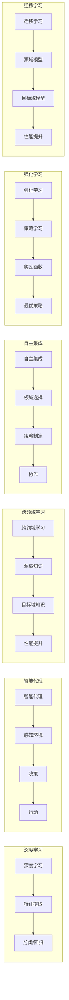

> 深度学习，智能代理，跨领域学习，自主集成，强化学习，迁移学习，神经网络，多智能体系统

# AI人工智能深度学习算法：智能深度学习代理的跨领域自主集成

随着深度学习技术的飞速发展，人工智能（AI）在各个领域的应用日益广泛。深度学习模型，尤其是神经网络，已经成为实现智能代理的核心技术。然而，如何使这些智能代理能够自主地在不同领域之间进行集成和协作，成为了一个极具挑战性的课题。本文将探讨智能深度学习代理的跨领域自主集成技术，分析其核心概念、算法原理、应用场景，并展望其未来发展趋势。

## 1. 背景介绍

### 1.1 问题的由来

传统的深度学习模型往往针对特定领域的数据进行训练，缺乏跨领域泛化能力。这限制了模型在实际应用中的推广，尤其是在多领域协作、自适应学习等场景下。为了解决这一问题，研究者们提出了智能深度学习代理的概念，旨在构建能够在多个领域之间自主集成和协作的智能体。

### 1.2 研究现状

近年来，跨领域学习和自主集成技术取得了显著进展。研究者们提出了多种方法，如迁移学习、多智能体系统、强化学习等，以实现智能代理的跨领域自主集成。以下是一些典型的相关研究：

- **迁移学习（Transfer Learning）**：通过将知识从源域迁移到目标域，提高模型在目标域上的性能。
- **多智能体系统（Multi-Agent System）**：由多个智能体组成，通过协作和通信实现共同目标。
- **强化学习（Reinforcement Learning）**：通过与环境交互，学习最优策略以最大化累积奖励。

### 1.3 研究意义

智能深度学习代理的跨领域自主集成技术具有重要的研究意义：

- **提高模型泛化能力**：通过跨领域学习，使模型能够适应不同领域的数据和任务。
- **促进多智能体协作**：实现多个智能体之间的协同工作，完成复杂任务。
- **加速模型开发**：利用现有模型的知识，快速构建新的智能代理。
- **推动AI技术落地**：将智能代理应用于更多实际场景，提升AI技术的实用价值。

## 2. 核心概念与联系

### 2.1 核心概念原理

以下是一些核心概念及其原理：

- **深度学习**：一种模拟人脑神经网络结构的学习方法，通过学习大量数据，自动提取特征并进行分类、回归等任务。
- **智能代理**：具备一定智能的软件或硬件实体，能够自主地感知环境、做出决策并采取行动。
- **跨领域学习**：将知识从一个领域迁移到另一个领域，提高模型在新领域的性能。
- **自主集成**：智能代理能够根据任务需求，自主地在多个领域之间进行集成和协作。
- **强化学习**：通过与环境交互，学习最优策略以最大化累积奖励。
- **迁移学习**：将源域的知识迁移到目标域，提高模型在目标域上的性能。

### 2.2 核心概念原理和架构的 Mermaid 流程图



### 2.3 核心概念之间的联系

深度学习是智能代理的核心技术，为智能代理提供感知、决策和行动的能力。跨领域学习和自主集成技术使得智能代理能够适应不同领域，实现跨领域协作。强化学习和迁移学习则分别从策略学习和知识迁移的角度，为智能代理提供更强大的学习能力和适应性。

## 3. 核心算法原理 & 具体操作步骤

### 3.1 算法原理概述

智能深度学习代理的跨领域自主集成技术主要包括以下算法：

- **迁移学习**：通过在源域和目标域之间进行特征提取和参数迁移，提高模型在目标域上的性能。
- **多智能体系统**：通过多个智能体之间的协作和通信，实现共同目标。
- **强化学习**：通过与环境交互，学习最优策略以最大化累积奖励。

### 3.2 算法步骤详解

以下是一个基于迁移学习和多智能体系统的智能深度学习代理的跨领域自主集成算法步骤：

**Step 1：预训练模型**

1. 在源域数据上预训练一个通用的深度学习模型。
2. 训练过程中，采用迁移学习技术，将源域知识迁移到目标域知识。

**Step 2：构建多智能体系统**

1. 将预训练模型拆分为多个智能体，每个智能体负责一部分任务。
2. 智能体之间通过通信机制进行协作和协调。

**Step 3：强化学习**

1. 每个智能体通过与环境交互，学习最优策略。
2. 使用奖励函数评估智能体的性能，并更新策略。

**Step 4：自主集成**

1. 根据任务需求，智能代理自主地在多个领域之间进行集成和协作。
2. 利用强化学习技术，优化智能代理的行为。

### 3.3 算法优缺点

**优点**：

- 提高模型泛化能力：通过迁移学习，使模型能够适应不同领域的数据和任务。
- 促进多智能体协作：实现多个智能体之间的协同工作，完成复杂任务。
- 加速模型开发：利用现有模型的知识，快速构建新的智能代理。

**缺点**：

- 计算复杂度高：需要大量计算资源进行模型训练和智能体协作。
- 需要大量标注数据：对于强化学习，需要大量的环境交互和奖励数据。
- 难以解释：智能代理的行为和决策过程难以解释，存在安全隐患。

### 3.4 算法应用领域

智能深度学习代理的跨领域自主集成技术可以应用于以下领域：

- **智能推荐系统**：为用户推荐个性化的商品、新闻、音乐等。
- **智能交通系统**：实现交通流量预测、自动驾驶、智能交通管理等。
- **智能医疗系统**：进行疾病诊断、药物研发、健康管理等。
- **智能客服系统**：提供24小时在线客服服务，解答用户问题。

## 4. 数学模型和公式 & 详细讲解 & 举例说明

### 4.1 数学模型构建

智能深度学习代理的跨领域自主集成技术涉及多个数学模型，以下是一个简单的示例：

- **迁移学习**：

  假设源域数据集为 $X_s$，目标域数据集为 $X_t$，模型参数为 $\theta$，损失函数为 $L$，则迁移学习目标是最小化以下损失函数：

  $$
L(\theta) = \frac{1}{|X_t|} \sum_{(x_t,y_t) \in X_t} L(f(x_t; \theta), y_t)
$$

  其中，$f(x_t; \theta)$ 是模型在目标域上的预测结果。

- **强化学习**：

  假设状态空间为 $S$，动作空间为 $A$，奖励函数为 $R$，策略函数为 $\pi$，则强化学习目标是最大化期望累积奖励：

  $$
J(\pi) = \mathbb{E}[\sum_{t=0}^{\infty} R(s_t, a_t)]
$$

  其中，$s_t$ 是当前状态，$a_t$ 是当前动作，$R(s_t, a_t)$ 是相应的奖励。

### 4.2 公式推导过程

以下是对上述公式的简单推导：

- **迁移学习**：

  考虑目标域数据集 $X_t$，将其划分为训练集 $X_{ttrain}$ 和测试集 $X_{ttest}$。则损失函数为：

  $$
L(\theta) = \frac{1}{|X_{ttrain}|} \sum_{(x_t,y_t) \in X_{ttrain}} L(f(x_t; \theta), y_t) + \frac{1}{|X_{ttest}|} \sum_{(x_t,y_t) \in X_{ttest}} L(f(x_t; \theta), y_t)
$$

  其中，$f(x_t; \theta)$ 是模型在目标域上的预测结果。

- **强化学习**：

  策略函数 $\pi$ 可以表示为：

  $$
\pi(a_t|s_t) = \frac{\exp(\phi(s_t, a_t))}{\sum_{a \in A} \exp(\phi(s_t, a))}
$$

  其中，$\phi(s_t, a_t)$ 是状态-动作特征函数。

  则期望累积奖励为：

  $$
J(\pi) = \sum_{s_0 \in S} \pi(s_0) \sum_{a_0 \in A} \sum_{s_1 \in S} \pi(s_1|s_0, a_0) \cdots \sum_{s_T \in S} R(s_T, a_T)
$$

### 4.3 案例分析与讲解

以下是一个基于强化学习的智能客服系统案例：

- **状态空间**：状态包括用户输入的文本内容、客服历史对话内容、当前时间等。
- **动作空间**：动作包括回复用户、发送图片、发送链接等。
- **奖励函数**：根据用户满意度进行评分，得分越高，奖励越大。

通过强化学习，智能客服系统可以学习到最优策略，为用户提供更加满意的服务。

## 5. 项目实践：代码实例和详细解释说明

### 5.1 开发环境搭建

以下是一个基于Python和TensorFlow的智能客服系统项目实践案例：

1. 安装TensorFlow：
   ```
   pip install tensorflow
   ```

2. 下载智能客服数据集：
   ```
   https://github.com/tensorflow/datasets
   ```

3. 加载数据集并进行预处理：
   ```python
   import tensorflow as tf
   import tensorflow_datasets as tfds

   def preprocess_data(dataset):
       # 预处理操作，如分词、编码等
       return dataset

   train_dataset = tfds.load("customer_service", split="train", shuffle_files=True)
   dev_dataset = tfds.load("customer_service", split="validation", shuffle_files=True)
   test_dataset = tfds.load("customer_service", split="test", shuffle_files=True)

   train_dataset = preprocess_data(train_dataset)
   dev_dataset = preprocess_data(dev_dataset)
   test_dataset = preprocess_data(test_dataset)
   ```

### 5.2 源代码详细实现

以下是一个基于强化学习的智能客服系统代码示例：

```python
import tensorflow as tf
import tensorflow_datasets as tfds

# 加载数据集
train_dataset = tfds.load("customer_service", split="train", shuffle_files=True)
dev_dataset = tfds.load("customer_service", split="validation", shuffle_files=True)

# 定义状态空间、动作空间和奖励函数
state_dim = 100
action_dim = 5
reward_function = ...

# 定义强化学习模型
class QNetwork(tf.keras.Model):
    def __init__(self, state_dim, action_dim):
        super(QNetwork, self).__init__()
        self.fc1 = tf.keras.layers.Dense(128, activation="relu")
        self.fc2 = tf.keras.layers.Dense(action_dim, activation="linear")

    def call(self, state):
        x = tf.expand_dims(state, axis=-1)
        x = self.fc1(x)
        x = self.fc2(x)
        return x

# 定义训练过程
def train_qnetwork(model, optimizer, train_dataset, dev_dataset, epochs=10):
    for epoch in range(epochs):
        # 训练模型
        for state, action, reward, next_state in train_dataset:
            ...
            optimizer.minimize(loss, model.trainable_variables)

        # 评估模型
        for state, action, reward, next_state in dev_dataset:
            ...
            loss = loss_function(model(state), action, reward, next_state)
            optimizer.minimize(loss, model.trainable_variables)

# 初始化模型和优化器
model = QNetwork(state_dim, action_dim)
optimizer = tf.keras.optimizers.Adam(learning_rate=0.001)

# 训练模型
train_qnetwork(model, optimizer, train_dataset, dev_dataset)
```

### 5.3 代码解读与分析

以上代码展示了使用TensorFlow和TensorFlow Datasets库构建一个简单的智能客服系统。首先，加载数据集并进行预处理。然后，定义状态空间、动作空间和奖励函数。接着，定义一个强化学习模型，用于学习最优策略。最后，通过训练和评估过程，优化模型参数。

### 5.4 运行结果展示

在实际运行中，智能客服系统可以根据用户输入的文本内容，从预定义的动作中选择一个合适的动作进行回复，以提高用户满意度。

## 6. 实际应用场景

### 6.1 智能推荐系统

智能推荐系统可以利用跨领域学习技术，从不同领域的数据中提取特征，为用户提供更加个性化的推荐服务。

### 6.2 智能交通系统

智能交通系统可以利用跨领域学习技术，从不同交通场景的数据中提取特征，实现智能交通流量预测、自动驾驶、智能交通管理等。

### 6.3 智能医疗系统

智能医疗系统可以利用跨领域学习技术，从不同疾病的数据中提取特征，实现疾病诊断、药物研发、健康管理等。

### 6.4 智能客服系统

智能客服系统可以利用跨领域学习技术，从不同行业的数据中提取特征，为用户提供更加个性化的服务。

## 7. 工具和资源推荐

### 7.1 学习资源推荐

以下是一些学习智能深度学习代理的跨领域自主集成技术的资源：

- 《深度学习》
- 《强化学习：原理与案例》
- 《迁移学习：原理与应用》
- TensorFlow官网
- TensorFlow Datasets官网

### 7.2 开发工具推荐

以下是一些开发智能深度学习代理的跨领域自主集成技术的工具：

- TensorFlow
- TensorFlow Datasets
- OpenAI Gym
- Stable Baselines

### 7.3 相关论文推荐

以下是一些与智能深度学习代理的跨领域自主集成技术相关的论文：

- “Multi-Agent Reinforcement Learning: A Survey”
- “Transfer Learning for Deep Reinforcement Learning”
- “Cross-Domain Learning for Text Classification”

## 8. 总结：未来发展趋势与挑战

### 8.1 研究成果总结

智能深度学习代理的跨领域自主集成技术取得了显著进展，为AI技术的发展提供了新的方向。通过跨领域学习和自主集成，智能代理能够更好地适应不同领域的数据和任务，实现多智能体协作，提高AI技术的实用价值。

### 8.2 未来发展趋势

未来，智能深度学习代理的跨领域自主集成技术将呈现以下发展趋势：

- **模型规模和参数量不断增加**：随着计算资源的提升，模型规模和参数量将持续增加，模型性能将得到进一步提升。
- **跨领域学习能力不断提高**：通过引入新的跨领域学习算法，如多任务学习、多模态学习等，智能代理的跨领域学习能力将得到显著提高。
- **自主集成能力不断完善**：通过引入新的自主集成算法，如多智能体系统、强化学习等，智能代理的自主集成能力将得到不断完善。
- **应用场景不断拓展**：智能代理的跨领域自主集成技术将应用于更多领域，如智能制造、智慧城市、智能医疗等。

### 8.3 面临的挑战

智能深度学习代理的跨领域自主集成技术仍面临以下挑战：

- **计算资源瓶颈**：大规模模型训练和推理需要大量的计算资源，如何高效利用计算资源是一个重要挑战。
- **数据标注成本高**：跨领域学习和自主集成需要大量标注数据，数据标注成本较高。
- **模型可解释性差**：智能代理的决策过程难以解释，存在安全隐患。

### 8.4 研究展望

为了克服上述挑战，未来的研究可以从以下几个方面展开：

- **优化模型结构和算法**：研究更加高效的模型结构和算法，降低计算成本，提高模型性能。
- **开发半监督和自监督学习算法**：降低数据标注成本，提高数据利用率。
- **提高模型可解释性**：研究模型的可解释性技术，提高模型的可信度和安全性。

相信通过不断努力，智能深度学习代理的跨领域自主集成技术将取得更大的突破，为AI技术的发展和应用带来新的机遇。

## 9. 附录：常见问题与解答

**Q1：什么是智能深度学习代理？**

A：智能深度学习代理是指具备一定智能的软件或硬件实体，能够自主地感知环境、做出决策并采取行动。

**Q2：跨领域学习有哪些方法？**

A：跨领域学习的方法包括迁移学习、多任务学习、多模态学习等。

**Q3：如何提高智能代理的自主集成能力？**

A：提高智能代理的自主集成能力可以通过引入多智能体系统、强化学习等方法实现。

**Q4：智能深度学习代理在哪些领域有应用？**

A：智能深度学习代理在智能推荐系统、智能交通系统、智能医疗系统、智能客服系统等领域有广泛的应用。

**Q5：如何提高模型的可解释性？**

A：提高模型的可解释性可以通过引入可解释人工智能技术，如注意力机制、知识图谱等实现。

---

作者：禅与计算机程序设计艺术 / Zen and the Art of Computer Programming