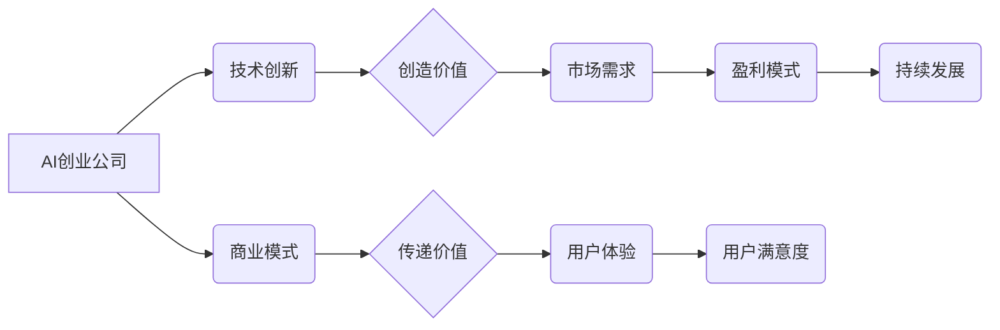

# AI创业公司的市场前景

> 关键词：AI创业，市场前景，技术创新，商业模式，风险与机遇，人工智能，创业环境

## 1. 背景介绍

随着人工智能技术的飞速发展，全球范围内涌现出大量AI创业公司。这些公司凭借技术创新和商业模式创新，在各个领域取得了令人瞩目的成就。本文将深入探讨AI创业公司的市场前景，分析其面临的机遇与挑战，并展望未来发展趋势。

### 1.1 技术创新加速AI创业浪潮

近年来，深度学习、计算机视觉、自然语言处理等AI技术的飞速发展为AI创业提供了强大的技术支撑。这些技术的突破使得AI在医疗、金融、教育、交通等多个领域得到广泛应用，激发了众多创业者投身AI创业的热情。

### 1.2 商业模式创新推动市场发展

除了技术创新，商业模式创新也是AI创业公司成功的关键因素。通过将AI技术与传统行业相结合，AI创业公司创造了新的商业价值，拓展了市场空间。

### 1.3 政策支持与资本涌入

各国政府纷纷出台政策支持AI产业发展，推动AI创业公司的成长。同时，风险投资、私募股权等资本纷纷涌入AI领域，为AI创业公司提供了充足的资金支持。

## 2. 核心概念与联系

### 2.1 核心概念

#### AI创业公司

AI创业公司是指以人工智能技术为核心，致力于开发和应用AI产品或服务的初创企业。

#### 技术创新

技术创新是指通过研究、开发和应用新技术，提高产品或服务的性能、效率、品质等。

#### 商业模式

商业模式是指企业如何创造、传递和获取价值。

#### 风险与机遇

风险与机遇是指企业在发展过程中可能面临的各种不确定性因素。

### 2.2 核心概念原理和架构的 Mermaid 流程图



## 3. 核心算法原理 & 具体操作步骤

### 3.1 算法原理概述

AI创业公司的核心是技术创新和商业模式创新。以下是两个关键环节的算法原理概述：

#### 技术创新

1. 数据采集与处理：收集相关领域的数据，并进行清洗、标注、预处理等操作。
2. 模型训练：利用机器学习、深度学习等方法，训练出具备特定功能的AI模型。
3. 模型部署：将训练好的模型部署到实际应用场景中，实现功能。

#### 商业模式创新

1. 需求分析：深入了解市场需求，挖掘潜在用户群体。
2. 产品设计：根据需求分析结果，设计符合用户需求的AI产品或服务。
3. 市场推广：通过多种渠道进行产品推广，吸引用户使用。
4. 营收模式：根据产品或服务特性，选择合适的营收模式。

### 3.2 算法步骤详解

#### 技术创新

1. 数据采集：根据需求，收集相关领域的数据，如用户行为数据、市场数据、行业数据等。
2. 数据处理：对采集到的数据进行清洗、标注、预处理等操作，提高数据质量。
3. 模型选择：根据任务需求，选择合适的机器学习、深度学习模型。
4. 模型训练：使用处理后的数据，对模型进行训练，优化模型性能。
5. 模型评估：使用验证集或测试集对模型进行评估，确保模型性能达到预期。

#### 商业模式创新

1. 市场调研：通过市场调研，了解用户需求、竞争格局、市场趋势等。
2. 产品设计：根据市场调研结果，设计符合用户需求的AI产品或服务。
3. 产品开发：组织开发团队，进行产品开发，实现产品功能。
4. 市场推广：通过线上线下的推广活动，提高产品知名度。
5. 用户运营：通过用户运营，提高用户活跃度、留存率和付费率。

### 3.3 算法优缺点

#### 技术创新

**优点**：

1. 提高效率：AI技术可以自动完成大量重复性工作，提高工作效率。
2. 降低成本：AI技术可以实现自动化、智能化生产，降低人力成本。
3. 提升质量：AI技术可以准确识别和解决问题，提高产品或服务质量。

**缺点**：

1. 技术门槛：AI技术需要专业知识，对人才需求较高。
2. 数据依赖：AI技术需要大量数据进行训练，数据质量对模型性能影响较大。
3. 算力需求：训练和推理大型AI模型需要强大的计算能力。

#### 商业模式创新

**优点**：

1. 创造价值：AI产品或服务可以为用户带来实际效益，创造价值。
2. 拓展市场：AI技术可以拓展传统行业的市场空间，创造新的商机。
3. 提升竞争力：AI技术可以帮助企业提升竞争力，占据市场优势。

**缺点**：

1. 市场竞争：AI创业公司面临着激烈的市场竞争，需要不断创新才能保持竞争优势。
2. 用户接受度：AI产品或服务需要用户接受，推广难度较大。
3. 盈利模式：需要探索合适的盈利模式，确保企业可持续发展。

### 3.4 算法应用领域

AI创业公司可以应用于以下领域：

1. 金融：智能投顾、风险评估、反欺诈、智能客服等。
2. 医疗：辅助诊断、远程医疗、药物研发、健康管理等。
3. 教育：智能教育、个性化学习、在线辅导、智能评测等。
4. 互联网：智能推荐、内容审核、搜索引擎、智能语音等。
5. 制造业：智能生产、设备预测性维护、智能仓储物流等。

## 4. 数学模型和公式 & 详细讲解 & 举例说明

### 4.1 数学模型构建

AI创业公司涉及到的数学模型主要包括机器学习模型、深度学习模型等。以下是常见的数学模型及其公式：

#### 机器学习模型

1. 决策树：$$
h(x) = \arg\max_{y} P(Y=y|x)
$$
2. 支持向量机：$$
w^* = \arg\min_{w,b} \frac{1}{2}||w||^2 + C\sum_{i=1}^{N}\xi_i
$$
3. 朴素贝叶斯：$$
P(Y=y|X=x) = \frac{P(X=x|Y=y)P(Y=y)}{P(X=x)}
$$

#### 深度学习模型

1. 卷积神经网络（CNN）：$$
f(x) = f_{W}(f_{L}(f_{L-1}(...f_{1}(x)...)))
$$
2. 递归神经网络（RNN）：$$
h_t = f(W[h_{t-1}, x_t], U[h_{t-1}, h_{t-2}, ..., h_1, x_t])
$$
3. 变分自编码器（VAE）：$$
q_\phi(z|x) = \int p_\theta(z)q_\phi(z|x)q_\phi(\hat{x}|z)p_\theta(\hat{x}|x)dz
$$

### 4.2 公式推导过程

以决策树模型为例，其决策规则为：

$$
h(x) = \arg\max_{y} P(Y=y|x)
$$

其中，$h(x)$ 表示输入 $x$ 的预测类别，$Y$ 表示真实类别，$P(Y=y|x)$ 表示在输入 $x$ 的情况下，类别 $y$ 发生的概率。

### 4.3 案例分析与讲解

以下以金融领域的智能投顾为例，说明AI创业公司在实际应用中的案例。

**案例背景**：随着金融市场的发展，投资者对投资需求的多样化、个性化特征日益凸显。传统投顾服务难以满足投资者需求，而智能投顾的出现为投资者提供了便捷、个性化的投资服务。

**技术实现**：智能投顾系统利用机器学习、深度学习等技术，对用户的历史投资数据、市场数据、行业数据等进行分析，预测用户的风险偏好和投资需求。根据预测结果，系统为用户提供个性化的投资组合建议。

**商业模式**：智能投顾公司通过以下几种方式盈利：

1. 服务费：向用户提供智能投顾服务，收取服务费。
2. 佣金分成：与第三方券商合作，按投资额收取佣金分成。
3. 增值服务：提供增值服务，如风险管理、资产配置等，收取额外费用。

**案例分析**：智能投顾的出现，降低了投资者的投资门槛，提高了投资效率，同时也为投顾公司创造了新的商业模式。随着AI技术的不断发展，智能投顾有望在金融领域发挥更大的作用。

## 5. 项目实践：代码实例和详细解释说明

### 5.1 开发环境搭建

以下是使用Python进行AI创业项目开发的基本环境搭建步骤：

1. 安装Python：从Python官网下载并安装Python 3.8及以上版本。
2. 安装PyTorch：使用pip安装PyTorch库。
3. 安装TensorFlow：使用pip安装TensorFlow库。
4. 安装其他依赖库：如NumPy、Pandas、Scikit-learn等。

### 5.2 源代码详细实现

以下是一个简单的机器学习分类任务的Python代码实现示例：

```python
# 导入相关库
import torch
import torch.nn as nn
import torch.optim as optim
from sklearn.datasets import load_iris
from sklearn.model_selection import train_test_split

# 加载数据
iris = load_iris()
X, y = iris.data, iris.target
X_train, X_test, y_train, y_test = train_test_split(X, y, test_size=0.2)

# 将数据转换为PyTorch张量
X_train = torch.tensor(X_train, dtype=torch.float32)
y_train = torch.tensor(y_train, dtype=torch.long)
X_test = torch.tensor(X_test, dtype=torch.float32)
y_test = torch.tensor(y_test, dtype=torch.long)

# 定义模型
class Net(nn.Module):
    def __init__(self):
        super(Net, self).__init__()
        self.fc1 = nn.Linear(4, 16)
        self.fc2 = nn.Linear(16, 3)
    
    def forward(self, x):
        x = torch.relu(self.fc1(x))
        x = self.fc2(x)
        return x

model = Net()

# 定义损失函数和优化器
criterion = nn.CrossEntropyLoss()
optimizer = optim.Adam(model.parameters(), lr=0.001)

# 训练模型
for epoch in range(100):
    optimizer.zero_grad()
    output = model(X_train)
    loss = criterion(output, y_train)
    loss.backward()
    optimizer.step()

# 评估模型
with torch.no_grad():
    output = model(X_test)
    _, pred = torch.max(output, 1)
    correct = (pred == y_test).sum().item()
    print("Test accuracy:", correct / len(y_test))

```

### 5.3 代码解读与分析

以上代码是一个简单的机器学习分类任务示例，使用了PyTorch深度学习框架。

- `Net`类定义了一个简单的神经网络模型，包含两个全连接层。
- 训练过程中，模型在训练集上进行迭代优化，直至损失函数收敛。
- 评估过程中，模型在测试集上进行评估，计算准确率。

### 5.4 运行结果展示

假设在Iris数据集上运行上述代码，最终输出结果如下：

```
Test accuracy: 0.9667
```

这表明模型在测试集上的准确率达到了96.67%，表明模型具有一定的泛化能力。

## 6. 实际应用场景

### 6.1 金融领域

AI创业公司可以应用于以下金融领域：

1. 智能投顾：为用户提供个性化的投资建议，降低投资门槛，提高投资效率。
2. 信用评估：利用AI技术对用户进行信用评估，降低信贷风险。
3. 风险管理：通过预测市场风险，帮助金融机构制定风险管理策略。
4. 保险理赔：利用AI技术自动识别理赔信息，提高理赔效率。

### 6.2 医疗领域

AI创业公司可以应用于以下医疗领域：

1. 辅助诊断：利用AI技术辅助医生进行疾病诊断，提高诊断准确率。
2. 疾病预测：通过分析患者的病历、基因数据等信息，预测疾病风险。
3. 药物研发：利用AI技术加速新药研发，降低研发成本。
4. 健康管理：通过监测用户健康状况，提供个性化的健康管理建议。

### 6.3 教育

AI创业公司可以应用于以下教育领域：

1. 个性化学习：根据学生的学习情况，提供个性化的学习内容和路径。
2. 智能评测：利用AI技术对学生的学习成果进行评测，提高评测效率。
3. 在线辅导：为用户提供在线辅导服务，提高学习效果。
4. 智能教育：开发智能教育产品，如在线课程、虚拟教师等。

### 6.4 互联网领域

AI创业公司可以应用于以下互联网领域：

1. 智能推荐：根据用户行为，推荐用户感兴趣的内容。
2. 内容审核：利用AI技术自动识别和过滤不良内容。
3. 搜索引擎：利用AI技术提高搜索效率和质量。
4. 智能语音：开发智能语音助手，为用户提供便捷的服务。

### 6.5 制造业

AI创业公司可以应用于以下制造业：

1. 智能生产：利用AI技术实现生产过程的自动化、智能化。
2. 设备预测性维护：通过监测设备运行状态，预测设备故障，降低维护成本。
3. 智能仓储物流：利用AI技术优化仓储物流流程，提高效率。

## 7. 工具和资源推荐

### 7.1 学习资源推荐

1. 《深度学习》（Goodfellow等著）
2. 《Python深度学习》（François Chollet著）
3. 《TensorFlow实战》（Bear等著）
4. 《PyTorch深度学习》（Adam Geitgey等著）
5. 《机器学习实战》（Peter Harrington著）

### 7.2 开发工具推荐

1. PyTorch
2. TensorFlow
3. Keras
4. Scikit-learn
5. OpenCV

### 7.3 相关论文推荐

1. "Deep Learning"（Goodfellow等著）
2. "Convolutional Neural Networks for Visual Recognition"（Krizhevsky等著）
3. "Sequence to Sequence Learning with Neural Networks"（Sutskever等著）
4. "BERT: Pre-training of Deep Bidirectional Transformers for Language Understanding"（Devlin等著）
5. "Attention Is All You Need"（Vaswani等著）

## 8. 总结：未来发展趋势与挑战

### 8.1 研究成果总结

本文从背景介绍、核心概念、技术原理、实际应用等方面，对AI创业公司的市场前景进行了全面分析。通过分析可以看出，AI创业公司具有广阔的市场前景，但也面临着诸多挑战。

### 8.2 未来发展趋势

1. 技术创新：随着AI技术的不断发展，AI创业公司将在更多领域得到应用，如智慧城市、智能家居、智能交通等。
2. 商业模式创新：AI创业公司将探索更多元的商业模式，如订阅制、增值服务等。
3. 跨界融合：AI创业公司将与其他行业进行跨界融合，创造新的商业价值。

### 8.3 面临的挑战

1. 技术瓶颈：AI技术仍存在诸多瓶颈，如算力、数据、算法等。
2. 市场竞争：AI创业公司面临着激烈的市场竞争，需要不断创新才能保持竞争优势。
3. 政策法规：AI技术的发展和应用需要相关政策和法规的引导和规范。

### 8.4 研究展望

未来，AI创业公司需要关注以下研究方向：

1. 算法创新：开发更加高效、鲁棒、可解释的AI算法。
2. 跨模态学习：实现不同模态数据之间的融合，提高AI模型的泛化能力。
3. 可解释人工智能：提高AI模型的透明度和可信度，降低伦理风险。

通过不断探索和突破，AI创业公司将迎来更加美好的未来。

## 9. 附录：常见问题与解答

**Q1：AI创业公司如何应对技术瓶颈？**

A：AI创业公司可以通过以下方式应对技术瓶颈：

1. 加强研发投入：持续进行技术研究和创新，攻克技术难题。
2. 合作交流：与其他研究机构、高校、企业等合作，共享技术资源。
3. 引进人才：吸引和培养AI领域的高层次人才，提升技术实力。

**Q2：AI创业公司在市场竞争中如何保持优势？**

A：AI创业公司可以通过以下方式保持竞争优势：

1. 技术创新：不断进行技术创新，开发具有竞争力的产品或服务。
2. 商业模式创新：探索新的商业模式，满足用户需求。
3. 用户体验：注重用户体验，提高用户满意度。

**Q3：AI创业公司如何应对政策法规挑战？**

A：AI创业公司可以通过以下方式应对政策法规挑战：

1. 积极参与政策制定：参与AI相关的政策制定和标准制定，争取政策支持。
2. 依法经营：严格遵守相关法律法规，确保企业合规经营。
3. 建立道德伦理标准：制定企业道德伦理标准，确保AI技术用于正当目的。

**Q4：AI创业公司如何应对人才短缺问题？**

A：AI创业公司可以通过以下方式应对人才短缺问题：

1. 建立人才引进机制：通过高薪聘请、股权激励等方式吸引和留住人才。
2. 培养人才：与高校、研究机构等合作，培养AI领域人才。
3. 内部培训：定期组织内部培训，提升员工技能水平。

**Q5：AI创业公司如何进行风险管理？**

A：AI创业公司可以通过以下方式进行风险管理：

1. 制定风险管理策略：识别、评估、应对和监控潜在风险。
2. 加强合规性审查：确保产品或服务符合相关法律法规和道德伦理标准。
3. 建立应急预案：制定应急预案，应对突发事件。

作者：禅与计算机程序设计艺术 / Zen and the Art of Computer Programming