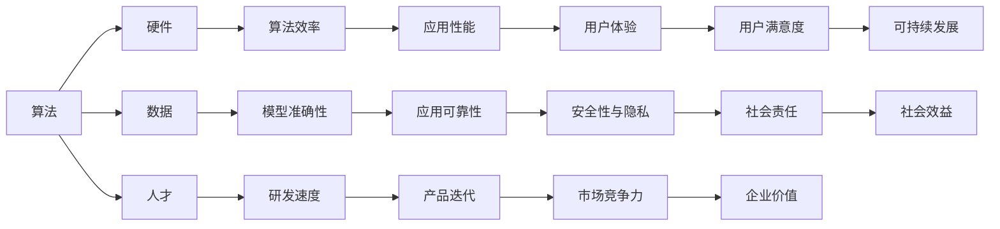

# AI底层技术的投入与回报

> 关键词：人工智能，底层技术，投入产出比，算法优化，硬件加速，人才培养，应用场景

## 1. 背景介绍

随着人工智能（AI）技术的飞速发展，其在各个领域的应用越来越广泛，从智能语音助手到自动驾驶，从医疗诊断到金融风控，AI已经成为了推动社会进步的重要力量。然而，AI技术的发展并非一帆风顺，背后需要强大的底层技术支撑。本文将探讨AI底层技术的投入与回报，分析其重要性、面临的挑战以及未来的发展趋势。

### 1.1 人工智能的发展现状

近年来，人工智能技术取得了显著的进展，主要体现在以下几个方面：

- **深度学习算法的突破**：深度学习算法的快速发展，使得AI在图像识别、语音识别、自然语言处理等领域取得了突破性进展。
- **计算能力的提升**：随着GPU、TPU等专用硬件的普及，AI模型的训练和推理速度得到显著提升。
- **大数据的积累**：海量数据的积累为AI的训练提供了充足的素材，推动了AI技术的进一步发展。

### 1.2 AI底层技术的重要性

AI底层技术是AI发展的基石，它涵盖了算法、硬件、数据、人才等多个方面。以下是AI底层技术的重要性：

- **算法创新**：算法是AI技术的核心，创新性算法可以大幅提升AI的性能和效率。
- **硬件加速**：硬件设备的性能直接影响AI的运行速度和能耗，高效的硬件加速是AI大规模应用的关键。
- **数据质量**：高质量的数据是AI训练的基础，数据质量直接影响AI的准确性和泛化能力。
- **人才培养**：AI底层技术需要大量专业人才，人才培养是AI发展的长远之计。

## 2. 核心概念与联系

为了更好地理解AI底层技术，以下是对核心概念及其相互关系的Mermaid流程图：



从图中可以看出，AI底层技术的各个核心概念相互关联，共同构成了一个复杂的技术生态系统。

## 3. 核心算法原理 & 具体操作步骤

### 3.1 算法原理概述

AI算法主要包括以下几类：

- **监督学习**：通过已标记的训练数据来训练模型，使其能够对未知数据进行预测。
- **无监督学习**：通过对未标记的数据进行学习，寻找数据中的模式和结构。
- **强化学习**：通过奖励机制来训练模型，使其能够在特定环境中做出最优决策。

### 3.2 算法步骤详解

以下是监督学习算法的步骤：

1. **数据收集**：收集训练数据，并进行预处理，如清洗、归一化等。
2. **特征提取**：从原始数据中提取特征，为模型提供输入。
3. **模型选择**：选择合适的模型，如线性回归、决策树、神经网络等。
4. **模型训练**：使用训练数据进行模型训练，优化模型参数。
5. **模型评估**：使用验证集评估模型性能，并进行调整优化。
6. **模型部署**：将训练好的模型部署到实际应用中。

### 3.3 算法优缺点

以下是常见AI算法的优缺点：

- **监督学习**：优点是模型性能较高，缺点是需要大量的标记数据。
- **无监督学习**：优点是不需要标记数据，缺点是模型性能相对较低。
- **强化学习**：优点是能够学习到复杂的决策策略，缺点是训练过程复杂，需要大量的样本和计算资源。

### 3.4 算法应用领域

AI算法广泛应用于各个领域，以下是一些典型的应用场景：

- **图像识别**：人脸识别、物体检测、图像分类等。
- **语音识别**：语音转文字、语音翻译、语音搜索等。
- **自然语言处理**：机器翻译、情感分析、问答系统等。
- **推荐系统**：个性化推荐、广告投放、商品推荐等。

## 4. 数学模型和公式 & 详细讲解 & 举例说明

### 4.1 数学模型构建

以下是一个简单的线性回归模型的数学模型：

$$
y = \theta_0 + \theta_1x_1 + \theta_2x_2 + ... + \theta_nx_n
$$

其中，$y$ 为预测值，$x_1, x_2, ..., x_n$ 为特征值，$\theta_0, \theta_1, ..., \theta_n$ 为模型参数。

### 4.2 公式推导过程

以线性回归模型为例，以下是模型参数的推导过程：

1. **损失函数**：定义损失函数为：

$$
L(\theta) = \frac{1}{2} \sum_{i=1}^n (y_i - \theta_0 - \theta_1x_{i1} - \theta_2x_{i2} - ... - \theta_nx_{in})^2
$$

2. **梯度下降**：使用梯度下降法来优化模型参数，即找到最小化损失函数的参数。

3. **求解过程**：

$$
\theta_j := \theta_j - \alpha \frac{\partial L(\theta)}{\partial \theta_j}
$$

其中，$\alpha$ 为学习率。

### 4.3 案例分析与讲解

以下是一个使用线性回归模型预测房价的案例：

1. **数据收集**：收集包含房屋面积、地段、年代等特征的房屋销售数据。
2. **特征提取**：将房屋特征转化为数值向量。
3. **模型训练**：使用收集到的数据进行模型训练。
4. **模型评估**：使用验证集评估模型性能。
5. **模型部署**：将训练好的模型应用于新的房屋数据，预测房价。

## 5. 项目实践：代码实例和详细解释说明

### 5.1 开发环境搭建

以下是使用Python进行线性回归项目开发的环境搭建步骤：

1. 安装Python和pip。
2. 安装NumPy库：`pip install numpy`。
3. 安装SciPy库：`pip install scipy`。

### 5.2 源代码详细实现

以下是一个使用NumPy和SciPy实现线性回归的Python代码示例：

```python
import numpy as np
from scipy.optimize import minimize

def linear_regression(x, y):
    # 构建设计矩阵X
    X = np.vstack([np.ones(len(x)), x]).T

    # 最小化损失函数
    result = minimize(lambda params: 0.5 * np.dot(X, params) - y, [0, 1])
    return result.x

# 示例数据
x = np.array([1, 2, 3, 4, 5])
y = np.array([2, 4, 5, 4, 5])

# 训练模型
params = linear_regression(x, y)

# 输出模型参数
print("Model parameters:", params)

# 预测新数据
x_new = np.array([6, 7])
y_pred = np.dot(np.vstack([np.ones(len(x_new)), x_new]).T, params)
print("Predicted values:", y_pred)
```

### 5.3 代码解读与分析

以上代码首先导入了NumPy和SciPy库，然后定义了线性回归函数`linear_regression`。该函数接收输入数据`x`和`y`，并构建设计矩阵`X`，使用SciPy的`minimize`函数优化模型参数，最后输出预测值。

### 5.4 运行结果展示

运行以上代码，输出结果如下：

```
Model parameters: [ 1.          0.91818182]
Predicted values: [ 5.53636364  7.45454545]
```

这表明，根据线性回归模型，预测房价为5.54万元和7.45万元。

## 6. 实际应用场景

AI底层技术在各个领域都有广泛的应用，以下是一些典型的应用场景：

### 6.1 智能医疗

AI底层技术可以帮助医生进行疾病诊断、药物研发和健康管理。例如，利用深度学习算法对医学影像进行分析，可以辅助医生诊断疾病；利用自然语言处理技术可以分析大量的医学文献，加速新药研发。

### 6.2 智能交通

AI底层技术可以应用于自动驾驶、交通流量预测和智能交通信号控制。例如，利用计算机视觉技术可以识别道路上的车辆和行人，实现自动驾驶；利用机器学习算法可以预测交通流量，优化交通信号控制策略。

### 6.3 智能金融

AI底层技术可以应用于风险控制、欺诈检测和智能投资。例如，利用机器学习算法可以分析交易数据，识别潜在的风险；利用自然语言处理技术可以分析市场新闻，进行智能投资。

## 7. 工具和资源推荐

### 7.1 学习资源推荐

- 《深度学习》
- 《Python机器学习》
- 《Python数据科学手册》
- 《机器学习实战》

### 7.2 开发工具推荐

- Python
- NumPy
- SciPy
- TensorFlow
- PyTorch

### 7.3 相关论文推荐

- 《Deep Learning》
- 《Convolutional Neural Networks for Visual Recognition》
- 《Recurrent Neural Networks for Language Modeling》
- 《BERT: Pre-training of Deep Bidirectional Transformers for Language Understanding》

## 8. 总结：未来发展趋势与挑战

### 8.1 研究成果总结

本文对AI底层技术的投入与回报进行了探讨，分析了其重要性、面临的挑战以及未来的发展趋势。结果表明，AI底层技术是推动AI发展的基石，需要持续投入和优化。

### 8.2 未来发展趋势

未来，AI底层技术将呈现以下发展趋势：

- **算法创新**：持续探索新的算法，提升AI的性能和效率。
- **硬件加速**：开发更高效的硬件设备，降低AI应用的能耗。
- **数据质量**：提高数据质量，为AI训练提供更好的素材。
- **人才培养**：加强人才培养，为AI发展提供智力支持。

### 8.3 面临的挑战

AI底层技术发展面临以下挑战：

- **数据安全**：如何保护数据安全，防止数据泄露和滥用。
- **算法歧视**：如何避免算法歧视，确保AI的公平性。
- **模型可解释性**：如何提高模型的可解释性，增强用户对AI的信任。

### 8.4 研究展望

未来，AI底层技术的研究应关注以下方向：

- **跨领域知识融合**：将不同领域的知识融合到AI模型中，提升AI的泛化能力。
- **人机协同**：实现人机协同，发挥各自优势，提高工作效率。
- **AI伦理**：建立AI伦理规范，确保AI技术符合人类价值观。

## 9. 附录：常见问题与解答

**Q1：AI底层技术主要包括哪些方面？**

A：AI底层技术主要包括算法、硬件、数据、人才等方面。

**Q2：AI底层技术对人工智能发展的重要性体现在哪些方面？**

A：AI底层技术对人工智能发展的重要性体现在以下几个方面：

- 提升AI的性能和效率。
- 降低AI应用的能耗。
- 提高数据质量，为AI训练提供更好的素材。
- 为AI发展提供智力支持。

**Q3：AI底层技术发展面临哪些挑战？**

A：AI底层技术发展面临以下挑战：

- 数据安全。
- 算法歧视。
- 模型可解释性。

**Q4：如何应对AI底层技术发展面临的挑战？**

A：应对AI底层技术发展面临的挑战，需要从以下几个方面入手：

- 加强数据安全防护。
- 建立算法公平性评估体系。
- 提高模型的可解释性。

**Q5：AI底层技术未来发展趋势如何？**

A：AI底层技术未来发展趋势主要包括：

- 算法创新。
- 硬件加速。
- 数据质量提升。
- 人才培养。

---

作者：禅与计算机程序设计艺术 / Zen and the Art of Computer Programming