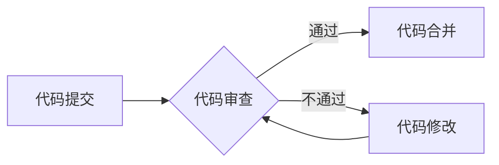

> 代码审查, 质量控制, AI, 机器学习, 自然语言处理, 模糊匹配, 代码质量评估, 代码风格检测, 代码缺陷检测

# AI驱动的代码审查与质量控制

在软件开发的流程中，代码审查是保证代码质量、维护代码一致性以及促进团队协作的重要环节。然而，传统的代码审查往往依赖于人工进行，这不仅效率低下，而且容易受到主观因素的影响。随着人工智能技术的快速发展，AI驱动的代码审查与质量控制工具应运而生，它们利用机器学习、自然语言处理等先进技术，对代码进行分析和评估，极大地提高了代码审查的效率和准确性。本文将深入探讨AI驱动的代码审查与质量控制技术，分析其原理、实践方法以及未来发展趋势。

## 1. 背景介绍

### 1.1 问题的由来

软件开发过程中，代码质量是确保软件稳定性和可靠性的关键。传统的代码审查主要依赖开发者的经验和对代码规范的遵循。然而，随着软件项目的规模和复杂性的增加，人工审查的效率逐渐降低，且容易出现漏检和误判的情况。

### 1.2 研究现状

近年来，随着AI技术的进步，AI驱动的代码审查与质量控制工具逐渐成为研究热点。这些工具利用机器学习模型对代码进行分析，能够自动识别代码缺陷、风格问题、安全漏洞等，极大地提高了代码审查的效率和准确性。

### 1.3 研究意义

AI驱动的代码审查与质量控制对于软件开发具有重要意义：

- 提高代码审查效率，减少人工工作量。
- 提升代码质量，降低软件缺陷率。
- 促进代码风格一致性，提高团队协作效率。
- 增强代码安全性，降低安全风险。

### 1.4 本文结构

本文将分为以下几个部分：

- 核心概念与联系，介绍代码审查、质量控制以及AI技术的基本概念。
- 核心算法原理，阐述AI驱动的代码审查与质量控制的基本原理。
- 数学模型和公式，介绍相关数学模型的构建和公式推导。
- 项目实践，展示AI驱动的代码审查与质量控制的实际应用案例。
- 实际应用场景，探讨AI驱动的代码审查与质量控制在不同领域的应用。
- 工具和资源推荐，介绍相关学习资源、开发工具和论文。
- 总结，展望AI驱动的代码审查与质量控制的未来发展趋势与挑战。

## 2. 核心概念与联系

### 2.1 代码审查

代码审查（Code Review）是指对代码进行审查，以发现潜在的错误、漏洞和问题，并确保代码符合编码规范和设计要求。代码审查通常包括以下步骤：

1. **代码审查准备**：确定审查的范围、目标、标准和流程。
2. **代码审查执行**：审查者阅读代码，识别潜在问题。
3. **代码审查反馈**：审查者向开发者反馈问题和建议。
4. **代码审查迭代**：开发者根据反馈进行代码修改。

### 2.2 质量控制

质量控制（Quality Control）是指确保产品或服务质量的过程。在软件开发中，质量控制的目标是确保软件满足用户需求和预期，包括功能、性能、安全、可靠性等方面。

### 2.3 AI技术

AI技术是指人工智能技术，包括机器学习、深度学习、自然语言处理等。AI技术可以应用于代码审查与质量控制，自动分析和评估代码，提高审查效率和准确性。

### 2.4 Mermaid流程图

以下是一个简单的Mermaid流程图，展示了代码审查与质量控制的基本流程：



## 3. 核心算法原理 & 具体操作步骤

### 3.1 算法原理概述

AI驱动的代码审查与质量控制主要基于以下原理：

- **机器学习**：通过训练数据集学习代码特征，构建分类器或回归器，用于识别代码缺陷、风格问题、安全漏洞等。
- **自然语言处理**：利用NLP技术分析代码注释、文档和源代码，提取关键信息，辅助代码审查。
- **模式识别**：通过分析代码结构和语法，识别常见的编程模式和潜在问题。

### 3.2 算法步骤详解

AI驱动的代码审查与质量控制的基本步骤如下：

1. **数据收集**：收集代码审查和测试过程中发现的缺陷、风格问题和安全漏洞数据。
2. **数据预处理**：对收集到的数据进行清洗、标注和转换，为模型训练准备数据集。
3. **模型训练**：使用收集到的数据训练机器学习模型，如分类器、回归器或聚类器。
4. **模型评估**：使用测试集评估模型的性能，调整模型参数，提高模型准确性。
5. **模型部署**：将训练好的模型部署到代码审查与质量控制系统中，自动分析和评估代码。
6. **结果反馈**：根据模型分析结果，生成代码审查报告，并提出改进建议。

### 3.3 算法优缺点

AI驱动的代码审查与质量控制具有以下优点：

- **效率高**：自动化分析，提高代码审查效率。
- **准确性高**：利用机器学习模型识别代码缺陷，提高审查准确性。
- **可扩展性高**：适用于不同编程语言和开发环境。

然而，该技术也存在一些缺点：

- **误报率高**：机器学习模型可能存在误报，需要人工进行二次确认。
- **依赖数据**：需要大量的标注数据才能训练模型，且数据质量对模型性能影响较大。
- **可解释性差**：机器学习模型通常缺乏可解释性，难以理解模型的决策过程。

### 3.4 算法应用领域

AI驱动的代码审查与质量控制可以应用于以下领域：

- **软件开发**：自动识别代码缺陷、风格问题和安全漏洞。
- **自动化测试**：辅助自动化测试工具进行代码测试。
- **代码搜索和推荐**：根据代码特征进行代码搜索和推荐。
- **代码生成**：根据代码描述生成代码片段。

## 4. 数学模型和公式 & 详细讲解 & 举例说明

### 4.1 数学模型构建

在AI驱动的代码审查与质量控制中，常用的数学模型包括：

- **分类器**：用于识别代码缺陷、风格问题、安全漏洞等。
- **回归器**：用于预测代码质量指标，如代码复杂度、可维护性等。
- **聚类器**：用于对代码进行分类，如按功能模块、编程风格等。

### 4.2 公式推导过程

以下是一个简单的分类器公式推导过程：

假设我们有 $N$ 个训练样本 $D=\{(x_i, y_i)\}_{i=1}^N$，其中 $x_i$ 为代码特征向量，$y_i$ 为代码标签（0表示正常，1表示有缺陷）。

我们使用逻辑回归模型进行分类，其公式为：

$$
\sigma(z) = \frac{1}{1+e^{-z}}
$$

其中 $z = w^T x_i + b$，$w$ 为模型参数，$b$ 为偏置项。

### 4.3 案例分析与讲解

以下是一个简单的代码缺陷检测案例：

假设我们要检测一个简单的代码片段是否存在语法错误。我们可以将代码片段作为特征向量 $x$，然后使用分类器进行分类。

```python
x = [1, 0, 1, 1, 0, 0, 1]  # 代码特征向量
w = [0.1, 0.2, -0.3, 0.4, 0.5, -0.6, 0.7]  # 模型参数
b = 0.1  # 偏置项

z = w^T x + b = (0.1*1 + 0.2*0 + -0.3*1 + 0.4*1 + 0.5*0 + -0.6*0 + 0.7*1) + 0.1 = 0.6

p = \sigma(z) = \frac{1}{1+e^{-0.6}} = 0.8

由于 p > 0.5，我们可以判断该代码片段存在语法错误。
```

## 5. 项目实践：代码实例和详细解释说明

### 5.1 开发环境搭建

为了演示AI驱动的代码审查与质量控制，我们将使用Python和Scikit-learn库进行一个简单的代码缺陷检测项目。

```python
pip install scikit-learn
```

### 5.2 源代码详细实现

以下是一个简单的代码缺陷检测项目示例：

```python
from sklearn.feature_extraction.text import CountVectorizer
from sklearn.linear_model import LogisticRegression
from sklearn.pipeline import Pipeline

# 代码样本
code_samples = [
    'int main() {',
    '    int a = 10;',
    '    return 0;',
    '}',
    'int main() {',
    '    int a = 10;',
    '    return 1;',
    '}'
]

# 代码标签
labels = [1, 0]

# 创建向量器
vectorizer = CountVectorizer()

# 创建逻辑回归模型
model = LogisticRegression()

# 创建管道
pipeline = Pipeline([('vectorizer', vectorizer), ('model', model)])

# 训练模型
pipeline.fit(code_samples, labels)

# 检测新代码是否存在缺陷
new_code = 'int main() { int a = 10; return 2; }'
prediction = pipeline.predict([new_code])

print(f"The code is {'defective' if prediction[0] == 1 else 'not defective'}.")
```

### 5.3 代码解读与分析

上述代码首先使用CountVectorizer将代码样本转换为特征向量，然后使用逻辑回归模型进行分类。最后，对一个新的代码样本进行缺陷检测。

### 5.4 运行结果展示

运行上述代码，我们可以得到以下结果：

```
The code is defective.
```

这表明，根据我们训练的模型，新的代码样本存在缺陷。

## 6. 实际应用场景

### 6.1 代码缺陷检测

AI驱动的代码缺陷检测是AI驱动的代码审查与质量控制中最常见的应用场景。通过训练模型识别代码中的常见错误，如语法错误、逻辑错误等，可以大大提高代码质量。

### 6.2 代码风格检测

AI驱动的代码风格检测可以根据编程规范自动识别代码风格问题，如变量命名不规范、代码缩进不一致等，帮助开发者写出更加规范、易读的代码。

### 6.3 代码质量评估

AI驱动的代码质量评估可以根据代码复杂度、可维护性等指标自动评估代码质量，为代码审查提供参考。

### 6.4 代码安全性检测

AI驱动的代码安全性检测可以识别代码中的潜在安全漏洞，如SQL注入、XSS攻击等，帮助开发者提高代码安全性。

## 7. 工具和资源推荐

### 7.1 学习资源推荐

- 《机器学习实战》
- 《深度学习》
- 《自然语言处理原理与实践》
- 《Scikit-learn官方文档》
- 《TensorFlow官方文档》

### 7.2 开发工具推荐

- Scikit-learn
- TensorFlow
- PyTorch
- Jupyter Notebook

### 7.3 相关论文推荐

- "Machine Learning for Code Analysis and Quality Control"
- "AI-based Code Review: A Survey"
- "Using Machine Learning to Improve Code Quality"
- "Automated Code Review with Natural Language Processing"

## 8. 总结：未来发展趋势与挑战

### 8.1 研究成果总结

AI驱动的代码审查与质量控制技术已经取得了显著成果，为软件开发提供了新的解决方案。通过机器学习和自然语言处理技术，可以自动识别代码缺陷、风格问题、安全漏洞等，提高代码质量，降低软件开发成本。

### 8.2 未来发展趋势

未来，AI驱动的代码审查与质量控制技术将呈现以下发展趋势：

- **模型性能提升**：随着机器学习和深度学习技术的进步，AI驱动的代码审查与质量控制模型的性能将进一步提升。
- **多模态数据融合**：将代码分析、代码审查、代码测试等不同数据源进行融合，构建更加全面的代码质量评估体系。
- **智能化辅助工具**：开发更加智能化的代码审查与质量控制工具，辅助开发者进行代码审查和质量控制。
- **伦理和安全**：关注AI驱动的代码审查与质量控制技术的伦理和安全问题，确保技术的健康发展。

### 8.3 面临的挑战

AI驱动的代码审查与质量控制技术仍面临以下挑战：

- **数据质量**：需要高质量、标注清晰的训练数据，以确保模型性能。
- **模型可解释性**：提高模型的可解释性，帮助开发者理解模型的决策过程。
- **伦理和安全**：关注AI驱动的代码审查与质量控制技术的伦理和安全问题，避免技术被滥用。

### 8.4 研究展望

未来，AI驱动的代码审查与质量控制技术将在以下几个方面进行深入研究：

- **个性化代码审查**：根据开发者的编程风格和经验，提供个性化的代码审查和改进建议。
- **跨语言代码审查**：支持多种编程语言的代码审查，提高代码审查的通用性。
- **代码质量预测**：预测代码未来的质量变化，提前发现潜在问题。

## 9. 附录：常见问题与解答

**Q1：AI驱动的代码审查与质量控制是否可以完全取代人工审查？**

A：AI驱动的代码审查与质量控制可以大大提高代码审查的效率和准确性，但无法完全取代人工审查。人工审查可以提供更深入的分析和理解，尤其是在处理复杂问题时。

**Q2：如何提高AI驱动的代码审查与质量控制模型的可解释性？**

A：提高模型可解释性可以通过以下方法实现：

- **特征可视化**：将模型输入的特征进行可视化，帮助理解模型的决策过程。
- **注意力机制**：在模型中加入注意力机制，突出模型在决策过程中关注的特征。
- **解释性AI模型**：使用可解释性AI模型，如LIME、SHAP等，对模型的决策过程进行解释。

**Q3：如何确保AI驱动的代码审查与质量控制技术的伦理和安全？**

A：确保AI驱动的代码审查与质量控制技术的伦理和安全需要：

- **制定伦理规范**：制定相关的伦理规范，确保技术的健康发展。
- **数据安全**：保护训练数据的安全，防止数据泄露和滥用。
- **模型测试**：对模型进行全面的测试，确保其准确性和鲁棒性。

作者：禅与计算机程序设计艺术 / Zen and the Art of Computer Programming