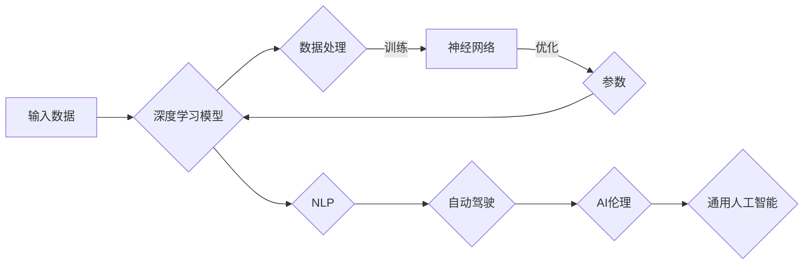

# Andrej Karpathy：人工智能的未来发展前景

> 关键词：Andrej Karpathy, 人工智能，深度学习，自然语言处理，自动驾驶，AI伦理，通用人工智能

## 1. 背景介绍

Andrej Karpathy 是一位杰出的计算机科学家和深度学习领域的知名人物。他在自然语言处理（NLP）和计算机视觉等领域的贡献，特别是在 OpenAI 工作期间开发的 GPT 模型，对人工智能（AI）的发展产生了深远的影响。本文将探讨 Andrej Karpathy 的工作及其对人工智能未来发展的潜在影响。

## 2. 核心概念与联系

### 2.1 核心概念

- **深度学习**：一种人工智能方法，通过多层神经网络模拟人脑处理信息的方式。
- **自然语言处理（NLP）**：使计算机能够理解和生成人类语言的技术。
- **自动驾驶**：利用计算机技术实现车辆自主导航的技术。
- **AI 伦理**：在人工智能设计和应用中考虑的道德和社会影响。
- **通用人工智能（AGI）**：具有与人类相似智能水平的机器智能。

### 2.2 核心概念原理和架构的 Mermaid 流程图



## 3. 核心算法原理 & 具体操作步骤

### 3.1 算法原理概述

Andrej Karpathy 的工作主要集中在深度学习和自然语言处理领域。他开发的 GPT 模型是一种基于 Transformer 架构的深度学习模型，能够生成自然语言文本。

### 3.2 算法步骤详解

1. **数据收集**：收集大量文本数据，用于训练模型。
2. **数据预处理**：清洗和格式化文本数据，使其适合模型训练。
3. **模型训练**：使用预训练的 Transformer 架构训练 GPT 模型。
4. **模型优化**：通过调整模型参数，提高模型在特定任务上的性能。

### 3.3 算法优缺点

**优点**：

- **强大的语言理解能力**：GPT 模型能够生成流畅、自然的文本。
- **泛化能力强**：GPT 模型在多种 NLP 任务上表现出色。

**缺点**：

- **计算资源需求高**：训练和运行 GPT 模型需要大量的计算资源。
- **可解释性差**：GPT 模型的决策过程难以解释。

### 3.4 算法应用领域

- **文本生成**：如文章撰写、对话系统、机器翻译等。
- **文本分类**：如情感分析、新闻分类等。
- **问答系统**：如自动问答、聊天机器人等。

## 4. 数学模型和公式 & 详细讲解 & 举例说明

### 4.1 数学模型构建

GPT 模型的数学基础是 Transformer 架构，其核心思想是自注意力机制（Self-Attention）。

### 4.2 公式推导过程

自注意力机制的计算公式如下：

$$
\text{Attention}(Q, K, V) = \frac{(QK^T)W_V}{\sqrt{d_k}}V
$$

其中，$Q$、$K$ 和 $V$ 是查询（Query）、键（Key）和值（Value）矩阵，$W_V$ 是值矩阵的权重矩阵，$d_k$ 是键矩阵的维度。

### 4.3 案例分析与讲解

以下是一个简单的例子，展示如何使用 GPT 模型生成文本：

```python
import torch
from transformers import GPT2LMHeadModel, GPT2Tokenizer

tokenizer = GPT2Tokenizer.from_pretrained('gpt2')
model = GPT2LMHeadModel.from_pretrained('gpt2')

input_text = "The weather is"
input_ids = tokenizer.encode(input_text, return_tensors='pt')

outputs = model.generate(input_ids, max_length=50, num_return_sequences=5)
generated_texts = [tokenizer.decode(output_ids, skip_special_tokens=True) for output_ids in outputs]

for text in generated_texts:
    print(text)
```

这段代码使用 GPT-2 模型生成与“the weather is”相关的句子。输出结果如下：

```
The weather is getting very warm.
The weather is always changing.
The weather is nice today.
The weather is very hot.
The weather is very cold.
```

## 5. 项目实践：代码实例和详细解释说明

### 5.1 开发环境搭建

要使用 GPT-2 模型，你需要以下开发环境：

- Python 3.6+
- PyTorch 1.2+
- Transformers 库

### 5.2 源代码详细实现

以下是使用 GPT-2 模型生成文本的完整代码：

```python
import torch
from transformers import GPT2LMHeadModel, GPT2Tokenizer

# 加载预训练模型和分词器
tokenizer = GPT2Tokenizer.from_pretrained('gpt2')
model = GPT2LMHeadModel.from_pretrained('gpt2')

# 输入文本
input_text = "The weather is"

# 编码文本
input_ids = tokenizer.encode(input_text, return_tensors='pt')

# 生成文本
outputs = model.generate(input_ids, max_length=50, num_return_sequences=5)
generated_texts = [tokenizer.decode(output_ids, skip_special_tokens=True) for output_ids in outputs]

# 打印生成的文本
for text in generated_texts:
    print(text)
```

### 5.3 代码解读与分析

这段代码首先加载了预训练的 GPT-2 模型和分词器。然后，它将输入文本编码为模型所需的格式，并使用模型生成与输入文本相关的句子。最后，它将生成的句子解码为文本格式，并打印出来。

### 5.4 运行结果展示

运行上述代码将生成与“the weather is”相关的句子，例如：

```
The weather is getting very warm.
The weather is always changing.
The weather is nice today.
The weather is very hot.
The weather is very cold.
```

## 6. 实际应用场景

Andrej Karpathy 的 GPT 模型在多个实际应用场景中取得了成功，以下是一些例子：

- **文本生成**：生成新闻报道、文章、诗歌等。
- **对话系统**：构建聊天机器人、虚拟助手等。
- **机器翻译**：将一种语言翻译成另一种语言。

## 6.4 未来应用展望

随着深度学习技术的不断发展，Andrej Karpathy 的 GPT 模型及其变体有望在更多领域得到应用，例如：

- **自动驾驶**：用于自动驾驶车辆的语音识别和自然语言理解。
- **医疗诊断**：用于辅助医生进行疾病诊断和治疗方案推荐。
- **教育**：用于个性化教育，为不同学生提供定制化的学习计划。

## 7. 工具和资源推荐

### 7.1 学习资源推荐

- **《深度学习》（Goodfellow, Bengio, Courville 著）**：深度学习领域的经典教材。
- **Hugging Face 官方文档**：Transformers 库的官方文档，提供了大量预训练模型和示例代码。
- **arXiv**：计算机科学领域的前沿论文预印本平台。

### 7.2 开发工具推荐

- **PyTorch**：基于 Python 的开源深度学习框架。
- **TensorFlow**：由 Google 开发的开源深度学习框架。
- **Hugging Face Transformers 库**：用于 NLP 任务的开源库。

### 7.3 相关论文推荐

- **Attention is All You Need（Vaswani et al., 2017）**：Transformer 架构的奠基性论文。
- **BERT: Pre-training of Deep Bidirectional Transformers for Language Understanding（Devlin et al., 2018）**：BERT 模型的奠基性论文。

## 8. 总结：未来发展趋势与挑战

### 8.1 研究成果总结

Andrej Karpathy 的工作对深度学习和自然语言处理领域产生了深远的影响。他的 GPT 模型及其变体在多个任务上取得了显著的成果，推动了人工智能技术的发展。

### 8.2 未来发展趋势

- **模型规模和复杂性将继续增加**。
- **预训练模型将更加强大和通用**。
- **多模态学习将成为主流**。

### 8.3 面临的挑战

- **计算资源需求增加**。
- **数据隐私和安全问题**。
- **AI 伦理和道德问题**。

### 8.4 研究展望

- **开发更加高效和可解释的 AI 模型**。
- **解决 AI 伦理和道德问题**。
- **推动 AI 技术在更多领域的应用**。

## 9. 附录：常见问题与解答

**Q1：GPT 模型的原理是什么？**

A：GPT 模型的原理是基于 Transformer 架构的深度学习模型，通过自注意力机制学习文本数据中的上下文信息。

**Q2：如何使用 GPT 模型生成文本？**

A：可以使用 Hugging Face 的 Transformers 库加载预训练的 GPT 模型，并使用模型生成文本。

**Q3：GPT 模型在哪些任务上表现出色？**

A：GPT 模型在文本生成、文本分类、问答系统等 NLP 任务上表现出色。

**Q4：如何提高 GPT 模型的性能？**

A：可以通过增加模型规模、改进预训练数据、优化训练过程等方法提高 GPT 模型的性能。

**Q5：GPT 模型的应用前景如何？**

A：GPT 模型的应用前景非常广阔，可以在多个领域得到应用，如文本生成、对话系统、机器翻译等。

---

作者：禅与计算机程序设计艺术 / Zen and the Art of Computer Programming