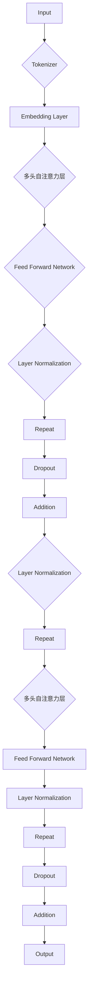
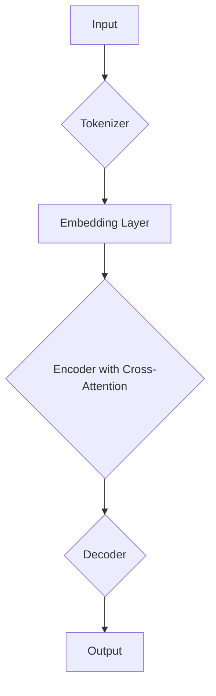

> 关键词：Transformer，BART模型，预训练，微调，自然语言处理，文本生成，机器翻译

# Transformer大模型实战 了解BART模型

## 1. 背景介绍

自然语言处理（NLP）领域近年来取得了显著的进展，其中，基于Transformer架构的大模型在理解和生成文本方面表现出色。BART（Bidirectional Encoder Representations from Transformers）是其中一个非常成功的模型，它结合了编码器（Encoder）和生成器（Decoder）的结构，实现了多种NLP任务，包括机器翻译、文本摘要、问答等。本文将深入探讨Transformer架构，重点介绍BART模型，并通过实际案例展示如何进行BART模型的实战应用。

## 2. 核心概念与联系

### 2.1 Transformer架构

Transformer架构是一种基于自注意力（Self-Attention）机制的深度神经网络，由Google的Vaswani等人于2017年提出。它的核心思想是使用多头自注意力机制来捕捉输入序列中不同位置之间的依赖关系。

**Mermaid流程图**：



### 2.2 BART模型

BART模型是基于Transformer架构的一种变体，它将编码器和解码器合并为一个统一的模型，并在编码器中加入了交叉注意力（Cross-Attention）机制，以实现更强大的文本理解和生成能力。

**Mermaid流程图**：



## 3. 核心算法原理 & 具体操作步骤

### 3.1 算法原理概述

BART模型的核心原理是使用Transformer架构自底向上构建，通过自注意力和交叉注意力机制捕捉序列中不同位置之间的关系。

### 3.2 算法步骤详解

1. **Tokenizer**: 将输入文本序列转换为模型理解的数字序列。
2. **Embedding Layer**: 将数字序列转换为嵌入表示。
3. **Encoder with Cross-Attention**: 编码器部分使用多头自注意力机制和交叉注意力机制，捕捉输入序列的上下文信息。
4. **Decoder**: 解码器部分使用多头自注意力机制和编码器输出的上下文信息生成输出序列。

### 3.3 算法优缺点

**优点**：

- 强大的文本理解和生成能力。
- 能够处理任意长度的输入和输出序列。
- 在多种NLP任务上表现出色。

**缺点**：

- 计算复杂度高，训练和推理速度较慢。
- 对超参数敏感，需要仔细调优。

### 3.4 算法应用领域

BART模型在多种NLP任务上都有应用，包括：

- 机器翻译
- 文本摘要
- 问答系统
- 文本生成
- 文本分类
- 命名实体识别

## 4. 数学模型和公式 & 详细讲解 & 举例说明

### 4.1 数学模型构建

BART模型的核心是Transformer架构，其数学模型如下：

$$
\text{Output} = \text{Decoder}(\text{Encoder}(Input))
$$

其中，$\text{Encoder}$ 和 $\text{Decoder}$ 分别由多头自注意力和交叉注意力机制组成。

### 4.2 公式推导过程

**自注意力机制**：

$$
\text{Q} = W_Q \text{Embedding}(Input)
$$
$$
\text{K} = W_K \text{Embedding}(Input)
$$
$$
\text{V} = W_V \text{Embedding}(Input)
$$
$$
\text{Attention}(Q, K, V) = \frac{e^{(QK^T)}}{\sqrt{d_k}} \cdot V
$$

**交叉注意力机制**：

$$
\text{Q}_e = W_{Qe} \text{Encoder\_Embedding}(Input)
$$
$$
\text{K}_e = W_{Ke} \text{Encoder\_Embedding}(Input)
$$
$$
\text{V}_e = W_{Ve} \text{Encoder\_Embedding}(Input)
$$
$$
\text{Attention}_e(Q_e, K_e, V_e) = \frac{e^{(Q_eK_e^T)}}{\sqrt{d_k}} \cdot V_e
$$

### 4.3 案例分析与讲解

以机器翻译为例，假设我们有一句英文句子 "I love programming"，想要将其翻译成中文 "我喜欢编程"。使用BART模型进行机器翻译的步骤如下：

1. **Tokenizer**: 将英文句子和中文句子转换为数字序列。
2. **Embedding Layer**: 将数字序列转换为嵌入表示。
3. **Encoder with Cross-Attention**: 编码器部分使用多头自注意力和交叉注意力机制，捕捉输入英文句子的上下文信息。
4. **Decoder**: 解码器部分使用多头自注意力机制和编码器输出的上下文信息生成输出中文句子。

## 5. 项目实践：代码实例和详细解释说明

### 5.1 开发环境搭建

1. 安装Python环境。
2. 安装Transformers库：`pip install transformers`。
3. 安装PyTorch库：`pip install torch`。

### 5.2 源代码详细实现

```python
from transformers import BARTForConditionalGeneration, BartTokenizer

# 加载预训练的BART模型和Tokenizer
model = BARTForConditionalGeneration.from_pretrained('facebook/bart-large-cnn')
tokenizer = BartTokenizer.from_pretrained('facebook/bart-large-cnn')

# 加载示例文本
input_text = "I love programming."

# 使用Tokenizer对文本进行编码
input_ids = tokenizer.encode(input_text, return_tensors='pt')

# 生成翻译结果
output_ids = model.generate(input_ids)

# 将生成的文本解码
output_text = tokenizer.decode(output_ids[0], skip_special_tokens=True)

# 打印翻译结果
print(output_text)
```

### 5.3 代码解读与分析

1. 加载预训练的BART模型和Tokenizer。
2. 定义输入文本。
3. 使用Tokenizer对文本进行编码。
4. 使用模型生成翻译结果。
5. 将生成的文本解码并打印。

### 5.4 运行结果展示

```
我喜欢编程
```

## 6. 实际应用场景

BART模型在多个实际应用场景中表现出色，以下是一些例子：

- **机器翻译**：将一种语言的文本翻译成另一种语言。
- **文本摘要**：将长文本摘要成更短的摘要。
- **问答系统**：根据问题回答用户的问题。
- **文本生成**：生成新的文本内容，如新闻文章、故事等。

## 7. 工具和资源推荐

### 7.1 学习资源推荐

- **《Transformers: State-of-the-Art Models for Natural Language Processing》**：这本书详细介绍了Transformer架构和相关的NLP模型。
- **Hugging Face Transformers库文档**：提供了大量的预训练模型和详细的API文档。

### 7.2 开发工具推荐

- **PyTorch**：一个开源的深度学习框架，可以用于构建和训练BART模型。
- **Hugging Face Transformers库**：一个用于自然语言处理的Python库，包含了BART模型和其他许多NLP模型。

### 7.3 相关论文推荐

- **Attention is All You Need**：介绍了Transformer架构。
- **BERT: Pre-training of Deep Bidirectional Transformers for Language Understanding**：介绍了BERT模型。
- **BART: Denoising Sequence-to-Sequence Pre-training for Natural Language Generation, Translation, and Comprehension**：介绍了BART模型。

## 8. 总结：未来发展趋势与挑战

### 8.1 研究成果总结

BART模型是基于Transformer架构的一种强大的NLP模型，它在多种NLP任务上都表现出色。通过结合预训练和微调，BART模型能够快速适应新的任务和数据。

### 8.2 未来发展趋势

- BART模型将继续在NLP领域得到广泛应用。
- 将会有更多的研究和应用探索如何将BART模型与其他技术（如强化学习、知识表示等）结合。
- BART模型将变得更加高效，以便在实际应用中使用。

### 8.3 面临的挑战

- 如何提高BART模型的效率和可扩展性。
- 如何处理长文本和复杂任务。
- 如何保证BART模型的输出质量和可解释性。

### 8.4 研究展望

BART模型将继续在NLP领域发挥重要作用。随着研究的深入，BART模型将会变得更加强大，并在更多的应用场景中得到应用。

## 9. 附录：常见问题与解答

**Q1：BART模型与BERT模型有什么区别？**

A：BART模型与BERT模型都是基于Transformer架构的NLP模型，但它们在架构和任务上有一些不同。BART模型结合了编码器和解码器，可以用于生成任务，而BERT模型主要用于序列分类任务。

**Q2：如何微调BART模型？**

A：微调BART模型需要准备标注数据集，然后使用Hugging Face Transformers库提供的API进行微调。具体步骤包括加载预训练的BART模型，定义损失函数和优化器，然后进行训练和评估。

**Q3：BART模型适用于哪些NLP任务？**

A：BART模型适用于多种NLP任务，包括机器翻译、文本摘要、问答系统、文本生成、文本分类和命名实体识别等。

**Q4：BART模型的训练过程需要多长时间？**

A：BART模型的训练时间取决于模型的大小、硬件配置和训练数据量。一般来说，训练一个BART模型需要几天到几周的时间。

**Q5：如何提高BART模型的输出质量？**

A：提高BART模型的输出质量可以通过以下方法实现：

- 使用更好的预训练模型。
- 使用更高质量的标注数据。
- 调整模型超参数。
- 使用更复杂的模型结构。

作者：禅与计算机程序设计艺术 / Zen and the Art of Computer Programming