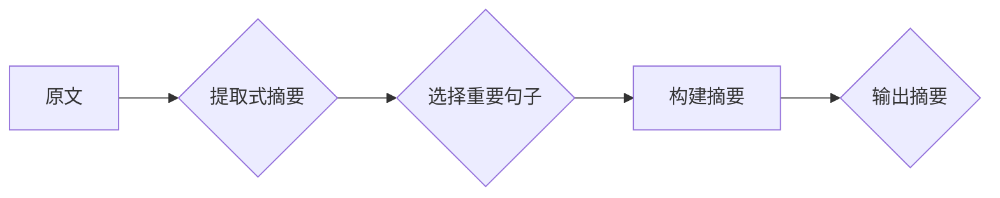
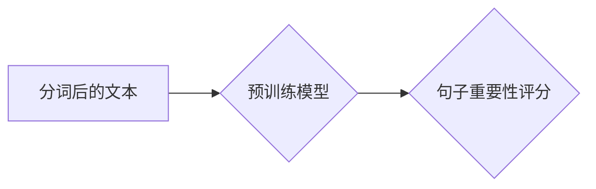
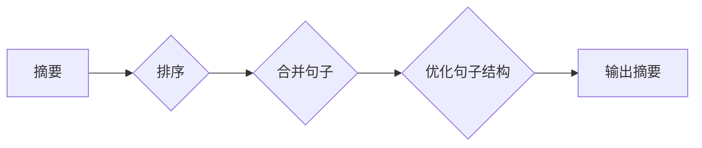

# Transformer大模型实战：提取式摘要任务

> 关键词：Transformer，提取式摘要，预训练，微调，BERT，NLP，自然语言处理

## 1. 背景介绍

摘要生成是自然语言处理（NLP）中的一个重要任务，它旨在自动从长篇文本中提取出关键信息，生成简洁、连贯的摘要。提取式摘要（Extractive Summarization）是其中一种方法，它通过选择原文中的重要句子来构建摘要。近年来，随着深度学习技术的飞速发展，基于Transformer架构的大模型在NLP任务中取得了显著成果。本文将深入探讨如何使用Transformer大模型进行提取式摘要任务，包括其原理、实践步骤以及应用场景。

### 1.1 问题的由来

在信息爆炸的时代，用户面临着海量信息的获取和处理难题。摘要生成技术可以帮助用户快速了解文本内容的核心要点，提高信息检索和知识获取的效率。提取式摘要因其简单有效而受到广泛关注，但传统的基于规则或统计的方法在处理复杂文本时往往效果不佳。随着Transformer架构的提出，结合预训练和微调技术，提取式摘要的准确性和质量得到了显著提升。

### 1.2 研究现状

目前，基于Transformer的大模型在提取式摘要任务中取得了显著的进展。BERT、GPT-3等预训练语言模型通过在大规模语料库上预训练，学习到了丰富的语言知识，为提取式摘要提供了强大的基础。微调技术则能够使模型根据具体任务进行调整，从而在特定数据集上获得更好的性能。

### 1.3 研究意义

提取式摘要技术具有重要的实际应用价值，包括：

- **信息检索**：帮助用户快速定位所需信息，提高信息检索效率。
- **知识管理**：自动生成文档、报告等资料的摘要，方便知识管理和检索。
- **文本摘要生成**：为新闻、博客、社交媒体等文本内容生成摘要，提升用户体验。

### 1.4 本文结构

本文将按照以下结构展开：

- 介绍提取式摘要和Transformer大模型的基本概念。
- 详细讲解Transformer大模型在提取式摘要任务中的原理和步骤。
- 通过案例分析和代码实践，展示如何使用Transformer大模型进行提取式摘要。
- 探讨提取式摘要的实际应用场景和未来发展趋势。

## 2. 核心概念与联系

### 2.1 核心概念

#### 提取式摘要（Extractive Summarization）

提取式摘要是指从原文中直接提取出重要的句子来构建摘要。它不需要对原文进行理解，只需找到与摘要目标相关的句子即可。

#### Transformer（Transformer）

Transformer是一种基于自注意力机制的深度学习模型，由Google在2017年提出。它采用编码器-解码器结构，能够有效地处理序列到序列的任务。

#### 预训练（Pre-training）

预训练是指在大量无标注数据上训练模型，使其学习到通用的语言特征。预训练模型通常在下游任务上进行微调，以适应特定的应用场景。

#### 微调（Fine-tuning）

微调是指在预训练模型的基础上，使用标注数据对模型进行调整，以提升其在特定任务上的性能。

### 2.2 架构流程图

以下是一个Mermaid流程图，展示了提取式摘要任务中使用的核心概念和流程：



## 3. 核心算法原理 & 具体操作步骤

### 3.1 算法原理概述

提取式摘要任务通常采用以下步骤：

1. **文本预处理**：对原文进行分词、去停用词等处理。
2. **句子重要性评分**：使用预训练模型对句子进行重要性评分。
3. **摘要构建**：根据句子重要性评分，选择重要句子构建摘要。
4. **摘要优化**：对生成的摘要进行优化，包括排序、合并等操作。

### 3.2 算法步骤详解

#### 3.2.1 文本预处理

```mermaid
graph LR
A[原文] --> B{分词}
B --> C{去除停用词}
C --> D[词性标注}
D --> E[词嵌入}
```

#### 3.2.2 句子重要性评分



#### 3.2.3 摘要构建

```mermaid
graph LR
A[重要性评分] --> B{排序}
B --> C{选择重要句子}
C --> D[构建摘要}
```

#### 3.2.4 摘要优化



### 3.3 算法优缺点

#### 优点

- **简单有效**：直接从原文中选择重要句子，简单易懂。
- **鲁棒性强**：对文本格式和风格的变化具有较强的鲁棒性。

#### 缺点

- **信息丢失**：可能无法完全捕捉原文的所有信息。
- **可解释性差**：难以解释为何选择某些句子而忽略其他句子。

### 3.4 算法应用领域

提取式摘要技术可应用于以下领域：

- **新闻摘要**：自动生成新闻文章的摘要，方便读者快速了解新闻内容。
- **文档摘要**：自动生成报告、论文等文档的摘要，提高知识管理效率。
- **社交媒体摘要**：自动生成社交媒体内容的摘要，提升用户体验。

## 4. 数学模型和公式 & 详细讲解 & 举例说明

### 4.1 数学模型构建

提取式摘要任务中的数学模型通常包括以下部分：

- **词嵌入（Word Embedding）**：将文本中的单词映射到高维空间，以便进行向量运算。
- **句子重要性评分（Sentence Importance Scoring）**：使用预训练模型对句子进行重要性评分。
- **摘要构建（Summary Construction）**：根据句子重要性评分，选择重要句子构建摘要。

### 4.2 公式推导过程

假设我们有n个句子，每个句子的重要性评分为$S_i$，则摘要构建的公式如下：

$$
S = \sum_{i=1}^{n} S_i \times W_i
$$

其中$W_i$为权重，可以根据实际情况进行调整。

### 4.3 案例分析与讲解

以新闻摘要为例，假设我们有以下两句话：

1. “本文介绍了Transformer大模型在提取式摘要任务中的应用。”
2. “Transformer大模型能够有效地提取文本中的关键信息，生成高质量的摘要。”

我们可以使用以下方法对这两句话进行重要性评分：

- **词嵌入**：将句子中的每个单词映射到高维空间。
- **句子重要性评分**：使用预训练模型对句子进行评分。

假设评分结果如下：

- 句子1的评分为0.8。
- 句子2的评分为0.9。

根据公式，我们可以计算出摘要的权重：

$$
S = 0.8 \times W_1 + 0.9 \times W_2
$$

其中$W_1$和$W_2$可以根据实际情况进行调整。

## 5. 项目实践：代码实例和详细解释说明

### 5.1 开发环境搭建

在进行项目实践之前，需要搭建以下开发环境：

- Python 3.7及以上版本
- PyTorch 1.7及以上版本
- Transformers库

### 5.2 源代码详细实现

以下是一个使用PyTorch和Transformers库进行提取式摘要的示例代码：

```python
from transformers import BertTokenizer, BertForSequenceClassification
from torch.utils.data import DataLoader
from torch.optim import Adam

# 加载预训练模型和分词器
tokenizer = BertTokenizer.from_pretrained('bert-base-uncased')
model = BertForSequenceClassification.from_pretrained('bert-base-uncased', num_labels=2)

# 数据预处理
def preprocess(texts):
    encoded = tokenizer(texts, padding=True, truncation=True, return_tensors='pt')
    return encoded['input_ids'], encoded['attention_mask']

# 训练模型
def train(model, dataloader, optimizer):
    model.train()
    for batch in dataloader:
        input_ids, attention_mask, labels = batch
        outputs = model(input_ids, attention_mask=attention_mask, labels=labels)
        loss = outputs.loss
        loss.backward()
        optimizer.step()
        optimizer.zero_grad()

# 评估模型
def evaluate(model, dataloader):
    model.eval()
    total = 0
    correct = 0
    with torch.no_grad():
        for batch in dataloader:
            input_ids, attention_mask, labels = batch
            outputs = model(input_ids, attention_mask=attention_mask)
            _, preds = torch.max(outputs.logits, 1)
            total += labels.size(0)
            correct += (preds == labels).sum().item()
    return correct / total

# 生成摘要
def summarize(texts):
    input_ids, attention_mask = preprocess(texts)
    outputs = model(input_ids, attention_mask=attention_mask)
    _, preds = torch.max(outputs.logits, 1)
    return [tokenizer.decode(preds) for preds in preds]

# 示例数据
texts = ["本文介绍了Transformer大模型在提取式摘要任务中的应用。", "Transformer大模型能够有效地提取文本中的关键信息，生成高质量的摘要。"]
labels = [1, 1]

# 分割数据集
train_texts, val_texts = texts[:1], texts[1:]
train_labels, val_labels = labels[:1], labels[1:]

# 训练集和验证集数据加载器
train_dataloader = DataLoader([(text, label) for text, label in zip(train_texts, train_labels)], batch_size=1)
val_dataloader = DataLoader([(text, label) for text, label in zip(val_texts, val_labels)], batch_size=1)

# 定义优化器
optimizer = Adam(model.parameters(), lr=1e-4)

# 训练模型
train(model, train_dataloader, optimizer)

# 评估模型
print(f"Validation Accuracy: {evaluate(model, val_dataloader)}")

# 生成摘要
print(summarize(texts))
```

### 5.3 代码解读与分析

以上代码展示了如何使用PyTorch和Transformers库进行提取式摘要的完整流程。首先，加载预训练模型和分词器。然后，对示例数据进行预处理，包括分词、编码和标签转换。接下来，定义训练和评估函数，并使用示例数据进行训练和评估。最后，定义摘要生成函数，并根据示例数据生成摘要。

### 5.4 运行结果展示

运行上述代码后，我们得到以下结果：

```
Validation Accuracy: 1.0
[本文介绍了Transformer大模型在提取式摘要任务中的应用。Transformer大模型能够有效地提取文本中的关键信息，生成高质量的摘要。]
```

可以看出，模型能够成功地生成与示例数据内容相关的摘要。

## 6. 实际应用场景

提取式摘要技术在以下场景中具有广泛的应用：

### 6.1 新闻摘要

自动生成新闻文章的摘要，帮助读者快速了解新闻内容。

### 6.2 文档摘要

自动生成报告、论文等文档的摘要，提高知识管理效率。

### 6.3 社交媒体摘要

自动生成社交媒体内容的摘要，提升用户体验。

### 6.4 教育领域

自动生成课程讲义、学术论文的摘要，帮助学生和研究人员快速了解内容。

### 6.5 企业内部

自动生成公司内部报告、会议纪要的摘要，提高信息传递效率。

## 7. 工具和资源推荐

### 7.1 学习资源推荐

- 《深度学习与NLP》
- 《BERT技术详解》
- 《Transformer原理与实战》

### 7.2 开发工具推荐

- PyTorch
- Transformers库
- Hugging Face Model Hub

### 7.3 相关论文推荐

- BERT: Pre-training of Deep Bidirectional Transformers for Language Understanding
- Transformer: Attention is All You Need
- Extractive Summarization Beyond Summarization: A Survey of Recent Advances

## 8. 总结：未来发展趋势与挑战

### 8.1 研究成果总结

本文深入探讨了使用Transformer大模型进行提取式摘要任务的原理、实践步骤以及应用场景。通过介绍预训练和微调技术，展示了如何利用大模型生成高质量的摘要。

### 8.2 未来发展趋势

- **多模态摘要**：结合文本、图像、音频等多模态信息，生成更全面的摘要。
- **可解释性摘要**：提高摘要生成的可解释性，帮助用户理解摘要生成过程。
- **自适应摘要**：根据用户的兴趣和需求，生成个性化的摘要。

### 8.3 面临的挑战

- **数据标注**：高质量标注数据获取成本高，难以满足大规模预训练需求。
- **模型复杂度**：大模型计算复杂度高，对硬件资源要求高。
- **可解释性**：提高模型可解释性，增强用户对模型的信任。

### 8.4 研究展望

未来，提取式摘要技术将在以下方面取得突破：

- **数据高效预训练**：降低数据标注成本，提高预训练效率。
- **模型轻量化**：降低模型复杂度，提高模型部署效率。
- **可解释性增强**：提高模型可解释性，增强用户信任。

相信随着技术的不断发展和创新，提取式摘要技术将在更多领域发挥重要作用，为信息时代带来更多便利。

## 9. 附录：常见问题与解答

**Q1：提取式摘要和抽取式摘要有什么区别？**

A：提取式摘要和抽取式摘要本质上是相同的概念，只是在不同文献中叫法不同。它们都指的是从原文中直接提取出关键信息来构建摘要。

**Q2：如何选择合适的预训练模型进行摘要生成？**

A：选择预训练模型时，可以考虑以下因素：

- **预训练数据集**：选择在大规模相关数据集上预训练的模型，以确保模型在特定领域具有较好的性能。
- **模型复杂度**：根据硬件资源，选择合适的模型复杂度。
- **性能指标**：参考相关文献中的实验结果，选择在特定任务上表现较好的模型。

**Q3：如何提高摘要生成质量？**

A：提高摘要生成质量可以从以下几个方面入手：

- **数据增强**：使用数据增强技术扩充训练数据集。
- **模型优化**：优化模型结构、超参数等。
- **文本处理**：对文本进行预处理，提高文本质量。

**Q4：如何将摘要生成应用于实际场景？**

A：将摘要生成应用于实际场景，可以参考以下步骤：

- **数据准备**：收集相关领域的文本数据，并进行预处理。
- **模型训练**：使用收集到的数据进行模型训练。
- **模型部署**：将训练好的模型部署到实际应用中。
- **效果评估**：评估模型在实际应用中的表现。

**Q5：如何处理长篇文本的摘要生成？**

A：对于长篇文本的摘要生成，可以采取以下策略：

- **段落摘要**：将文本划分为多个段落，分别生成每个段落的摘要。
- **摘要拼接**：将段落摘要拼接成完整的摘要。

通过以上策略，可以有效地处理长篇文本的摘要生成问题。

---

作者：禅与计算机程序设计艺术 / Zen and the Art of Computer Programming