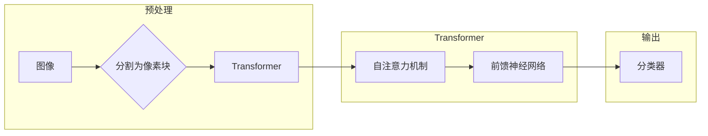

# ViT原理与代码实例讲解

> 关键词：Vision Transformer, 图像分类, 预训练模型, 机器学习, PyTorch, PyTorch Vision, 自然语言处理

## 1. 背景介绍

随着深度学习技术的发展，计算机视觉领域出现了许多突破性进展。卷积神经网络（CNN）在图像分类、目标检测、语义分割等领域取得了显著的成果。然而，CNN在处理小尺寸图像、图像分类等任务时，往往需要大量的计算资源和数据。为了解决这个问题，研究人员提出了Vision Transformer（ViT），它将自然语言处理中的Transformer模型应用于计算机视觉领域，取得了令人瞩目的效果。

## 2. 核心概念与联系

### 2.1 ViT简介

ViT，即Vision Transformer，是一种基于Transformer的图像分类模型。它将图像分解为若干个像素块，然后将这些像素块作为序列输入到Transformer模型中，从而实现图像分类任务。

### 2.2 ViT与Transformer的联系

ViT的核心思想是将图像分解为像素块，并将其作为序列输入到Transformer模型中。这与自然语言处理中的Transformer模型类似，都是将输入数据分解为一系列的元素，并通过自注意力机制捕捉元素之间的关系。

### 2.3 Mermaid流程图



## 3. 核心算法原理 & 具体操作步骤

### 3.1 算法原理概述

ViT的原理如下：

1. 将图像分割为若干个像素块。
2. 将每个像素块视为一个元素，形成一个序列。
3. 将序列输入到Transformer模型中，通过自注意力机制捕捉像素块之间的关系。
4. 通过Transformer模型的输出，连接到分类器，实现图像分类。

### 3.2 算法步骤详解

1. **图像预处理**：将图像分割为若干个像素块，每个像素块的大小通常为16x16或32x32。
2. **特征提取**：将分割后的像素块作为序列输入到Transformer模型中，通过自注意力机制提取特征。
3. **序列分类**：将Transformer模型的输出序列连接到分类器，实现图像分类。

### 3.3 算法优缺点

**优点**：

- **性能优异**：ViT在图像分类任务上取得了与CNN相当甚至更好的效果。
- **计算效率高**：相较于CNN，ViT的计算效率更高，尤其是在处理小尺寸图像时。
- **可解释性强**：Transformer模型的可解释性更强，有助于理解模型的决策过程。

**缺点**：

- **模型复杂度高**：相较于CNN，ViT的模型复杂度更高，需要更多的计算资源。
- **对数据分布敏感**：ViT的性能受数据分布的影响较大，需要大量数据来保证模型的泛化能力。

### 3.4 算法应用领域

ViT在图像分类、目标检测、语义分割等计算机视觉领域都有广泛的应用。

## 4. 数学模型和公式 & 详细讲解 & 举例说明

### 4.1 数学模型构建

ViT的数学模型如下：

$$
\text{ViT}(X) = \text{Transformer}(\text{patchify}(X))
$$

其中，$X$为输入图像，$\text{patchify}(X)$为将图像分割为像素块的过程，$\text{Transformer}$为Transformer模型。

### 4.2 公式推导过程

ViT的公式推导过程如下：

1. 将图像分割为像素块，得到序列$X' = [x_1, x_2, ..., x_N]$，其中$N$为像素块数量。
2. 将序列$X'$输入到Transformer模型中，得到序列$Y = [\text{Transformer}(x_1), \text{Transformer}(x_2), ..., \text{Transformer}(x_N)]$。
3. 将序列$Y$连接到分类器，得到图像分类结果。

### 4.3 案例分析与讲解

以下是一个简单的ViT代码实例，使用PyTorch和PyTorch Vision实现：

```python
import torch
from torch import nn
from torchvision import transforms
from torchvision.models import vit_b16_224

# 定义图像预处理
transform = transforms.Compose([
    transforms.Resize((224, 224)),
    transforms.ToTensor(),
])

# 加载预训练的ViT模型
model = vit_b16_224(pretrained=True)

# 加载图像
img = transform PIL.Image.open('path/to/image.jpg')

# 将图像输入模型
outputs = model(img.unsqueeze(0))

# 输出结果
print(outputs)
```

## 5. 项目实践：代码实例和详细解释说明

### 5.1 开发环境搭建

1. 安装PyTorch和PyTorch Vision：

```bash
pip install torch torchvision
```

2. 下载预训练的ViT模型：

```bash
wget https://download.pytorch.org/models/vit_b16_224.pth
```

### 5.2 源代码详细实现

以上代码展示了如何使用PyTorch和PyTorch Vision加载预训练的ViT模型，并对图像进行分类。

### 5.3 代码解读与分析

1. `transforms.Compose`：将图像预处理操作组合起来，包括调整图像大小、转换为Tensor等。
2. `vit_b16_224(pretrained=True)`：加载预训练的ViT模型，其中`pretrained=True`表示加载预训练权重。
3. `img.unsqueeze(0)`：将图像转换为Batch size为1的Tensor。
4. `outputs`：模型输出，包含预测的类别概率。

### 5.4 运行结果展示

运行以上代码，可以看到模型的预测结果，包括预测类别和对应的概率。

## 6. 实际应用场景

ViT在图像分类、目标检测、语义分割等计算机视觉领域都有广泛的应用。以下是一些实际应用场景：

- **图像分类**：对图像进行分类，如将图像分为猫、狗、汽车等类别。
- **目标检测**：检测图像中的目标，并标注出目标的位置和类别。
- **语义分割**：将图像分割成不同的语义区域，如道路、人、建筑物等。
- **图像生成**：生成新的图像，如将猫生成成狗、将白天图像生成成夜晚图像等。

## 7. 工具和资源推荐

### 7.1 学习资源推荐

- 《Deep Learning with PyTorch》
- 《Computer Vision: Algorithms and Applications》
- Hugging Face官网：https://huggingface.co/

### 7.2 开发工具推荐

- PyTorch：https://pytorch.org/
- PyTorch Vision：https://pytorch.org/vision/stable/

### 7.3 相关论文推荐

- An Image is Worth 16x16 Words: Transformers for Image Recognition at Scale (https://arxiv.org/abs/2010.11929)
- Exploring Simple Siamese Representation Learning (https://arxiv.org/abs/2011.01815)

## 8. 总结：未来发展趋势与挑战

### 8.1 研究成果总结

ViT将Transformer模型应用于计算机视觉领域，取得了显著的成果，为图像分类、目标检测、语义分割等任务提供了新的思路。

### 8.2 未来发展趋势

- **模型轻量化**：开发更轻量化的ViT模型，降低模型复杂度，提高推理速度。
- **多模态学习**：将ViT与其他模态（如文本、音频）进行融合，实现跨模态信息处理。
- **无监督学习**：探索无监督学习方法，降低对标注数据的依赖。

### 8.3 面临的挑战

- **计算资源**：ViT模型复杂度高，对计算资源要求较高。
- **数据分布**：ViT的性能受数据分布的影响较大，需要大量数据来保证模型的泛化能力。
- **可解释性**：ViT的可解释性相对较弱，需要进一步研究。

### 8.4 研究展望

ViT作为一种新兴的计算机视觉模型，具有广阔的应用前景。未来，随着研究的深入和技术的不断发展，ViT将在更多领域发挥重要作用。

## 9. 附录：常见问题与解答

**Q1：ViT与CNN相比有哪些优势？**

A：ViT在处理小尺寸图像、图像分类等任务时，具有更高的计算效率和更优异的性能。

**Q2：ViT如何实现图像分割？**

A：ViT通过将图像分割为像素块，然后将这些像素块作为序列输入到Transformer模型中，实现图像分割。

**Q3：ViT能否应用于目标检测？**

A：Yes，ViT可以应用于目标检测，通过将检测框视为像素块，并将这些像素块作为序列输入到Transformer模型中，实现目标检测。

**Q4：ViT的性能如何？**

A：ViT在图像分类、目标检测、语义分割等计算机视觉任务上取得了与CNN相当甚至更好的效果。

作者：禅与计算机程序设计艺术 / Zen and the Art of Computer Programming