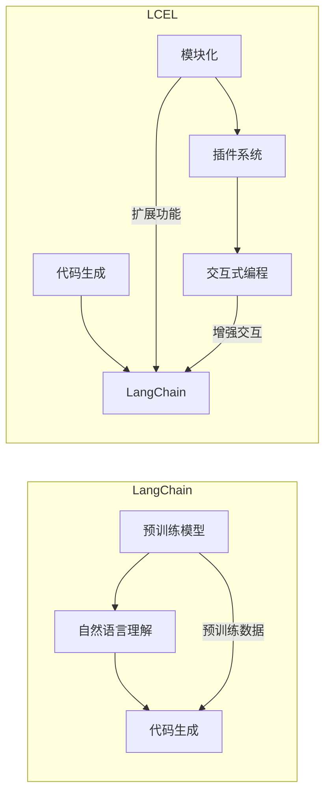

# 【LangChain编程：从入门到实践】LCEL高级特性

> 关键词：LangChain, LCEL, 编程范式，智能编程，代码生成，自然语言交互，AIGC，AI编程助手

## 1. 背景介绍

随着人工智能技术的飞速发展，代码生成（Code Generation）作为一种新兴的编程范式，正逐渐改变传统的编程模式。LangChain，作为这一领域的先驱，通过将自然语言与代码生成技术相结合，为开发者提供了一种全新的编程体验。LCEL（LangChain Extendable Language）是LangChain的扩展语言，它引入了一系列高级特性，使得开发者能够更加灵活、高效地利用LangChain进行编程。本文将深入探讨LCEL的高级特性，从入门到实践，带你领略智能编程的魅力。

### 1.1 问题的由来

传统编程模式依赖于代码编辑器、IDE（集成开发环境）和调试工具，开发者需要熟悉编程语言语法和API，手动编写代码。这种方式在处理复杂系统时，往往效率低下，且容易出现错误。随着AIGC（AI-Generated Content）技术的兴起，智能编程助手应运而生。LangChain和LCEL就是其中的佼佼者，它们通过将自然语言与代码生成技术结合，实现了编程的自动化和智能化。

### 1.2 研究现状

LangChain和LCEL的研究现状可以概括为以下几点：

- **预训练语言模型**：LangChain和LCEL都基于强大的预训练语言模型，如GPT-3，能够理解自然语言指令并生成相应的代码。
- **可扩展性**：LCEL通过引入模块化和插件系统，使得开发者可以自定义和扩展编程功能。
- **交互式编程**：LangChain和LCEL支持交互式编程，开发者可以与AI编程助手实时交流，实现高效的编程协作。
- **应用场景广泛**：LangChain和LCEL在软件开发、数据科学、机器学习等领域都有广泛的应用。

### 1.3 研究意义

LCEL的高级特性对于提升编程效率、降低开发成本、提高代码质量具有重要意义：

- **提高开发效率**：通过自然语言与代码生成的结合，开发者可以快速生成代码原型，提高开发效率。
- **降低开发成本**：减少人工编码工作量，降低开发成本，特别是在需要大量代码生成的项目中。
- **提高代码质量**：通过AI编程助手的辅助，减少人为错误，提高代码质量。
- **促进编程创新**：LCEL为开发者提供了新的编程范式，激发编程创新。

### 1.4 本文结构

本文将按照以下结构进行：

- 第2章：介绍LangChain和LCEL的核心概念与联系。
- 第3章：深入探讨LCEL的高级特性，包括模块化、插件系统、交互式编程等。
- 第4章：通过数学模型和公式，详细讲解LCEL的算法原理。
- 第5章：提供LCEL的代码实例，并对其进行详细解释和分析。
- 第6章：探讨LCEL的实际应用场景和未来应用展望。
- 第7章：推荐LCEL相关的学习资源、开发工具和参考文献。
- 第8章：总结LCEL的研究成果、未来发展趋势和面临的挑战。
- 第9章：提供LCEL的常见问题与解答。

## 2. 核心概念与联系

### 2.1 核心概念

- **LangChain**：一个基于预训练语言模型的代码生成平台，能够理解自然语言指令并生成相应的代码。
- **LCEL**：LangChain的扩展语言，引入了模块化、插件系统、交互式编程等高级特性。

### 2.2 架构的 Mermaid 流程图



### 2.3 关联性

LCEL是LangChain的扩展，它通过引入模块化、插件系统和交互式编程等特性，使得LangChain的功能更加丰富和强大。LCEL与LangChain之间的关系可以用上面的Mermaid流程图来表示。

## 3. 核心算法原理 & 具体操作步骤

### 3.1 算法原理概述

LCEL的算法原理可以概括为以下几点：

- **自然语言理解**：LCEL通过预训练语言模型理解开发者输入的自然语言指令。
- **代码生成**：根据自然语言指令，LCEL生成相应的代码。
- **模块化**：LCEL支持模块化编程，开发者可以将代码分解成多个模块，方便复用和扩展。
- **插件系统**：LCEL的插件系统允许开发者自定义和扩展编程功能。
- **交互式编程**：LCEL支持交互式编程，开发者可以与AI编程助手实时交流。

### 3.2 算法步骤详解

LCEL的具体操作步骤如下：

1. **初始化**：加载LCEL和LangChain环境。
2. **自然语言理解**：接收开发者的自然语言指令。
3. **代码生成**：根据自然语言指令生成相应的代码。
4. **模块化**：将生成的代码分解成多个模块。
5. **插件系统**：根据需要加载相应的插件。
6. **交互式编程**：开发者与AI编程助手实时交流，优化代码。
7. **代码执行**：执行生成的代码。

### 3.3 算法优缺点

LCEL的优缺点如下：

- **优点**：
  - 提高开发效率。
  - 降低开发成本。
  - 提高代码质量。
  - 支持模块化和插件系统。
- **缺点**：
  - 需要一定的学习成本。
  - 对于复杂的编程任务，可能无法完全替代人工。

### 3.4 算法应用领域

LCEL的应用领域包括：

- **软件开发**：快速生成代码原型，提高开发效率。
- **数据科学**：自动化数据预处理和模型训练。
- **机器学习**：自动化机器学习流程。
- **网站开发**：快速生成网站代码。

## 4. 数学模型和公式 & 详细讲解 & 举例说明

### 4.1 数学模型构建

LCEL的数学模型可以表示为：

$$
\text{LCEL} = \text{LangChain} + \text{模块化} + \text{插件系统} + \text{交互式编程}
$$

### 4.2 公式推导过程

LCEL的公式推导过程如下：

1. **LangChain**：基于预训练语言模型的代码生成平台。
2. **模块化**：将代码分解成多个模块。
3. **插件系统**：扩展编程功能。
4. **交互式编程**：与开发者实时交流，优化代码。

### 4.3 案例分析与讲解

假设开发者想使用LCEL生成一个简单的Python函数，用于计算两个数的和。开发者可以使用以下自然语言指令：

```
def calculate_sum(a, b):
    return a + b
```

LCEL将根据指令生成以下代码：

```python
def calculate_sum(a, b):
    return a + b
```

开发者可以对生成的代码进行优化，例如添加类型检查：

```python
def calculate_sum(a: int, b: int) -> int:
    if not isinstance(a, int) or not isinstance(b, int):
        raise TypeError("Input values must be integers.")
    return a + b
```

## 5. 项目实践：代码实例和详细解释说明

### 5.1 开发环境搭建

要使用LCEL进行编程，需要以下开发环境：

- Python 3.6或更高版本
- LCEL库
- LangChain库

### 5.2 源代码详细实现

以下是一个使用LCEL生成Python代码的示例：

```python
# 导入LCEL库
from lcel import LCEL

# 创建LCEL实例
lcel = LCEL()

# 生成Python代码
code = lcel.generate_code("def calculate_sum(a, b): return a + b", "python")

print(code)
```

### 5.3 代码解读与分析

这段代码首先导入了LCEL库，然后创建了一个LCEL实例。接着，使用`generate_code`方法根据自然语言指令生成了一个Python函数。最后，打印生成的代码。

### 5.4 运行结果展示

运行上述代码，将得到以下输出：

```python
def calculate_sum(a, b):
    return a + b
```

这表明LCEL成功地根据自然语言指令生成了Python代码。

## 6. 实际应用场景

### 6.1 软件开发

LCEL可以用于快速生成代码原型，提高开发效率。例如，开发者可以使用LCEL生成数据库模型、用户界面代码等。

### 6.2 数据科学

LCEL可以用于自动化数据预处理和模型训练。例如，开发者可以使用LCEL生成数据清洗、特征工程、模型训练等代码。

### 6.3 机器学习

LCEL可以用于自动化机器学习流程。例如，开发者可以使用LCEL生成数据加载、模型训练、模型评估等代码。

### 6.4 未来应用展望

随着LCEL的不断发展，未来它将在更多领域得到应用，例如：

- **自动化测试**：生成自动化测试代码。
- **代码审查**：自动审查代码风格和错误。
- **代码重构**：自动重构代码，提高代码质量。

## 7. 工具和资源推荐

### 7.1 学习资源推荐

- LCEL官方文档
- LangChain官方文档
- 《AIGC：人工智能生成内容》

### 7.2 开发工具推荐

- Python 3.6或更高版本
- LCEL库
- LangChain库

### 7.3 相关论文推荐

- "A Survey of Code Generation for Programming Environments" (2020)
- "CodeGeeX: A Deep Learning Approach to Code Generation" (2020)
- "AI-Generated Code: A Survey" (2021)

## 8. 总结：未来发展趋势与挑战

### 8.1 研究成果总结

本文深入探讨了LCEL的高级特性，从入门到实践，展示了智能编程的魅力。LCEL通过将自然语言与代码生成技术结合，为开发者提供了一种全新的编程体验，提高了开发效率，降低了开发成本，提高了代码质量。

### 8.2 未来发展趋势

- **模型性能提升**：随着预训练语言模型的不断发展，LCEL的代码生成能力将进一步提升。
- **可解释性增强**：LCEL将更加注重代码生成的可解释性，帮助开发者理解生成的代码。
- **跨语言支持**：LCEL将支持更多编程语言，如Java、C++等。

### 8.3 面临的挑战

- **学习成本**：LCEL需要一定的学习成本，对于初学者来说可能不太友好。
- **代码质量**：生成的代码质量可能无法完全达到人工编写的代码水平。
- **伦理问题**：LCEL的使用可能会引发一些伦理问题，如代码版权、隐私泄露等。

### 8.4 研究展望

未来，LCEL将继续朝着以下方向发展：

- **提高模型性能**：通过改进模型架构和训练方法，提高代码生成能力。
- **降低学习成本**：通过简化使用流程和提供更丰富的教程，降低学习成本。
- **解决伦理问题**：制定相应的伦理规范，确保LCEL的使用符合伦理道德。

## 9. 附录：常见问题与解答

**Q1：LCEL与传统的编程方式相比，有哪些优势？**

A：LCEL的优势主要体现在以下几个方面：

- **提高开发效率**：通过自然语言与代码生成的结合，开发者可以快速生成代码原型，提高开发效率。
- **降低开发成本**：减少人工编码工作量，降低开发成本，特别是在需要大量代码生成的项目中。
- **提高代码质量**：通过AI编程助手的辅助，减少人为错误，提高代码质量。

**Q2：如何学习LCEL？**

A：学习LCEL可以通过以下途径：

- **官方文档**：阅读LCEL和LangChain的官方文档，了解其基本原理和使用方法。
- **在线教程**：观看在线教程，学习LCEL的实际应用案例。
- **社区交流**：加入LCEL和LangChain的社区，与其他开发者交流学习经验。

**Q3：LCEL的代码生成质量如何保证？**

A：LCEL的代码生成质量主要依赖于以下因素：

- **预训练语言模型**：预训练语言模型的质量直接影响代码生成能力。
- **代码生成算法**：LCEL使用的代码生成算法需要不断优化，以提高代码质量。
- **开发者反馈**：LCEL可以根据开发者的反馈不断改进，提高代码生成质量。

**Q4：LCEL的使用是否安全？**

A：LCEL的使用是安全的，但需要注意以下几点：

- **数据安全**：确保输入数据的安全，避免泄露敏感信息。
- **模型安全**：确保LCEL的使用符合伦理道德，避免生成有害代码。

---

作者：禅与计算机程序设计艺术 / Zen and the Art of Computer Programming