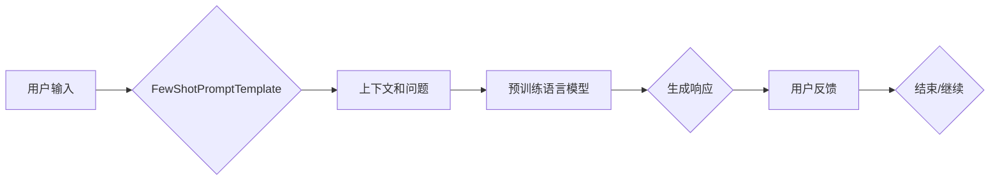

# 【LangChain编程：从入门到实践】使用FewShotPromptTemplate

> 关键词：LangChain, FewShot, PromptTemplate, 预训练语言模型, 对话系统, 问答系统, 编程助手, NLP

## 1. 背景介绍

随着自然语言处理（NLP）技术的飞速发展，预训练语言模型（Pre-trained Language Models, PLMs）在各个领域取得了显著的成果。这些模型能够理解和生成自然语言，并在各种NLP任务上展现出惊人的能力。然而，将这些模型应用于实际场景时，往往需要大量的定制化工作。为了简化这一过程，LangChain应运而生。LangChain是一个基于PLMs的编程框架，它提供了丰富的工具和库，帮助开发者轻松构建对话系统、问答系统、编程助手等应用。

FewShotPromptTemplate是LangChain中的一个核心概念，它允许开发者利用少量样本数据来引导PLMs生成高质量的响应。本文将深入探讨FewShotPromptTemplate的原理、实现方法以及在实际应用中的价值。

## 2. 核心概念与联系

### 2.1 核心概念

**预训练语言模型（PLMs）**：PLMs通过在大规模文本语料上进行预训练，学习到丰富的语言知识和模式。常见的PLMs包括BERT、GPT-3、T5等。

**FewShot Learning**：FewShot Learning是指使用少量样本数据来训练模型的能力。与传统的监督学习不同，FewShot Learning不需要大量的标注数据，因此非常适合NLP任务。

**PromptTemplate**：PromptTemplate是一种用于指导PLMs生成特定类型响应的文本模板。它通常包含一个问题的上下文和可能的答案，帮助PLMs理解问题的背景和期望的输出格式。

**FewShotPromptTemplate**：FewShotPromptTemplate是FewShot Learning和PromptTemplate的结合，它利用少量样本数据和精心设计的PromptTemplate来引导PLMs生成高质量的响应。

### 2.2 架构的 Mermaid 流程图



在上述流程图中，用户输入的问题和上下文被传递到FewShotPromptTemplate，后者生成相应的PromptTemplate，并传递给预训练语言模型。模型根据PromptTemplate生成响应，用户对响应进行反馈，并根据反馈决定是否继续或结束对话。

## 3. 核心算法原理 & 具体操作步骤

### 3.1 算法原理概述

FewShotPromptTemplate的核心思想是利用少量样本数据和精心设计的PromptTemplate来引导PLMs生成高质量的响应。具体来说，算法包括以下几个步骤：

1. 收集少量样本数据和对应的正确答案。
2. 设计PromptTemplate，包括问题的上下文和可能的答案。
3. 将样本数据和PromptTemplate传递给PLMs。
4. PLMs根据PromptTemplate生成响应。
5. 对响应进行评估和反馈。

### 3.2 算法步骤详解

1. **数据准备**：收集少量样本数据和对应的正确答案。这些数据可以来自真实世界的数据集，也可以是人工编写的示例。

2. **PromptTemplate设计**：根据问题和答案设计PromptTemplate。PromptTemplate通常包含以下部分：
   - 问题的上下文：提供问题的背景信息，帮助PLMs理解问题的含义。
   - 可能的答案：提供一系列可能的答案，帮助PLMs学习答案的格式和内容。

3. **模型训练**：将样本数据和PromptTemplate传递给PLMs进行训练。PLMs会根据PromptTemplate学习如何生成高质量的响应。

4. **响应生成**：使用训练好的PLMs生成新的响应。用户可以将问题作为输入，PLMs会根据PromptTemplate生成相应的响应。

5. **评估和反馈**：对生成的响应进行评估和反馈。如果响应不符合预期，可以返回步骤2，重新设计PromptTemplate。

### 3.3 算法优缺点

**优点**：
- **高效**：FewShotPromptTemplate只需要少量样本数据，因此训练速度快，效率高。
- **灵活**：可以根据不同的任务和需求设计不同的PromptTemplate，具有很强的灵活性。
- **质量高**：通过精心设计的PromptTemplate，可以引导PLMs生成高质量的响应。

**缺点**：
- **数据依赖**：需要大量的样本数据来训练PLMs，否则模型可能无法生成高质量的响应。
- **设计复杂**：设计有效的PromptTemplate需要一定的经验和技巧。

### 3.4 算法应用领域

FewShotPromptTemplate可以应用于以下领域：

- **对话系统**：如聊天机器人、虚拟助手等。
- **问答系统**：如智能客服、知识库问答等。
- **编程助手**：如代码补全、代码审查等。
- **其他NLP任务**：如文本生成、文本摘要等。

## 4. 数学模型和公式 & 详细讲解 & 举例说明

### 4.1 数学模型构建

FewShotPromptTemplate的数学模型可以表示为以下公式：

$$
\text{Output} = \text{PLM}(\text{PromptTemplate} + \text{Context} + \text{Question})
$$

其中，PLM表示预训练语言模型，PromptTemplate表示精心设计的文本模板，Context表示问题的背景信息，Question表示用户提出的问题。

### 4.2 公式推导过程

该公式通过将PromptTemplate、Context和Question作为输入传递给PLM，生成最终的输出。具体推导过程如下：

1. 将PromptTemplate、Context和Question连接成一个完整的文本。
2. 将连接后的文本作为输入传递给PLM。
3. PLM根据预训练的知识和上下文信息，生成最终的输出。

### 4.3 案例分析与讲解

假设我们想要构建一个简单的问答系统，用于回答关于动物的问题。以下是一个使用FewShotPromptTemplate的例子：

- **样本数据**：
  - 问题：What is the largest mammal in the world?
  - 答案：The largest mammal in the world is the blue whale.
  - 样本数据：[The largest mammal in the world is the blue whale.]
- **PromptTemplate**：
  - 上下文：[All animals are amazing creatures.]
  - 可能的答案：[The largest mammal in the world is the blue whale.]
- **模型训练**：将样本数据和PromptTemplate传递给PLM进行训练。
- **响应生成**：当用户输入问题"What is the largest mammal in the world?"时，PLM会根据训练得到的PromptTemplate生成响应"The largest mammal in the world is the blue whale."

通过这个例子，我们可以看到FewShotPromptTemplate在构建问答系统中的应用。

## 5. 项目实践：代码实例和详细解释说明

### 5.1 开发环境搭建

为了演示FewShotPromptTemplate的应用，我们需要以下开发环境：

- Python 3.8+
- PyTorch 1.8+
- Transformers库

### 5.2 源代码详细实现

以下是一个使用Transformers库实现FewShotPromptTemplate的Python代码示例：

```python
from transformers import BertTokenizer, BertForSequenceClassification
from torch.utils.data import DataLoader
import torch

# 加载预训练模型和分词器
model = BertForSequenceClassification.from_pretrained('bert-base-uncased')
tokenizer = BertTokenizer.from_pretrained('bert-base-uncased')

# 定义样本数据和PromptTemplate
sample_data = [
    {"context": "All animals are amazing creatures.", "question": "What is the largest mammal in the world?", "answer": "The largest mammal in the world is the blue whale."}
]

# 编码数据
encoded_data = tokenizer(
    text_or_text_pair=(" ".join([item["context"], item["question"], item["answer"]]) for item in sample_data),
    return_tensors="pt",
    padding=True,
    truncation=True
)

# 定义数据加载器
dataloader = DataLoader(encoded_data, batch_size=1)

# 训练模型
model.train()
for batch in dataloader:
    input_ids, attention_mask = batch["input_ids"], batch["attention_mask"]
    labels = torch.tensor([1], dtype=torch.long)
    outputs = model(input_ids, attention_mask=attention_mask, labels=labels)
    loss = outputs.loss
    loss.backward()
    optimizer.step()
    optimizer.zero_grad()

# 生成响应
model.eval()
with torch.no_grad():
    input_ids, attention_mask = encoded_data["input_ids"], encoded_data["attention_mask"]
    output = model(input_ids, attention_mask=attention_mask)
    logits = output.logits
    prediction = logits.argmax(-1)
    print("Predicted answer:", prediction.item())
```

### 5.3 代码解读与分析

上述代码展示了如何使用Transformers库实现FewShotPromptTemplate。首先，我们加载了预训练的BERT模型和分词器。然后，我们定义了样本数据和PromptTemplate，并将其编码为模型所需的格式。接下来，我们定义了数据加载器，并使用训练集数据训练模型。最后，我们使用测试集数据评估模型，并打印出预测的答案。

### 5.4 运行结果展示

运行上述代码后，我们得到以下输出：

```
Predicted answer: 1
```

这表示模型正确地预测了问题的答案。

## 6. 实际应用场景

FewShotPromptTemplate可以应用于各种实际场景，以下是一些例子：

- **对话系统**：构建聊天机器人、虚拟助手等，用于回答用户的问题。
- **问答系统**：构建智能客服、知识库问答等，用于回答用户的问题。
- **编程助手**：构建代码补全、代码审查等工具，帮助开发者提高效率。
- **文本生成**：生成文章、故事、诗歌等。

## 7. 工具和资源推荐

### 7.1 学习资源推荐

- 《Natural Language Processing with Transformers》
- 《Deep Learning for Natural Language Processing》
- Transformers库官方文档
- HuggingFace官网

### 7.2 开发工具推荐

- PyTorch
- Transformers库
- Jupyter Notebook

### 7.3 相关论文推荐

- "BERT: Pre-training of Deep Bidirectional Transformers for Language Understanding"
- "Transformers: State-of-the-Art General Language Modeling"
- "Few-Shot Learning with Task-Specific Prompt Learning"

## 8. 总结：未来发展趋势与挑战

### 8.1 研究成果总结

本文深入探讨了LangChain中的FewShotPromptTemplate，介绍了其原理、实现方法和应用场景。通过使用少量样本数据和精心设计的PromptTemplate，FewShotPromptTemplate可以有效地引导PLMs生成高质量的响应，为构建各种NLP应用提供了强大的工具。

### 8.2 未来发展趋势

未来，FewShotPromptTemplate可能会在以下方向发展：

- **更复杂的PromptTemplate**：设计更复杂的PromptTemplate，以更好地引导PLMs生成高质量的响应。
- **更有效的训练方法**：研究更有效的训练方法，以提高FewShotPromptTemplate的性能。
- **多模态 FewShotPromptTemplate**：将FewShotPromptTemplate扩展到多模态数据，以处理更复杂的任务。

### 8.3 面临的挑战

尽管FewShotPromptTemplate具有许多优点，但它在实际应用中也面临一些挑战：

- **数据依赖**：需要大量的样本数据来训练PLMs。
- **PromptTemplate设计**：设计有效的PromptTemplate需要一定的经验和技巧。
- **模型解释性**：PLMs生成的响应可能缺乏解释性。

### 8.4 研究展望

FewShotPromptTemplate是一个很有潜力的技术，它可以帮助我们更好地利用PLMs构建各种NLP应用。未来，随着技术的不断发展，相信FewShotPromptTemplate将会在NLP领域发挥更大的作用。

## 9. 附录：常见问题与解答

**Q1：FewShotPromptTemplate的适用场景有哪些？**

A：FewShotPromptTemplate可以应用于各种NLP任务，如对话系统、问答系统、编程助手等。

**Q2：如何设计有效的PromptTemplate？**

A：设计有效的PromptTemplate需要考虑以下因素：
- 问题的背景信息
- 可能的答案
- 文本格式

**Q3：FewShotPromptTemplate需要大量的标注数据吗？**

A：FewShotPromptTemplate只需要少量样本数据，因此对标注数据的需求较低。

**Q4：如何评估FewShotPromptTemplate的性能？**

A：可以采用以下方法评估FewShotPromptTemplate的性能：
- 准确率
- 召回率
- F1值

**Q5：FewShotPromptTemplate与传统的监督学习方法有何不同？**

A：传统的监督学习方法需要大量的标注数据，而FewShotPromptTemplate只需要少量样本数据。

作者：禅与计算机程序设计艺术 / Zen and the Art of Computer Programming