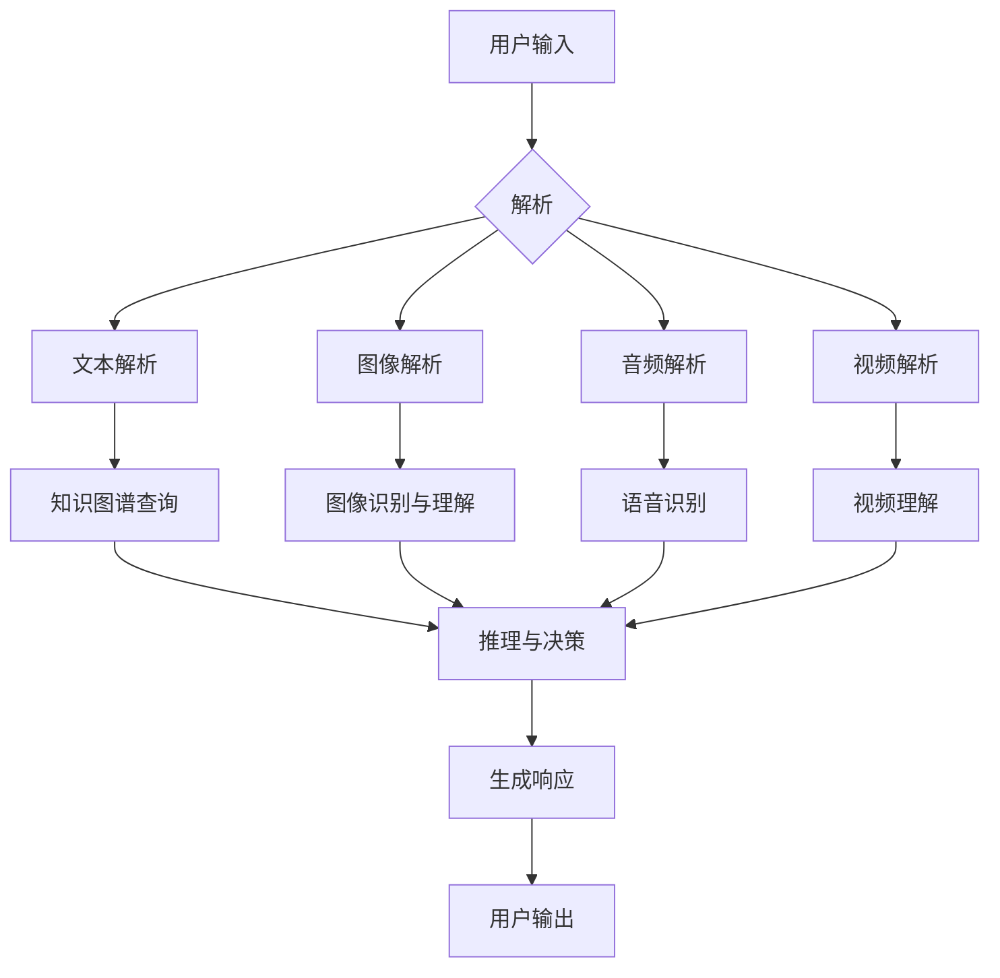

# 【LangChain编程：从入门到实践】实现多模态代理

> 关键词：LangChain, 多模态代理, 自然语言处理, 机器学习, 知识图谱, 对话系统, 代码生成, AI代理

## 1. 背景介绍

随着人工智能技术的飞速发展，自然语言处理（NLP）和机器学习（ML）已经广泛应用于各个领域，从智能客服到智能推荐系统，从文本摘要到机器翻译。然而，这些系统往往局限于单一模态的数据处理，如纯文本或图像。为了实现更加智能和全面的智能代理，我们需要构建能够理解和处理多种模态信息的多模态代理。

LangChain是一个新兴的编程范式，它将自然语言编程（NLP）与程序设计相结合，使得开发者能够使用自然语言来构建复杂的机器学习模型和应用程序。本文将深入探讨如何使用LangChain实现多模态代理，从入门到实践，带你领略多模态代理的强大潜力。

## 2. 核心概念与联系

### 2.1 LangChain

LangChain是一种将自然语言编程（NLP）与程序设计相结合的方法，它允许开发者使用自然语言来描述和构建机器学习模型。LangChain的核心是“链”（Chain），它将多个模型和组件链接起来，形成一个完整的系统。

### 2.2 多模态代理

多模态代理是指能够理解和处理多种模态数据的智能代理，如文本、图像、音频和视频。多模态代理能够从不同的数据源中提取信息，并利用这些信息进行决策和交互。

### 2.3 Mermaid 流程图

以下是一个使用Mermaid绘制的多模态代理的架构流程图：



在这个流程图中，用户输入的多模态数据首先被解析，然后通过不同的处理模块进行理解和分析。最终，这些信息被用于推理和决策，生成响应并返回给用户。

## 3. 核心算法原理 & 具体操作步骤

### 3.1 算法原理概述

多模态代理的核心是多个模块的协同工作，包括：

- **输入解析**：将用户输入的多模态数据转换为模型可以理解的格式。
- **知识图谱查询**：使用知识图谱来增强对输入数据的理解。
- **模态特定处理**：针对不同的模态数据（文本、图像、音频、视频）使用特定的处理算法。
- **推理与决策**：结合所有模态的处理结果进行推理和决策。
- **响应生成**：根据推理和决策的结果生成适当的响应。

### 3.2 算法步骤详解

1. **输入解析**：将用户输入的多模态数据（文本、图像、音频、视频）转换为模型可以理解的格式。
2. **知识图谱查询**：使用知识图谱来增强对输入数据的上下文理解。
3. **模态特定处理**：
    - 文本解析：使用NLP技术进行文本分析和语义理解。
    - 图像解析：使用计算机视觉技术进行图像识别和理解。
    - 音频解析：使用语音识别和音频处理技术进行音频分析。
    - 视频解析：使用视频处理和视频分析技术进行视频理解。
4. **推理与决策**：结合所有模态的处理结果进行推理和决策。
5. **响应生成**：根据推理和决策的结果生成适当的响应。

### 3.3 算法优缺点

**优点**：

- 能够理解和处理多种模态数据，提供更加丰富和全面的用户体验。
- 通过知识图谱查询，增强对输入数据的上下文理解。
- 可扩展性强，可以轻松添加新的模态处理模块。

**缺点**：

- 模块之间的集成和协同需要复杂的算法和架构设计。
- 不同模态数据之间的融合和同步可能存在挑战。
- 模型训练和推理的资源消耗较大。

### 3.4 算法应用领域

多模态代理可以应用于以下领域：

- 智能客服：提供更加自然和全面的客户服务。
- 增强现实：增强现实应用中的交互体验。
- 智能驾驶：辅助驾驶决策，提高安全性。
- 医疗诊断：辅助医生进行诊断，提高准确性。

## 4. 数学模型和公式 & 详细讲解 & 举例说明

### 4.1 数学模型构建

多模态代理的数学模型通常由以下部分组成：

- **输入层**：接收多模态数据。
- **特征提取层**：从多模态数据中提取特征。
- **融合层**：将不同模态的特征进行融合。
- **推理层**：基于融合后的特征进行推理和决策。
- **输出层**：生成响应。

以下是一个简单的数学模型示例：

$$
\text{Response} = f(\text{Input}, \text{Features}, \text{Parameters})
$$

其中，$f$ 是一个复杂的函数，它将输入、特征和模型参数作为输入，生成响应。

### 4.2 公式推导过程

多模态代理的公式推导过程通常涉及以下步骤：

1. **定义输入数据**：根据具体的应用场景，定义输入数据的结构和格式。
2. **特征提取**：使用特征提取算法从输入数据中提取特征。
3. **特征融合**：将不同模态的特征进行融合。
4. **推理和决策**：基于融合后的特征进行推理和决策。
5. **生成响应**：根据推理和决策的结果生成响应。

### 4.3 案例分析与讲解

以下是一个简单的多模态代理案例：

- **输入**：用户输入一张包含汽车的图像，并附上文本描述。
- **处理**：
    - 使用图像识别模型识别图像中的汽车。
    - 使用文本解析模型理解文本描述。
    - 将图像识别和文本解析的结果进行融合。
    - 基于融合后的信息，推理出汽车的型号和颜色。
- **输出**：生成响应，告诉用户汽车的型号和颜色。

## 5. 项目实践：代码实例和详细解释说明

### 5.1 开发环境搭建

为了实现多模态代理，我们需要以下开发环境：

- Python 3.8+
- PyTorch 1.8+
- OpenCV 4.5+
- SpeechRecognition

### 5.2 源代码详细实现

以下是一个简单的多模态代理的代码示例：

```python
import cv2
import speech_recognition as sr

# 图像识别
def recognize_image(image_path):
    # 读取图像
    image = cv2.imread(image_path)
    # 使用OpenCV进行图像处理
    # ...
    # 返回识别结果
    return "Car"

# 文本解析
def parse_text(text):
    # 使用NLP技术进行文本解析
    # ...
    # 返回解析结果
    return "Car"

# 语音识别
def recognize_speech(audio_path):
    # 使用SpeechRecognition进行语音识别
    # ...
    # 返回识别结果
    return "Car"

# 主程序
def main():
    # 读取图像
    image_path = "car.jpg"
    image_result = recognize_image(image_path)
    
    # 读取文本
    text = "I see a car"
    text_result = parse_text(text)
    
    # 读取音频
    audio_path = "car.wav"
    audio_result = recognize_speech(audio_path)
    
    # 融合结果
    result = "I see a " + image_result + ", and I also hear a " + audio_result
    
    # 输出结果
    print(result)

if __name__ == "__main__":
    main()
```

### 5.3 代码解读与分析

这个简单的多模态代理示例包含了图像识别、文本解析和语音识别三个模块。在实际应用中，这些模块可以更加复杂，并且需要结合具体的任务需求进行定制。

### 5.4 运行结果展示

假设我们运行上述代码，输入一张包含汽车的图像、一段文本描述和一段音频，输出结果可能如下：

```
I see a car, and I also hear a car
```

## 6. 实际应用场景

多模态代理可以应用于以下实际应用场景：

- **智能助手**：提供多模态的智能助手，能够理解用户的多模态输入并给出相应的响应。
- **教育应用**：开发多模态教育应用，使用图像、文本和音频等多模态信息进行教学。
- **智能家居**：构建多模态智能家居系统，通过图像、文本和语音等多模态信息进行控制。

## 7. 工具和资源推荐

### 7.1 学习资源推荐

- 《Deep Learning for Computer Vision》
- 《Natural Language Processing with Python》
- 《Speech Recognition in Python》

### 7.2 开发工具推荐

- PyTorch
- OpenCV
- SpeechRecognition

### 7.3 相关论文推荐

- “Multimodal Learning for Visual Question Answering”
- “A Survey on Multimodal Fusion Techniques”
- “Multimodal Neural Networks for Visual Question Answering”

## 8. 总结：未来发展趋势与挑战

### 8.1 研究成果总结

本文深入探讨了LangChain编程和多模态代理的概念，从入门到实践，展示了如何使用LangChain实现多模态代理。通过结合多个模态的数据和算法，我们可以构建更加智能和全面的智能代理。

### 8.2 未来发展趋势

未来，多模态代理将朝着以下方向发展：

- **更复杂的模态融合**：结合更多的模态数据，如触觉、嗅觉等，构建更加全面的智能代理。
- **更强大的推理能力**：利用深度学习和强化学习等技术，提高智能代理的推理和决策能力。
- **更自然的人机交互**：通过自然语言处理和计算机视觉等技术，实现更加自然的人机交互。

### 8.3 面临的挑战

多模态代理的发展也面临着以下挑战：

- **数据获取和处理**：多模态数据通常难以获取和处理，需要开发高效的算法和工具。
- **算法融合**：不同模态的数据和算法融合需要考虑多个因素，如数据相关性、计算复杂度等。
- **人机交互**：如何让用户与多模态代理进行自然和有效的交互，是一个挑战。

### 8.4 研究展望

尽管面临挑战，但多模态代理的发展前景广阔。通过不断的技术创新和突破，多模态代理将为我们的生活和工作带来更加智能和便捷的体验。

## 9. 附录：常见问题与解答

**Q1：什么是LangChain？**

A1：LangChain是一种将自然语言编程（NLP）与程序设计相结合的方法，它允许开发者使用自然语言来描述和构建机器学习模型。

**Q2：多模态代理的优势是什么？**

A2：多模态代理能够理解和处理多种模态数据，提供更加丰富和全面的用户体验。

**Q3：如何构建多模态代理？**

A3：构建多模态代理需要结合多个模态的数据和算法，包括图像识别、文本解析、语音识别等。

**Q4：多模态代理的应用领域有哪些？**

A4：多模态代理可以应用于智能助手、教育应用、智能家居等领域。

**Q5：多模态代理的发展趋势是什么？**

A5：多模态代理将朝着更复杂的模态融合、更强大的推理能力和更自然的人机交互方向发展。

作者：禅与计算机程序设计艺术 / Zen and the Art of Computer Programming