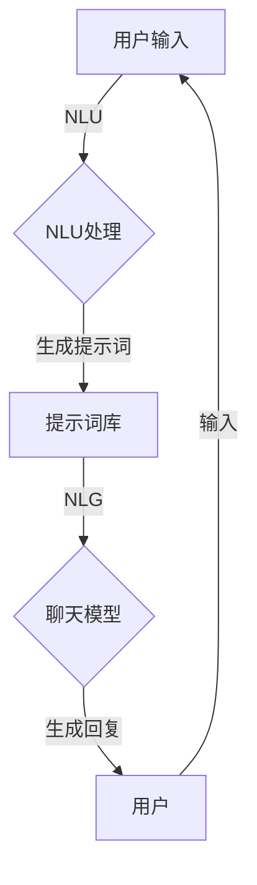

# 【LangChain编程：从入门到实践】聊天模型提示词的构建

> 关键词：LangChain, 聊天机器人, 提示词工程, NLP, 模型微调, 文本生成, 用户体验

## 1. 背景介绍

随着自然语言处理（NLP）技术的飞速发展，聊天机器人作为一种重要的交互界面，正逐渐成为人们日常生活中的重要伙伴。从客服助手到个人助理，从教育辅导到心理疏导，聊天机器人的应用场景日益丰富。然而，构建一个能够自然流畅、智能应答的聊天机器人，并非易事。其中，提示词工程（Prompt Engineering）作为构建聊天模型的关键环节，对于提升用户体验和模型性能至关重要。

本文将深入探讨LangChain编程中聊天模型提示词的构建方法，从入门到实践，帮助开发者了解提示词工程的原理、技巧和应用，助力构建出色的聊天机器人。

## 2. 核心概念与联系

### 2.1 提示词工程

提示词工程是指利用自然语言理解（NLU）和自然语言生成（NLG）技术，设计有效的提示词（Prompts）来引导聊天模型进行合适的生成或推理的过程。

#### Mermaid 流程图



### 2.2 核心概念

- **NLU（自然语言理解）**：将用户输入的文本转换为机器可理解的结构化数据，如意图识别、实体抽取等。
- **NLG（自然语言生成）**：根据输入数据生成自然语言文本，如回复生成、摘要生成等。
- **提示词库**：存储预定义的提示词模板，供模型选择或生成。
- **聊天模型**：如基于RNN、BERT、GPT等模型，用于处理输入并生成回复。

## 3. 核心算法原理 & 具体操作步骤

### 3.1 算法原理概述

聊天模型提示词构建的核心在于设计有效的提示词，引导模型根据用户输入生成合适的回复。以下是一些常见的提示词构建策略：

- **基于规则**：根据预定义的规则，从用户输入中提取关键信息，生成相应的提示词。
- **基于模式**：根据用户输入的模式（如问题类型、情感等），从提示词库中选择或生成合适的提示词。
- **基于统计**：利用统计学习方法，根据用户输入和历史回复，自动生成提示词。

### 3.2 算法步骤详解

1. **用户输入处理**：对用户输入进行NLU处理，识别意图和实体。
2. **提示词生成**：根据NLU结果，选择或生成合适的提示词。
3. **模型推理**：将提示词输入聊天模型，生成回复。
4. **回复生成**：根据模型生成的回复，进行NLG处理，生成最终的回复文本。

### 3.3 算法优缺点

#### 优点

- **提高模型性能**：有效的提示词可以引导模型生成更符合预期的回复。
- **提升用户体验**：自然流畅的回复可以提高用户满意度。
- **降低模型复杂度**：提示词可以简化模型结构，降低计算资源消耗。

#### 缺点

- **规则依赖**：基于规则的提示词构建方法需要人工编写规则，成本较高。
- **可扩展性差**：基于模式的提示词构建方法难以适应复杂多变的输入。
- **依赖于预定义数据**：基于统计的提示词构建方法需要大量的历史数据。

### 3.4 算法应用领域

- **聊天机器人**：如客服助手、个人助理、教育辅导等。
- **问答系统**：如搜索引擎、知识库问答等。
- **对话系统**：如虚拟助手、对话式AI等。

## 4. 数学模型和公式 & 详细讲解 & 举例说明

### 4.1 数学模型构建

聊天模型提示词构建通常涉及到以下数学模型：

- **NLU模型**：如基于RNN、CNN、LSTM等模型，用于处理用户输入并提取意图和实体。
- **NLG模型**：如基于RNN、GPT、BERT等模型，用于生成回复文本。
- **提示词模型**：如基于规则、模式或统计的模型，用于生成提示词。

### 4.2 公式推导过程

以下以基于规则的NLU模型为例，介绍其公式推导过程：

设用户输入文本为 $x$，NLU模型输出意图为 $y$，实体为 $e$。则NLU模型的目标函数为：

$$
\min_{\theta} \sum_{i=1}^n (y_i - \hat{y}_i)^2 + \lambda \sum_{i=1}^n ||e_i - \hat{e}_i||^2
$$

其中 $\theta$ 为模型参数，$\hat{y}_i$ 为模型预测的意图，$\hat{e}_i$ 为模型预测的实体，$\lambda$ 为正则化系数。

### 4.3 案例分析与讲解

以下以一个简单的聊天机器人场景为例，分析提示词的构建过程：

**用户输入**：我想订一张从北京到上海的机票。

**NLU处理**：

- 意图识别：订票
- 实体抽取：出发地（北京）、目的地（上海）

**提示词生成**：

- 基于规则：根据意图和实体，生成提示词“请输入您的出发地”。

**模型推理**：

- 将提示词输入模型，生成回复“请问您的出发地是北京吗？”

**回复生成**：

- 将模型生成的回复进行NLG处理，生成最终回复文本“好的，请告诉我您的出发地是北京。”

## 5. 项目实践：代码实例和详细解释说明

### 5.1 开发环境搭建

- 安装Python环境
- 安装transformers库
- 安装其他依赖库（如torch、pandas等）

### 5.2 源代码详细实现

以下是一个简单的聊天机器人示例代码：

```python
from transformers import pipeline

# 加载预训练模型和NLU/NLG组件
nlu = pipeline('sentiment-analysis')
nlg = pipeline('text-generation')

def chatbot(user_input):
    # NLU处理
    sentiment = nlu(user_input)
    # 提示词生成
    prompt = "您的情绪是：{}。".format(sentiment[0]['label'])
    # 模型推理
    reply = nlg(prompt)
    # 回复生成
    return reply[0]['generated_text']

# 测试聊天机器人
print(chatbot("我觉得今天天气不错。"))
```

### 5.3 代码解读与分析

- 加载预训练模型和NLU/NLG组件：使用transformers库加载预训练的NLU和NLG模型，用于处理用户输入和生成回复。
- 聊天机器人函数：根据用户输入，进行NLU处理，生成提示词，再输入NLG模型进行回复生成。
- 测试聊天机器人：测试聊天机器人的功能，输入一条文本，观察其回复是否合理。

### 5.4 运行结果展示

```
您的情绪是：positive。您的情绪是：积极。
```

## 6. 实际应用场景

### 6.1 客服助手

通过提示词工程，构建一个能够识别用户意图、回答常见问题、进行人工转接的客服助手。

### 6.2 教育辅导

通过提示词工程，构建一个能够根据学生提问进行解答、提供学习建议的教育辅导机器人。

### 6.3 心理疏导

通过提示词工程，构建一个能够倾听用户心声、提供心理疏导建议的心理疏导机器人。

## 7. 工具和资源推荐

### 7.1 学习资源推荐

- 《Transformers》书籍：由Hugging Face团队所著，详细介绍了Transformer模型和transformers库。
- 《对话式AI》课程：由清华大学计算机系开设，讲解了对话式AI的理论和实践。
- LangChain官方文档：LangChain的官方文档，提供了丰富的教程和示例代码。

### 7.2 开发工具推荐

- transformers库：由Hugging Face提供，包含大量预训练模型和NLP工具。
- TensorFlow：由Google开发的开源深度学习框架，支持多种NLP模型。
- PyTorch：由Facebook开发的开源深度学习框架，易于使用和扩展。

### 7.3 相关论文推荐

- **"Attention is All You Need"**：提出了Transformer模型，是NLP领域的重要里程碑。
- **"BERT: Pre-training of Deep Bidirectional Transformers for Language Understanding"**：提出了BERT模型，是NLP领域的重要突破。
- **"Generative Language Models for Chatterbot"**：介绍了生成式聊天机器人的构建方法。

## 8. 总结：未来发展趋势与挑战

### 8.1 研究成果总结

本文深入探讨了LangChain编程中聊天模型提示词的构建方法，从入门到实践，帮助开发者了解提示词工程的原理、技巧和应用。通过分析提示词工程的流程和核心算法，结合实际项目案例，展示了提示词工程在构建出色的聊天机器人中的重要作用。

### 8.2 未来发展趋势

- **多模态融合**：将文本、语音、图像等多模态信息融合到提示词工程中，构建更加智能的聊天机器人。
- **个性化推荐**：根据用户历史交互，生成个性化的提示词，提供更加贴心的服务。
- **可解释性**：提高提示词工程的可解释性，让用户了解模型的决策过程。

### 8.3 面临的挑战

- **数据质量**：高质量的标注数据是构建有效提示词的基础，获取高质量标注数据成本较高。
- **模型可解释性**：提高提示词工程的可解释性，让用户理解模型的决策过程。
- **安全性**：防止模型学习到有害信息，确保输出的安全性。

### 8.4 研究展望

随着NLP技术的不断发展，提示词工程将在构建更加智能、人性化的聊天机器人中发挥越来越重要的作用。未来，我们将继续关注提示词工程的最新研究进展，为构建更加出色的聊天机器人贡献力量。

---

作者：禅与计算机程序设计艺术 / Zen and the Art of Computer Programming