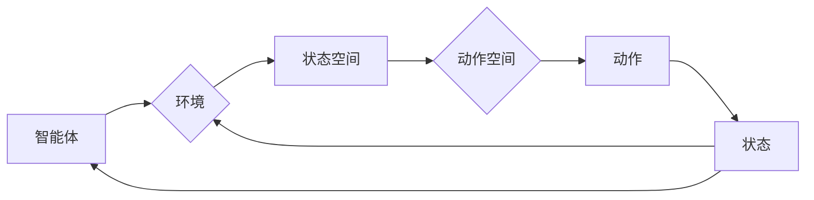

# 一切皆是映射：AI Q-learning国际研究前沿速览

> 关键词：Q-learning，强化学习，智能决策，映射策略，动态环境，状态空间，动作空间，值函数，策略迭代，蒙特卡洛方法，深度学习

## 1. 背景介绍

在人工智能领域，强化学习（Reinforcement Learning，RL）是一种重要的机器学习方法，它通过智能体（Agent）在与环境的交互中学习最优策略，以实现目标最大化。Q-learning作为强化学习中最经典的方法之一，自1989年由Richard S. Sutton和Richard S. Armstrong提出以来，一直备受关注。Q-learning通过学习状态-动作价值函数（Q-function），帮助智能体在给定状态下选择最优动作，从而实现决策优化。

近年来，随着深度学习（Deep Learning，DL）的兴起，Q-learning在处理复杂环境和大规模数据方面取得了显著进展。本文将深入探讨Q-learning的原理、方法以及在国际研究前沿中的应用，旨在为读者提供一个全面且深入的视角。

## 2. 核心概念与联系

### 2.1 核心概念

**Q-learning**：Q-learning是一种基于值函数的强化学习方法。它通过学习状态-动作价值函数（Q-function）来指导智能体的决策过程。在Q-learning中，智能体通过与环境交互，不断更新Q-function，以找到最优策略。

**状态空间（State Space）**：状态空间是所有可能状态集合的抽象表示。每个状态代表智能体在环境中的特定情境。

**动作空间（Action Space）**：动作空间是智能体可以采取的所有可能动作的集合。

**值函数（Value Function）**：值函数是衡量某个状态或策略期望回报的函数。在Q-learning中，Q-function表示在给定状态下采取特定动作的预期回报。

**策略（Policy）**：策略是智能体在给定状态下采取的动作选择规则。

**奖励（Reward）**：奖励是环境对智能体采取动作的反馈。

### 2.2 核心概念原理和架构的 Mermaid 流程图



在上述流程图中，智能体与环境交互，根据当前状态从动作空间中选择动作，执行动作后进入新状态，并从环境中获得奖励。智能体通过学习值函数，不断优化其策略。

## 3. 核心算法原理 & 具体操作步骤

### 3.1 算法原理概述

Q-learning的核心思想是学习一个值函数Q(s,a)，表示在状态s下采取动作a的期望回报。具体来说，Q-learning通过以下步骤进行：

1. 初始化Q-table，将所有Q(s,a)值初始化为0。
2. 初始化智能体策略，通常采用ε-greedy策略，即以一定概率随机选择动作，以探索未知状态。
3. 在环境E中，智能体选择动作a，进入新状态s'。
4. 接收环境给定的奖励r。
5. 更新Q-table中的Q(s,a)值：$$ Q(s,a) = Q(s,a) + \alpha \cdot [r + \gamma \cdot \max_{a'} Q(s',a') - Q(s,a)] $$
6. 返回步骤3，继续学习。

其中，α为学习率，γ为折扣因子，表示未来回报的重要性。

### 3.2 算法步骤详解

1. **初始化**：创建一个Q-table，行代表状态，列代表动作，所有元素初始化为0。

2. **选择动作**：根据当前状态，以ε-greedy策略选择动作。

3. **执行动作**：执行选择的动作，进入新状态。

4. **获得奖励**：从环境中获得奖励。

5. **更新Q-table**：根据Q-learning更新公式，更新Q-table中的Q(s,a)值。

6. **重复步骤2-5**：重复执行上述步骤，直到满足终止条件（如达到最大迭代次数、达到目标状态等）。

### 3.3 算法优缺点

**优点**：

- Q-learning是一种无模型的强化学习方法，不需要对环境有先验知识。
- Q-learning可以学习到最优策略，在许多实际问题中取得了很好的效果。

**缺点**：

- Q-learning需要大量的样本数据进行学习，计算量大。
- Q-table的增长速度随着状态和动作空间的增大而迅速增加，难以处理大规模问题。

### 3.4 算法应用领域

Q-learning在许多领域都有广泛的应用，如：

- **游戏**：棋类游戏、无人驾驶、机器人控制等。
- **金融**：投资组合优化、风险管理等。
- **工业**：生产调度、库存管理、设备维护等。

## 4. 数学模型和公式 & 详细讲解 & 举例说明

### 4.1 数学模型构建

Q-learning的核心是Q-table，它是一个二维数组，行索引表示状态s，列索引表示动作a。Q-table中的元素表示在状态s下采取动作a的期望回报。

### 4.2 公式推导过程

Q-learning的更新公式如下：

$$ Q(s,a) = Q(s,a) + \alpha \cdot [r + \gamma \cdot \max_{a'} Q(s',a') - Q(s,a)] $$

其中，α为学习率，γ为折扣因子，r为奖励，Q(s',a')为在状态s'下采取动作a'的期望回报。

### 4.3 案例分析与讲解

以下是一个简单的Q-learning示例：

假设有一个环境，包含3个状态（s1、s2、s3）和2个动作（a1、a2）。智能体从状态s1开始，采取动作a1，进入状态s2，获得奖励r1。接着，智能体在状态s2采取动作a2，进入状态s3，获得奖励r2。

根据Q-learning的更新公式，我们可以计算出Q-table中的Q(s1,a1)和Q(s2,a2)：

$$ Q(s1,a1) = Q(s1,a1) + \alpha \cdot [r1 + \gamma \cdot \max_{a'} Q(s3,a') - Q(s1,a1)] $$

$$ Q(s2,a2) = Q(s2,a2) + \alpha \cdot [r2 + \gamma \cdot \max_{a'} Q(s3,a') - Q(s2,a2)] $$

通过不断迭代更新Q-table，智能体最终可以学习到最优策略。

## 5. 项目实践：代码实例和详细解释说明

### 5.1 开发环境搭建

以下是使用Python和OpenAI Gym库实现的Q-learning代码示例。首先，需要安装Python和OpenAI Gym：

```bash
pip install gym
```

### 5.2 源代码详细实现

```python
import gym
import numpy as np

# 创建环境
env = gym.make("CartPole-v0")

# 初始化Q-table
num_states = env.observation_space.n
num_actions = env.action_space.n
Q_table = np.zeros((num_states, num_actions))

# 学习参数
alpha = 0.1  # 学习率
gamma = 0.95  # 折扣因子
epsilon = 0.1  # 探索率

# Q-learning训练
for episode in range(1000):
    state = env.reset()
    done = False
    while not done:
        # ε-greedy策略
        if np.random.uniform(0, 1) < epsilon:
            action = env.action_space.sample()
        else:
            action = np.argmax(Q_table[state])

        # 执行动作
        next_state, reward, done, _ = env.step(action)

        # 更新Q-table
        Q_table[state, action] = Q_table[state, action] + alpha * (reward + gamma * np.max(Q_table[next_state]) - Q_table[state, action])

        state = next_state

# 关闭环境
env.close()

# 打印Q-table
print(Q_table)
```

### 5.3 代码解读与分析

- 首先，我们创建了一个CartPole-v0环境，这是一个经典的强化学习环境。
- 然后，我们初始化一个Q-table，用于存储状态-动作价值函数。
- 接着，我们设置学习参数，包括学习率、折扣因子和探索率。
- 在Q-learning训练过程中，我们使用ε-greedy策略选择动作，并执行动作，然后更新Q-table。
- 最后，我们打印出Q-table的内容。

### 5.4 运行结果展示

运行上述代码后，可以看到Q-table的内容，它表示在各个状态下采取各个动作的预期回报。通过不断训练，Q-table中的值会逐渐收敛，表示智能体已经学习到最优策略。

## 6. 实际应用场景

### 6.1 游戏领域

Q-learning在游戏领域有着广泛的应用，如Atari 2600游戏、星际争霸等。通过Q-learning，智能体可以学习到在游戏中取得高分的策略。

### 6.2 金融领域

Q-learning可以应用于金融领域，如投资组合优化、风险管理等。通过学习市场数据，智能体可以预测股票价格走势，并制定相应的投资策略。

### 6.3 工业领域

Q-learning可以应用于工业领域，如生产调度、库存管理、设备维护等。通过学习工业环境，智能体可以优化生产流程，提高生产效率。

## 7. 工具和资源推荐

### 7.1 学习资源推荐

- 《Reinforcement Learning: An Introduction》（Richard S. Sutton and Andrew G. Barto）
- 《Artificial Intelligence: A Modern Approach》（Stuart Russell and Peter Norvig）
- 《Deep Reinforcement Learning》（David Silver et al.）

### 7.2 开发工具推荐

- OpenAI Gym：开源的强化学习环境库。
- TensorFlow：开源的深度学习框架。
- PyTorch：开源的深度学习框架。

### 7.3 相关论文推荐

- Q-Learning (Richard S. Sutton and Richard S. Armstrong)
- Deep Q-Networks (Volodymyr Mnih et al.)
- Asynchronous Advantage Actor-Critic (Mikael Henaff et al.)

## 8. 总结：未来发展趋势与挑战

### 8.1 研究成果总结

Q-learning作为一种经典的强化学习方法，在许多领域都取得了显著的应用成果。随着深度学习的兴起，Q-learning得到了进一步的发展，如深度Q网络（DQN）、异步优势演员-评论家（A3C）等。

### 8.2 未来发展趋势

- 深度学习与Q-learning的进一步结合，如深度Q网络（DQN）、深度确定性策略梯度（DDPG）等。
- 多智能体强化学习（Multi-Agent Reinforcement Learning，MARL）的发展。
- 强化学习与深度学习、迁移学习等其他机器学习方法的融合。

### 8.3 面临的挑战

- 状态和动作空间爆炸问题。
- 学习效率低下。
- 策略的稳定性问题。

### 8.4 研究展望

未来，Q-learning等强化学习方法将在以下方面取得突破：

- 状态和动作空间的压缩。
- 学习效率的提升。
- 策略的稳定性和可解释性的提高。

## 9. 附录：常见问题与解答

**Q1：什么是状态-动作价值函数（Q-function）？**

A：状态-动作价值函数（Q-function）是衡量在给定状态下采取特定动作的期望回报的函数。它可以帮助智能体选择最优动作。

**Q2：什么是ε-greedy策略？**

A：ε-greedy策略是一种探索与利用的平衡策略，其中ε表示探索概率。当ε大于0时，智能体会以概率ε随机选择动作，以探索未知状态；当ε等于0时，智能体总是选择Q-function值最大的动作，以利用已学到的知识。

**Q3：Q-learning如何处理连续动作空间？**

A：Q-learning可以处理连续动作空间，但需要使用一些技术，如网格化、随机采样等。

**Q4：Q-learning与深度学习的结合有哪些优势？**

A：深度学习可以处理复杂的特征表示，而Q-learning可以学习状态-动作价值函数，两者结合可以构建更强大的强化学习模型。

**Q5：Q-learning在实际应用中存在哪些挑战？**

A：Q-learning在实际应用中存在状态和动作空间爆炸、学习效率低下、策略的稳定性问题等挑战。

作者：禅与计算机程序设计艺术 / Zen and the Art of Computer Programming