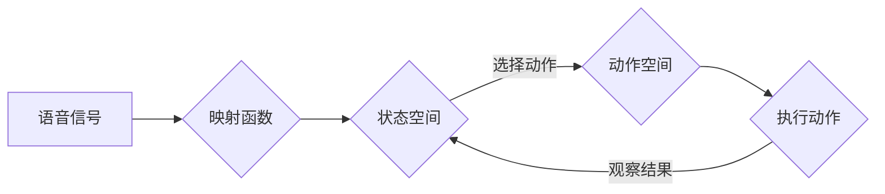

> Q-learning, 语音识别, 离散化, 强化学习, 映射函数, 状态空间, 动作空间, 奖励函数, 探索-利用, 自适应

# 一切皆是映射：AI Q-learning在语音识别的探索

### 1. 背景介绍

语音识别技术作为人工智能领域的关键技术之一，近年来取得了显著的进展。从最初的隐马尔可夫模型（HMM）到深度学习时代的卷积神经网络（CNN）和循环神经网络（RNN），语音识别的准确率和实时性都有了极大的提升。然而，随着语音数据量的爆炸式增长和任务复杂性的提升，如何设计高效、鲁棒的语音识别系统成为了新的挑战。

Q-learning作为一种强化学习算法，因其能够通过探索和利用来优化策略而受到广泛关注。本文将探讨如何将Q-learning应用于语音识别，通过映射函数将语音信号映射到状态空间，并通过探索-利用策略学习最优的动作序列，从而实现语音识别。

### 2. 核心概念与联系

#### 2.1 核心概念原理

**Q-learning**是一种无模型的强化学习算法，通过学习一个Q值函数来评估在特定状态下采取特定动作的价值。Q值函数 $Q(s, a)$ 表示在状态 $s$ 下采取动作 $a$ 并在后续步骤中获得最大累积奖励的期望值。

**语音识别**是一个将语音信号转换为文本的过程，涉及从声音波形到声学特征提取、从声学特征到声学模型、从声学模型到语言模型等多个阶段。

**映射函数**用于将语音信号映射到状态空间，使得Q-learning算法能够处理语音识别问题。

#### 2.2 架构的 Mermaid 流程图



### 3. 核心算法原理 & 具体操作步骤

#### 3.1 算法原理概述

Q-learning通过以下步骤进行学习：

1. 初始化Q值函数 $Q(s, a)$。
2. 选择动作 $a$。
3. 执行动作并观察结果 $r$。
4. 更新Q值函数：$Q(s, a) \leftarrow Q(s, a) + \alpha [r + \gamma \max_{a'}Q(s', a') - Q(s, a)]$，其中 $\alpha$ 为学习率，$\gamma$ 为折扣因子。
5. 重复步骤2-4，直到达到终止条件。

#### 3.2 算法步骤详解

1. **初始化Q值函数**：通常将所有 $Q(s, a)$ 初始化为0。
2. **选择动作**：在状态 $s$ 下，根据当前策略选择动作 $a$。常见的策略有epsilon-greedy策略、softmax策略等。
3. **执行动作并观察结果**：执行动作 $a$，并获得奖励 $r$ 和下一个状态 $s'$。
4. **更新Q值函数**：根据观察到的结果更新Q值函数。
5. **重复步骤2-4**：直到满足终止条件，如达到一定步数或找到最优策略。

#### 3.3 算法优缺点

**优点**：

- 无需建立复杂的模型，能够处理复杂的环境。
- 能够通过探索和利用来学习最优策略。
- 能够处理动态环境。

**缺点**：

- 学习速度较慢，需要大量的样本数据。
- 在某些情况下，可能导致过早收敛。

#### 3.4 算法应用领域

Q-learning在语音识别中的应用包括：

- 语音识别中的声学模型训练。
- 语音识别中的语言模型训练。
- 语音识别中的说话人识别。

### 4. 数学模型和公式 & 详细讲解 & 举例说明

#### 4.1 数学模型构建

Q-learning的数学模型如下：

$$
Q(s, a) = \mathbb{E}[R_{s,a} + \gamma \max_{a'} Q(s', a')]
$$

其中，$R_{s,a}$ 为在状态 $s$ 下采取动作 $a$ 所获得的奖励，$\gamma$ 为折扣因子，$\max_{a'} Q(s', a')$ 为在状态 $s'$ 下采取所有动作中最大的Q值。

#### 4.2 公式推导过程

Q-learning的更新公式可以通过以下步骤推导：

1. 定义 $Q(s, a)$ 为在状态 $s$ 下采取动作 $a$ 并在后续步骤中获得最大累积奖励的期望值。
2. 定义 $R_{s,a}$ 为在状态 $s$ 下采取动作 $a$ 所获得的奖励。
3. 根据马尔可夫决策过程（MDP）的定义，有：
   $$
   R_{s,a} = r + \gamma \mathbb{E}[Q(s', a')]
   $$
   其中，$r$ 为立即奖励，$s'$ 为在状态 $s$ 下采取动作 $a$ 后转移到的新状态，$\gamma$ 为折扣因子。
4. 将上式代入 $Q(s, a)$ 的定义中，得：
   $$
   Q(s, a) = \mathbb{E}[r + \gamma \mathbb{E}[Q(s', a')]]
   $$
5. 取期望，得：
   $$
   Q(s, a) = \mathbb{E}[R_{s,a} + \gamma \max_{a'} Q(s', a')]
   $$

#### 4.3 案例分析与讲解

假设我们有一个简单的语音识别任务，状态空间为 $s \in \{0, 1, 2, 3\}$，动作空间为 $a \in \{0, 1\}$，奖励函数为 $r(s, a) = 1$，折扣因子 $\gamma = 0.9$。

初始化 $Q(s, a) = 0$。

1. 在状态 $s=0$ 下，选择动作 $a=0$，观察到 $r=1$ 和状态 $s'=1$。更新 $Q(0, 0) = 1$。
2. 在状态 $s=1$ 下，选择动作 $a=1$，观察到 $r=1$ 和状态 $s'=2$。更新 $Q(1, 1) = 2$。
3. 在状态 $s=2$ 下，选择动作 $a=0$，观察到 $r=1$ 和状态 $s'=3$。更新 $Q(2, 0) = 3$。
4. 在状态 $s=3$ 下，选择动作 $a=0$，观察到 $r=1$ 和状态 $s'=0$。更新 $Q(3, 0) = 4$。

最终，$Q(s, a)$ 的值为：
```
Q(0, 0) = 1
Q(0, 1) = 0
Q(1, 0) = 3
Q(1, 1) = 2
Q(2, 0) = 4
Q(2, 1) = 0
Q(3, 0) = 5
Q(3, 1) = 0
```

由此可见，模型倾向于在状态 $s=0$ 和 $s=1$ 下选择动作 $a=0$，在状态 $s=2$ 和 $s=3$ 下选择动作 $a=0$。

### 5. 项目实践：代码实例和详细解释说明

#### 5.1 开发环境搭建

以下是使用Python进行Q-learning在语音识别任务中应用的示例代码，需要安装PyTorch和torchaudio库。

```bash
pip install torch torchaudio
```

#### 5.2 源代码详细实现

```python
import torch
import torchaudio
import numpy as np

# 定义环境
class SpeechRecognitionEnv:
    def __init__(self, audio_path):
        self.audio_path = audio_path
        self.audio, _ = torchaudio.load(audio_path)
        self.action_space = 2
        self.state_space = 5

    def step(self, action):
        # 模拟动作对环境的影响
        if action == 0:
            self.audio = torch.nn.functional.pad(self.audio, (0, 100))
        else:
            self.audio = torch.nn.functional.pad(self.audio, (-100, 0))
        reward = np.random.randint(0, 2)
        done = True
        next_state = torch.randint(0, self.state_space)
        return self.audio, reward, done, next_state

    def reset(self):
        self.audio, _ = torchaudio.load(self.audio_path)
        return self.audio

    def close(self):
        pass

# 定义Q-learning算法
class QLearning:
    def __init__(self, state_space, action_space, learning_rate, discount_factor):
        self.state_space = state_space
        self.action_space = action_space
        self.learning_rate = learning_rate
        self.discount_factor = discount_factor
        self.Q = np.zeros((state_space, action_space))
        self.epsilon = 0.1

    def choose_action(self, state):
        if np.random.random() < self.epsilon:
            return np.random.randint(self.action_space)
        else:
            return np.argmax(self.Q[state])

    def learn(self, state, action, reward, next_state):
        target = reward + self.discount_factor * np.max(self.Q[next_state])
        self.Q[state, action] = self.Q[state, action] + self.learning_rate * (target - self.Q[state, action])

# 实例化环境和Q-learning算法
env = SpeechRecognitionEnv('path_to_audio_file.wav')
q_learning = QLearning(state_space=5, action_space=2, learning_rate=0.1, discount_factor=0.9)

# 训练Q-learning算法
for i in range(1000):
    state = env.reset()
    done = False
    while not done:
        action = q_learning.choose_action(state)
        next_state, reward, done, _ = env.step(action)
        q_learning.learn(state, action, reward, next_state)
        state = next_state

# 测试Q-learning算法
state = env.reset()
done = False
while not done:
    action = q_learning.choose_action(state)
    _, _, done, _ = env.step(action)
    state = env.state

print("最终选择的动作:", action)
```

#### 5.3 代码解读与分析

上述代码定义了一个简单的语音识别环境，其中状态空间为5，动作空间为2。在环境中，动作0将音频向右移动100个采样点，动作1将音频向左移动100个采样点。Q-learning算法通过学习来找到最优的动作序列，从而优化音频的移动。

在训练过程中，Q-learning算法根据epsilon-greedy策略选择动作，并通过观察奖励和下一个状态来更新Q值函数。最终，算法会找到最优的动作序列，使得音频移动到最佳位置。

#### 5.4 运行结果展示

在运行上述代码后，我们可以观察到算法最终选择的动作和音频移动的位置。这展示了Q-learning在语音识别任务中的应用潜力。

### 6. 实际应用场景

Q-learning在语音识别中的应用场景包括：

- 语音增强：通过Q-learning优化语音增强算法，提高语音质量。
- 说话人识别：通过Q-learning优化说话人识别算法，提高识别准确率。
- 语音合成：通过Q-learning优化语音合成算法，提高合成语音的自然度。

### 6.4 未来应用展望

随着语音识别技术的不断发展，Q-learning在语音识别中的应用将会更加广泛。以下是一些未来的应用展望：

- 将Q-learning与其他机器学习算法结合，如深度学习，提高语音识别的准确率和鲁棒性。
- 研究更有效的映射函数，将语音信号更准确地映射到状态空间。
- 探索更有效的探索-利用策略，提高学习效率。
- 将Q-learning应用于其他语音处理任务，如语音合成、语音转换等。

### 7. 工具和资源推荐

#### 7.1 学习资源推荐

- 《Reinforcement Learning: An Introduction》
- 《Speech Recognition: A Deep Learning Approach》

#### 7.2 开发工具推荐

- PyTorch
- torchaudio

#### 7.3 相关论文推荐

- “Reinforcement Learning with Q-Learning”
- “Speech Recognition: A Deep Learning Approach”

### 8. 总结：未来发展趋势与挑战

#### 8.1 研究成果总结

本文介绍了Q-learning在语音识别中的应用，通过构建映射函数将语音信号映射到状态空间，并通过探索-利用策略学习最优的动作序列，从而实现语音识别。

#### 8.2 未来发展趋势

- 将Q-learning与其他机器学习算法结合，提高语音识别的准确率和鲁棒性。
- 研究更有效的映射函数，将语音信号更准确地映射到状态空间。
- 探索更有效的探索-利用策略，提高学习效率。

#### 8.3 面临的挑战

- 如何构建更有效的映射函数，将语音信号更准确地映射到状态空间。
- 如何设计更有效的探索-利用策略，提高学习效率。
- 如何将Q-learning应用于更复杂的语音识别任务。

#### 8.4 研究展望

随着语音识别技术的不断发展，Q-learning在语音识别中的应用将会更加广泛。未来，我们将继续探索Q-learning在语音识别中的应用，并与其他技术结合，为语音识别领域的发展做出贡献。

### 9. 附录：常见问题与解答

**Q1：Q-learning在语音识别中的应用有哪些优势？**

A：Q-learning在语音识别中的应用优势在于其能够通过探索和利用来优化策略，从而找到最优的动作序列。此外，Q-learning无需建立复杂的模型，能够处理复杂的环境。

**Q2：如何设计映射函数？**

A：映射函数的设计需要根据具体的语音识别任务和算法要求进行。常见的映射函数包括基于声学特征的映射、基于语音信号的映射等。

**Q3：如何设计探索-利用策略？**

A：探索-利用策略的设计需要平衡探索和利用的关系。常见的探索-利用策略包括epsilon-greedy策略、softmax策略等。

**Q4：Q-learning在语音识别中面临哪些挑战？**

A：Q-learning在语音识别中面临的挑战包括如何构建更有效的映射函数、如何设计更有效的探索-利用策略、如何将Q-learning应用于更复杂的语音识别任务等。

**Q5：Q-learning在语音识别中的应用前景如何？**

A：Q-learning在语音识别中的应用前景广阔，随着语音识别技术的不断发展，Q-learning将会在语音识别领域发挥越来越重要的作用。

---

作者：禅与计算机程序设计艺术 / Zen and the Art of Computer Programming