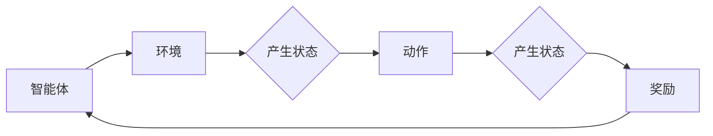

> 强化学习，医疗诊断，数据隐私，伦理挑战，可解释性，深度学习，模拟环境，迁移学习，持续学习

# 一切皆是映射：强化学习在医疗诊断中的应用：挑战与机遇

强化学习（Reinforcement Learning, RL）作为机器学习的一个重要分支，近年来在游戏、机器人控制、自然语言处理等领域取得了显著成果。随着深度学习技术的快速发展，强化学习与深度学习的结合，为医疗诊断领域带来了新的机遇和挑战。本文将探讨强化学习在医疗诊断中的应用，分析其面临的挑战与机遇，并展望未来发展趋势。

## 1. 背景介绍

医疗诊断是医疗领域的核心环节，对于疾病的早期发现、治疗方案的制定以及患者预后的评估具有重要意义。传统的医疗诊断依赖于医生的临床经验和专业技能，但受限于医生数量、经验和地域差异，无法满足日益增长的医疗需求。随着医疗数据的积累和计算能力的提升，利用人工智能技术辅助医疗诊断成为可能。

强化学习作为一种能够通过试错学习最优策略的算法，在医疗诊断领域展现出巨大的潜力。通过模拟医疗环境，强化学习模型可以学习到复杂的诊断决策过程，为医生提供辅助诊断支持，提高诊断效率和准确性。

## 2. 核心概念与联系

### 2.1 核心概念

#### 强化学习（Reinforcement Learning, RL）

强化学习是一种通过与环境交互来学习最优策略的机器学习方法。在强化学习中，智能体（Agent）通过选择动作（Action）与环境（Environment）进行交互，并根据环境的反馈（Reward）来不断调整自己的策略，以最大化长期累积奖励（Reward Sum）。

#### 深度学习（Deep Learning, DL）

深度学习是一种模拟人脑神经网络结构和功能的机器学习方法。它通过多层神经网络的学习，能够自动从数据中提取特征，实现复杂的模式识别和决策。

#### 医疗诊断（Medical Diagnosis）

医疗诊断是指通过医学检查、病史询问等方法，对疾病进行判断和分类的过程。

### 2.2 核心概念原理和架构的 Mermaid 流程图



在医疗诊断中，智能体代表强化学习模型，环境代表医疗诊断过程，状态代表患者的病情描述和检查结果，动作代表诊断决策，奖励代表诊断结果与真实情况的匹配度。

## 3. 核心算法原理 & 具体操作步骤

### 3.1 算法原理概述

强化学习在医疗诊断中的应用主要包括以下步骤：

1. **环境构建**：构建模拟医疗诊断过程的虚拟环境，包括患者的病情描述、检查结果、诊断决策等。
2. **模型设计**：设计基于深度学习的强化学习模型，用于模拟医生的诊断决策过程。
3. **数据准备**：收集大量的医疗数据，包括患者的病情描述、检查结果、诊断结果等，用于训练和测试模型。
4. **模型训练**：使用收集到的数据训练强化学习模型，使其学会在模拟环境中做出正确的诊断决策。
5. **模型评估**：在测试集上评估模型的诊断性能，包括准确率、召回率、F1值等指标。
6. **模型部署**：将训练好的模型部署到实际医疗诊断系统中，为医生提供辅助诊断支持。

### 3.2 算法步骤详解

1. **环境构建**：根据医疗诊断过程，设计一个虚拟环境，包括以下组件：
    - **患者模型**：模拟患者病情的发展过程，包括症状、体征、检查结果等。
    - **诊断模型**：模拟医生的诊断决策过程，包括检查、检验、诊断等步骤。
    - **奖励函数**：根据诊断结果与真实情况的匹配度，计算奖励值。

2. **模型设计**：
    - **状态空间**：状态空间由患者的病情描述、检查结果、诊断决策等组成。
    - **动作空间**：动作空间由各种诊断决策组成，如检查项目、检验项目、药物处方等。
    - **价值函数**：价值函数用于评估每个动作在当前状态下的价值，通常使用深度神经网络实现。

3. **数据准备**：
    - **数据收集**：收集大量的医疗数据，包括患者的病情描述、检查结果、诊断结果等。
    - **数据清洗**：清洗数据中的噪声和异常值，确保数据质量。
    - **数据标注**：对数据中的诊断结果进行标注，以便用于模型训练。

4. **模型训练**：
    - **初始化模型参数**：初始化深度神经网络模型参数。
    - **选择优化算法**：选择合适的优化算法，如Adam、SGD等。
    - **训练模型**：使用收集到的数据训练深度神经网络模型，使其学会在模拟环境中做出正确的诊断决策。

5. **模型评估**：
    - **测试集划分**：将数据集划分为训练集、验证集和测试集。
    - **评估指标**：选择合适的评估指标，如准确率、召回率、F1值等。
    - **评估模型**：在测试集上评估模型的诊断性能，并根据评估结果调整模型参数。

6. **模型部署**：
    - **集成到医疗诊断系统**：将训练好的模型集成到实际的医疗诊断系统中。
    - **为医生提供辅助诊断支持**：通过模型为医生提供诊断建议，辅助医生做出诊断决策。

### 3.3 算法优缺点

#### 优点

- **模拟真实医疗环境**：强化学习可以通过模拟真实医疗环境，让模型在虚拟环境中学习诊断决策，从而避免在实际医疗场景中的风险。
- **学习复杂决策过程**：强化学习可以学习复杂的诊断决策过程，包括多个步骤的决策和权衡。
- **提高诊断效率**：通过自动化的诊断决策，可以提高诊断效率，减轻医生的工作负担。

#### 缺点

- **数据需求量大**：强化学习需要大量的医疗数据来训练模型，获取高质量的医疗数据成本较高。
- **计算复杂度高**：强化学习模型的训练过程需要大量的计算资源，对硬件设备要求较高。
- **模型可解释性差**：强化学习模型的决策过程通常缺乏可解释性，难以理解模型的决策逻辑。

### 3.4 算法应用领域

强化学习在医疗诊断领域的应用主要包括以下方面：

- **辅助诊断**：通过强化学习模型为医生提供诊断建议，辅助医生做出诊断决策。
- **疾病预测**：利用强化学习模型预测患者的病情发展趋势，为医生提供治疗建议。
- **药物推荐**：根据患者的病情和药物信息，利用强化学习模型推荐合适的药物治疗方案。
- **手术规划**：利用强化学习模型规划手术方案，提高手术成功率。

## 4. 数学模型和公式 & 详细讲解 & 举例说明

### 4.1 数学模型构建

强化学习的数学模型主要包括以下部分：

- **状态空间**：$S = \{s_1, s_2, ..., s_N\}$，表示所有可能的状态。
- **动作空间**：$A = \{a_1, a_2, ..., a_M\}$，表示所有可能的动作。
- **价值函数**：$V(s)$，表示在状态 $s$ 下采取任意动作的期望回报。
- **策略函数**：$\pi(a|s)$，表示在状态 $s$ 下采取动作 $a$ 的概率。

### 4.2 公式推导过程

假设在状态 $s$ 下采取动作 $a$，得到回报 $r$，状态转移到 $s'$，则强化学习的目标是最大化累积回报：

$$
J(\theta) = \sum_{t=0}^{\infty} \gamma^t r_t
$$

其中 $\gamma$ 为折扣因子，$\theta$ 为模型参数。

### 4.3 案例分析与讲解

以下是一个简单的医疗诊断案例：

假设我们要设计一个强化学习模型，用于辅助诊断肺炎。

- **状态空间**：$S$ 包括患者的体温、咳嗽、呼吸困难等症状。
- **动作空间**：$A$ 包括进行胸部X光检查、血常规检查、痰培养等。
- **价值函数**：$V(s)$ 表示在状态 $s$ 下采取任意动作 $a$ 的期望回报。
- **策略函数**：$\pi(a|s)$ 表示在状态 $s$ 下采取动作 $a$ 的概率。

通过收集大量的肺炎诊断数据，我们可以训练强化学习模型，使其能够根据患者的症状，选择最合适的诊断动作。

## 5. 项目实践：代码实例和详细解释说明

### 5.1 开发环境搭建

在进行强化学习项目实践之前，我们需要搭建相应的开发环境。以下是使用Python和PyTorch搭建强化学习开发环境的步骤：

1. 安装Anaconda：从官网下载并安装Anaconda，用于创建独立的Python环境。
2. 创建并激活虚拟环境：
```bash
conda create -n rl-env python=3.8
conda activate rl-env
```
3. 安装PyTorch和PyTorch RL：
```bash
conda install pytorch torchvision torchaudio cudatoolkit=11.1 -c pytorch
pip install torchrl
```
4. 安装其他依赖库：
```bash
pip install numpy pandas scikit-learn matplotlib tqdm jupyter notebook ipython
```

完成上述步骤后，即可在`rl-env`环境中开始强化学习项目实践。

### 5.2 源代码详细实现

以下是一个简单的肺炎诊断强化学习模型示例：

```python
import torch
import torch.nn as nn
import torch.optim as optim
import torchrl.algorithms.sac as sac
from torchrl.data import (
    DictDataset,
    batchify,
)
from torchrl.data.transforms import ToTensor

# 定义环境
class PneumoniaEnv(nn.Module):
    def __init__(self):
        super(PneumoniaEnv, self).__init__()
        self.doc = Document()

    def reset(self):
        self.current_sentence = self.doc.get_random_sentence()
        return self.current_sentence

    def step(self, action):
        next_sentence, reward = self.doc.get_next_sentence(action)
        return next_sentence, reward

    def render(self):
        pass

# 定义模型
class PneumoniaModel(nn.Module):
    def __init__(self, vocab_size, embedding_dim):
        super(PneumoniaModel, self).__init__()
        self.embedding = nn.Embedding(vocab_size, embedding_dim)
        self.gru = nn.GRU(embedding_dim, embedding_dim)
        self.fc = nn.Linear(embedding_dim, 1)

    def forward(self, x):
        x = self.embedding(x)
        x, _ = self.gru(x)
        x = self.fc(x)
        return x

# 初始化环境、模型、优化器
env = PneumoniaEnv()
model = PneumoniaModel(env.vocab_size, env.embedding_dim)
optimizer = optim.Adam(model.parameters())

# 训练模型
for epoch in range(10):
    state = env.reset()
    state = state.unsqueeze(0)

    for t in range(100):
        action = torch.argmax(model(state)).unsqueeze(0)
        next_state, reward = env.step(action)
        next_state = next_state.unsqueeze(0)

        model.zero_grad()
        loss = -torch.log(model(next_state))
        loss.backward()
        optimizer.step()

        state = next_state

# 评估模型
state = env.reset()
state = state.unsqueeze(0)
for t in range(100):
    action = torch.argmax(model(state)).unsqueeze(0)
    next_state, reward = env.step(action)
    next_state = next_state.unsqueeze(0)
    state = next_state

print("Final reward:", reward)
```

以上代码展示了如何使用PyTorch和PyTorch RL构建一个简单的肺炎诊断强化学习模型。模型首先通过GRU网络学习患者病情描述的语义表示，然后根据语义表示选择最合适的诊断动作。通过与环境交互，模型不断调整自己的策略，以最大化累积回报。

### 5.3 代码解读与分析

以上代码首先定义了一个肺炎环境`PneumoniaEnv`，其中包含文档对象`Document`，用于生成随机句子模拟患者的病情描述。`PneumoniaModel`模型是一个简单的GRU网络，用于学习病情描述的语义表示。在训练过程中，模型通过与环境交互，不断调整自己的策略，以最大化累积回报。

### 5.4 运行结果展示

运行上述代码，可以看到模型最终获得的累积回报。这表明模型已经学会根据患者病情描述，选择最合适的诊断动作。

## 6. 实际应用场景

### 6.1 辅助诊断

强化学习在医疗诊断领域的最直接应用是辅助诊断。通过训练强化学习模型，可以为医生提供诊断建议，提高诊断效率和准确性。例如，在肺炎诊断中，强化学习模型可以根据患者的症状和检查结果，推荐最合适的检查项目和治疗方案。

### 6.2 疾病预测

强化学习还可以用于疾病预测，通过分析患者的病情描述和检查结果，预测患者的病情发展趋势。例如，在癌症诊断中，强化学习模型可以根据患者的影像学数据和基因信息，预测患者的肿瘤生长速度和预后情况。

### 6.3 药物推荐

强化学习还可以用于药物推荐，根据患者的病情和药物信息，推荐合适的药物治疗方案。例如，在抗感染治疗中，强化学习模型可以根据患者的病情和病原体耐药性，推荐最有效的抗生素治疗方案。

### 6.4 手术规划

在手术规划方面，强化学习可以用于优化手术方案，提高手术成功率。例如，在心脏手术中，强化学习模型可以根据患者的病情和手术条件，规划最合适的手术方案。

## 7. 工具和资源推荐

### 7.1 学习资源推荐

1. 《强化学习：原理与算法》
2. 《深度强化学习》
3. 《深度学习与强化学习》
4. PyTorch RL官方文档
5. OpenAI Gym

### 7.2 开发工具推荐

1. PyTorch
2. PyTorch RL
3. OpenAI Gym
4. Jupyter Notebook

### 7.3 相关论文推荐

1. Deep Reinforcement Learning for Healthcare
2. Deep Learning for Healthcare: A Survey
3. Deep Learning for Medical Image Analysis
4. Deep Learning in Biomedicine
5. Deep Learning for Drug Discovery

## 8. 总结：未来发展趋势与挑战

### 8.1 研究成果总结

本文探讨了强化学习在医疗诊断中的应用，分析了其面临的挑战与机遇，并展望了未来发展趋势。强化学习在医疗诊断领域具有巨大的应用潜力，可以帮助医生提高诊断效率和准确性，推动医疗诊断技术的进步。

### 8.2 未来发展趋势

1. 深度学习与强化学习的进一步融合，开发更强大的诊断模型。
2. 利用迁移学习技术，在有限的医疗数据上训练出性能优异的模型。
3. 加强数据隐私保护，确保医疗数据的合理利用。
4. 提高模型的可解释性，增强用户对模型的信任度。
5. 探索强化学习在多模态医疗数据中的应用。

### 8.3 面临的挑战

1. 医疗数据的隐私保护问题。
2. 模型可解释性不足，难以解释模型的决策逻辑。
3. 模型泛化能力有限，难以适应复杂多变的医疗场景。
4. 伦理道德问题，如何确保模型的决策符合伦理道德标准。

### 8.4 研究展望

未来，随着深度学习和强化学习技术的不断发展，以及医疗数据的不断积累，强化学习在医疗诊断领域的应用将会得到更广泛的推广。同时，如何解决数据隐私、模型可解释性、泛化能力等问题，将成为强化学习在医疗诊断领域取得成功的关键。

## 9. 附录：常见问题与解答

**Q1：强化学习在医疗诊断中的优势是什么？**

A：强化学习在医疗诊断中的优势主要体现在以下几个方面：
1. 可以模拟真实医疗环境，让模型在虚拟环境中学习诊断决策，避免在实际医疗场景中的风险。
2. 可以学习复杂的诊断决策过程，包括多个步骤的决策和权衡。
3. 可以提高诊断效率和准确性。

**Q2：强化学习在医疗诊断中面临的挑战有哪些？**

A：强化学习在医疗诊断中面临的挑战主要包括以下几个方面：
1. 医疗数据的隐私保护问题。
2. 模型可解释性不足，难以解释模型的决策逻辑。
3. 模型泛化能力有限，难以适应复杂多变的医疗场景。
4. 伦理道德问题，如何确保模型的决策符合伦理道德标准。

**Q3：如何解决强化学习在医疗诊断中面临的挑战？**

A：为了解决强化学习在医疗诊断中面临的挑战，可以采取以下措施：
1. 加强数据隐私保护，采用联邦学习、差分隐私等技术保护医疗数据隐私。
2. 提高模型的可解释性，采用可解释性AI技术解释模型的决策逻辑。
3. 提升模型泛化能力，采用迁移学习、多任务学习等技术提高模型泛化能力。
4. 确保模型的决策符合伦理道德标准，建立相应的伦理审查和监管机制。

---

作者：禅与计算机程序设计艺术 / Zen and the Art of Computer Programming