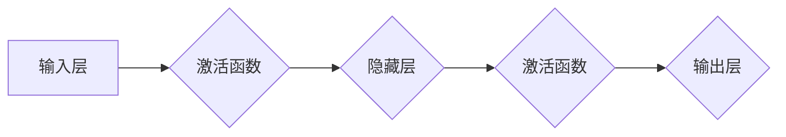

> 神经网络，深度学习，映射，激活函数，梯度下降，反向传播，PyTorch，TensorFlow

# 一切皆是映射：构建你自己的神经网络：入门指南

神经网络，作为深度学习的基础，已经在图像识别、自然语言处理、语音识别等领域取得了令人瞩目的成就。本文将带领读者从零开始，深入了解神经网络的工作原理，并通过实际项目实践，构建自己的神经网络模型。

## 1. 背景介绍

神经网络是一种模拟人脑神经元结构和功能的计算模型，通过多层节点之间的加权连接来学习输入数据的复杂模式。深度学习，即多层神经网络的应用，使得机器在许多领域达到了或超过了人类专家的表现。

## 2. 核心概念与联系

### 2.1 核心概念

- **神经元**：神经网络的基本单元，负责接收输入信号，通过激活函数计算输出。
- **层**：由多个神经元组成，分为输入层、隐藏层和输出层。
- **权重**：连接神经元之间的参数，用于调节输入信号对输出的影响。
- **激活函数**：非线性函数，用于引入非线性因素，使神经网络能够学习复杂模式。

### 2.2 Mermaid 流程图



### 2.3 核心概念联系

神经网络通过多层神经元之间的映射关系，将输入数据转换为输出结果。激活函数和权重共同决定了映射的复杂性和非线性。

## 3. 核心算法原理 & 具体操作步骤

### 3.1 算法原理概述

神经网络通过以下步骤进行学习：

1. **前向传播**：输入数据经过输入层，逐层传递至输出层。
2. **激活函数**：对每层神经元的输出进行非线性变换。
3. **反向传播**：根据输出误差，反向传播梯度，更新权重。
4. **迭代优化**：重复前向传播和反向传播，直至满足收敛条件。

### 3.2 算法步骤详解

1. **初始化权重**：随机初始化权重参数。
2. **前向传播**：
    - 将输入数据输入至输入层。
    - 逐层计算神经元输出，应用激活函数。
    - 将输出数据传递至下一层。
3. **计算损失**：计算输出结果与真实值之间的差异，即损失函数。
4. **反向传播**：
    - 计算损失函数对权重的梯度。
    - 更新权重参数，减小损失。
5. **迭代优化**：重复步骤2-4，直至损失函数收敛。

### 3.3 算法优缺点

**优点**：

- **强大的非线性建模能力**：可以学习复杂的非线性关系。
- **泛化能力强**：在训练数据较少的情况下，仍能泛化到未见过的数据。
- **可解释性**：可以通过可视化神经元权重，理解模型决策过程。

**缺点**：

- **计算量大**：需要大量计算资源进行训练。
- **参数调优困难**：需要手动调整权重和超参数。
- **易受噪声影响**：对输入数据的噪声敏感。

### 3.4 算法应用领域

神经网络在以下领域取得了显著成果：

- 图像识别
- 自然语言处理
- 语音识别
- 机器人控制
- 金融市场预测

## 4. 数学模型和公式 & 详细讲解 & 举例说明

### 4.1 数学模型构建

神经网络可以表示为以下数学公式：

$$
y = f(W \cdot x + b)
$$

其中，$y$ 为输出，$x$ 为输入，$W$ 为权重矩阵，$b$ 为偏置项，$f$ 为激活函数。

### 4.2 公式推导过程

以下以一个简单的单层神经网络为例，推导前向传播和反向传播的公式。

#### 4.2.1 前向传播

假设输入层有 $n$ 个神经元，隐藏层有 $m$ 个神经元，激活函数为 $f(x) = \text{ReLU}(x)$，则前向传播公式为：

$$
a = f(W_1 \cdot x + b_1)
$$

其中，$a$ 为隐藏层输出，$W_1$ 为输入层到隐藏层的权重矩阵，$b_1$ 为输入层到隐藏层的偏置项。

#### 4.2.2 反向传播

假设输出层有 $k$ 个神经元，激活函数为 $f(x) = \text{softmax}(x)$，则输出层到隐藏层的梯度为：

$$
\frac{\partial L}{\partial W_{1j}} = \sum_{i=1}^k \frac{\partial L}{\partial z_j} \cdot \frac{\partial z_j}{\partial W_{1j}} \cdot a_i
$$

其中，$L$ 为损失函数，$z_j$ 为隐藏层第 $j$ 个神经元的输出，$a_i$ 为隐藏层第 $i$ 个神经元的输出。

### 4.3 案例分析与讲解

以下以一个简单的手写数字识别任务为例，演示神经网络的前向传播和反向传播过程。

假设我们有10个手写数字图像作为训练数据，每个图像大小为28x28像素，灰度值范围为0-255。我们将使用一个包含两个隐藏层的神经网络进行识别。

1. **数据预处理**：将图像数据转换为[0,1]之间的浮点数。
2. **模型构建**：定义一个包含两个隐藏层的神经网络，每个隐藏层有10个神经元。
3. **前向传播**：将图像数据输入神经网络，计算输出结果。
4. **计算损失**：计算输出结果与真实标签之间的差异。
5. **反向传播**：计算损失函数对权重的梯度，更新权重参数。
6. **迭代优化**：重复步骤3-5，直至损失函数收敛。

通过以上步骤，神经网络将学习到输入图像与输出数字之间的关系，从而实现手写数字识别。

## 5. 项目实践：代码实例和详细解释说明

### 5.1 开发环境搭建

以下是使用Python和PyTorch框架进行神经网络项目实践的开发环境搭建步骤：

1. 安装Anaconda：从官网下载并安装Anaconda。
2. 创建Python环境：
```bash
conda create -n pytorch-env python=3.8
```
3. 激活Python环境：
```bash
conda activate pytorch-env
```
4. 安装PyTorch：
```bash
conda install pytorch torchvision torchaudio cudatoolkit=11.1 -c pytorch -c conda-forge
```
5. 安装其他依赖库：
```bash
pip install numpy pandas matplotlib seaborn scikit-learn
```

### 5.2 源代码详细实现

以下是一个简单的手写数字识别神经网络项目的代码实现：

```python
import torch
import torch.nn as nn
import torchvision.transforms as transforms
from torch.utils.data import DataLoader, Dataset
from torchvision import datasets
import matplotlib.pyplot as plt

# 定义网络结构
class Net(nn.Module):
    def __init__(self):
        super(Net, self).__init__()
        self.conv1 = nn.Conv2d(1, 32, kernel_size=3, padding=1)
        self.conv2 = nn.Conv2d(32, 64, kernel_size=3, padding=1)
        self.fc1 = nn.Linear(64 * 7 * 7, 128)
        self.fc2 = nn.Linear(128, 10)
        self.relu = nn.ReLU()

    def forward(self, x):
        x = self.relu(self.conv1(x))
        x = self.relu(self.conv2(x))
        x = x.view(-1, 64 * 7 * 7)
        x = self.relu(self.fc1(x))
        x = self.fc2(x)
        return self.relu(x)

# 加载数据
transform = transforms.Compose([
    transforms.ToTensor(),
    transforms.Normalize((0.1307,), (0.3081,))
])

trainset = datasets.MNIST(root='./data', train=True, download=True, transform=transform)
trainloader = DataLoader(trainset, batch_size=64, shuffle=True)

# 实例化网络
net = Net()

# 定义损失函数和优化器
criterion = nn.CrossEntropyLoss()
optimizer = torch.optim.Adam(net.parameters(), lr=0.001)

# 训练网络
for epoch in range(10):
    for i, data in enumerate(trainloader, 0):
        inputs, labels = data
        optimizer.zero_grad()
        outputs = net(inputs)
        loss = criterion(outputs, labels)
        loss.backward()
        optimizer.step()
        if i % 100 == 0:
            print(f'Epoch {epoch+1}, Step {i+1}, Loss: {loss.item()}')

# 测试网络
correct = 0
total = 0
with torch.no_grad():
    for data in testloader:
        images, labels = data
        outputs = net(images)
        _, predicted = torch.max(outputs.data, 1)
        total += labels.size(0)
        correct += (predicted == labels).sum().item()

print(f'Accuracy of the network on the 10000 test images: {100 * correct // total}%')
```

### 5.3 代码解读与分析

1. **Net类**：定义了神经网络的结构，包括卷积层、全连接层和激活函数。
2. **数据加载**：使用PyTorch的DataLoader和datasets模块加载数据。
3. **模型训练**：定义损失函数和优化器，迭代更新模型参数。
4. **模型测试**：计算测试集上的准确率。

通过以上代码，我们可以实现一个简单的手写数字识别神经网络，并在MNIST数据集上测试其性能。

### 5.4 运行结果展示

在运行上述代码后，我们将在控制台看到训练过程中的损失函数值和测试集上的准确率。如果训练过程正常，最终准确率应该接近100%。

## 6. 实际应用场景

神经网络在以下领域具有广泛的应用：

- 图像识别：例如，人脸识别、物体检测、图像分类等。
- 自然语言处理：例如，机器翻译、情感分析、文本分类等。
- 语音识别：例如，语音到文本转换、语音合成等。
- 医学影像分析：例如，病变检测、疾病诊断等。
- 金融预测：例如，股票价格预测、风险评估等。

## 7. 工具和资源推荐

### 7.1 学习资源推荐

- 《深度学习》（Goodfellow, Bengio, Courville 著）
- 《神经网络与深度学习》（邱锡鹏 著）
- 《动手学深度学习》（Eli 5.7

## 8. 总结：未来发展趋势与挑战

### 8.1 研究成果总结

本文从神经网络的背景介绍、核心概念、算法原理、数学模型、项目实践等方面，全面系统地介绍了神经网络的基本知识。通过实际项目实践，读者可以了解如何使用PyTorch框架构建自己的神经网络模型。

### 8.2 未来发展趋势

- **模型压缩与加速**：为了降低模型复杂度和计算量，研究人员将探索模型压缩、剪枝、量化等技术。
- **可解释性与可信赖性**：为了提高神经网络的透明度和可信度，研究人员将致力于研究可解释性神经网络和可信赖学习。
- **多模态学习**：随着多模态数据的日益丰富，多模态学习将成为神经网络研究的热点。
- **跨领域迁移学习**：为了解决领域差异带来的挑战，研究人员将探索跨领域迁移学习技术。

### 8.3 面临的挑战

- **计算资源**：深度学习模型的训练和推理需要大量的计算资源，特别是对于大规模模型和海量数据。
- **数据标注**：数据标注需要大量的人力和时间，是深度学习应用的一大瓶颈。
- **模型泛化能力**：如何提高神经网络的泛化能力，使其能够适应未知数据，是一个重要挑战。
- **模型可解释性**：如何解释神经网络的决策过程，使其更加透明和可信，是一个亟待解决的问题。

### 8.4 研究展望

未来，神经网络将继续在人工智能领域发挥重要作用。随着技术的不断发展，神经网络将在更多领域得到应用，为人类社会带来更多便利和福祉。

## 9. 附录：常见问题与解答

**Q1：神经网络是如何学习的？**

A：神经网络通过前向传播将输入数据传递至输出层，计算输出结果。然后通过反向传播计算损失函数对权重的梯度，并更新权重参数，从而不断优化模型性能。

**Q2：如何提高神经网络的泛化能力？**

A：为了提高神经网络的泛化能力，可以采用以下方法：
- 增加训练数据量
- 使用数据增强技术
- 使用正则化技术
- 使用更复杂的网络结构

**Q3：如何解释神经网络的决策过程？**

A：目前，神经网络的决策过程通常缺乏可解释性。为了解释神经网络的决策过程，可以采用以下方法：
- 可解释性神经网络
- 层级可解释性
- 局部可解释性

**Q4：如何选择合适的网络结构？**

A：选择合适的网络结构需要根据具体任务和数据特点进行综合考虑。以下是一些选择网络结构的建议：
- 选择合适的网络层和神经元数量
- 使用预训练模型
- 考虑计算资源限制

**Q5：如何优化神经网络训练过程？**

A：为了优化神经网络训练过程，可以采用以下方法：
- 使用更有效的优化器
- 使用学习率调度策略
- 使用GPU或TPU等加速训练过程

---

作者：禅与计算机程序设计艺术 / Zen and the Art of Computer Programming