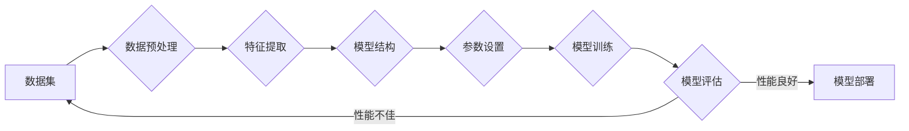

> 深度学习，调参艺术，实践窍门，参数优化，模型性能，神经网络，超参数，正则化，交叉验证

# 一切皆是映射：深度学习的调参艺术与实践窍门

## 1. 背景介绍

深度学习作为人工智能领域的核心技术，已经在图像识别、自然语言处理、语音识别等领域取得了显著的成果。然而，深度学习模型的训练并非易事，其中调参（Hyperparameter Tuning）是关键环节。本文将深入探讨深度学习的调参艺术，分享实践窍门，帮助读者在深度学习项目中取得更好的模型性能。

### 1.1 问题的由来

深度学习模型由大量的参数组成，这些参数需要通过训练数据进行学习。然而，并不是所有的参数都是同等重要的。一些参数对模型性能影响较大，而另一些参数则相对较小。因此，如何选择合适的参数值，以实现模型在特定任务上的最优性能，成为了深度学习研究中的一个重要问题。

### 1.2 研究现状

目前，调参方法主要分为以下几类：

- **网格搜索（Grid Search）**：通过遍历所有可能的参数组合，找出最优的参数配置。
- **随机搜索（Random Search）**：在给定范围内随机选择参数值，避免网格搜索的搜索空间浪费。
- **贝叶斯优化（Bayesian Optimization）**：利用贝叶斯统计方法，根据历史数据选择下一次搜索的最优方向。
- **遗传算法（Genetic Algorithm）**：模拟自然选择过程，通过交叉和变异操作寻找最优参数。

### 1.3 研究意义

有效的调参可以显著提高模型性能，减少训练时间，降低计算成本。对于深度学习研究者而言，掌握调参艺术是必备的技能。

## 2. 核心概念与联系

### 2.1 核心概念原理

以下是大模型微调涉及的核心概念及其原理的Mermaid流程图：



### 2.2 节点解释

- **A 数据集**：深度学习模型的输入数据，通常为训练集和测试集。
- **B 数据预处理**：包括数据清洗、归一化、数据增强等操作，以提高数据质量和模型的鲁棒性。
- **C 特征提取**：从原始数据中提取有用的特征，用于模型训练。
- **D 模型结构**：选择合适的神经网络结构，如卷积神经网络（CNN）、循环神经网络（RNN）等。
- **E 参数设置**：设置模型的超参数，如学习率、批大小、层数、神经元数等。
- **F 模型训练**：使用训练数据对模型进行训练，学习数据中的规律。
- **G 模型评估**：使用测试集评估模型的性能，调整参数以达到最佳效果。
- **H 模型部署**：将训练好的模型部署到实际应用中。

## 3. 核心算法原理 & 具体操作步骤

### 3.1 算法原理概述

调参的主要目标是找到一组最优的参数配置，以使模型在特定任务上取得最佳性能。这通常涉及以下步骤：

1. **参数搜索空间定义**：确定需要调整的超参数及其可能取值范围。
2. **搜索算法选择**：选择合适的搜索算法，如网格搜索、随机搜索、贝叶斯优化等。
3. **模型训练与评估**：使用搜索算法遍历参数空间，训练模型并评估性能。
4. **结果分析与选择**：根据评估结果，选择最优的参数配置。

### 3.2 算法步骤详解

1. **定义搜索空间**：确定需要调整的超参数及其可能取值范围。例如，学习率、批大小、层数、神经元数等。
2. **选择搜索算法**：根据任务复杂度和计算资源，选择合适的搜索算法。网格搜索适用于参数较少的情况，而贝叶斯优化和随机搜索适用于参数较多的情况。
3. **模型训练与评估**：使用搜索算法遍历参数空间，对于每一组参数，使用训练数据训练模型，并在测试数据上评估性能。
4. **结果分析与选择**：根据评估结果，选择最优的参数配置。如果需要，可以尝试不同的搜索算法或参数组合，以进一步提高性能。

### 3.3 算法优缺点

- **网格搜索**：
  - 优点：简单易用，结果直观。
  - 缺点：搜索空间较大时效率低，容易遗漏最优参数。
- **随机搜索**：
  - 优点：效率较高，能够找到较好的参数配置。
  - 缺点：结果不如网格搜索直观。
- **贝叶斯优化**：
  - 优点：能够找到较好的参数配置，效率较高。
  - 缺点：需要一定的数学知识，实现较为复杂。
- **遗传算法**：
  - 优点：能够找到较好的参数配置，适用于复杂问题。
  - 缺点：实现较为复杂，需要较多的计算资源。

### 3.4 算法应用领域

调参方法广泛应用于各个深度学习任务，如图像识别、自然语言处理、语音识别等。

## 4. 数学模型和公式 & 详细讲解 & 举例说明

### 4.1 数学模型构建

深度学习模型的数学模型通常由以下部分组成：

- **输入层**：接收原始数据。
- **隐藏层**：通过激活函数进行非线性变换。
- **输出层**：输出模型预测结果。

以下是一个简单的神经网络数学模型：

$$
\begin{align*}
z^{[l]} &= W^{[l]} \cdot a^{[l-1]} + b^{[l]} \\
a^{[l]} &= \sigma(z^{[l]})
\end{align*}
$$

其中，$W^{[l]}$ 和 $b^{[l]}$ 分别为第 $l$ 层的权重和偏置，$a^{[l-1]}$ 为上一层的激活输出，$a^{[l]}$ 为第 $l$ 层的激活输出，$\sigma$ 为激活函数。

### 4.2 公式推导过程

神经网络的训练过程涉及到损失函数的优化，常用的损失函数包括均方误差（MSE）、交叉熵损失（Cross-Entropy Loss）等。以下以交叉熵损失为例进行推导：

假设模型的输出为 $\hat{y} = \sigma(W^{[2]} \cdot a^{[1]} + b^{[2]})$，真实标签为 $y$，则交叉熵损失函数为：

$$
\begin{align*}
L &= -\frac{1}{m} \sum_{i=1}^m (y_{i} \log \hat{y}_{i} + (1-y_{i}) \log (1-\hat{y}_{i})) \\
&= -\frac{1}{m} \sum_{i=1}^m (y_{i} \log(\sigma(W^{[2]} \cdot a^{[1]} + b^{[2]})) + (1-y_{i}) \log(1-\sigma(W^{[2]} \cdot a^{[1]} + b^{[2]})))
\end{align*}
$$

其中，$m$ 为样本数量，$\sigma$ 为Sigmoid激活函数。

### 4.3 案例分析与讲解

以下是一个使用Python和PyTorch进行交叉熵损失计算的示例：

```python
import torch
import torch.nn as nn

# 创建一个简单的神经网络模型
class SimpleNet(nn.Module):
    def __init__(self):
        super(SimpleNet, self).__init__()
        self.fc = nn.Linear(10, 2)

    def forward(self, x):
        return self.fc(x)

# 创建模型实例
model = SimpleNet()

# 创建输入和标签
x = torch.randn(64, 10)
y = torch.randint(0, 2, (64,))

# 创建交叉熵损失函数
criterion = nn.CrossEntropyLoss()

# 计算损失
loss = criterion(model(x), y)

print(loss)
```

在上面的代码中，我们首先创建了一个简单的神经网络模型 `SimpleNet`，该模型包含一个全连接层。然后，我们创建了一些随机数据和标签，并使用 `nn.CrossEntropyLoss` 创建了一个交叉熵损失函数。最后，我们使用 `model(x)` 计算模型的预测结果，并使用 `criterion` 计算损失。

## 5. 项目实践：代码实例和详细解释说明

### 5.1 开发环境搭建

在进行调参实践之前，我们需要准备开发环境。以下是使用Python进行深度学习开发的常见环境搭建步骤：

1. 安装Anaconda：从Anaconda官网下载并安装Anaconda，用于创建独立的Python环境。
2. 创建并激活虚拟环境：
```bash
conda create -n deep-learning-env python=3.8
conda activate deep-learning-env
```
3. 安装PyTorch：从PyTorch官网下载安装命令，根据CUDA版本选择合适的版本。
4. 安装其他依赖库：
```bash
pip install numpy pandas scikit-learn matplotlib tqdm jupyter notebook
```

### 5.2 源代码详细实现

以下是一个使用PyTorch进行图像分类任务的示例代码：

```python
import torch
import torch.nn as nn
import torch.optim as optim
from torch.utils.data import DataLoader
from torchvision import datasets, transforms
from torch.utils.data.sampler import SubsetRandomSampler

# 创建数据集
transform = transforms.Compose([
    transforms.Resize(256),
    transforms.CenterCrop(224),
    transforms.ToTensor(),
    transforms.Normalize(mean=[0.485, 0.456, 0.406], std=[0.229, 0.224, 0.225]),
])

train_dataset = datasets.ImageFolder(root='path/to/train/data', transform=transform)
train_loader = DataLoader(dataset=train_dataset, batch_size=32, shuffle=True)

# 创建模型
model = nn.Sequential(
    nn.Conv2d(3, 32, kernel_size=3, padding=1),
    nn.ReLU(),
    nn.MaxPool2d(kernel_size=2, stride=2),
    nn.Conv2d(32, 64, kernel_size=3, padding=1),
    nn.ReLU(),
    nn.MaxPool2d(kernel_size=2, stride=2),
    nn.Flatten(),
    nn.Linear(64 * 56 * 56, 10)
)

# 定义损失函数和优化器
criterion = nn.CrossEntropyLoss()
optimizer = optim.Adam(model.parameters(), lr=0.001)

# 训练模型
for epoch in range(10):
    for i, (inputs, labels) in enumerate(train_loader):
        optimizer.zero_grad()
        outputs = model(inputs)
        loss = criterion(outputs, labels)
        loss.backward()
        optimizer.step()
        if i % 100 == 0:
            print(f"Epoch {epoch+1}, Iteration {i}, Loss: {loss.item()}")
```

在上面的代码中，我们首先创建了一个简单的卷积神经网络模型，用于图像分类任务。然后，我们使用CIFAR-10数据集进行训练。训练过程中，我们使用Adam优化器和交叉熵损失函数进行模型训练。

### 5.3 代码解读与分析

在上面的代码中，我们首先定义了数据预处理和加载函数，将图像数据转换为PyTorch张量，并进行归一化处理。然后，我们创建了一个简单的卷积神经网络模型，并使用CIFAR-10数据集进行训练。

### 5.4 运行结果展示

在训练完成后，我们可以使用测试集评估模型的性能。以下是一个简单的测试代码示例：

```python
test_dataset = datasets.CIFAR10(root='path/to/test/data', train=False, download=True, transform=transform)
test_loader = DataLoader(dataset=test_dataset, batch_size=32, shuffle=False)

# 评估模型
correct = 0
total = 0
with torch.no_grad():
    for inputs, labels in test_loader:
        outputs = model(inputs)
        _, predicted = torch.max(outputs.data, 1)
        total += labels.size(0)
        correct += (predicted == labels).sum().item()

print(f"Accuracy of the network on the 10,000 test images: {100 * correct // total}%")
```

在上面的代码中，我们首先加载测试数据集，并创建一个DataLoader。然后，我们遍历测试数据，计算模型的预测结果，并计算准确率。

## 6. 实际应用场景

### 6.1 图像识别

深度学习在图像识别领域的应用非常广泛，如图像分类、目标检测、图像分割等。通过调参优化模型，可以提高模型在图像识别任务上的准确率。

### 6.2 自然语言处理

深度学习在自然语言处理领域的应用包括文本分类、机器翻译、情感分析等。通过调参优化模型，可以提高模型在自然语言处理任务上的性能。

### 6.3 语音识别

深度学习在语音识别领域的应用包括语音转文本、语音合成等。通过调参优化模型，可以提高模型在语音识别任务上的准确率和鲁棒性。

## 7. 工具和资源推荐

### 7.1 学习资源推荐

- **《深度学习》（Goodfellow et al.）**：这是一本经典的深度学习入门书籍，详细介绍了深度学习的理论基础、算法和实现。
- **《神经网络与深度学习》（邱锡鹏）**：这是一本中文深度学习入门书籍，适合中文读者。
- **PyTorch官方文档**：PyTorch官方文档提供了丰富的教程和示例，是学习PyTorch的必备资料。

### 7.2 开发工具推荐

- **PyTorch**：PyTorch是一个开源的深度学习框架，具有易用性、灵活性和高性能的特点。
- **TensorFlow**：TensorFlow是Google开发的深度学习框架，具有强大的社区支持和丰富的应用场景。
- **Keras**：Keras是一个高级神经网络API，构建在TensorFlow和Theano之上。

### 7.3 相关论文推荐

- **“A Comprehensive Survey on Deep Learning for Image Classification: What, How and Why”**：这篇综述文章全面介绍了深度学习在图像分类领域的应用。
- **“Sequence to Sequence Learning with Neural Networks”**：这篇论文介绍了序列到序列学习的原理和实现。
- **“Deep Learning for Natural Language Processing (NLP)”**：这篇论文介绍了深度学习在自然语言处理领域的应用。

## 8. 总结：未来发展趋势与挑战

### 8.1 研究成果总结

本文深入探讨了深度学习的调参艺术，分享了实践窍门，并介绍了相关的工具和资源。通过本文的学习，读者可以更好地理解调参的重要性，并掌握调参方法。

### 8.2 未来发展趋势

随着深度学习技术的不断发展，调参方法也将不断演进。以下是一些未来发展趋势：

- **自动化调参**：利用强化学习、贝叶斯优化等方法，实现自动化调参。
- **多模态学习**：将文本、图像、语音等多模态数据融合，进行多模态学习。
- **无监督学习**：利用无监督学习技术，降低对标注数据的依赖。

### 8.3 面临的挑战

尽管调参技术在不断发展，但仍面临着以下挑战：

- **参数空间爆炸**：随着模型复杂度的增加，参数空间呈指数级增长，搜索难度增大。
- **调参成本高昂**：调参过程需要大量的计算资源，成本较高。
- **模型可解释性**：深度学习模型的决策过程通常难以解释，需要进一步研究可解释性方法。

### 8.4 研究展望

为了应对上述挑战，未来的研究需要在以下方面进行探索：

- **优化搜索算法**：设计更高效的搜索算法，降低调参成本。
- **引入先验知识**：将先验知识融入调参过程，提高搜索效率。
- **可解释性研究**：提高模型的可解释性，帮助用户理解模型的决策过程。

相信通过不懈的努力，深度学习的调参技术将会取得更大的突破，为人工智能技术的发展贡献力量。

## 9. 附录：常见问题与解答

**Q1：调参对深度学习模型性能的影响有多大？**

A：调参对深度学习模型性能的影响非常大。合适的参数配置可以使模型在特定任务上取得最佳性能，而错误的参数配置则可能导致模型性能下降。

**Q2：如何选择合适的搜索算法？**

A：选择合适的搜索算法需要考虑任务复杂度、计算资源等因素。对于参数较少的情况，可以使用网格搜索；对于参数较多的情况，可以使用贝叶斯优化或随机搜索。

**Q3：如何降低调参成本？**

A：为了降低调参成本，可以采用以下方法：
- **使用预训练模型**：利用预训练模型进行微调，减少需要调整的参数数量。
- **自动化调参**：利用自动化调参工具，减少人工干预。
- **迁移学习**：将已有知识迁移到新任务，降低对新数据的依赖。

**Q4：如何提高模型的可解释性？**

A：提高模型的可解释性需要从以下几个方面进行探索：
- **特征可视化**：可视化模型的特征表示，帮助用户理解模型的决策过程。
- **解释性模型**：设计可解释的模型，如决策树、规则基模型等。
- **注意力机制**：利用注意力机制，帮助用户理解模型在处理输入数据时的关注点。

通过不断的研究和探索，深度学习的调参技术将会取得更大的突破，为人工智能技术的发展贡献力量。

---

作者：禅与计算机程序设计艺术 / Zen and the Art of Computer Programming