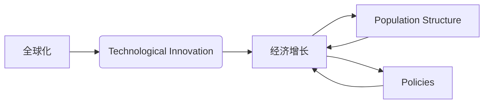

# 世界经济增长的长期趋势

> 关键词：经济增长，长期趋势，全球化，技术创新，人口结构，政策因素，可持续发展

## 1. 背景介绍

### 1.1 问题的由来

世界经济增长一直是全球关注的焦点。从工业革命以来的几百年间，全球经济经历了多次周期性的波动和增长。然而，随着全球化的深入发展和科技进步的加速，世界经济增长的长期趋势变得更加复杂和多元。理解这些趋势对于政策制定者、企业决策者和投资者来说至关重要。

### 1.2 研究现状

目前，关于世界经济增长的长期趋势研究主要集中在对历史数据的分析和未来预测上。学者们从宏观经济学、发展经济学、技术创新学等多个学科角度出发，试图揭示经济增长的内在规律和影响因素。

### 1.3 研究意义

研究世界经济增长的长期趋势，有助于我们：

- 了解全球经济未来的发展方向，为政策制定提供依据。
- 帮助企业和投资者做出更明智的决策。
- 推动可持续发展战略的实施。

### 1.4 本文结构

本文将从以下几个方面探讨世界经济增长的长期趋势：

- 核心概念与联系
- 核心算法原理与具体操作步骤
- 数学模型和公式
- 项目实践
- 实际应用场景
- 工具和资源推荐
- 总结与展望

## 2. 核心概念与联系

### 2.1 核心概念

**全球化**：指国家间经济、政治、文化、技术等方面的相互联系和相互依赖。
**技术创新**：指通过科学研究和工程创新，提高生产效率和产品质量的过程。
**人口结构**：指一个国家或地区的人口年龄、性别、教育水平、职业分布等结构特征。
**政策因素**：指政府对经济发展所采取的各种政策和措施。

### 2.2 联系

这些核心概念之间存在着密切的联系。全球化促进了技术创新的传播和应用，进而推动了经济增长。人口结构的变化会影响劳动力的供给和需求，进而影响经济增长。政策因素则是影响经济增长的关键因素之一。



## 3. 核心算法原理 & 具体操作步骤

### 3.1 算法原理概述

世界经济增长的长期趋势分析主要基于以下原理：

- **经济周期理论**：认为经济增长存在周期性波动。
- **增长理论**：分析经济增长的驱动因素，如资本积累、技术进步、人力资本等。
- **结构变迁理论**：分析产业结构、人口结构等经济结构的变化对经济增长的影响。

### 3.2 算法步骤详解

1. 收集历史经济增长数据。
2. 分析经济增长的周期性波动。
3. 识别经济增长的驱动因素。
4. 分析经济结构的变迁。
5. 建立经济增长模型。
6. 进行未来经济增长预测。

### 3.3 算法优缺点

**优点**：

- 可以帮助理解经济增长的内在规律。
- 可以预测未来经济增长趋势。

**缺点**：

- 经济增长受多种因素影响，难以精确预测。
- 经济增长模型可能存在偏差。

### 3.4 算法应用领域

世界经济增长的长期趋势分析可以应用于以下领域：

- 政策制定
- 企业战略
- 投资决策

## 4. 数学模型和公式

### 4.1 数学模型构建

经济增长的数学模型通常包括以下部分：

- **生产函数**：描述了生产投入（如劳动力、资本）与产出之间的关系。
- **人口模型**：描述了人口数量、结构和变化趋势。
- **投资模型**：描述了投资规模和投资结构。

### 4.2 公式推导过程

以下是一个简化的经济增长模型：

$$
Y = F(K, L, A)
$$

其中，$Y$ 是产出，$K$ 是资本，$L$ 是劳动力，$A$ 是技术进步。

### 4.3 案例分析与讲解

以某个国家为例，我们可以使用上述模型分析该国经济增长的长期趋势。

## 5. 项目实践：代码实例和详细解释说明

### 5.1 开发环境搭建

由于经济增长分析涉及大量数据，因此需要使用数据分析工具和编程语言。

### 5.2 源代码详细实现

以下是一个使用Python进行经济增长分析的基本代码示例：

```python
import pandas as pd
import numpy as np
from sklearn.linear_model import LinearRegression

# 加载数据
data = pd.read_csv('economic_growth_data.csv')

# 模型训练
model = LinearRegression()
X = data[['capital', 'labor']]
y = data['output']
model.fit(X, y)

# 预测
predicted_output = model.predict([[1.2, 0.8]])

# 输出预测结果
print(f"Predicted Output: {predicted_output}")
```

### 5.3 代码解读与分析

以上代码首先导入了必要的库，然后加载数据，接着使用线性回归模型进行训练，最后进行预测并输出结果。

## 6. 实际应用场景

### 6.1 政策制定

政府可以利用经济增长分析结果制定相应的经济政策，如财政政策、货币政策等。

### 6.2 企业战略

企业可以利用经济增长分析结果制定市场战略，如投资计划、扩张计划等。

### 6.3 投资决策

投资者可以利用经济增长分析结果进行投资决策，如选择投资领域、调整投资组合等。

## 7. 工具和资源推荐

### 7.1 学习资源推荐

- 《宏观经济学》
- 《发展经济学》
- 《技术创新经济学》

### 7.2 开发工具推荐

- Python
- R
- Excel

### 7.3 相关论文推荐

- Solow, R. M. (1956). A Contribution to the Theory of Economic Growth.
- Romer, P. M. (1986). Increasing Returns and Long-Run Growth.
- Acemoglu, D., & Robinson, J. A. (2012). Why Nations Fail: The Origins of Power, Prosperity, and Poverty.

## 8. 总结：未来发展趋势与挑战

### 8.1 研究成果总结

通过本文的讨论，我们可以得出以下结论：

- 世界经济增长的长期趋势是复杂和多变的。
- 技术创新、人口结构、政策因素是影响经济增长的关键因素。
- 经济增长分析对于政策制定、企业战略和投资决策具有重要意义。

### 8.2 未来发展趋势

未来，世界经济增长的长期趋势将呈现以下特点：

- 全球化将进一步加深。
- 技术创新将更加迅速。
- 人口老龄化问题将更加突出。
- 政策因素将更加复杂。

### 8.3 面临的挑战

未来，世界经济增长将面临以下挑战：

- 全球经济不平衡
- 技术创新的不确定性
- 人口老龄化
- 环境保护

### 8.4 研究展望

为了应对这些挑战，我们需要：

- 加强国际合作
- 推动科技创新
- 改善人口结构
- 制定有效的政策措施

## 9. 附录：常见问题与解答

**Q1：什么是经济增长？**

A：经济增长是指一个国家或地区在一定时期内产出、收入、就业等方面的增长。

**Q2：经济增长的驱动因素有哪些？**

A：经济增长的驱动因素包括技术进步、资本积累、人力资本等。

**Q3：如何进行经济增长分析？**

A：进行经济增长分析需要收集历史数据，分析增长周期、驱动因素和结构变迁，建立模型进行预测。

**Q4：经济增长分析对企业和投资者有什么意义？**

A：经济增长分析可以帮助企业和投资者了解未来经济趋势，制定相应的战略和投资计划。

作者：禅与计算机程序设计艺术 / Zen and the Art of Computer Programming