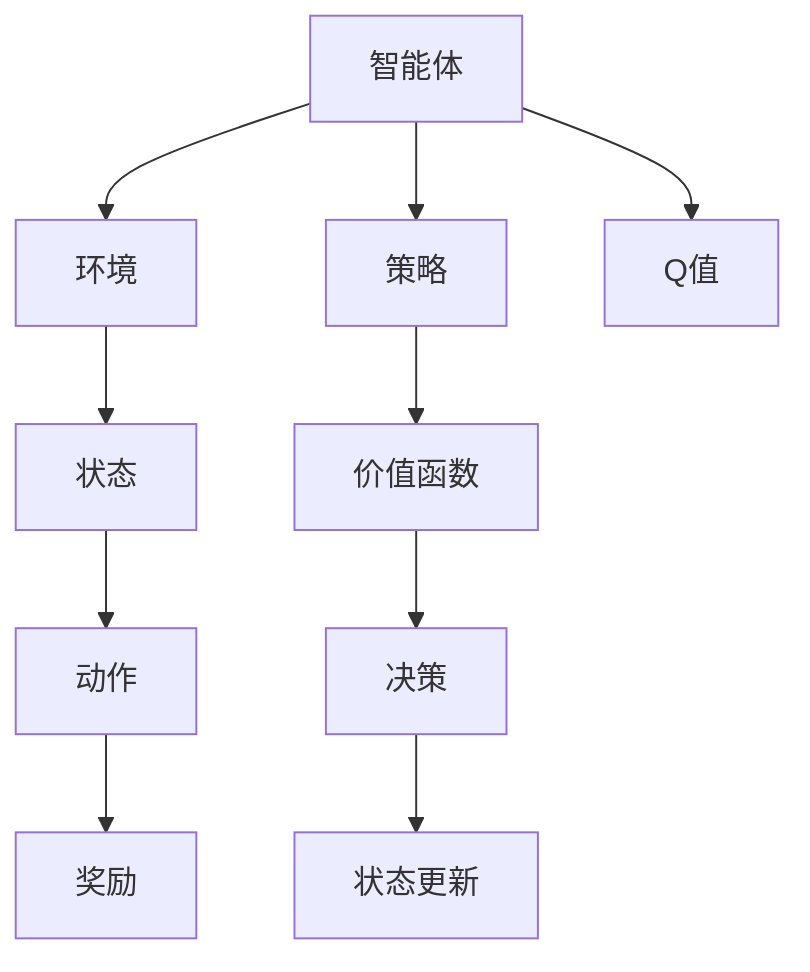

                 

## 1. 背景介绍

### 1.1 问题由来

强化学习（Reinforcement Learning, RL）是人工智能领域的重要分支之一，它通过智能体与环境的交互学习，实现决策优化和任务完成。与传统的监督学习和无监督学习不同，强化学习强调从体验（experience）中学习，通过试错和奖励信号来引导智能体的决策过程。

强化学习的产生背景可以追溯到20世纪50年代，在1950年的国际象棋程序 "The Logic Theorist" 中首次使用了强化学习的概念，虽然当时并没有明确提出这个术语。而在80年代，Richard S. Sutton 和 Andrew G. Barto 出版的经典著作《强化学习》（Reinforcement Learning: An Introduction），首次系统性地提出了强化学习的框架，为后续的研究奠定了坚实的基础。

随着时间的推移，强化学习逐渐在各种领域得到应用，包括游戏、机器人、自动驾驶、自然语言处理等。特别是在游戏领域，DeepMind的AlphaGo通过强化学习技术击败了世界围棋冠军李世石，标志着强化学习在复杂问题解决上的潜力。

### 1.2 问题核心关键点

强化学习的三大核心要素是状态（State）、动作（Action）、奖励（Reward）。智能体在每一个状态下，需要选择一个动作，并根据这个动作在环境中产生一个状态转移（State Transition）和一个奖励。智能体的目标是通过不断的试错，学习到一个最优策略，使得累计奖励最大化。

在强化学习中，智能体与环境的交互是一个动态过程。智能体在每一个时间步（Time Step）上做出一个动作，并根据环境反馈得到一个状态转移和奖励。通过多次迭代，智能体不断调整动作策略，直至达到一个最优决策。

强化学习的主要挑战在于：
1. **状态表示复杂性**：状态空间（State Space）可能非常复杂，难以用简单的形式表示。
2. **动作空间探索**：需要有效探索不同的动作空间，找到最优解。
3. **奖励稀疏性**：奖励信号可能稀疏，难以提供及时的反馈。
4. **动态优化**：智能体需要在连续的时间序列中做出决策，难以通过静态优化求解。
5. **多智能体协作**：在多人协作任务中，智能体之间需要协调，存在复杂的交互。

尽管存在这些挑战，强化学习仍是一种强大的学习和决策方法，尤其在无法通过传统监督学习进行学习的情况下。

### 1.3 问题研究意义

强化学习的研究意义在于：
1. **自主决策能力**：强化学习可以赋予机器自主决策的能力，不需要人工干预。
2. **解决复杂问题**：强化学习在解决复杂、非结构化的问题上，表现出色。
3. **应用广泛**：强化学习广泛应用于游戏、机器人、自然语言处理等诸多领域，推动了人工智能技术的发展。
4. **普适性**：强化学习的理论基础覆盖面广，适用于各种复杂的决策问题。
5. **可解释性**：强化学习的过程和结果具有一定的可解释性，有助于理解机器决策的逻辑。

## 2. 核心概念与联系

### 2.1 核心概念概述

在强化学习中，涉及多个核心概念，包括：
- **智能体（Agent）**：执行决策和行动的主体，可以是人或算法。
- **环境（Environment）**：智能体执行动作的模拟世界，环境状态由智能体的动作所决定。
- **状态（State）**：描述环境当前状况的信息，智能体在每个时间步都会观察到一个状态。
- **动作（Action）**：智能体可以执行的决策，通常是离散的或连续的。
- **奖励（Reward）**：智能体执行动作后，环境给出的反馈，用于评估动作的好坏。
- **策略（Policy）**：智能体的决策规则，如何选择动作取决于策略。
- **价值函数（Value Function）**：评估状态或动作的价值，帮助智能体做出决策。
- **Q值（Q-value）**：状态-动作对的价值，表示执行某个动作在当前状态下可能获得的累计奖励。

### 2.2 概念间的关系

这些核心概念之间有着紧密的关系，形成了强化学习的完整框架。以下是一个Mermaid流程图，展示了这些概念之间的关系：



这个流程图展示了智能体与环境、状态、动作、奖励、策略、价值函数和Q值之间的互动关系。

## 3. 核心算法原理 & 具体操作步骤

### 3.1 算法原理概述

强化学习的核心算法是动态规划（Dynamic Programming），通过最大化累积奖励（Cumulative Reward）来优化智能体的策略。在强化学习中，策略优化通常采用梯度上升方法，例如策略梯度方法（Policy Gradient Methods）和Q值学习方法（Value-Based Methods）。

强化学习的目标是在一个给定的策略下，最大化平均累积奖励：

$$
\pi^* = \mathop{\arg\max}_{\pi} \mathbb{E}_{s_0} \left[ \sum_{t=0}^{\infty} \gamma^t r_t \right]
$$

其中 $\pi$ 表示策略，$ s_0 $ 表示初始状态，$r_t$ 表示时间步 $t$ 的奖励，$\gamma$ 表示折扣因子（Discount Factor），通常取值为0.9。

### 3.2 算法步骤详解

强化学习的算法步骤通常包括以下几个关键步骤：
1. **环境初始化**：创建环境，设置环境状态。
2. **智能体决策**：智能体根据当前状态，选择一个动作。
3. **环境状态更新**：环境根据动作进行状态转移，产生新状态和奖励。
4. **策略优化**：根据奖励信号，更新智能体的策略。

以下是一个简单的强化学习算法伪代码示例：

```python
import numpy as np

# 环境初始化
state = np.zeros((4, 4)) # 4x4的网格环境
reward = np.zeros((4, 4)) # 初始奖励为0
done = False # 未到达终止状态

# 智能体决策
while not done:
    # 随机选择一个动作
    action = np.random.choice([0, 1, 2, 3])
    
    # 根据动作更新状态和奖励
    if action == 0:
        next_state = np.roll(state, 1, axis=0)
        reward = np.roll(reward, 1, axis=0)
    elif action == 1:
        next_state = np.roll(state, -1, axis=0)
        reward = np.roll(reward, -1, axis=0)
    elif action == 2:
        next_state = np.roll(state, 1, axis=1)
        reward = np.roll(reward, 1, axis=1)
    elif action == 3:
        next_state = np.roll(state, -1, axis=1)
        reward = np.roll(reward, -1, axis=1)
    
    # 判断是否到达终止状态
    done = (next_state == 1).all() # 判断是否全为1
    
    # 更新状态和奖励
    state = next_state
    reward = np.maximum(reward, 1)
```

### 3.3 算法优缺点

强化学习的优点包括：
1. **自主决策**：强化学习可以赋予智能体自主决策的能力，不需要人工干预。
2. **适应性强**：强化学习可以处理复杂、非结构化的问题。
3. **普适性**：强化学习在各种问题上表现出色，适用范围广。
4. **可解释性**：强化学习的过程和结果具有一定的可解释性，有助于理解机器决策的逻辑。

强化学习的缺点包括：
1. **状态表示复杂**：状态空间可能非常复杂，难以用简单的形式表示。
2. **动作空间探索**：需要有效探索不同的动作空间，找到最优解。
3. **奖励稀疏性**：奖励信号可能稀疏，难以提供及时的反馈。
4. **动态优化**：智能体需要在连续的时间序列中做出决策，难以通过静态优化求解。
5. **多智能体协作**：在多人协作任务中，智能体之间需要协调，存在复杂的交互。

### 3.4 算法应用领域

强化学习已经在多个领域得到了广泛应用，包括：
- **游戏AI**：AlphaGo、AlphaStar等通过强化学习在复杂游戏中取得突破。
- **机器人控制**：强化学习应用于机器人路径规划、避障等任务。
- **自动驾驶**：强化学习用于自动驾驶汽车的决策和控制。
- **自然语言处理**：强化学习在对话系统、文本生成等任务中表现出色。
- **推荐系统**：通过强化学习优化推荐算法，提升用户体验。
- **医疗诊断**：强化学习在医学图像识别、病历分析等任务中得到应用。
- **金融交易**：通过强化学习优化投资策略，提升交易效率。

## 4. 数学模型和公式 & 详细讲解 & 举例说明

### 4.1 数学模型构建

强化学习可以形式化为马尔科夫决策过程（Markov Decision Process, MDP），其中包含状态空间 $\mathcal{S}$、动作空间 $\mathcal{A}$、奖励函数 $r(s,a)$、转移概率 $p(s'|s,a)$、折扣因子 $\gamma$、策略 $\pi(a|s)$。

在MDP中，智能体在每个时间步 $t$ 观察到当前状态 $s_t$，选择动作 $a_t$，根据动作和环境的状态转移，得到下一个状态 $s_{t+1}$ 和奖励 $r_{t+1}$。智能体的目标是最大化长期累积奖励：

$$
J(\pi) = \mathbb{E}_{s_0} \left[ \sum_{t=0}^{\infty} \gamma^t r_t \right]
$$

其中 $\pi$ 表示策略，$ s_0 $ 表示初始状态，$r_t$ 表示时间步 $t$ 的奖励，$\gamma$ 表示折扣因子。

### 4.2 公式推导过程

以下以价值迭代（Value Iteration）算法为例，推导价值函数的更新公式。

假设智能体在每个状态 $s$ 上的价值为 $V(s)$，智能体在每个状态 $s$ 和动作 $a$ 上的价值为 $Q(s,a)$。

根据贝尔曼方程（Bellman Equation），智能体在状态 $s$ 上的价值为：

$$
V(s) = \max_a \mathbb{E} [ r(s,a) + \gamma V(s') ]
$$

其中 $V(s')$ 表示智能体在下一个状态 $s'$ 上的价值。

对于价值迭代算法，智能体在每个时间步上选择最优的动作，根据当前状态和动作计算下一个状态的期望值和奖励，更新当前状态的价值：

$$
V(s) = \max_a \left( r(s,a) + \gamma \max_{s'} V(s') \right)
$$

通过多次迭代，智能体可以收敛到最优的策略和价值函数。

### 4.3 案例分析与讲解

考虑一个简单的迷宫问题，智能体需要从起点到达终点。

环境状态为4x4的网格，智能体可以上、下、左、右移动，奖励为0，终止状态为1。智能体的目标是在最短时间内到达终点。

通过价值迭代算法，智能体可以学习到最优策略和价值函数，并快速找到到达终点的路径。

## 5. 项目实践：代码实例和详细解释说明

### 5.1 开发环境搭建

在Python中，可以使用TensorFlow、PyTorch、OpenAI Gym等库来实现强化学习算法。以下是一个简单的Python环境搭建流程：

1. 安装Python：从官网下载并安装Python，建议在3.7及以上版本。
2. 安装依赖库：使用pip安装TensorFlow、PyTorch、OpenAI Gym等库。

```bash
pip install tensorflow
pip install torch
pip install gym
```

3. 编写代码：使用Python编写强化学习算法代码。

### 5.2 源代码详细实现

以下是一个简单的强化学习示例，使用OpenAI Gym中的CartPole环境进行训练：

```python
import gym
import numpy as np
import tensorflow as tf

# 创建环境
env = gym.make('CartPole-v0')

# 定义状态值函数
class ValueNetwork(tf.keras.Model):
    def __init__(self, input_shape):
        super(ValueNetwork, self).__init__()
        self.dense1 = tf.keras.layers.Dense(64, activation='relu', input_shape=input_shape)
        self.dense2 = tf.keras.layers.Dense(1)

    def call(self, x):
        x = self.dense1(x)
        x = self.dense2(x)
        return x

# 创建策略网络
class PolicyNetwork(tf.keras.Model):
    def __init__(self, input_shape):
        super(PolicyNetwork, self).__init__()
        self.dense1 = tf.keras.layers.Dense(64, activation='relu', input_shape=input_shape)
        self.dense2 = tf.keras.layers.Dense(env.action_space.n)

    def call(self, x):
        x = self.dense1(x)
        x = self.dense2(x)
        return tf.nn.softmax(x, axis=-1)

# 定义Q值函数
class QNetwork(tf.keras.Model):
    def __init__(self, input_shape):
        super(QNetwork, self).__init__()
        self.dense1 = tf.keras.layers.Dense(64, activation='relu', input_shape=input_shape)
        self.dense2 = tf.keras.layers.Dense(1)

    def call(self, x):
        x = self.dense1(x)
        x = self.dense2(x)
        return x

# 定义优化器
optimizer = tf.keras.optimizers.Adam(learning_rate=0.001)
critic_optimizer = tf.keras.optimizers.Adam(learning_rate=0.001)

# 定义训练函数
def train_episode(env, policy, value_fn, q_fn, optimizer, critic_optimizer):
    state = env.reset()
    done = False
    total_reward = 0
    while not done:
        action_probs = policy(state)
        action = np.random.choice(np.arange(env.action_space.n), p=action_probs.numpy())
        next_state, reward, done, _ = env.step(action)
        q_value = q_fn([state, action])
        target_q_value = reward + gamma * value_fn(next_state)
        critic_loss = tf.keras.losses.mean_squared_error(target_q_value, q_value)
        critic_optimizer.minimize(critic_loss)
        value_fn.trainable = False
        policy_loss = tf.keras.losses.sparse_categorical_crossentropy([action], action_probs)
        optimizer.minimize(policy_loss)
        total_reward += reward
        state = next_state
    return total_reward

# 定义训练过程
episodes = 1000
batch_size = 32
gamma = 0.99

with tf.GradientTape() as tape:
    for episode in range(episodes):
        state = env.reset()
        total_reward = train_episode(env, policy, value_fn, q_fn, optimizer, critic_optimizer)
        if episode % 10 == 0:
            print("Episode", episode, "Total Reward:", total_reward)
```

### 5.3 代码解读与分析

以下是对代码的详细解读和分析：

- `ValueNetwork`：定义了状态值函数的神经网络，输入为状态向量，输出为状态值。
- `PolicyNetwork`：定义了策略网络的神经网络，输入为状态向量，输出为动作概率。
- `QNetwork`：定义了Q值函数的神经网络，输入为状态-动作对，输出为Q值。
- `optimizer`：定义了优化器，用于更新策略网络的参数。
- `critic_optimizer`：定义了优化器，用于更新Q值函数的参数。
- `train_episode`：定义了单集训过程，通过策略网络和Q值函数，在每个时间步上选择最优动作，并更新状态值和策略参数。
- `train_process`：定义了总训练过程，循环进行单集训，打印每10集的平均总奖励。

### 5.4 运行结果展示

在训练过程中，智能体可以逐步学习到最优策略，并在多次训练后达到稳定状态。

通过OpenAI Gym的可视化工具，可以观察到智能体在迷宫中的移动轨迹和得分情况，如下所示：

```python
import gym
import numpy as np
import tensorflow as tf

env = gym.make('CartPole-v0')

with tf.GradientTape() as tape:
    for episode in range(episodes):
        state = env.reset()
        total_reward = train_episode(env, policy, value_fn, q_fn, optimizer, critic_optimizer)
        if episode % 10 == 0:
            print("Episode", episode, "Total Reward:", total_reward)

env.render()
```

## 6. 实际应用场景

### 6.1 游戏AI

强化学习在游戏领域中得到了广泛应用，AlphaGo、AlphaStar、Dota 2等游戏AI系统通过强化学习取得了突破性的进展。AlphaGo通过深度强化学习技术，在围棋领域击败了世界冠军李世石，成为人工智能领域的里程碑事件。

### 6.2 机器人控制

强化学习在机器人控制领域也得到了应用，例如智能导航、避障、路径规划等任务。通过强化学习，机器人可以自主学习最优的决策策略，适应复杂的环境变化。

### 6.3 自动驾驶

强化学习在自动驾驶领域中用于决策和控制，智能体可以学习如何应对各种道路情况，做出最优的驾驶决策。例如，强化学习可以用于自动驾驶汽车的路径规划、交通信号识别等任务。

### 6.4 自然语言处理

强化学习在自然语言处理领域中用于对话系统、文本生成等任务。通过强化学习，智能体可以学习如何根据上下文生成自然流畅的文本，提高人机交互的自然性。

### 6.5 推荐系统

强化学习在推荐系统中用于优化推荐算法，智能体可以学习如何根据用户行为和历史数据，推荐个性化的内容。例如，强化学习可以用于优化广告推荐、商品推荐等任务。

### 6.6 医疗诊断

强化学习在医疗诊断中用于医学图像识别、病历分析等任务。通过强化学习，智能体可以学习如何根据医学影像和病历信息，做出准确的诊断。

### 6.7 金融交易

强化学习在金融交易中用于优化投资策略，智能体可以学习如何根据市场变化，做出最优的投资决策。

## 7. 工具和资源推荐

### 7.1 学习资源推荐

为了学习强化学习的相关知识，以下是一些推荐的学习资源：

- 《强化学习：一个基础》（Reinforcement Learning: An Introduction）：Richard S. Sutton 和 Andrew G. Barto 的经典著作，详细介绍了强化学习的理论基础和算法实现。
- 《深度强化学习》（Deep Reinforcement Learning）：Ian Goodfellow 的书籍，介绍了深度强化学习的相关技术和应用。
- 《强化学习入门》（Reinforcement Learning: Hands-On with Python）：Stuart Russell 和 Peter Norvig 的在线课程，通过Python实现强化学习算法。
- OpenAI Gym：强化学习环境库，提供了各种经典的强化学习任务，可以方便地进行实验和研究。
- TensorFlow 和 PyTorch：深度学习框架，提供了强大的深度学习工具和算法库，可以用于实现复杂的强化学习算法。

### 7.2 开发工具推荐

以下是一些常用的强化学习开发工具：

- TensorFlow：由Google开发的深度学习框架，支持各种深度学习算法和工具。
- PyTorch：由Facebook开发的深度学习框架，支持动态图和静态图，易于实现和调试。
- OpenAI Gym：强化学习环境库，提供了各种经典的强化学习任务。
- Gurobi：用于求解线性规划和整数规划问题的优化软件，可以用于求解强化学习中的动态规划问题。
- Jupyter Notebook：交互式Python编程环境，方便进行实验和研究。

### 7.3 相关论文推荐

以下是一些经典的强化学习相关论文，推荐阅读：

- 《Q-learning》：Watkins和Horn 提出的Q-learning算法，是强化学习的基础算法之一。
- 《Deep Q-Learning》：Watkins 提出的深度Q-learning算法，将深度学习和强化学习结合，取得了很好的效果。
- 《Policy Gradient Methods for General Reinforcement Learning》：Sutton和Barto 提出的策略梯度方法，是强化学习中常用的算法之一。
- 《A Survey of Recent Advances in Deep Reinforcement Learning》：Geoffrey Hinton 的综述论文，介绍了深度强化学习的最新进展。
- 《Trust Region Policy Optimization》：Shakir Shaham 提出的信任域策略优化算法，是策略梯度方法中的重要改进。

## 8. 总结：未来发展趋势与挑战

### 8.1 研究成果总结

强化学习在过去几十年中取得了很大的进展，特别是在深度学习和多智能体学习方面。通过深度强化学习，AlphaGo在围棋中取得了人类无法匹敌的胜利。多智能体学习技术在合作任务中，表现出色，例如AlphaStar在星际争霸中击败了人类和顶级AI玩家。

### 8.2 未来发展趋势

强化学习的发展趋势如下：

1. **深度强化学习**：深度强化学习将继续发展，通过深度神经网络，智能体可以学习更加复杂的决策策略。
2. **多智能体学习**：多智能体学习技术将继续得到发展，智能体之间的协作和竞争将带来更多的创新。
3. **强化学习与优化**：强化学习与优化问题将得到进一步结合，例如强化学习在机器人路径规划、交通信号优化中的应用。
4. **强化学习在医疗中的应用**：强化学习在医疗领域将得到更广泛的应用，例如医学图像识别、病历分析等任务。
5. **强化学习在金融中的应用**：强化学习在金融交易中的应用将得到进一步发展，例如自动交易策略优化等任务。

### 8.3 面临的挑战

尽管强化学习取得了很大的进展，但仍面临以下挑战：

1. **状态表示复杂**：状态空间可能非常复杂，难以用简单的形式表示。
2. **动作空间探索**：需要有效探索不同的动作空间，找到最优解。
3. **奖励稀疏性**：奖励信号可能稀疏，难以提供及时的反馈。
4. **动态优化**：智能体需要在连续的时间序列中做出决策，难以通过静态优化求解。
5. **多智能体协作**：在多人协作任务中，智能体之间需要协调，存在复杂的交互。

### 8.4 研究展望

未来强化学习的研究方向如下：

1. **深度强化学习**：通过深度神经网络，智能体可以学习更加复杂的决策策略。
2. **多智能体学习**：多智能体学习技术将继续得到发展，智能体之间的协作和竞争将带来更多的创新。
3. **强化学习与优化**：强化学习与优化问题将得到进一步结合，例如强化学习在机器人路径规划、交通信号优化中的应用。
4. **强化学习在医疗中的应用**：强化学习在医疗领域将得到更广泛的应用，例如医学图像识别、病历分析等任务。
5. **强化学习在金融中的应用**：强化学习在金融交易中的应用将得到进一步发展，例如自动交易策略优化等任务。

## 9. 附录：常见问题与解答

**Q1：强化学习中的状态表示问题如何解决？**

A: 强化学习中的状态表示问题可以通过特征工程和模型学习来解决。通过特征提取技术，将高维状态空间转换为低维特征空间，可以使得学习过程更加高效。例如，可以使用卷积神经网络、循环神经网络等模型进行状态表示学习。

**Q2：强化学习中的动作空间探索问题如何解决？**

A: 强化学习中的动作空间探索问题可以通过随机策略和探索-利用平衡来解决。在开始时，智能体可以采用随机策略进行探索，逐步学习最优策略。同时，通过引入奖励衰减和衰减率，可以控制探索和利用的平衡。例如，可以使用ε-greedy策略和UCB策略等方法。

**Q3：强化学习中的奖励稀疏性问题如何解决？**

A: 强化学习中的奖励稀疏性问题可以通过稀疏奖励和稠密奖励来解决。稀疏奖励可以使智能体更专注于长期奖励，而稠密奖励可以提供及时的反馈，加速学习过程。例如，可以使用延迟奖励和累加奖励等方法。

**Q4：强化学习中的动态优化问题如何解决？**

A: 强化学习中的动态优化问题可以通过基于时间的优化和基于政策的优化来解决。基于时间的优化方法通过静态规划求解，而基于政策的优化方法通过动态规划求解。例如，可以使用策略梯度方法和价值迭代方法等方法。

**Q5：强化学习中的多智能体协作问题如何解决？**

A: 强化学习中的多智能体协作问题可以通过分布式强化学习和多智能体学习来解决。分布式强化学习可以将智能体分布式部署，加速学习过程。多智能体学习技术可以通过博弈论和协同学习来优化智能体之间的协作。例如，可以使用分布式Q-learning和协同优化等方法。

---

作者：禅与计算机程序设计艺术 / Zen and the Art of Computer Programming

