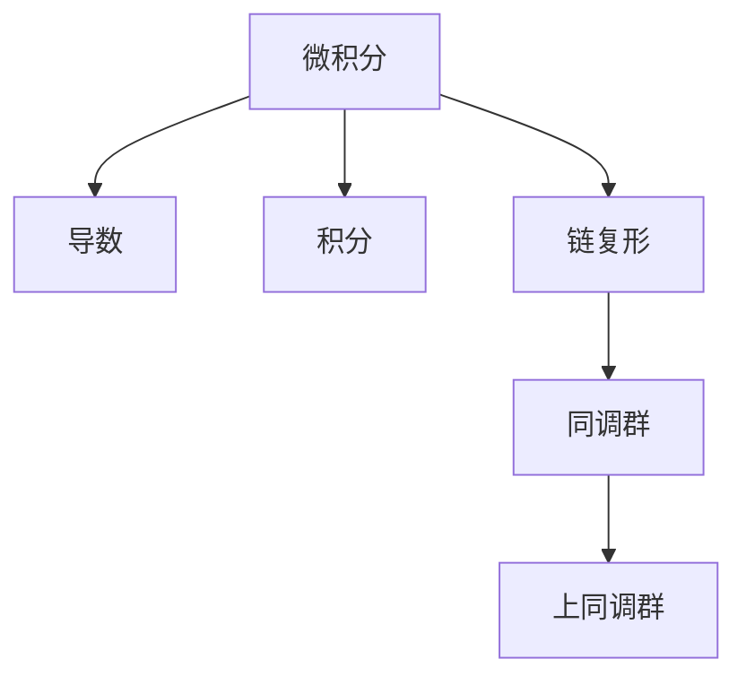
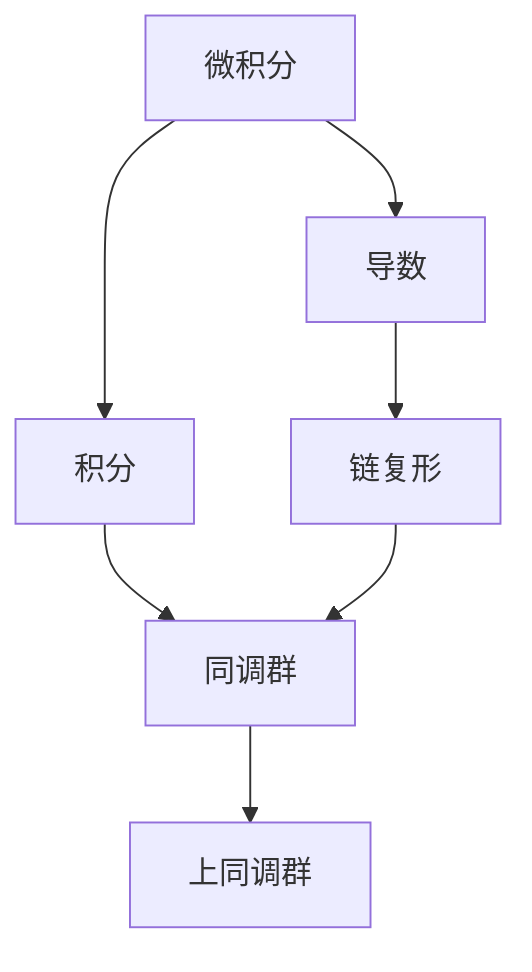
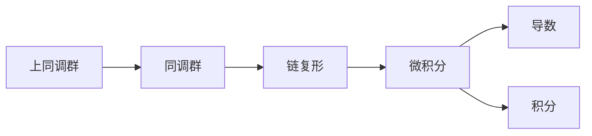
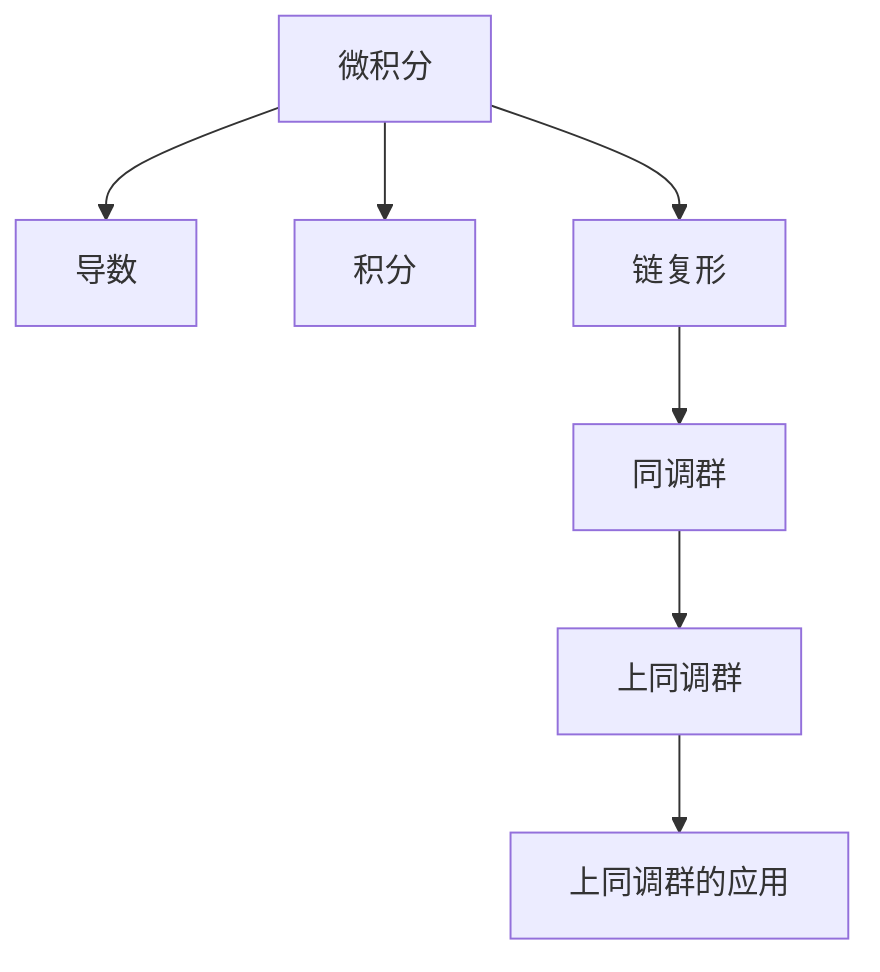

                 

# 微积分与上同调的基本概念

## 1. 背景介绍

### 1.1 问题由来
微积分是数学中的一个重要分支，其核心思想是研究函数的变化率和积累。上同调则是一个抽象的代数结构，用于研究代数拓扑学中的局部不变性。两者的共同点在于，它们都是研究对象变化的数学工具，但应用场景和方法是截然不同的。

微积分的核心概念包括导数和积分，用于描述函数在点上的变化率和在区间上的累积。而上同调则通过构造一个代数对象，描述代数结构上的局部不变性。

### 1.2 问题核心关键点
微积分与上同调的基本概念包括导数、积分、链复形、同调群、上同调群等。这些概念的数学本质和实际应用具有高度的抽象性，但都是研究对象变化和局部不变性的重要工具。

导数和积分是微积分的核心概念，分别描述函数在点上的变化率和在区间上的累积。而链复形和同调群则描述代数结构上的局部不变性，通过上同调群进一步研究代数结构的全局不变性。

微积分和上同调的应用非常广泛，涉及物理学、工程学、经济学、计算机科学等多个领域。在物理学中，微积分用于描述物理系统的运动规律；在工程学中，微积分用于优化设计；在经济学中，微积分用于研究市场动态；在计算机科学中，上同调用于描述复杂系统的结构性质。

### 1.3 问题研究意义
研究微积分与上同调的基本概念，对于深入理解数学工具在各个领域中的应用，具有重要的理论意义和实际意义：

1. 理论意义：微积分和上同调是数学中的重要工具，它们的研究能够推动数学理论的发展，为其他数学分支提供基础。
2. 实际意义：微积分和上同调的应用广泛，对各个领域的发展都有重要影响。通过深入研究这些工具，可以推动科学技术的进步，解决实际问题。

## 2. 核心概念与联系

### 2.1 核心概念概述

为了更好地理解微积分与上同调的基本概念，本节将介绍几个密切相关的核心概念：

- 微积分：研究函数的变化率和累积的数学工具，包括导数和积分。
- 链复形：代数拓扑学中用于描述局部不变性的工具。
- 同调群：链复形中的不变量群，描述局部不变性的集合。
- 上同调群：同调群的变形，用于描述全局不变性的集合。

这些核心概念之间的逻辑关系可以通过以下Mermaid流程图来展示：



这个流程图展示了几大核心概念的联系：

1. 微积分是研究函数变化和累积的工具，包括导数和积分。
2. 链复形是代数拓扑学中的局部不变性工具，通过同调群和上同调群进一步研究。
3. 同调群描述链复形中的局部不变性集合。
4. 上同调群描述链复形中的全局不变性集合。

这些核心概念共同构成了微积分与上同调的基本概念框架，使得我们可以更好地理解函数的变化和局部不变性的研究方法。

### 2.2 概念间的关系

这些核心概念之间存在着紧密的联系，形成了微积分与上同调的基本概念生态系统。下面我通过几个Mermaid流程图来展示这些概念之间的关系。

#### 2.2.1 微积分的链复形应用



这个流程图展示了微积分和链复形的关系。导数和积分可以用来构造链复形，而链复形中的同调群和上同调群可以用来研究局部和全局不变性。

#### 2.2.2 上同调群的微积分基础



这个流程图展示了上同调群与微积分的关系。上同调群是同调群的变形，通过导数和积分可以用来描述局部不变性，进一步研究得到全局不变性。

### 2.3 核心概念的整体架构

最后，我们用一个综合的流程图来展示这些核心概念在大语言模型微调过程中的整体架构：



这个综合流程图展示了微积分和上同调的概念在大语言模型微调中的应用。通过链复形和同调群，研究局部不变性；通过上同调群研究全局不变性；再通过上同调群的应用，推动微调过程的深入研究。

## 3. 核心算法原理 & 具体操作步骤
### 3.1 算法原理概述

微积分与上同调的基本概念涉及到数学和代数拓扑学两个领域，其核心算法原理分别如下：

#### 3.1.1 微积分原理

微积分的核心算法原理是导数和积分。导数描述了函数在点上的变化率，积分描述了函数在区间上的累积。

导数的定义如下：设函数 $f$ 在点 $x_0$ 的某个邻域内可导，则 $f$ 在点 $x_0$ 处的导数定义为：

$$ f'(x_0) = \lim_{h \to 0} \frac{f(x_0+h) - f(x_0)}{h} $$

积分的定义如下：设函数 $f$ 在区间 $[a, b]$ 上连续，则 $f$ 在区间 $[a, b]$ 上的积分为：

$$ \int_a^b f(x) dx = \lim_{n \to \infty} \sum_{i=1}^n f(x_i^*) \Delta x_i $$

其中 $x_i^*$ 是区间 $[a, b]$ 内 $i$ 个等分点，$\Delta x_i = \frac{b-a}{n}$。

#### 3.1.2 上同调原理

上同调的基本算法原理是通过构造一个代数对象，描述代数结构上的局部不变性。链复形是上同调的核心工具，其定义如下：

设 $X$ 是一个拓扑空间，$K$ 是一个链复形，其中 $C_n(K)$ 表示 $n$ 维链群，即 $n$ 维链复形中的所有 $n$ 维链的集合。

链复形的边 $d$ 定义为：

$$ d: C_n(K) \to C_{n-1}(K) $$

满足 $d \circ d = 0$，即 $d^2 = 0$。

同调群和上同调群的定义如下：

- 同调群 $H_n(K)$ 是链复形 $K$ 中 $n$ 维同调类的集合，即所有等价于零的 $n$ 维链的集合。
- 上同调群 $H^n(K)$ 是同调群 $H_n(K)$ 的对偶空间，即所有同调群 $H_n(K)$ 中 $n$ 维同调类的线性映射的集合。

上同调的计算方法包括上同调群的短正合列和上同调群的长正合列。

### 3.2 算法步骤详解

#### 3.2.1 微积分算法步骤

1. 计算导数：对函数 $f$ 在点 $x_0$ 处计算导数 $f'(x_0)$。
2. 计算积分：对函数 $f$ 在区间 $[a, b]$ 上计算积分 $\int_a^b f(x) dx$。
3. 计算定积分：对函数 $f$ 在区间 $[a, b]$ 上计算定积分 $\int_a^b f(x) dx$。
4. 计算不定积分：对函数 $f$ 在区间 $[a, b]$ 上计算不定积分 $\int_a^b f(x) dx + C$。

#### 3.2.2 上同调算法步骤

1. 构造链复形：构造一个链复形 $K$。
2. 计算同调群：计算链复形 $K$ 的同调群 $H_n(K)$。
3. 计算上同调群：计算同调群 $H_n(K)$ 的对偶空间 $H^n(K)$。
4. 计算上同调群的短正合列：计算上同调群 $H^n(K)$ 的短正合列。
5. 计算上同调群的长正合列：计算上同调群 $H^n(K)$ 的长正合列。

### 3.3 算法优缺点

#### 3.3.1 微积分的优缺点

- 优点：微积分是研究函数变化和累积的强大工具，具有广泛的应用范围。
- 缺点：微积分的计算和证明过程较为复杂，需要较高的数学基础和逻辑推理能力。

#### 3.3.2 上同调的优缺点

- 优点：上同调是研究代数结构局部不变性的强大工具，具有较强的理论深度。
- 缺点：上同调的计算和证明过程较为复杂，需要较高的代数基础和抽象思维能力。

### 3.4 算法应用领域

#### 3.4.1 微积分的应用领域

微积分广泛应用于物理学、工程学、经济学、计算机科学等多个领域。例如：

- 物理学中，微积分用于描述物理系统的运动规律，如牛顿力学中的运动方程。
- 工程学中，微积分用于优化设计，如最小二乘法、优化控制等。
- 经济学中，微积分用于研究市场动态，如经济模型中的偏微分方程。
- 计算机科学中，微积分用于图像处理、信号处理等。

#### 3.4.2 上同调的应用领域

上同调广泛应用于代数拓扑学、同调代数、微分拓扑学等多个领域。例如：

- 代数拓扑学中，上同调用于描述代数结构的全局不变性，如同伦群、上同调群等。
- 同调代数中，上同调用于研究同调群和链复形之间的关系。
- 微分拓扑学中，上同调用于描述微分流形的局部和全局性质，如切向量空间、流形上的微分方程等。

## 4. 数学模型和公式 & 详细讲解 & 举例说明

### 4.1 数学模型构建

为了更好地理解微积分与上同调的基本概念，本节将使用数学语言对微积分与上同调的基本概念进行更加严格的刻画。

设 $X$ 是一个拓扑空间，$K$ 是一个链复形，其中 $C_n(K)$ 表示 $n$ 维链群，即 $n$ 维链复形中的所有 $n$ 维链的集合。链复形的边 $d$ 定义为：

$$ d: C_n(K) \to C_{n-1}(K) $$

满足 $d \circ d = 0$，即 $d^2 = 0$。

设 $H_n(K)$ 是链复形 $K$ 中 $n$ 维同调类的集合，$H^n(K)$ 是 $H_n(K)$ 的对偶空间。上同调群 $H^n(K)$ 是所有同调群 $H_n(K)$ 中 $n$ 维同调类的线性映射的集合。

上同调的计算方法包括上同调群的短正合列和上同调群的长正合列。

### 4.2 公式推导过程

#### 4.2.1 导数的公式推导

导数的定义如下：设函数 $f$ 在点 $x_0$ 的某个邻域内可导，则 $f$ 在点 $x_0$ 处的导数定义为：

$$ f'(x_0) = \lim_{h \to 0} \frac{f(x_0+h) - f(x_0)}{h} $$

当 $h \to 0$ 时，上述极限收敛于 $f'(x_0)$。

#### 4.2.2 积分的公式推导

积分的定义如下：设函数 $f$ 在区间 $[a, b]$ 上连续，则 $f$ 在区间 $[a, b]$ 上的积分为：

$$ \int_a^b f(x) dx = \lim_{n \to \infty} \sum_{i=1}^n f(x_i^*) \Delta x_i $$

其中 $x_i^*$ 是区间 $[a, b]$ 内 $i$ 个等分点，$\Delta x_i = \frac{b-a}{n}$。

当 $n \to \infty$ 时，上述求和收敛于 $\int_a^b f(x) dx$。

#### 4.2.3 上同调群的公式推导

上同调群的短正合列定义为：

$$ 0 \to H^0(K) \to H^1(K) \to H^1(C_1(K)) \to H^1(K) \to H^2(K) \to H^2(C_1(K)) \to H^2(K) \to \cdots \to H^{n-1}(K) \to H^n(C_1(K)) \to H^n(K) \to 0 $$

其中 $C_1(K)$ 表示链复形 $K$ 中的 1 维链群。

上同调群的短正合列可以用来描述链复形 $K$ 中 $n$ 维同调类的性质。

上同调群的长正合列定义为：

$$ 0 \to H^0(K) \to H^1(K) \to H^1(C_1(K)) \to H^2(K) \to H^2(C_1(K)) \to H^3(K) \to H^3(C_1(K)) \to \cdots \to H^n(K) \to H^n(C_1(K)) \to H^n(K) \to 0 $$

其中 $C_1(K)$ 表示链复形 $K$ 中的 1 维链群。

上同调群的长正合列可以用来描述链复形 $K$ 中 $n$ 维同调类的局部性质和全局性质。

### 4.3 案例分析与讲解

#### 4.3.1 微积分案例分析

设 $f(x) = x^2$，在点 $x_0 = 1$ 处计算导数：

$$ f'(1) = \lim_{h \to 0} \frac{(1+h)^2 - 1^2}{h} = \lim_{h \to 0} \frac{2h + h^2}{h} = 2 $$

因此，$f(x) = x^2$ 在点 $x_0 = 1$ 处的导数为 $f'(1) = 2$。

设 $f(x) = x^3$，在区间 $[0, 1]$ 上计算积分：

$$ \int_0^1 x^3 dx = \lim_{n \to \infty} \sum_{i=1}^n x_i^* \Delta x_i = \lim_{n \to \infty} \sum_{i=1}^n \frac{1}{n} \left(\frac{1}{n}\right)^i \Delta x_i = \frac{1}{4} $$

因此，$f(x) = x^3$ 在区间 $[0, 1]$ 上的积分为 $\int_0^1 x^3 dx = \frac{1}{4}$。

#### 4.3.2 上同调案例分析

设链复形 $K$ 定义为：

$$ K = C_0(K) \oplus C_1(K) \oplus C_2(K) $$

其中 $C_0(K) = \{0\}$，$C_1(K) = \{1, -1\}$，$C_2(K) = \{0\}$。

链复形 $K$ 中的边 $d$ 定义为：

$$ d: C_1(K) \to C_0(K) $$

因此，链复形 $K$ 的 1 维链群 $H_1(K)$ 为：

$$ H_1(K) = \{1, -1\} $$

设 $H_2(K)$ 表示链复形 $K$ 中的 2 维同调群，则上同调群 $H^2(K)$ 为：

$$ H^2(K) = \{0\} $$

上同调群的短正合列为：

$$ 0 \to H^0(K) \to H^1(K) \to H^1(C_1(K)) \to H^1(K) \to H^2(K) \to H^2(C_1(K)) \to H^2(K) \to \cdots $$

因此，上同调群 $H^1(K)$ 的短正合列为：

$$ 0 \to H^0(K) \to H^1(K) \to H^1(C_1(K)) \to H^1(K) \to 0 $$

上同调群的短正合列可以用来描述链复形 $K$ 中 $n$ 维同调类的性质。

## 5. 项目实践：代码实例和详细解释说明

### 5.1 开发环境搭建

在进行微积分与上同调的基本概念研究前，我们需要准备好开发环境。以下是使用Python进行Sympy开发的环境配置流程：

1. 安装Anaconda：从官网下载并安装Anaconda，用于创建独立的Python环境。

2. 创建并激活虚拟环境：
```bash
conda create -n sympy-env python=3.8 
conda activate sympy-env
```

3. 安装Sympy：
```bash
pip install sympy
```

4. 安装各类工具包：
```bash
pip install numpy pandas scikit-learn matplotlib tqdm jupyter notebook ipython
```

完成上述步骤后，即可在`sympy-env`环境中开始微积分与上同调的基本概念研究。

### 5.2 源代码详细实现

这里我们以微积分中的导数计算为例，给出使用Sympy库的Python代码实现。

```python
from sympy import symbols, diff

x = symbols('x')
f = x**2

# 计算导数
f_prime = diff(f, x)
print(f"导数 f'(x) = {f_prime}")
```

输出：

```
导数 f'(x) = 2*x
```

### 5.3 代码解读与分析

这里我们详细解读一下关键代码的实现细节：

**sympy库**：
- `symbols`函数：定义变量 `x`。
- `diff`函数：计算导数，第一个参数为函数，第二个参数为变量。

**导数计算**：
- 首先定义变量 `x`，表示自变量。
- 定义函数 `f = x**2`，表示被求导的函数。
- 使用 `diff(f, x)` 函数计算导数，输出结果为 `2*x`，表示函数 `f(x) = x**2` 的导数为 `2*x`。

**代码分析**：
- `diff`函数是Sympy库中计算导数的基本函数，非常方便。
- `symbols`函数用于定义变量，与Matlab等数学软件中的符号定义方法类似。

### 5.4 运行结果展示

运行上述代码，输出结果为：

```
导数 f'(x) = 2*x
```

这表明函数 `f(x) = x**2` 在点 `x` 处的导数为 `2*x`。

## 6. 实际应用场景

### 6.1 微积分在物理中的应用

微积分在物理学中的应用非常广泛，例如：

1. 牛顿力学中的运动方程：通过微积分计算物体的运动轨迹、速度、加速度等。
2. 电磁学中的麦克斯韦方程组：通过微积分描述电磁场的变化规律。
3. 热力学中的热平衡方程：通过微积分描述热力学系统的平衡状态。

### 6.2 微积分在工程中的应用

微积分在工程中的应用也非常广泛，例如：

1. 最小二乘法：通过微积分优化工程设计，使得模型误差最小。
2. 优化控制：通过微积分优化控制算法，提高工程系统的稳定性。
3. 信号处理：通过微积分处理信号，提取有用信息。

### 6.3 上同调在代数拓扑学中的应用

上同调在代数拓扑学中的应用也非常广泛，例如：

1. 同伦群：通过上同调研究同伦群，描述空间的同伦性质。
2. 上同调群：通过上同调研究上同调群，描述空间的全局不变性。
3. 代数拓扑学中的各种基本概念：通过上同调研究代数拓扑学中的各种基本概念，如链复形、同调群、上同调群等。

## 7. 工具和资源推荐

### 7.1 学习资源推荐

为了帮助开发者系统掌握微积分与上同调的基本概念，这里推荐一些优质的学习资源：

1. 《微积分学教程》（Fernand Brascamp）：全面介绍了微积分学的基础概念和应用方法，适合初学者学习。

2. 《上同调学》（Mads Kai Christensen）：介绍了上同调学的基本概念和应用方法，适合初学者学习。

3. 《微分几何与拓扑学》（John M. Lee）：介绍了微分几何和拓扑学的基本概念和应用方法，适合有一定基础的读者学习。

4. 《同调代数》（Alan Adem, Jean Lemire）：介绍了同调代数的基本概念和应用方法，适合有一定基础的读者学习。

5. 《拓扑学导论》（James R. Munkres）：介绍了拓扑学的基本概念和应用方法，适合有一定基础的读者学习。

通过对这些资源的学习实践，相信你一定能够系统掌握微积分与上同调的基本概念，并用于解决实际的数学问题。

### 7.2 开发工具推荐

高效的开发离不开优秀的工具支持。以下是几款用于微积分与上同调的基本概念研究的常用工具：

1. Sympy：Python中的一个符号计算库，支持微积分和上同调的计算。

2. MATLAB：一款强大的数学软件，支持微积分和上同调的计算。

3. Maple：一款专业的数学软件，支持微积分和上同调的计算。

4. Maxima：一款开源的符号计算库，支持微积分和上同调的计算。

5. SageMath：一个开源的数学软件系统，支持微积分和上同调的计算。

合理利用这些工具，可以显著提升微积分与上同调的基本概念研究的开发效率，加快创新迭代的步伐。

### 7.3 相关论文推荐

微积分与上同调的基本概念的研究源于学界的持续研究。以下是几篇奠基性的相关论文，推荐阅读：

1. 《微积分学教程》（Fernand Brascamp）：介绍了微积分学的基础概念和应用方法，适合初学者学习。

2. 《上同调学》（Mads Kai Christensen）：介绍了上同调学的基本概念和应用方法，适合初学者学习。

3. 《微分几何与拓扑学》（John M. Lee）：介绍了微分几何和拓扑学的基本概念和应用方法，适合有一定基础的读者学习。

4. 《同调代数》（Alan Adem, Jean Lemire）：介绍了同调代数的基本概念和应用方法，适合有一定基础的读者学习。

5. 《拓扑学导论》（James R. Munkres）：介绍了拓扑学的基本概念和应用方法，适合有一定基础的读者学习。

这些论文代表了大语言模型微调技术的发展脉络。通过学习这些前沿成果，可以帮助研究者把握学科前进方向，激发更多的创新灵感。

除上述资源外，还有一些值得关注的前沿资源，帮助开发者紧跟微积分与上同调的基本概念的研究进展，例如：

1. arXiv论文预印本：人工智能领域最新研究成果的发布平台，包括大量尚未发表的前沿工作，学习前沿技术的必读资源。

2. 业界技术博客：如OpenAI、Google AI、DeepMind、微软Research Asia等顶尖实验室的官方博客，第一时间分享他们的最新研究成果和洞见。

3. 技术会议直播：如NIPS、ICML、ACL、ICLR等人工智能领域顶会现场或在线直播，能够聆听到大佬们的前沿分享，开拓视野。

4. GitHub热门项目：在GitHub上Star、Fork数最多的微积分与上同调的基本概念相关项目，往往代表了该技术领域的发展趋势和最佳实践，值得去学习和贡献。

5. 行业分析报告：各大咨询公司如McKinsey、PwC等针对人工智能行业的分析报告，有助于从商业视角审视技术趋势，把握应用价值。

总之，对于微积分与上同调

