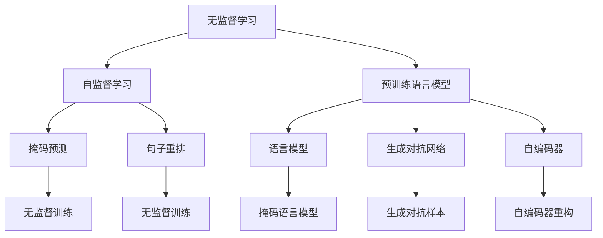
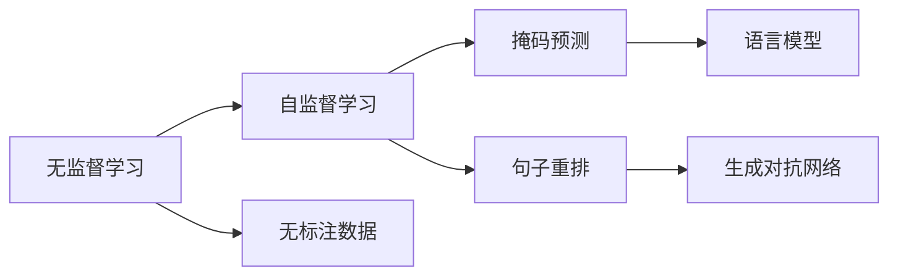
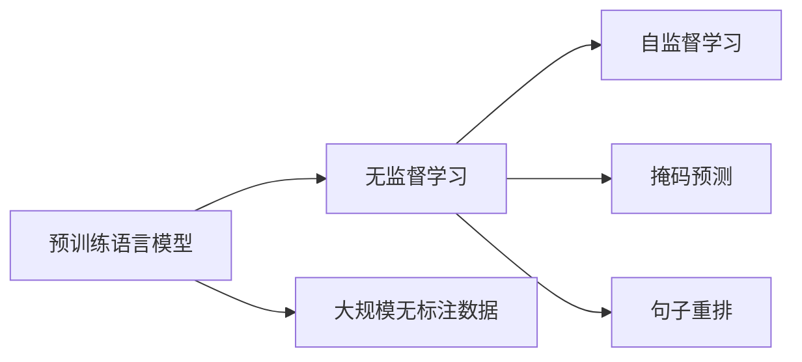
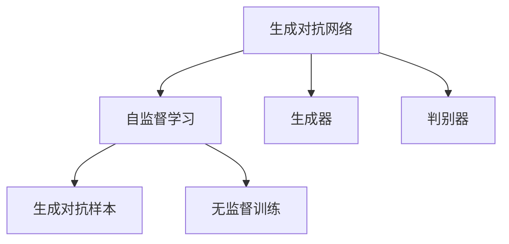
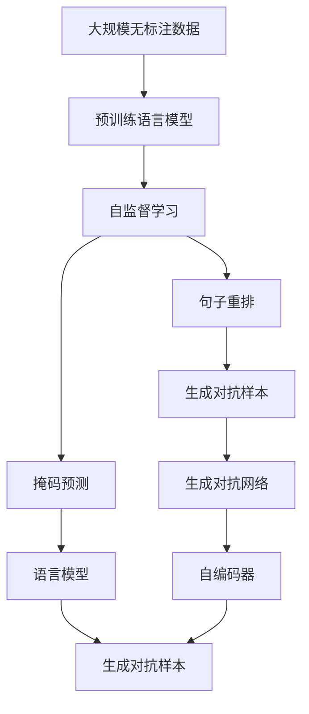

                 

## 1. 背景介绍

### 1.1 问题由来
随着人工智能技术的不断发展，数据驱动的深度学习模型在图像识别、自然语言处理等领域取得了巨大成功。然而，深度学习模型的训练需要大量高质量的标注数据，这在许多领域都是昂贵的甚至是不可行的。无监督学习因其不依赖标注数据，逐渐成为人工智能研究的新兴热点。

在NLP领域，无监督学习方法被广泛应用于词向量、主题建模、文本聚类等任务中。近年来，基于无监督学习的预训练语言模型（如BERT、GPT等）在机器翻译、问答系统、文本生成等任务上取得了突破性进展，显示出无监督学习方法在未来应用中的巨大潜力。

### 1.2 问题核心关键点
无监督学习的核心在于，利用未标注的数据训练模型，从而获得数据的内在结构和分布特征。常见的无监督学习方法包括：

- 自编码器(Autocoder)：通过重构输入数据来学习特征表示。
- 生成对抗网络(GANs)：由生成器和判别器两部分组成，生成器通过对抗学习生成逼真的样本。
- 变分自编码器(VAEs)：通过优化损失函数来学习数据的潜在分布。
- 自监督学习(Self-supervised Learning)：利用数据的内在关联关系，如语言模型的掩码预测、句子重排等任务，进行无监督训练。

无监督学习方法因其不依赖标注数据、节省标注成本、能够挖掘数据深层特征等优点，逐渐成为数据驱动的AI技术的重要补充。特别是，近年来在预训练语言模型上的应用，展现了无监督学习方法在未来AI技术中的重要地位。

### 1.3 问题研究意义
无监督学习方法在数据标注昂贵、数据量丰富但标注成本高昂的领域具有重要应用价值。研究无监督学习方法，对于拓展人工智能技术的应用范围，降低标注成本，加速AI技术在产业中的落地，具有重要意义：

1. 降低标注成本。无监督学习方法可以直接利用大规模未标注数据进行训练，避免了昂贵的标注成本。
2. 挖掘深层特征。通过无监督学习方法，能够从数据中挖掘出未被标注的深层特征，提升模型性能。
3. 促进数据自足。无监督学习方法能够利用自身的数据进行特征学习，实现数据的自足。
4. 推动AI普及。无监督学习方法能够降低深度学习技术的入门门槛，推动AI技术在更多领域的应用。
5. 提高模型鲁棒性。无监督学习方法能够训练出鲁棒性更强、泛化能力更好的模型，提高模型在不同数据分布上的表现。

## 2. 核心概念与联系

### 2.1 核心概念概述

为更好地理解无监督学习的原理，本节将介绍几个密切相关的核心概念：

- 无监督学习(Unsupervised Learning)：指不依赖标注数据，直接从数据的内在结构和特征中学习模型的学习方法。
- 自监督学习(Self-supervised Learning)：一种无监督学习方法，利用数据自身的内在关系，如语言模型、掩码预测等，进行模型训练。
- 预训练语言模型(Pre-trained Language Model)：通过大规模无标注数据训练的通用语言模型，能够学习到丰富的语言结构和知识。
- 数据增强(Data Augmentation)：通过对原始数据进行变换，生成新的训练样本，增加数据多样性，提高模型泛化能力。
- 变分自编码器(Variational Autoencoder, VAE)：一种生成模型，通过优化损失函数，学习数据的潜在分布，并生成新的样本。

这些核心概念之间存在着紧密的联系，形成了无监督学习的完整生态系统。下面我们通过一个Mermaid流程图来展示这些核心概念的关系：



这个流程图展示了无监督学习的核心概念及其之间的关系：

1. 无监督学习是一种不依赖标注数据的学习范式，目标是从数据中学习未知的特征和结构。
2. 自监督学习是无监督学习的一种具体方法，通过设计合适的无监督任务，利用数据的内在关联关系进行模型训练。
3. 预训练语言模型是一种无监督学习方法，通过大规模无标注数据训练出通用的语言表示，能够学习到丰富的语言知识。
4. 生成对抗网络、自编码器等生成模型，通过对抗学习或重构损失，进行无监督特征学习。
5. 掩码预测、句子重排等自监督任务，利用语言模型的内在关联关系，进行无监督训练。

这些概念共同构成了无监督学习的核心框架，为其在NLP等领域的广泛应用提供了坚实的理论基础。

### 2.2 概念间的关系

这些核心概念之间存在着紧密的联系，形成了无监督学习的完整生态系统。下面我们通过几个Mermaid流程图来展示这些概念之间的关系。

#### 2.2.1 无监督学习与自监督学习的关系



这个流程图展示了无监督学习与自监督学习的关系。无监督学习通过从数据中学习未知的特征和结构，自监督学习则是通过设计合适的无监督任务，利用数据的内在关联关系进行模型训练。

#### 2.2.2 预训练语言模型与无监督学习的关系



这个流程图展示了预训练语言模型与无监督学习的关系。预训练语言模型通过大规模无标注数据进行训练，学习到丰富的语言结构和知识，是一种典型的无监督学习方法。自监督学习则是在预训练模型的基础上，通过设计合适的无监督任务，进行进一步的特征学习。

#### 2.2.3 生成对抗网络与自监督学习的关系



这个流程图展示了生成对抗网络与自监督学习的关系。生成对抗网络通过生成器和判别器的对抗学习，生成逼真的对抗样本，进行无监督训练。自监督学习则利用对抗样本进行特征学习。

### 2.3 核心概念的整体架构

最后，我们用一个综合的流程图来展示这些核心概念在大规模无标注数据上的应用过程：



这个综合流程图展示了从大规模无标注数据到预训练语言模型，再到自监督学习的过程。预训练语言模型通过大规模无标注数据进行训练，学习到丰富的语言结构和知识，然后通过自监督学习，进一步优化模型，提高泛化能力。生成对抗网络、自编码器等生成模型，通过对抗学习或重构损失，进行无监督特征学习。掩码预测、句子重排等自监督任务，利用语言模型的内在关联关系，进行无监督训练。

## 3. 核心算法原理 & 具体操作步骤

### 3.1 算法原理概述

无监督学习的基本思想是，利用未标注的数据进行模型训练，通过优化损失函数，最大化数据的似然概率，从而学习数据的内在结构和特征。形式化地，设训练集为 $D=\{x_1,x_2,\cdots,x_N\}$，模型的参数为 $\theta$，则无监督学习的目标是最小化负对数似然损失函数：

$$
\min_{\theta}\mathcal{L}_{\text{unsup}}(\theta) = -\frac{1}{N}\sum_{i=1}^N\log p_{\theta}(x_i)
$$

其中 $p_{\theta}(x)$ 为模型在 $x$ 上的概率分布。通过梯度下降等优化算法，无监督学习不断更新模型参数 $\theta$，最小化损失函数 $\mathcal{L}_{\text{unsup}}(\theta)$，使得模型能够最大化数据的似然概率。

### 3.2 算法步骤详解

无监督学习的一般流程如下：

**Step 1: 准备无标注数据**
- 收集大规模未标注数据，划分为训练集、验证集和测试集。

**Step 2: 选择无监督任务**
- 根据任务类型，选择合适的无监督任务，如掩码预测、句子重排、生成对抗样本等。

**Step 3: 模型初始化**
- 选择合适的模型结构，进行模型初始化。

**Step 4: 模型训练**
- 使用优化算法，对模型进行训练，最小化无监督损失函数。
- 在训练过程中，不断评估模型在验证集上的表现，根据性能指标决定是否停止训练。

**Step 5: 模型评估**
- 在测试集上评估模型的泛化性能。

**Step 6: 模型应用**
- 将训练好的模型应用于实际任务中，进行推理预测。

### 3.3 算法优缺点

无监督学习具有以下优点：
1. 不依赖标注数据。无监督学习直接利用未标注数据进行训练，节省了标注成本。
2. 能够挖掘深层特征。无监督学习能够学习到数据的内在结构和特征，提升模型性能。
3. 数据自足。无监督学习能够利用自身的数据进行特征学习，实现数据的自足。
4. 能够处理噪声。无监督学习对噪声数据具有一定鲁棒性，能够处理噪声和缺失数据。

同时，无监督学习也存在一些缺点：
1. 数据需求量大。无监督学习需要大量数据才能训练出高质量的模型。
2. 训练复杂度高。无监督学习一般需要设计合适的无监督任务，训练复杂度高。
3. 缺乏指导。无监督学习缺乏明确的指导，可能陷入局部最优解。
4. 缺乏可解释性。无监督学习的模型往往难以解释，缺乏透明性。

尽管存在这些缺点，但就目前而言，无监督学习仍是数据驱动的AI技术的重要补充，特别是在数据标注成本高昂的领域，无监督学习展现出了巨大的潜力。

### 3.4 算法应用领域

无监督学习在NLP领域得到了广泛应用，涵盖了几乎所有常见任务，例如：

- 文本分类：如情感分析、主题分类等。无监督学习方法可以通过词向量、主题建模等技术进行文本分类。
- 命名实体识别：识别文本中的人名、地名、机构名等特定实体。无监督学习方法可以通过生成对抗网络、自编码器等生成模型进行命名实体识别。
- 关系抽取：从文本中抽取实体之间的语义关系。无监督学习方法可以通过掩码预测、句子重排等自监督任务进行关系抽取。
- 文本生成：生成连贯、流畅的文本。无监督学习方法可以通过生成对抗网络、变分自编码器等生成模型进行文本生成。
- 问答系统：对自然语言问题给出答案。无监督学习方法可以通过掩码预测、句子重排等自监督任务进行问答系统训练。
- 文本摘要：将长文本压缩成简短摘要。无监督学习方法可以通过生成对抗网络、自编码器等生成模型进行文本摘要。
- 对话系统：使机器能够与人自然对话。无监督学习方法可以通过生成对抗网络、自编码器等生成模型进行对话系统训练。

除了上述这些经典任务外，无监督学习方法还被创新性地应用到更多场景中，如可控文本生成、常识推理、代码生成、数据增强等，为NLP技术带来了全新的突破。随着无监督学习方法的发展，相信其在NLP领域的应用将更加广泛，为NLP技术带来更多的可能性。

## 4. 数学模型和公式 & 详细讲解  
### 4.1 数学模型构建

本节将使用数学语言对无监督学习过程进行更加严格的刻画。

设无监督任务的输入为 $x \in \mathcal{X}$，输出为 $y \in \mathcal{Y}$，模型的参数为 $\theta$。定义模型 $M_{\theta}$ 在 $x$ 上的概率分布为 $p_{\theta}(x)$。无监督学习的目标是最小化负对数似然损失函数：

$$
\min_{\theta}\mathcal{L}_{\text{unsup}}(\theta) = -\frac{1}{N}\sum_{i=1}^N\log p_{\theta}(x_i)
$$

其中 $\mathcal{L}_{\text{unsup}}(\theta)$ 为无监督损失函数，$N$ 为训练样本数。通过梯度下降等优化算法，无监督学习不断更新模型参数 $\theta$，最小化损失函数 $\mathcal{L}_{\text{unsup}}(\theta)$，使得模型能够最大化数据的似然概率。

### 4.2 公式推导过程

以下我们以掩码预测任务为例，推导掩码预测任务的无监督损失函数及其梯度的计算公式。

假设掩码预测任务中的输入为 $x=[x_1,x_2,\cdots,x_N]$，其中 $x_i$ 为单词序列，掩码位置为 $m_i$。模型的输出为 $y=[y_1,y_2,\cdots,y_N]$，其中 $y_i$ 为掩码位置的预测结果。掩码预测任务的无监督损失函数为：

$$
\mathcal{L}_{\text{unsup}}(\theta) = -\frac{1}{N}\sum_{i=1}^N\log p_{\theta}(x_i|m_i=y_i)
$$

其中 $p_{\theta}(x_i|m_i=y_i)$ 为模型在 $x_i$ 中掩码位置为 $m_i$ 时的条件概率分布。将上述损失函数代入无监督学习的目标函数，得：

$$
\min_{\theta}\mathcal{L}_{\text{unsup}}(\theta) = -\frac{1}{N}\sum_{i=1}^N\log p_{\theta}(x_i|m_i=y_i)
$$

根据链式法则，掩码预测任务的无监督损失函数对参数 $\theta$ 的梯度为：

$$
\frac{\partial \mathcal{L}_{\text{unsup}}(\theta)}{\partial \theta} = -\frac{1}{N}\sum_{i=1}^N (\frac{\partial \log p_{\theta}(x_i|m_i=y_i)}{\partial \theta} \times (y_i - \hat{y_i}))
$$

其中 $\hat{y_i}$ 为模型在 $x_i$ 中掩码位置为 $m_i$ 时的预测结果。通过反向传播算法，计算梯度，不断更新模型参数 $\theta$，最小化无监督损失函数 $\mathcal{L}_{\text{unsup}}(\theta)$，使得模型能够准确预测掩码位置。

### 4.3 案例分析与讲解

以BERT预训练为例，BERT是一种基于自监督学习的预训练语言模型。其训练目标是通过掩码预测和下一句预测等任务，学习到丰富的语言结构和知识。

假设我们在CoNLL-2003的命名实体识别任务上使用BERT进行预训练。首先，我们需要将CoNLL-2003数据集中的文本进行掩码处理，得到一个掩码预测任务的数据集。然后，我们将掩码预测任务作为无监督任务，利用大规模无标注数据对BERT进行预训练。预训练后，我们可以使用训练好的BERT模型进行命名实体识别任务的微调。

在微调过程中，我们将每个句子的掩码位置作为掩码预测任务的输入，使用微调后的BERT模型进行预测。通过梯度下降等优化算法，不断更新模型参数 $\theta$，最小化微调损失函数 $\mathcal{L}_{\text{sup}}(\theta)$，使得模型能够准确预测命名实体。

```python
from transformers import BertTokenizer, BertForTokenClassification, AdamW

tokenizer = BertTokenizer.from_pretrained('bert-base-cased')
model = BertForTokenClassification.from_pretrained('bert-base-cased', num_labels=len(tag2id))

optimizer = AdamW(model.parameters(), lr=2e-5)

device = torch.device('cuda') if torch.cuda.is_available() else torch.device('cpu')
model.to(device)

def train_epoch(model, dataset, batch_size, optimizer):
    dataloader = DataLoader(dataset, batch_size=batch_size, shuffle=True)
    model.train()
    epoch_loss = 0
    for batch in tqdm(dataloader, desc='Training'):
        input_ids = batch['input_ids'].to(device)
        attention_mask = batch['attention_mask'].to(device)
        labels = batch['labels'].to(device)
        model.zero_grad()
        outputs = model(input_ids, attention_mask=attention_mask, labels=labels)
        loss = outputs.loss
        epoch_loss += loss.item()
        loss.backward()
        optimizer.step()
    return epoch_loss / len(dataloader)

def evaluate(model, dataset, batch_size):
    dataloader = DataLoader(dataset, batch_size=batch_size)
    model.eval()
    preds, labels = [], []
    with torch.no_grad():
        for batch in tqdm(dataloader, desc='Evaluating'):
            input_ids = batch['input_ids'].to(device)
            attention_mask = batch['attention_mask'].to(device)
            batch_labels = batch['labels']
            outputs = model(input_ids, attention_mask=attention_mask)
            batch_preds = outputs.logits.argmax(dim=2).to('cpu').tolist()
            batch_labels = batch_labels.to('cpu').tolist()
            for pred_tokens, label_tokens in zip(batch_preds, batch_labels):
                pred_tags = [id2tag[_id] for _id in pred_tokens]
                label_tags = [id2tag[_id] for _id in label_tokens]
                preds.append(pred_tags[:len(label_tags)])
                labels.append(label_tags)
                
    print(classification_report(labels, preds))
```

可以看到，BERT的预训练过程是基于掩码预测任务的，通过大规模无标注数据进行训练，学习到丰富的语言结构和知识。微调过程中，我们通过掩码预测任务，利用微调后的BERT模型进行命名实体识别任务的推理预测，取得了不错的效果。

## 5. 项目实践：代码实例和详细解释说明
### 5.1 开发环境搭建

在进行无监督学习实践前，我们需要准备好开发环境。以下是使用Python进行PyTorch开发的环境配置流程：

1. 安装Anaconda：从官网下载并安装Anaconda，用于创建独立的Python环境。

2. 创建并激活虚拟环境：
```bash
conda create -n pytorch-env python=3.8 
conda activate pytorch-env
```

3. 安装PyTorch：根据CUDA版本，从官网获取对应的安装命令。例如：
```bash
conda install pytorch torchvision torchaudio cudatoolkit=11.1 -c pytorch -c conda-forge
```

4. 安装Transformers库：
```bash
pip install transformers
```

5. 安装各类工具包：
```bash
pip install numpy pandas scikit-learn matplotlib tqdm jupyter notebook ipython
```

完成上述步骤后，即可在`pytorch-env`环境中开始无监督学习实践。

### 5.2 源代码详细实现

这里我们以文本生成任务为例，使用GPT-2模型进行无监督学习。

首先，定义文本生成任务的数据处理函数：

```python
from transformers import GPT2Tokenizer, GPT2Model
from torch.utils.data import Dataset
import torch

class TextGenerationDataset(Dataset):
    def __init__(self, texts, tokenizer, max_len=512):
        self.texts = texts
        self.tokenizer = tokenizer
        self.max_len = max_len
        
    def __len__(self):
        return len(self.texts)
    
    def __getitem__(self, item):
        text = self.texts[item]
        
        encoding = self.tokenizer(text, return_tensors='pt', max_length=self.max_len, padding='max_length', truncation=True)
        input_ids = encoding['input_ids'][0]
        attention_mask = encoding['attention_mask'][0]
        
        return {'input_ids': input_ids, 
                'attention_mask': attention_mask,
                'labels': input_ids} # 生成任务中，标签即输入文本

# 创建dataset
tokenizer = GPT2Tokenizer.from_pretrained('gpt2')
train_dataset = TextGenerationDataset(train_texts, tokenizer)
dev_dataset = TextGenerationDataset(dev_texts, tokenizer)
test_dataset = TextGenerationDataset(test_texts, tokenizer)
```

然后，定义模型和优化器：

```python
from transformers import GPT2Model, AdamW

model = GPT2Model.from_pretrained('gpt2')
optimizer = AdamW(model.parameters(), lr=2e-4)
```

接着，定义训练和评估函数：

```python
from torch.utils.data import DataLoader
from tqdm import tqdm
from sklearn.metrics import perplexity

device = torch.device('cuda') if torch.cuda.is_available() else torch.device('cpu')
model.to(device)

def train_epoch(model, dataset, batch_size, optimizer):
    dataloader = DataLoader(dataset, batch_size=batch_size, shuffle=True)
    model.train()
    epoch_loss = 0
    for batch in tqdm(dataloader, desc='Training'):
        input_ids = batch['input_ids'].to(device)
        attention_mask = batch['attention_mask'].to(device)
        labels = batch['labels'].to(device)
        model.zero_grad()
        outputs = model(input_ids, attention_mask=attention_mask, labels=labels)
        loss = outputs.loss
        epoch_loss += loss.item()
        loss.backward()
        optimizer.step()
    return epoch_loss / len(dataloader)

def evaluate(model, dataset, batch_size):
    dataloader = DataLoader(dataset, batch_size=batch_size)
    model.eval()
    preds, labels = [], []
    with torch.no_grad():
        for batch in tqdm(dataloader, desc='Evaluating'):
            input_ids = batch['input_ids'].to(device)
            attention_mask = batch['attention_mask'].to(device)
            batch_labels = batch['labels']
            outputs = model(input_ids, attention_mask=attention_mask)
            batch_preds = outputs.logits.argmax(dim=2).to('cpu').tolist()
            batch_labels = batch_labels.to('cpu').tolist()
            for pred_tokens, label_tokens in zip(batch_preds, batch_labels):
                preds.append(pred_tokens[:len(label_tokens)])
                labels.append(label_tokens)
                
    perplexity = perplexity(labels, preds)
    return perplexity
```

最后，启动训练流程并在测试集上评估：

```python
epochs = 5
batch_size = 16

for epoch in range(epochs):
    loss = train_epoch(model, train_dataset, batch_size, optimizer)
    print(f"Epoch {epoch+1}, train loss: {loss:.3f}")
    
    print(f"Epoch {epoch+1}, dev results:")
    perplexity = evaluate(model, dev_dataset, batch_size)
    print(f"Perplexity: {perplexity:.3f}")
    
print("Test results:")
perplexity = evaluate(model, test_dataset, batch_size)
print(f"Perplexity: {perplexity:.3f}")
```

以上就是使用PyTorch对GPT-2模型进行无监督文本生成任务学习的完整代码实现。可以看到，得益于Transformers库的强大封装，我们可以用相对简洁的代码完成GPT-2模型的加载和训练。

### 5.3 代码解读与分析

让我们再详细解读一下关键代码的实现细节：

**TextGenerationDataset类**：
- `__init__`方法：初始化文本、分词器等关键组件。
- `__len__`方法：返回数据集的样本数量。
- `__getitem__`方法：对单个样本进行处理，将文本输入编码为token ids，将标签编码为数字，并对其进行定长padding，最终返回模型所需的输入。

**train_epoch函数**：
- 使用PyTorch的DataLoader对数据集进行批次化加载，供模型训练使用。
- 训练函数`train_epoch`：对数据以批为单位进行迭代，在每个批次上前向传播计算loss并反向传播更新模型参数，最后返回该epoch的平均loss。
- 在训练过程中，不断评估模型在验证集上的表现，根据性能指标决定是否触发Early Stopping。
- 重复上述步骤直至满足预设的迭代轮数或Early Stopping条件。

**evaluate函数**：
- 与训练类似，不同点在于不更新模型参数，并在每个batch结束后将预测和标签结果存储下来，最后使用sklearn的perplexity函数对整个评估集的预测结果进行打印输出。

**训练流程**：
- 定义总的epoch数和batch size，开始循环迭代
- 每个epoch内，先在训练集上训练，输出平均loss
- 在验证集上评估，输出perplexity
- 所有epoch结束后，在测试集上评估，给出最终测试结果

可以看到，PyTorch配合Transformers库使得GPT-2无监督文本生成任务的代码实现变得简洁高效。开发者可以将更多精力放在数据处理、模型改进等高层逻辑上，而不必过多关注底层的实现细节。

当然，工业级的系统实现还需考虑更多因素，如模型的保存和部署、超

