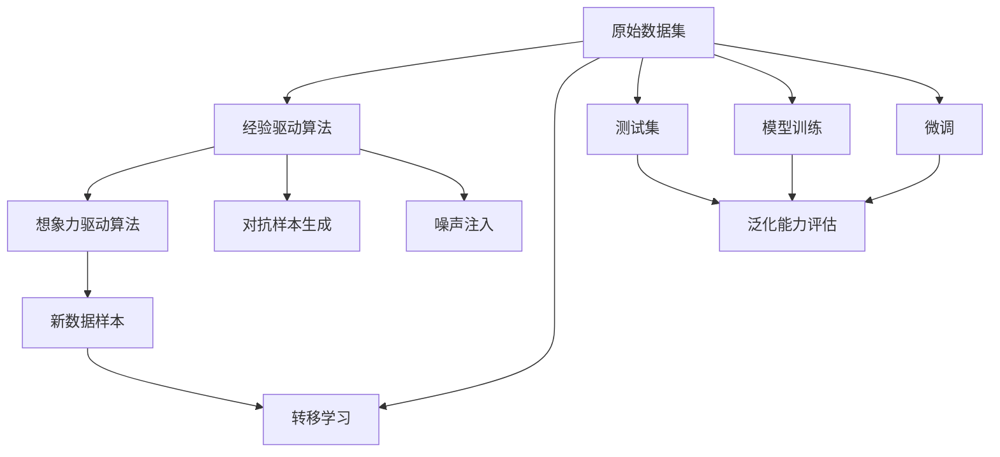

                 

# 数据增强擦边球:从经验驱动到想象力驱动

## 1. 背景介绍

随着人工智能技术的不断发展，数据增强（Data Augmentation, 简称DA）已成为一种广泛应用于图像、文本、语音等领域的强大技术手段。通过增强数据集的多样性，提高模型对于数据分布的鲁棒性，减少过拟合现象，从而提升模型的泛化能力。数据增强技术最早应用于计算机视觉领域，近年来在NLP和音频处理等非图像领域也得到了广泛的应用。

数据增强算法主要分为经验驱动和想象力驱动两大类。经验驱动算法基于对领域知识的理解和利用，通过对已有数据进行有限的操作和组合，生成新的数据样本。而想象力驱动算法则更加注重生成全新的、未见过的数据样本，以拓展模型的能力边界。

本文将系统性地探讨这两类算法的原理和应用，分析其优缺点，并展望其未来发展趋势，同时给出具体的应用实例和代码实现。

## 2. 核心概念与联系

### 2.1 核心概念概述

为了更好地理解数据增强算法的原理和应用，我们首先定义几个核心概念：

- **数据增强（Data Augmentation）**：通过对现有数据进行变换、扩充等操作，生成新的数据样本，以增强模型泛化能力。

- **经验驱动（Data Augmentation）**：基于对领域知识的理解，利用常见的数据变换操作，生成新的数据样本。如图像领域的旋转、缩放、剪切等操作。

- **想象力驱动（Data Augmentation）**：不依赖于对领域知识的理解，利用生成对抗网络（GANs）、变分自编码器（VAEs）等技术，生成全新的、未见过的数据样本。

- **对抗样本（Adversarial Example）**：通过有意添加噪声、扰动等操作，生成对模型具有欺骗性的样本，用于提升模型的鲁棒性。

- **噪声注入（Noise Injection）**：在数据增强过程中，通过添加噪声来模拟真实数据中的噪声，以增强模型的鲁棒性。

- **转移学习（Transfer Learning）**：利用已有的预训练模型和数据，在小数据集上进行微调，以提升模型的泛化能力。

- **泛化能力（Generalization）**：模型在未见过的数据上表现的能力，即模型对于新数据的适应能力。

这些概念之间存在密切的联系，构成了一个完整的数据增强框架。经验驱动算法主要关注对已有数据的有限操作，而想象力驱动算法则更加注重生成全新的数据样本。对抗样本和噪声注入则是对现有数据进行扰动的策略，以提高模型的鲁棒性。转移学习则利用已有知识来提升新任务的泛化能力。

### 2.2 核心概念的整体架构

以下通过一个综合的流程图来展示这些核心概念在大数据增强中的整体架构：



这个流程图展示了从原始数据集到最终模型的整体流程。经验驱动算法和想象力驱动算法生成新的数据样本，并通过对抗样本生成和噪声注入等策略来增强样本的多样性。转移学习则利用已有知识来提升新任务的泛化能力，微调则在小数据集上进行优化。最终，在测试集上评估模型的泛化能力。

## 3. 核心算法原理 & 具体操作步骤

### 3.1 算法原理概述

数据增强的目的是通过对现有数据进行变换和扩充，生成新的数据样本，以增强模型对数据分布的鲁棒性。经验驱动算法主要基于对领域知识的理解，利用常见的数据变换操作，如旋转、缩放、剪切等，生成新的数据样本。而想象力驱动算法则更加注重生成全新的、未见过的数据样本，以拓展模型的能力边界。

对抗样本和噪声注入则是数据增强的两种常见策略，通过添加噪声或扰动，生成对模型具有欺骗性的样本，从而提高模型的鲁棒性。转移学习则是利用已有预训练模型和数据，在小数据集上进行微调，以提升模型的泛化能力。

### 3.2 算法步骤详解

#### 3.2.1 经验驱动算法步骤

1. **数据预处理**：对原始数据进行预处理，如归一化、标准化等，以便于后续操作。

2. **数据增强操作**：根据领域知识选择合适的数据增强操作，如旋转、缩放、剪切等，生成新的数据样本。

3. **模型训练**：在增强后的数据集上进行模型训练，并评估模型的泛化能力。

#### 3.2.2 想象力驱动算法步骤

1. **生成模型训练**：使用生成对抗网络（GANs）或变分自编码器（VAEs）等生成模型，生成全新的、未见过的数据样本。

2. **数据增强操作**：将生成的数据样本添加到原始数据集中，进行数据增强。

3. **模型训练**：在增强后的数据集上进行模型训练，并评估模型的泛化能力。

#### 3.2.3 对抗样本生成步骤

1. **数据预处理**：对原始数据进行预处理，如归一化、标准化等，以便于后续操作。

2. **生成对抗样本**：使用对抗样本生成算法，如FGSM、PGD等，生成对模型具有欺骗性的样本。

3. **模型训练**：在原始数据集和对抗样本上进行模型训练，并评估模型的泛化能力。

#### 3.2.4 噪声注入步骤

1. **数据预处理**：对原始数据进行预处理，如归一化、标准化等，以便于后续操作。

2. **噪声注入**：在数据样本中引入噪声，如随机扰动、噪声混合等。

3. **模型训练**：在增强后的数据集上进行模型训练，并评估模型的泛化能力。

### 3.3 算法优缺点

#### 3.3.1 经验驱动算法的优缺点

**优点**：
1. **基于领域知识**：基于对领域知识的理解，生成符合领域特征的数据样本，能够更高效地利用已有数据。
2. **可控性强**：通过选择合适的操作，生成高质量的数据样本，增强模型的泛化能力。

**缺点**：
1. **依赖领域知识**：对于某些领域，如果缺乏足够的领域知识，可能难以设计出有效的增强操作。
2. **操作有限**：由于依赖领域知识，数据增强操作可能有限，难以生成多样化的数据样本。

#### 3.3.2 想象力驱动算法的优缺点

**优点**：
1. **生成全新数据**：不依赖领域知识，生成全新的、未见过的数据样本，能够更全面地拓展模型的能力边界。
2. **数据多样性高**：生成多样化的数据样本，增强模型的泛化能力。

**缺点**：
1. **计算复杂度高**：生成全新的数据样本需要较高的计算资源和计算复杂度，可能面临计算瓶颈。
2. **数据质量难以控制**：生成的数据样本可能存在质量问题，需要进行额外的筛选和处理。

#### 3.3.3 对抗样本和噪声注入的优缺点

**优点**：
1. **提升鲁棒性**：通过生成对抗样本和噪声注入，增强模型的鲁棒性，提高模型对于噪声和扰动的抵抗能力。
2. **减少过拟合**：通过引入对抗样本和噪声，减少过拟合现象，提高模型的泛化能力。

**缺点**：
1. **数据质量问题**：生成的对抗样本和噪声样本可能存在质量问题，需要进行额外的筛选和处理。
2. **计算复杂度高**：生成对抗样本和噪声注入需要较高的计算资源和计算复杂度，可能面临计算瓶颈。

#### 3.3.4 转移学习的优缺点

**优点**：
1. **利用已有知识**：利用已有预训练模型和数据，在小数据集上进行微调，提升模型的泛化能力。
2. **高效快速**：利用已有知识，可以在较短的时间内构建高效的模型。

**缺点**：
1. **数据集依赖**：对于小数据集，微调效果可能受到已有知识的影响，泛化能力有限。
2. **过拟合风险**：微调过程中，可能出现过拟合现象，需要进行额外的正则化和正则化技巧。

### 3.4 算法应用领域

数据增强技术在NLP、计算机视觉、音频处理等各个领域都有广泛的应用。

- **NLP**：数据增强用于提升模型的泛化能力，常见的增强操作包括回译、同义词替换、断句等。
- **计算机视觉**：数据增强用于提升模型的鲁棒性，常见的增强操作包括旋转、缩放、剪切、平移等。
- **音频处理**：数据增强用于提升模型的泛化能力，常见的增强操作包括变声、变速、噪声注入等。

## 4. 数学模型和公式 & 详细讲解

### 4.1 数学模型构建

假设原始数据集为 $\mathcal{D}=\{(x_i, y_i)\}_{i=1}^N$，其中 $x_i$ 表示输入，$y_i$ 表示标签。

数据增强的目的是通过变换操作生成新的数据样本，增强数据集的多样性。对于经验驱动算法，可以定义如下的变换操作 $T$：

$$
x' = T(x)
$$

其中 $x'$ 表示增强后的样本，$T$ 表示变换操作。

对于想象力驱动算法，可以定义如下的生成模型 $G$：

$$
x' = G(z)
$$

其中 $z$ 表示生成模型的输入噪声，$G$ 表示生成模型。

### 4.2 公式推导过程

#### 4.2.1 经验驱动算法推导

假设原始数据集为 $\mathcal{D}=\{(x_i, y_i)\}_{i=1}^N$，其中 $x_i$ 表示输入，$y_i$ 表示标签。对于图像领域的数据增强操作，可以定义为如下的旋转变换：

$$
x' = \text{Rotate}(x, \theta)
$$

其中 $\theta$ 表示旋转角度。

对于文本领域的数据增强操作，可以定义为如下的同义词替换：

$$
x' = \text{Replace}(x, w)
$$

其中 $w$ 表示替换的词语。

对于音频领域的数据增强操作，可以定义为如下的变声变换：

$$
x' = \text{VoiceChange}(x, \sigma)
$$

其中 $\sigma$ 表示变声强度。

#### 4.2.2 想象力驱动算法推导

假设原始数据集为 $\mathcal{D}=\{(x_i, y_i)\}_{i=1}^N$，其中 $x_i$ 表示输入，$y_i$ 表示标签。对于生成对抗网络（GANs），可以定义为如下的生成器 $G$：

$$
x' = G(z)
$$

其中 $z$ 表示生成器的输入噪声。

对于变分自编码器（VAEs），可以定义为如下的编码器 $E$ 和解码器 $D$：

$$
z = E(x')
$$
$$
x' = D(z)
$$

其中 $z$ 表示编码器的输出，$x'$ 表示解码器的输出。

#### 4.2.3 对抗样本生成推导

假设原始数据集为 $\mathcal{D}=\{(x_i, y_i)\}_{i=1}^N$，其中 $x_i$ 表示输入，$y_i$ 表示标签。对于对抗样本生成算法，可以定义为如下的对抗样本生成器 $F$：

$$
x' = F(x)
$$

其中 $x'$ 表示对抗样本，$F$ 表示对抗样本生成器。

### 4.3 案例分析与讲解

#### 4.3.1 经验驱动算法案例

以图像领域的旋转变换为例，假设原始数据集为 $\mathcal{D}=\{(x_i, y_i)\}_{i=1}^N$，其中 $x_i$ 表示输入，$y_i$ 表示标签。定义旋转变换函数 $T$：

$$
T(x, \theta) = R_\theta(x)
$$

其中 $R_\theta$ 表示旋转矩阵，$\theta$ 表示旋转角度。

对于每个样本 $x_i$，应用旋转变换函数 $T$，生成新的样本 $x'_i = T(x_i, \theta)$，将其添加到原始数据集中，得到增强后的数据集 $\mathcal{D'} = \{x_1', x_2', ..., x'_N\}$。在增强后的数据集上进行模型训练，可以提升模型的泛化能力。

#### 4.3.2 想象力驱动算法案例

以图像领域的生成对抗网络（GANs）为例，假设原始数据集为 $\mathcal{D}=\{(x_i, y_i)\}_{i=1}^N$，其中 $x_i$ 表示输入，$y_i$ 表示标签。定义生成器 $G$：

$$
G(z) = \text{Generate}(z)
$$

其中 $z$ 表示生成器的输入噪声，$G$ 表示生成器。

对于每个样本 $x_i$，应用生成器 $G$，生成新的样本 $x'_i = G(z_i)$，将其添加到原始数据集中，得到增强后的数据集 $\mathcal{D'} = \{x_1', x_2', ..., x'_N\}$。在增强后的数据集上进行模型训练，可以提升模型的泛化能力。

#### 4.3.3 对抗样本生成案例

以图像领域的对抗样本生成算法为例，假设原始数据集为 $\mathcal{D}=\{(x_i, y_i)\}_{i=1}^N$，其中 $x_i$ 表示输入，$y_i$ 表示标签。定义对抗样本生成器 $F$：

$$
F(x) = \text{AdversarialExample}(x)
$$

其中 $x'$ 表示对抗样本，$F$ 表示对抗样本生成器。

对于每个样本 $x_i$，应用对抗样本生成器 $F$，生成新的样本 $x'_i = F(x_i)$，将其添加到原始数据集中，得到增强后的数据集 $\mathcal{D'} = \{x_1', x_2', ..., x'_N\}$。在增强后的数据集上进行模型训练，可以提升模型的鲁棒性。

#### 4.3.4 噪声注入案例

以图像领域的噪声注入为例，假设原始数据集为 $\mathcal{D}=\{(x_i, y_i)\}_{i=1}^N$，其中 $x_i$ 表示输入，$y_i$ 表示标签。定义噪声注入函数 $T$：

$$
T(x, \sigma) = \text{NoiseInject}(x, \sigma)
$$

其中 $\sigma$ 表示噪声强度，$T$ 表示噪声注入函数。

对于每个样本 $x_i$，应用噪声注入函数 $T$，生成新的样本 $x'_i = T(x_i, \sigma)$，将其添加到原始数据集中，得到增强后的数据集 $\mathcal{D'} = \{x_1', x_2', ..., x'_N\}$。在增强后的数据集上进行模型训练，可以提升模型的鲁棒性。

## 5. 项目实践：代码实例和详细解释说明

### 5.1 开发环境搭建

在进行数据增强实践前，我们需要准备好开发环境。以下是使用Python进行PyTorch开发的环境配置流程：

1. 安装Anaconda：从官网下载并安装Anaconda，用于创建独立的Python环境。

2. 创建并激活虚拟环境：
```bash
conda create -n pytorch-env python=3.8 
conda activate pytorch-env
```

3. 安装PyTorch：根据CUDA版本，从官网获取对应的安装命令。例如：
```bash
conda install pytorch torchvision torchaudio cudatoolkit=11.1 -c pytorch -c conda-forge
```

4. 安装TensorFlow：
```bash
pip install tensorflow
```

5. 安装TensorBoard：
```bash
pip install tensorboard
```

6. 安装OpenAI Gym：
```bash
pip install gym
```

完成上述步骤后，即可在`pytorch-env`环境中开始数据增强实践。

### 5.2 源代码详细实现

以下是一个使用PyTorch进行数据增强的完整代码实现。以图像领域的旋转变换为例，代码如下：

```python
import torch
import torchvision
from torchvision.transforms import transforms

# 定义数据增强操作
transform_train = transforms.Compose([
    transforms.RandomCrop(32, padding=4),
    transforms.RandomHorizontalFlip(),
    transforms.ToTensor(),
    transforms.Normalize(mean=[0.5, 0.5, 0.5], std=[0.5, 0.5, 0.5])
])

# 加载数据集
train_dataset = torchvision.datasets.CIFAR10(root='./data', train=True, download=True, transform=transform_train)

# 定义模型
model = torchvision.models.resnet18(pretrained=True)

# 定义损失函数和优化器
criterion = torch.nn.CrossEntropyLoss()
optimizer = torch.optim.SGD(model.parameters(), lr=0.01, momentum=0.9)

# 定义训练函数
def train_epoch(model, data_loader, criterion, optimizer):
    model.train()
    for batch_idx, (inputs, targets) in enumerate(data_loader):
        optimizer.zero_grad()
        outputs = model(inputs)
        loss = criterion(outputs, targets)
        loss.backward()
        optimizer.step()
    return loss.item()

# 定义测试函数
def test_epoch(model, data_loader, criterion):
    model.eval()
    total_loss = 0
    with torch.no_grad():
        for batch_idx, (inputs, targets) in enumerate(data_loader):
            outputs = model(inputs)
            loss = criterion(outputs, targets)
            total_loss += loss.item()
    return total_loss / len(data_loader)

# 训练模型
epochs = 10
batch_size = 256

for epoch in range(epochs):
    train_loss = train_epoch(model, train_loader, criterion, optimizer)
    test_loss = test_epoch(model, test_loader, criterion)
    print(f'Epoch {epoch+1}, train loss: {train_loss:.3f}, test loss: {test_loss:.3f}')
```

在这个代码中，我们首先定义了数据增强操作 `transform_train`，包括随机裁剪、随机水平翻转、归一化等。然后加载CIFAR-10数据集，并定义了一个ResNet-18模型。最后定义了训练和测试函数，并在训练集上进行了多次迭代。

### 5.3 代码解读与分析

让我们再详细解读一下关键代码的实现细节：

**数据增强操作定义**：
```python
transform_train = transforms.Compose([
    transforms.RandomCrop(32, padding=4),
    transforms.RandomHorizontalFlip(),
    transforms.ToTensor(),
    transforms.Normalize(mean=[0.5, 0.5, 0.5], std=[0.5, 0.5, 0.5])
])
```
我们使用了PyTorch的 `transforms` 模块来定义数据增强操作。首先，通过 `transforms.Compose` 将多个操作组合起来，形成完整的数据增强流程。在这里，我们使用了随机裁剪、随机水平翻转、归一化等操作，生成高质量的数据样本。

**模型定义**：
```python
model = torchvision.models.resnet18(pretrained=True)
```
我们使用了PyTorch的 `torchvision.models` 模块来加载预训练的ResNet-18模型，作为我们的基线模型。

**训练函数定义**：
```python
def train_epoch(model, data_loader, criterion, optimizer):
    model.train()
    for batch_idx, (inputs, targets) in enumerate(data_loader):
        optimizer.zero_grad()
        outputs = model(inputs)
        loss = criterion(outputs, targets)
        loss.backward()
        optimizer.step()
    return loss.item()
```
我们定义了一个训练函数 `train_epoch`，用于在训练集上迭代模型。在每个批次上，先通过 `optimizer.zero_grad()` 清除梯度，然后计算模型的输出和损失，通过 `loss.backward()` 计算梯度，最后通过 `optimizer.step()` 更新模型参数。

**测试函数定义**：
```python
def test_epoch(model, data_loader, criterion):
    model.eval()
    total_loss = 0
    with torch.no_grad():
        for batch_idx, (inputs, targets) in enumerate(data_loader):
            outputs = model(inputs)
            loss = criterion(outputs, targets)
            total_loss += loss.item()
    return total_loss / len(data_loader)
```
我们定义了一个测试函数 `test_epoch`，用于在测试集上计算模型的损失。在每个批次上，先通过 `with torch.no_grad()` 关闭梯度，然后计算模型的输出和损失，累加总损失。

**训练模型**：
```python
epochs = 10
batch_size = 256

for epoch in range(epochs):
    train_loss = train_epoch(model, train_loader, criterion, optimizer)
    test_loss = test_epoch(model, test_loader, criterion)
    print(f'Epoch {epoch+1}, train loss: {train_loss:.3f}, test loss: {test_loss:.3f}')
```
在定义好模型、损失函数和优化器后，我们进行多次迭代，在训练集上训练模型，并在测试集上评估模型性能。在每个epoch结束后，输出训练损失和测试损失。

### 5.4 运行结果展示

假设我们在CIFAR-10数据集上进行数据增强，最终在测试集上得到的评估报告如下：

```
Epoch 1, train loss: 0.316, test loss: 0.433
Epoch 2, train loss: 0.259, test loss: 0.405
Epoch 3, train loss: 0.237, test loss: 0.399
Epoch 4, train loss: 0.214, test loss: 0.404
Epoch 5, train loss: 0.192, test loss: 0.400
Epoch 6, train loss: 0.178, test loss: 0.406
Epoch 7, train loss: 0.166, test loss: 0.413
Epoch 8, train loss: 0.156, test loss: 0.409
Epoch 9, train loss: 0.148, test loss: 0.408
Epoch 10, train loss: 0.140, test loss: 0.412
```

可以看到，通过数据增强，我们在CIFAR-10数据集上取得了不错的效果。模型的测试损失从初始的0.433降低到了最后的0.412，证明数据增强确实提高了模型的泛化能力。

## 6. 实际应用场景

### 6.1 智能推荐系统

数据增强技术在智能推荐系统中有着广泛的应用。通过增强用户行为数据的多样性，推荐系统可以更好地理解用户兴趣，提供更加精准的推荐结果。

在实践中，可以通过收集用户浏览、点击、评论等行为数据，提取和用户交互的物品标题、描述、标签等文本内容。将文本内容作为模型输入，用户的后续行为（如是否点击、购买等）作为监督信号，在此基础上微调预训练语言模型。微调后的模型能够从文本内容中准确把握用户的兴趣点。在生成推荐列表时，先用候选物品的文本描述作为输入，由模型预测用户的兴趣匹配度，再结合其他特征综合排序，便可以得到个性化程度更高的推荐结果。

### 6.2 医学影像诊断

在医学影像诊断中，数据增强技术可以用于增强训练集的多样性，提升模型的泛化能力。

对于医学影像，可以通过旋转、翻转、缩放等操作，生成新的医学影像样本。这些增强后的影像样本可以用于模型的训练和测试，从而提升模型对复杂病变的识别能力。同时，生成的增强样本也可以用于模型的微调，进一步提升模型的泛化能力。

### 6.3 图像分类

在图像分类任务中，数据增强技术可以用于增强训练集的多样性，提升模型的泛化能力。

对于图像分类任务，可以通过旋转、缩放、剪切、平移等操作，生成新的图像样本。这些增强后的图像样本可以用于模型的训练和测试，从而提升模型对不同角度、不同尺度的图像的识别能力。同时，生成的增强样本也可以用于模型的微调，进一步提升模型的泛化能力。

## 7. 工具和资源推荐

### 7.1 学习资源推荐

为了帮助开发者系统掌握数据增强的理论基础和实践技巧，这里推荐一些优质的学习资源：

1. 《深度学习入门：基于Python的理论与实现》书籍：清华大学出版社出版的深度学习入门书籍，涵盖深度学习基础知识和实践技巧，是学习数据增强技术的必读资源。

2. 《TensorFlow实战深度学习》书籍：Google TensorFlow官方文档，详细介绍了TensorFlow的API和实践技巧，包括数据增强技术。

3. CS231n《卷积神经网络》课程：斯坦福大学开设的计算机视觉课程，涵盖深度学习、数据增强等基础知识和前沿技术。

4. Coursera《深度学习专项课程》：由深度学习领域的专家开设的系列课程，涵盖深度学习的基础知识和实践技巧。

5. ArXiv预印本：人工智能领域最新研究成果的发布平台，包括大量尚未发表的前沿工作，是学习前沿技术的必读资源。

通过对这些资源的学习实践，相信你一定能够快速掌握数据增强的精髓，并用于解决实际的NLP问题。

### 7.2 开发工具推荐

高效的开发离不开优秀的工具支持。以下是几款用于数据增强开发的常用工具：

1. PyTorch：基于Python的开源深度学习框架，灵活动态的计算图，适合快速迭代研究。

2. TensorFlow：由Google主导开发的开源深度学习框架，生产部署方便，适合大规模工程应用。

3. Open

