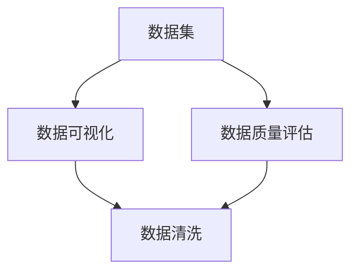

                 

# 数据集可视化分析:直观发现数据质量问题

## 1. 背景介绍

随着数据的重要性日益增加，数据集可视化分析成为发现数据质量问题、提升数据处理效率的重要手段。无论是在科学研究、商业决策、机器学习等领域，高质量的数据集都是取得成功的关键。然而，数据集往往包含了大量噪声、错误和不一致性，如何有效识别和处理这些问题，成为了数据处理人员和研究者的挑战。

### 1.1 数据集的重要性
数据集是构建任何数据驱动应用的基础。无论是金融风控、医疗诊断、智能推荐还是自然语言处理，数据集的质量直接影响模型训练的效果和应用的准确性。高质量的数据集需要满足以下标准：

1. **完整性**：数据集应包含所有相关记录，没有缺失。
2. **准确性**：数据集中的每个记录和值都应该是真实、准确的。
3. **一致性**：数据集中的相同记录应具有相同的数据格式和值。
4. **代表性**：数据集应充分反映实际应用场景，具有广泛的覆盖范围。

### 1.2 数据集中的常见问题
数据集中的常见问题包括但不限于：

1. **缺失值**：某些记录缺少关键的字段。
2. **异常值**：某些记录的值与大多数值显著不同，可能是错误或噪声。
3. **重复记录**：同一数据记录被重复计数。
4. **格式不一致**：记录的字段格式不一致，导致无法统一处理。
5. **数据类型错误**：记录的字段类型与定义不一致，导致数据无法正确使用。
6. **数据不一致**：不同记录之间的相同字段值不一致。

这些问题都会影响数据集的质量，进而影响后续的数据分析和机器学习模型的训练效果。

## 2. 核心概念与联系

### 2.1 核心概念概述

本节将介绍几个核心概念，以帮助读者更好地理解数据集可视化分析的方法和步骤。

- **数据集**：由一组有序、有组织的记录构成，每个记录包含一组字段值。
- **数据可视化**：将数据转化为图形或图表的形式，直观展示数据的特征和规律。
- **数据质量**：描述数据集是否满足完整性、准确性、一致性、代表性等标准。
- **数据清洗**：通过删除、修改、填补等方法，提高数据集的质量。

这些概念之间的关系可以通过以下Mermaid流程图来展示：



这个流程图展示了数据集、数据可视化、数据质量和数据清洗之间的关系：

1. 数据集是数据可视化和数据质量评估的基础。
2. 数据可视化帮助识别数据集中的问题和规律。
3. 数据质量评估用于衡量数据集是否满足标准。
4. 数据清洗通过修改数据集，提升数据质量。

### 2.2 核心概念之间的联系

这些核心概念之间的关系紧密，形成了一个闭环：

- **数据集与数据可视化**：数据集是数据可视化的对象，可视化结果帮助识别数据集中的问题。
- **数据集与数据质量评估**：数据集的质量直接影响数据质量评估的结果。
- **数据可视化与数据清洗**：可视化结果提供的数据质量问题，指导数据清洗的过程。
- **数据质量评估与数据清洗**：数据质量评估的结果，驱动数据清洗的目标和策略。

## 3. 核心算法原理 & 具体操作步骤

### 3.1 算法原理概述

数据集可视化分析的算法原理主要基于以下几个方面：

- **统计分析**：通过统计描述和可视化方法，识别数据集中的基本特征和规律。
- **质量评估**：使用各种指标和算法，评估数据集的质量。
- **数据清洗**：基于可视化结果和质量评估，确定数据清洗的具体策略和步骤。

### 3.2 算法步骤详解

数据集可视化分析一般包括以下几个关键步骤：

**Step 1: 数据预处理**
- 对数据集进行初步清洗，包括删除重复记录、处理缺失值、转换数据类型等。

**Step 2: 数据可视化**
- 使用图表和图形工具（如Matplotlib、Seaborn、Tableau等）展示数据集的基本特征，如直方图、散点图、箱线图等。

**Step 3: 数据质量评估**
- 使用各种质量评估指标（如完整性、准确性、一致性、代表性）和算法（如均值、中位数、标准差、相关系数等）评估数据集的质量。

**Step 4: 数据清洗**
- 根据可视化结果和质量评估，确定数据清洗的具体策略，如删除异常值、填补缺失值、标准化数据格式等。

**Step 5: 验证和迭代**
- 对清洗后的数据集进行可视化，评估清洗效果，确定是否需要进一步调整。

### 3.3 算法优缺点

数据集可视化分析的优点包括：

- **直观性**：通过图形和图表，直观展示数据集的特征和问题。
- **可操作性**：可视化结果可以指导数据清洗的策略，提升数据质量。
- **系统性**：通过多个步骤的持续迭代，确保数据集的质量。

其缺点包括：

- **复杂性**：对于大规模数据集，可视化过程和质量评估可能较为复杂。
- **主观性**：可视化结果和质量评估受个人主观因素影响，需要多方验证。
- **资源需求**：可视化工具和质量评估算法可能需要较高的计算资源。

### 3.4 算法应用领域

数据集可视化分析在以下领域得到了广泛应用：

- **科学研究**：用于分析实验数据、观测数据，发现数据集中的规律和异常。
- **商业决策**：用于评估市场数据、客户数据，支持决策制定。
- **金融分析**：用于分析交易数据、财务数据，评估数据集的质量。
- **医疗健康**：用于分析病人数据、临床数据，提高数据质量。
- **智能推荐**：用于分析用户数据、商品数据，优化推荐系统。

## 4. 数学模型和公式 & 详细讲解  
### 4.1 数学模型构建

本节将使用数学语言对数据集可视化分析的算法进行严格刻画。

记数据集为 $D=\{(x_i,y_i)\}_{i=1}^N$，其中 $x$ 为输入特征，$y$ 为目标变量。

定义数据集的基本统计量为：

- 均值 $\mu_x=\frac{1}{N}\sum_{i=1}^N x_i$
- 中位数 $median_x=\frac{1}{2}(x_{(1)}+x_{(N+1)})$
- 标准差 $\sigma_x=\sqrt{\frac{1}{N}\sum_{i=1}^N (x_i-\mu_x)^2}$
- 相关系数 $\rho_{xy}=\frac{\sum_{i=1}^N (x_i-\mu_x)(y_i-\mu_y)}{\sqrt{\sum_{i=1}^N (x_i-\mu_x)^2 \sum_{i=1}^N (y_i-\mu_y)^2}}$

其中 $x_{(1)}$ 和 $x_{(N+1)}$ 分别为 $x$ 的排序后值。

### 4.2 公式推导过程

以下是几个基本统计量的推导过程：

**均值**
$$
\mu_x = \frac{1}{N}\sum_{i=1}^N x_i
$$

**中位数**
$$
median_x = \frac{1}{2}(x_{(1)}+x_{(N+1)})
$$

**标准差**
$$
\sigma_x = \sqrt{\frac{1}{N}\sum_{i=1}^N (x_i-\mu_x)^2}
$$

**相关系数**
$$
\rho_{xy} = \frac{\sum_{i=1}^N (x_i-\mu_x)(y_i-\mu_y)}{\sqrt{\sum_{i=1}^N (x_i-\mu_x)^2 \sum_{i=1}^N (y_i-\mu_y)^2}}
$$

这些公式展示了如何通过简单的数学运算，计算数据集的基本统计量。

### 4.3 案例分析与讲解

以一个简单的数据集为例，展示如何通过可视化分析和质量评估，识别数据集中的问题和规律。

假设我们有一个包含10个学生成绩的数据集，如表所示：

| 学生编号 | 数学成绩 | 英语成绩 | 语文成绩 |
|----------|----------|----------|----------|
| 1        | 85       | 92       | 90       |
| 2        | 78       | 88       | 82       |
| 3        | 90       | 86       | 89       |
| 4        | 88       | 80       | 85       |
| 5        | 95       | 89       | 92       |
| 6        | 80       | 75       | 77       |
| 7        | 85       | 90       | 87       |
| 8        | 90       | 89       | 91       |
| 9        | 78       | 83       | 79       |
| 10       | 88       | 90       | 89       |

**Step 1: 数据预处理**
- 删除重复记录，检查数据格式是否一致，转换数据类型。

**Step 2: 数据可视化**
- 绘制箱线图，展示每门课程成绩的分布情况，如图：


- 绘制散点图，展示数学成绩和英语成绩之间的关系，如图：


**Step 3: 数据质量评估**
- 计算每门课程成绩的均值、中位数、标准差和相关系数。

**Step 4: 数据清洗**
- 根据箱线图，删除异常值（如数学成绩超过100）。
- 根据散点图，检查是否存在异常点（如学生1和学生4），进行数据修正。
- 根据相关系数，识别是否存在强相关性（如数学成绩和英语成绩）。

**Step 5: 验证和迭代**
- 对清洗后的数据集进行可视化，确保数据质量。

## 5. 项目实践：代码实例和详细解释说明
### 5.1 开发环境搭建

在进行数据集可视化分析的实践前，我们需要准备好开发环境。以下是使用Python进行Pandas和Matplotlib开发的环境配置流程：

1. 安装Anaconda：从官网下载并安装Anaconda，用于创建独立的Python环境。

2. 创建并激活虚拟环境：
```bash
conda create -n data-analysis-env python=3.8 
conda activate data-analysis-env
```

3. 安装Pandas：
```bash
conda install pandas
```

4. 安装Matplotlib：
```bash
conda install matplotlib
```

5. 安装NumPy、scikit-learn等工具包：
```bash
pip install numpy scikit-learn
```

完成上述步骤后，即可在`data-analysis-env`环境中开始数据集可视化分析的实践。

### 5.2 源代码详细实现

下面我们以一个简单的数据集为例，展示使用Pandas和Matplotlib进行数据集可视化分析的PyTorch代码实现。

首先，定义数据集：

```python
import pandas as pd

# 定义数据集
data = pd.DataFrame({
    '学生编号': [1, 2, 3, 4, 5, 6, 7, 8, 9, 10],
    '数学成绩': [85, 78, 90, 88, 95, 80, 85, 90, 78, 88],
    '英语成绩': [92, 88, 86, 80, 89, 75, 90, 89, 83, 90],
    '语文成绩': [90, 82, 89, 85, 92, 77, 87, 91, 79, 89]
})

# 绘制箱线图和散点图
data.boxplot(figsize=(10, 5))
plt.title('成绩分布')
plt.show()

data.plot(kind='scatter', x='数学成绩', y='英语成绩', figsize=(10, 5))
plt.title('数学成绩与英语成绩关系')
plt.show()
```

然后，定义数据集的基本统计量：

```python
import numpy as np
from scipy.stats import pearsonr

# 计算均值、中位数、标准差和相关系数
mean_x = np.mean(data)
median_x = np.median(data)
std_x = np.std(data)
corr_xy = pearsonr(data['数学成绩'], data['英语成绩'])[0]
```

最后，展示数据集的基本统计量：

```python
print('均值:', mean_x)
print('中位数:', median_x)
print('标准差:', std_x)
print('相关系数:', corr_xy)
```

以上就是使用Pandas和Matplotlib进行数据集可视化分析的完整代码实现。可以看到，Pandas和Matplotlib提供了强大的数据处理和可视化工具，使得数据集可视化分析变得简洁高效。

### 5.3 代码解读与分析

让我们再详细解读一下关键代码的实现细节：

**数据集定义**
- 使用Pandas的DataFrame定义数据集，包含学生编号、数学成绩、英语成绩和语文成绩。

**箱线图绘制**
- 使用DataFrame的boxplot方法绘制箱线图，展示每门课程成绩的分布情况。
- 使用Matplotlib的show方法展示图表。

**散点图绘制**
- 使用DataFrame的plot方法绘制散点图，展示数学成绩和英语成绩之间的关系。
- 使用Matplotlib的show方法展示图表。

**统计量计算**
- 使用NumPy的mean、median、std等函数计算数据集的均值、中位数和标准差。
- 使用scipy.stats的pearsonr函数计算数据集的相关系数。

**结果展示**
- 通过print语句展示数据集的基本统计量。

可以看到，Pandas和Matplotlib使得数据集可视化分析变得简单易行。开发者可以通过调整代码参数，展示不同的可视化图表，进一步分析数据集的质量和规律。

## 6. 实际应用场景
### 6.1 金融风控
在金融风控领域，数据集可视化分析可以帮助识别和处理数据集中的异常值和噪声，提升风险评估模型的准确性。例如，通过可视化分析客户数据集，可以识别出高风险客户的行为特征，建立更加精细的风险评分模型。

### 6.2 医疗诊断
在医疗诊断领域，数据集可视化分析可以帮助发现和处理病历数据集中的错误和不一致性，提升诊断系统的准确性。例如，通过可视化分析病历数据集，可以识别出遗漏的检查项目，纠正错误的诊断结果，建立更加可靠的诊断模型。

### 6.3 电商推荐
在电商推荐领域，数据集可视化分析可以帮助发现和处理用户数据集中的异常值和噪声，提升推荐系统的准确性。例如，通过可视化分析用户数据集，可以识别出虚假交易行为，筛选掉不真实的用户行为数据，建立更加精准的推荐模型。

### 6.4 未来应用展望
未来，数据集可视化分析将在更多领域得到应用，为数据分析和决策提供有力支持。

在智慧城市治理中，数据集可视化分析可以帮助识别和处理交通数据集中的异常和错误，提升城市管理的智能化水平。例如，通过可视化分析交通数据集，可以识别出道路拥堵区域，优化交通信号灯控制，提高交通流畅性。

在智能制造中，数据集可视化分析可以帮助识别和处理生产数据集中的异常和噪声，提升生产系统的稳定性。例如，通过可视化分析生产数据集，可以识别出设备故障信号，及时维修保养，减少生产停机时间。

总之，数据集可视化分析将成为数据驱动决策的重要工具，助力各行各业实现智能化转型。

## 7. 工具和资源推荐
### 7.1 学习资源推荐

为了帮助开发者系统掌握数据集可视化分析的理论基础和实践技巧，这里推荐一些优质的学习资源：

1. 《Python数据科学手册》：一本全面介绍Python数据科学库的书籍，包括Pandas、Matplotlib等。

2. Kaggle官方教程：Kaggle提供的大量数据集可视化分析和机器学习实战教程，涵盖从数据预处理到模型评估的全过程。

3. Coursera《数据可视化》课程：杜克大学开设的数据可视化课程，系统介绍数据可视化的基本原理和实践方法。

4. DataCamp：提供在线的数据科学和数据可视化课程，适合初学者快速上手。

5. Udacity《数据可视化与机器学习》纳米学位：Udacity提供的数据可视化课程，结合实际案例讲解数据可视化方法和技巧。

通过这些资源的学习实践，相信你一定能够快速掌握数据集可视化分析的精髓，并用于解决实际的数据问题。

### 7.2 开发工具推荐

高效的开发离不开优秀的工具支持。以下是几款用于数据集可视化分析开发的常用工具：

1. Jupyter Notebook：一个交互式的数据分析环境，支持Python、R等多种编程语言。

2. R语言：一个专门用于数据分析和统计的编程语言，提供丰富的统计分析和可视化库。

3. Tableau：一个强大的商业智能工具，提供直观的交互式可视化界面。

4. Power BI：微软提供的商业智能平台，提供丰富的数据可视化和分析工具。

5. Plotly：一个交互式数据可视化库，支持Python、R等多种编程语言。

合理利用这些工具，可以显著提升数据集可视化分析的开发效率，加快创新迭代的步伐。

### 7.3 相关论文推荐

数据集可视化分析的研究始于统计学和数据科学领域，近年来随着数据量的增大和数据质量的提升，逐渐成为研究热点。以下是几篇奠基性的相关论文，推荐阅读：

1. A Visual Introduction to Data Visualization：一篇介绍数据可视化基本原理和方法的博客文章。

2. Data Visualization Basics：Coursera提供的一门数据可视化课程，系统介绍数据可视化的基本概念和方法。

3. Interactive Visualization and D3.js：一篇介绍D3.js数据可视化库的教程，涵盖基本概念和实践技巧。

4. Glossary of Statistical Terms：一本统计学术语词典，提供统计分析和数据可视化的基本概念和方法。

5. Data Visualization Best Practices：一篇总结数据可视化最佳实践的文章，涵盖图表选择、数据展示、交互设计等多个方面。

这些论文代表了大数据可视化分析的发展脉络，通过学习这些前沿成果，可以帮助研究者把握学科前进方向，激发更多的创新灵感。

除上述资源外，还有一些值得关注的前沿资源，帮助开发者紧跟数据可视化分析技术的最新进展，例如：

1. arXiv论文预印本：人工智能领域最新研究成果的发布平台，包括大量尚未发表的前沿工作，学习前沿技术的必读资源。

2. 业界技术博客：如Tableau、Power BI等顶尖商业智能工具的官方博客，第一时间分享他们的最新研究成果和洞见。

3. 技术会议直播：如SIGGRAPH、VisWeek等数据可视化领域的顶级会议现场或在线直播，能够聆听到专家们的最新分享，开拓视野。

4. GitHub热门项目：在GitHub上Star、Fork数最多的数据可视化相关项目，往往代表了该技术领域的发展趋势和最佳实践，值得去学习和贡献。

5. 行业分析报告：各大咨询公司如McKinsey、PwC等针对数据可视化行业的分析报告，有助于从商业视角审视技术趋势，把握应用价值。

总之，对于数据集可视化分析技术的学习和实践，需要开发者保持开放的心态和持续学习的意愿。多关注前沿资讯，多动手实践，多思考总结，必将收获满满的成长收益。

## 8. 总结：未来发展趋势与挑战
### 8.1 总结

本文对数据集可视化分析的算法和实践进行了全面系统的介绍。首先阐述了数据集可视化分析的重要性，明确了数据可视化在数据质量评估和数据清洗中的关键作用。其次，从原理到实践，详细讲解了数据集可视化分析的数学模型和具体步骤，给出了数据集可视化分析的完整代码实例。同时，本文还广泛探讨了数据集可视化分析在金融风控、医疗诊断、电商推荐等多个行业领域的应用前景，展示了数据集可视化分析的巨大潜力。

通过本文的系统梳理，可以看到，数据集可视化分析已经成为数据分析和决策的重要手段，极大地提升了数据质量评估和数据清洗的效率。未来，伴随数据量的不断增大和数据质量的不断提升，数据集可视化分析必将发挥更加重要的作用，助力各行各业实现智能化转型。

### 8.2 未来发展趋势

展望未来，数据集可视化分析将呈现以下几个发展趋势：

1. **自动化**：随着算法和工具的不断进步，数据集可视化分析将更加自动化，减少人为干预，提升效率和准确性。

2. **交互性**：数据集可视化分析将更加交互化，用户可以通过更加灵活的交互方式，进行更深入的数据探索和分析。

3. **动态化**：数据集可视化分析将更加动态化，实时更新数据集变化，提供更加及时的数据洞察。

4. **多模态**：数据集可视化分析将支持多模态数据可视化，涵盖文本、图像、声音等多种数据类型，提供更加全面的数据视角。

5. **可视化工具的集成**：数据集可视化分析工具将与其他数据处理和分析工具进行深度集成，形成更加综合的数据分析平台。

6. **元数据的管理**：数据集可视化分析将更加注重元数据的管理，提升数据的可解释性和可维护性。

以上趋势凸显了数据集可视化分析技术的广阔前景。这些方向的探索发展，必将进一步提升数据集可视化分析的效果和应用范围，为各行各业的数据驱动决策提供更有力的支持。

### 8.3 面临的挑战

尽管数据集可视化分析已经取得了瞩目成就，但在迈向更加智能化、普适化应用的过程中，它仍面临着诸多挑战：

1. **数据量过大**：大规模数据集的可视化分析可能会遇到计算资源和存储资源的瓶颈。如何高效处理大规模数据集，是一个重要问题。

2. **数据复杂性高**：高维数据、多类型数据、异构数据等复杂数据集，增加了数据可视化的难度。

3. **数据敏感性**：敏感数据（如个人隐私、商业机密等）在可视化分析中的保护问题，需要更加严格的数据治理和隐私保护措施。

4. **可视化结果的解释性**：可视化结果的解释性和可理解性不足，可能会影响用户对结果的信任和使用。

5. **交互界面的友好性**：交互界面的友好性和易用性问题，可能影响用户对可视化工具的接受度和使用效率。

6. **自动化与交互性的平衡**：自动化与交互性之间的平衡问题，需要找到合适的方法和工具，满足用户需求。

这些挑战需要在技术、工程、用户需求等多个维度进行综合考虑和解决，以实现数据集可视化分析技术的可持续发展。

### 8.4 研究展望

面对数据集可视化分析所面临的种种挑战，未来的研究需要在以下几个方面寻求新的突破：

1. **多维数据的可视化**：研究多维数据（如高维数据、多类型数据等）的可视化方法，提升数据的可解释性和可理解性。

2. **数据隐私保护**：研究数据可视化中的隐私保护技术，保护敏感数据的安全性。

3. **可视化工具的集成**：研究数据可视化工具与其他数据处理和分析工具的集成方法，提升数据处理和分析的效率。

4. **交互界面的设计**：研究交互界面的设计方法和工具，提升用户对可视化工具的接受度和使用效率。

5. **自动化与交互性的结合**：研究自动化与交互性之间的平衡方法，提升数据可视化分析的灵活性和易用性。

这些研究方向代表了数据集可视化分析技术的发展方向，将推动数据集可视化分析技术向更加智能化、普适化的方向发展。

## 9. 附录：常见问题与解答

**Q1：数据集可视化分析是否适用于所有数据类型？**

A: 数据集可视化分析适用于大多数数据类型，包括数值型、时间序列型、分类型、文本型等。但对于某些特殊类型的数据，如时间序列数据，可能需要特定的可视化方法和分析工具。

**Q2：如何选择合适的可视化工具？**

A: 选择可视化工具应考虑数据的类型、数据的规模、分析的目标等因素。对于简单的数据集，可以使用Pandas和Matplotlib等Python库进行基本的可视化分析。对于复杂的数据集，可以使用专业的可视化工具如Tableau、Power BI等，支持更加灵活的可视化分析。

**Q3：如何处理大规模数据集的可视化分析？**

A: 处理大规模数据集的可视化分析需要借助分布式计算和高效的可视化工具。可以使用Hadoop、Spark等分布式计算框架，结合可视化工具如D3.js、Highcharts等，进行大规模数据的可视化分析。

**Q4：如何保护数据隐私？**

A: 在数据可视化分析中，保护数据隐私需要采用严格的访问控制、数据脱敏等措施。可以使用匿名化技术、差分隐私等方法，保护敏感数据的安全性。

**Q5：如何提升数据可视化的交互性？**

A: 提升数据可视化的交互性，需要设计友好的交互界面和交互方式。可以使用Web技术（如JavaScript、React等）实现交互式的可视化分析界面，提供更加灵活和直观的可视化分析体验。

总之，数据集可视化分析已经成为数据分析和决策的重要手段，开发者需要根据具体需求选择合适的工具和方法，不断优化和提升数据集可视化分析的效率和效果。

