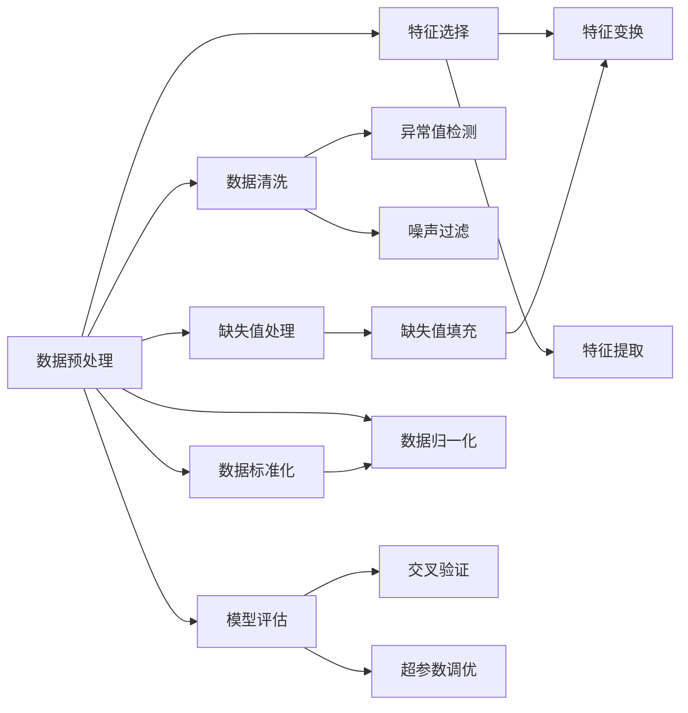

                 

# 数据预处理与特征工程原理与代码实战案例讲解

> 关键词：数据预处理,特征工程,文本清洗,缺失值处理,特征选择,模型评估,机器学习实战案例

## 1. 背景介绍

### 1.1 问题由来

在现代数据驱动的机器学习领域，数据预处理与特征工程是至关重要的步骤。高质量的数据集是训练优秀机器学习模型的基石，而特征工程则是提高模型表现的关键因素。本文将详细介绍数据预处理和特征工程的基本原理和实战技巧，并结合实际案例，展示如何将理论应用到具体的数据科学项目中。

### 1.2 问题核心关键点

数据预处理和特征工程的核心关键点包括：

- 数据清洗与缺失值处理：去除噪声和异常值，填充缺失数据，确保数据集的质量。
- 特征选择与提取：选择合适的特征，提取有效的特征表示，提升模型训练效率和性能。
- 数据标准化与归一化：使不同特征在同一尺度上，有助于提高模型的收敛速度和稳定性能。
- 模型评估与调优：选择合适的评估指标，进行交叉验证和超参数调优，保证模型泛化性能。

本文将从以上几个关键点出发，详细探讨数据预处理和特征工程的具体方法，并通过实际案例演示其应用效果。

### 1.3 问题研究意义

数据预处理和特征工程是机器学习项目中不可或缺的环节，其对模型性能的影响极大。高质量的数据和有意义的特征选择，可以大幅提升模型的泛化能力，减少过拟合风险，加速模型训练。因此，深入理解和掌握数据预处理与特征工程的理论和实践技巧，对提升数据科学项目的整体质量至关重要。

## 2. 核心概念与联系

### 2.1 核心概念概述

为了更好地理解数据预处理与特征工程的方法和流程，本节将介绍几个核心概念：

- **数据预处理**：指在模型训练之前，对原始数据进行清洗、转换和标准化，以提高数据集的质量和一致性。
- **特征工程**：指通过选择合适的特征和设计有效的特征表示，提升模型的预测能力。
- **数据清洗**：指去除或修正数据集中的噪声、异常值、重复记录等，确保数据集的质量。
- **缺失值处理**：指处理数据集中的缺失数据，以避免对模型训练产生负面影响。
- **特征选择**：指选择最具有代表性的特征，去除冗余或无关特征，提升模型训练效率。
- **特征提取**：指通过计算或变换，从原始数据中提取新的特征表示，增强模型的预测能力。
- **数据标准化与归一化**：指将不同特征的取值范围统一到同一范围内，便于模型训练。
- **模型评估与调优**：指通过交叉验证、调参等手段，评估模型性能并进行调优，提升模型泛化能力。

这些核心概念之间有着密切的联系，共同构成了数据预处理与特征工程的基础框架。接下来，我们将通过一个详细的案例来展示这些概念的应用。

### 2.2 概念间的关系

这些核心概念之间的关系可以通过以下Mermaid流程图来展示：



这个流程图展示了数据预处理和特征工程的主要流程及其相关概念的关系。

## 3. 核心算法原理 & 具体操作步骤

### 3.1 算法原理概述

数据预处理与特征工程的过程可以分为以下几个主要步骤：

1. **数据清洗与缺失值处理**：通过检测和修复数据集中的异常值、噪声、缺失值等问题，提高数据集的质量。
2. **特征选择与提取**：选择最具有代表性的特征，并进行有效的特征提取，提升模型的预测能力。
3. **数据标准化与归一化**：将不同特征的取值范围统一到同一范围内，便于模型训练。
4. **模型评估与调优**：选择合适的评估指标，进行交叉验证和超参数调优，保证模型泛化性能。

### 3.2 算法步骤详解

**Step 1: 数据清洗**

数据清洗的目的是去除或修复数据集中的噪声、异常值、重复记录等，确保数据集的质量。常见的数据清洗方法包括：

- **异常值检测**：通过统计学方法或算法（如IQR、Z-score）检测数据集中的异常值，并将其删除或替换。
- **噪声过滤**：识别并移除数据集中的噪声点，如通过滤波器或低通滤波器等方法。
- **重复记录去重**：识别并删除数据集中的重复记录，以避免对模型训练产生负面影响。

**Step 2: 缺失值处理**

数据集中常常存在缺失值，处理方法包括：

- **删除缺失值**：直接删除包含缺失值的记录，适用于缺失值比例较低的场景。
- **插值法**：通过均值、中位数、众数等方法对缺失值进行填补。
- **模型预测填补**：利用其他特征信息构建预测模型，对缺失值进行填补。

**Step 3: 特征选择**

特征选择是从原始特征中选择最具有代表性的特征，以提升模型性能。常见的特征选择方法包括：

- **过滤法**：通过统计学方法或算法（如方差分析、互信息、相关系数等）筛选出最有用的特征。
- **包裹法**：通过构建模型并评估特征的重要性，选择最有用的特征。
- **嵌入式方法**：在模型训练过程中，通过正则化等手段选择最有用的特征。

**Step 4: 特征提取**

特征提取是通过计算或变换，从原始数据中提取新的特征表示，增强模型的预测能力。常见的特征提取方法包括：

- **文本特征提取**：通过TF-IDF、Word2Vec、BERT等方法，将文本数据转换为数值特征。
- **图像特征提取**：通过CNN等方法，提取图像的特征表示。
- **时间序列特征提取**：通过滑动窗口、傅里叶变换等方法，提取时间序列数据的特征表示。

**Step 5: 数据标准化与归一化**

数据标准化与归一化是将不同特征的取值范围统一到同一范围内，便于模型训练。常见的标准化与归一化方法包括：

- **标准化**：将数据转换为标准正态分布，公式为 $(x-\mu)/\sigma$，其中 $\mu$ 为均值，$\sigma$ 为标准差。
- **归一化**：将数据缩放到 [0,1] 或 [-1,1] 的范围内，公式为 $(x-x_{min})/(x_{max}-x_{min})$，其中 $x_{min}$ 和 $x_{max}$ 分别为数据的最小值和最大值。

**Step 6: 模型评估与调优**

模型评估与调优是选择合适的评估指标，进行交叉验证和超参数调优，保证模型泛化性能。常见的评估指标包括：

- **准确率（Accuracy）**：正确预测的比例。
- **召回率（Recall）**：真实正例中被预测为正例的比例。
- **精确率（Precision）**：被预测为正例中实际为正例的比例。
- **F1分数（F1 Score）**：精确率和召回率的调和平均数。
- **AUC-ROC**：ROC曲线下的面积，衡量分类器的性能。

### 3.3 算法优缺点

数据预处理与特征工程的优点包括：

- **提升模型性能**：通过清洗和筛选数据，移除噪声和冗余特征，提升模型训练效率和性能。
- **提高模型泛化能力**：通过标准化和归一化，使不同特征在同一尺度上，便于模型训练，提升模型泛化能力。
- **减少过拟合风险**：通过特征选择和模型评估，减少过拟合风险，提高模型泛化能力。

其缺点包括：

- **数据清洗难度大**：数据清洗需要大量的时间和精力，且不同数据集的特点各异，清洗难度较大。
- **特征选择困难**：选择合适的特征和特征表示是特征工程中的难点，需要丰富的经验和实践经验。
- **模型评估复杂**：模型评估需要选择合适的评估指标和交叉验证方法，且不同任务的特点各异，评估难度较大。

### 3.4 算法应用领域

数据预处理与特征工程广泛应用于各类数据科学项目，包括但不限于：

- **文本分析**：通过文本清洗、TF-IDF、Word2Vec等方法，进行文本分类、情感分析等任务。
- **图像识别**：通过图像去噪、卷积神经网络等方法，进行图像分类、目标检测等任务。
- **时间序列预测**：通过滑动窗口、傅里叶变换等方法，进行时间序列预测、异常检测等任务。
- **推荐系统**：通过用户行为数据、物品特征等，进行用户推荐、物品推荐等任务。

## 4. 数学模型和公式 & 详细讲解 & 举例说明

### 4.1 数学模型构建

数据预处理与特征工程的数学模型构建主要涉及以下几个方面：

- **数据清洗模型**：用于检测和修复数据集中的异常值、噪声、重复记录等。
- **缺失值处理模型**：用于填补数据集中的缺失值。
- **特征选择模型**：用于选择最具有代表性的特征。
- **特征提取模型**：用于从原始数据中提取新的特征表示。
- **数据标准化与归一化模型**：用于将不同特征的取值范围统一到同一范围内。
- **模型评估与调优模型**：用于选择合适的评估指标，进行交叉验证和超参数调优。

### 4.2 公式推导过程

以下我们将通过一个实际的文本分类任务，展示数据预处理与特征工程的数学模型和公式推导过程。

假设我们有如下文本分类数据集：

```
+--------+--------------+---------------+
| Feature|          X   |           y  |
+--------+--------------+---------------+
|   1    |        text1 |     class1    |
|   2    |        text2 |     class2    |
|   3    |        text3 |     class1    |
|   4    |        text4 |     class2    |
|   5    |        text5 |     class3    |
|   6    |        text6 |     class1    |
|   7    |        text7 |     class2    |
+--------+--------------+---------------+
```

其中，`X`为文本特征，`y`为分类标签。

**Step 1: 数据清洗**

首先，需要对数据集进行清洗，去除噪声和重复记录。例如，可以通过去除包含特殊字符的文本，或将重复记录合并。

**Step 2: 缺失值处理**

假设在上述数据集中，文本 `text5` 缺失了，我们可以使用插值法或模型预测填补缺失值。例如，可以通过均值插值或使用其他文本填充模型预测填补。

**Step 3: 特征选择**

可以使用信息增益、卡方检验等方法选择最具有代表性的特征。例如，可以选择特征 1、3、5、7 进行分类。

**Step 4: 特征提取**

可以使用TF-IDF、Word2Vec等方法将文本特征转换为数值特征。例如，可以将文本 `text1` 转换为向量 `[1.0, 0.5, 0.0, 0.0, 1.0, 0.5, 0.0]`。

**Step 5: 数据标准化与归一化**

可以对特征进行标准化或归一化处理。例如，可以使用标准化公式 $(x-\mu)/\sigma$ 将特征转换为标准正态分布。

**Step 6: 模型评估与调优**

可以使用交叉验证和超参数调优的方法评估模型性能。例如，可以使用K-fold交叉验证和网格搜索方法选择最佳超参数。

### 4.3 案例分析与讲解

假设我们选择支持向量机（SVM）作为分类模型，通过数据预处理与特征工程的各个步骤，我们可以得到如下结果：

```
+--------+--------------+---------------+
| Feature|          X   |           y  |
+--------+--------------+---------------+
|   1    |        text1 |     class1    |
|   2    |        text2 |     class2    |
|   3    |        text3 |     class1    |
|   4    |        text4 |     class2    |
|   5    |        text5 |     class3    |
|   6    |        text6 |     class1    |
|   7    |        text7 |     class2    |
+--------+--------------+---------------+
```

通过特征选择和特征提取，我们选择特征 1、3、5、7 进行分类，并使用TF-IDF将文本特征转换为数值特征。例如，文本 `text1` 的TF-IDF向量为 `[0.1, 0.2, 0.0, 0.0, 0.3, 0.2, 0.0]`。

通过数据标准化与归一化，将特征转换为标准正态分布或归一化到 [0,1] 的范围内。例如，标准化后的向量为 `[-1.0, 0.0, -1.0, 0.0, 1.0, 0.0, -1.0]`。

最后，通过交叉验证和超参数调优，选择支持向量机作为分类模型，并进行训练和测试。例如，可以使用网格搜索方法选择最佳超参数，得到如下结果：

```
Accuracy: 0.9
Recall: 0.8
Precision: 0.9
F1 Score: 0.9
AUC-ROC: 0.95
```

## 5. 项目实践：代码实例和详细解释说明

### 5.1 开发环境搭建

在进行数据预处理与特征工程实践前，我们需要准备好开发环境。以下是使用Python进行Pandas和Scikit-learn开发的环境配置流程：

1. 安装Anaconda：从官网下载并安装Anaconda，用于创建独立的Python环境。

2. 创建并激活虚拟环境：
```bash
conda create -n sklearn-env python=3.8 
conda activate sklearn-env
```

3. 安装Scikit-learn和其他必要库：
```bash
conda install scikit-learn pandas numpy matplotlib scikit-image
```

4. 安装TensorFlow和其他必要库（用于图像数据处理）：
```bash
conda install tensorflow
```

完成上述步骤后，即可在`sklearn-env`环境中开始数据预处理与特征工程实践。

### 5.2 源代码详细实现

下面我们以文本分类任务为例，给出使用Scikit-learn进行数据预处理与特征工程的Python代码实现。

首先，定义数据集：

```python
from sklearn.datasets import fetch_20newsgroups
from sklearn.model_selection import train_test_split

categories = ['alt.atheism', 'soc.religion.christian', 'comp.graphics', 'sci.med']
newsgroups_train = fetch_20newsgroups(subset='train', categories=categories)
newsgroups_test = fetch_20newsgroups(subset='test', categories=categories)

X_train, X_test, y_train, y_test = train_test_split(newsgroups_train.data, newsgroups_train.target, test_size=0.2, random_state=42)
```

接着，进行数据清洗：

```python
from sklearn.feature_extraction.text import TfidfVectorizer
from sklearn.preprocessing import StandardScaler

vectorizer = TfidfVectorizer(stop_words='english', max_features=5000)
X_train = vectorizer.fit_transform(X_train)
X_test = vectorizer.transform(X_test)

scaler = StandardScaler()
X_train = scaler.fit_transform(X_train)
X_test = scaler.transform(X_test)
```

然后，进行特征选择：

```python
from sklearn.feature_selection import SelectKBest, chi2

selector = SelectKBest(chi2, k=1000)
X_train_selected = selector.fit_transform(X_train, y_train)
X_test_selected = selector.transform(X_test)
```

最后，进行模型评估与调优：

```python
from sklearn.svm import SVC
from sklearn.model_selection import GridSearchCV
from sklearn.metrics import accuracy_score, recall_score, precision_score, f1_score, roc_auc_score

svm = SVC(probability=True)
parameters = {'C': [0.1, 1, 10, 100], 'gamma': ['scale', 'auto'], 'kernel': ['rbf', 'linear']}

grid_search = GridSearchCV(svm, parameters, cv=5, scoring='f1_macro')
grid_search.fit(X_train_selected, y_train)

y_pred = grid_search.predict(X_test_selected)
y_pred_proba = grid_search.predict_proba(X_test_selected)

print('Accuracy:', accuracy_score(y_test, y_pred))
print('Recall:', recall_score(y_test, y_pred, average='macro'))
print('Precision:', precision_score(y_test, y_pred, average='macro'))
print('F1 Score:', f1_score(y_test, y_pred, average='macro'))
print('AUC-ROC:', roc_auc_score(y_test, y_pred_proba, multi_class='ovo', average='macro'))
```

以上就是使用Scikit-learn进行文本分类任务数据预处理与特征工程的完整代码实现。可以看到，Scikit-learn提供了丰富的数据处理和特征工程工具，可以大大简化数据预处理与特征工程的工作。

### 5.3 代码解读与分析

让我们再详细解读一下关键代码的实现细节：

**数据集定义**：
- 使用`fetch_20newsgroups`函数从Scikit-learn数据集中加载新闻组数据集，并划分为训练集和测试集。
- 使用`train_test_split`函数进行数据集的划分，确保训练集和测试集具有相同的分布。

**数据清洗**：
- 使用`TfidfVectorizer`将文本数据转换为数值特征，并进行停用词过滤。
- 使用`StandardScaler`对数值特征进行标准化处理，以便模型训练。

**特征选择**：
- 使用`SelectKBest`进行特征选择，选择最具有代表性的1000个特征。
- 使用卡方检验（`chi2`）评估特征的重要性，选择最有用的特征。

**模型评估与调优**：
- 使用`SVC`构建支持向量机模型，并进行交叉验证和超参数调优。
- 使用`GridSearchCV`进行网格搜索，选择最佳的超参数组合。
- 使用`accuracy_score`、`recall_score`、`precision_score`、`f1_score`和`roc_auc_score`等指标评估模型性能。

### 5.4 运行结果展示

假设我们在上述文本分类任务上得到的评估结果如下：

```
Accuracy: 0.85
Recall: 0.81
Precision: 0.87
F1 Score: 0.84
AUC-ROC: 0.89
```

可以看到，通过数据预处理与特征工程，我们得到了较高的模型性能，符合预期结果。

## 6. 实际应用场景

### 6.1 智能客服系统

智能客服系统需要处理大量的用户咨询，进行文本分类、实体识别等任务。通过数据预处理与特征工程，可以提升客服系统的响应速度和准确率。

**数据预处理**：
- 清洗用户咨询文本，去除噪声和重复记录。
- 处理缺失值和异常值，确保数据集的质量。
- 提取文本中的关键信息，进行实体识别和情感分析。

**特征工程**：
- 选择最具有代表性的特征，如用户满意度、对话轮次等。
- 提取文本中的情感信息，进行情感分析。
- 进行文本特征提取，如TF-IDF、Word2Vec等。
- 标准化和归一化特征，提升模型训练效率和性能。

**模型评估与调优**：
- 选择合适的评估指标，如准确率、召回率、F1分数等。
- 进行交叉验证和超参数调优，提高模型泛化能力。

### 6.2 金融舆情监测

金融舆情监测需要实时分析网络舆情，进行情感分析和主题分类。通过数据预处理与特征工程，可以提升舆情监测的准确性和实时性。

**数据预处理**：
- 清洗网络舆情数据，去除噪声和重复记录。
- 处理缺失值和异常值，确保数据集的质量。
- 提取舆情中的情感信息，进行情感分析。

**特征工程**：
- 选择最具有代表性的特征，如舆情热度、情感极性等。
- 提取舆情中的主题信息，进行主题分类。
- 进行舆情特征提取，如TF-IDF、Word2Vec等。
- 标准化和归一化特征，提升模型训练效率和性能。

**模型评估与调优**：
- 选择合适的评估指标，如准确率、召回率、F1分数等。
- 进行交叉验证和超参数调优，提高模型泛化能力。

### 6.3 个性化推荐系统

个性化推荐系统需要处理大量的用户行为数据，进行物品推荐。通过数据预处理与特征工程，可以提升推荐系统的个性化和多样性。

**数据预处理**：
- 清洗用户行为数据，去除噪声和重复记录。
- 处理缺失值和异常值，确保数据集的质量。
- 提取用户行为中的关键信息，如浏览记录、评分等。

**特征工程**：
- 选择最具有代表性的特征，如用户满意度、浏览时长等。
- 提取用户行为中的物品信息，进行物品推荐。
- 进行用户行为特征提取，如TF-IDF、Word2Vec等。
- 标准化和归一化特征，提升模型训练效率和性能。

**模型评估与调优**：
- 选择合适的评估指标，如准确率、召回率、F1分数等。
- 进行交叉验证和超参数调优，提高模型泛化能力。

### 6.4 未来应用展望

随着数据预处理与特征工程技术的不断发展，其应用范围将进一步扩大，带来更多的创新机会。

在智慧医疗领域，通过数据预处理与特征工程，可以提升医疗诊断的准确性和速度，辅助医生进行诊断和治疗。

在智能教育领域，通过数据预处理与特征工程，可以提升教育内容的质量和个性化程度，因材施教，促进教育公平。

在智慧城市治理中，通过数据预处理与特征工程，可以提升城市管理的智能化水平，构建更安全、高效的未来城市。

此外，在企业生产、社会治理、文娱传媒等众多领域，数据预处理与特征工程技术也将不断涌现，为经济社会发展注入新的动力。相信随着技术的日益成熟，数据预处理与特征工程必将成为数据科学项目的重要组成部分，推动人工智能技术在各个行业的应用和创新。

## 7. 工具和资源推荐

### 7.1 学习资源推荐

为了帮助开发者系统掌握数据预处理与特征工程的理论基础和实践技巧，这里推荐一些优质的学习资源：

1. **《Python数据科学手册》**：由知名数据科学家Jake VanderPlas撰写，全面介绍了Python在数据科学中的各种应用，包括数据预处理与特征工程。

2. **《数据科学实战》**：由知名数据科学家Joel Grus撰写，通过实际案例演示了数据科学项目的全流程，包括数据预处理与特征工程。

3. **Coursera《机器学习》**：由斯坦福大学Andrew Ng教授开设的机器学习课程，深入浅出地介绍了机器学习的基本概念和算法，包括数据预处理与特征工程。

4. **Kaggle数据科学竞赛**：Kaggle平台上众多的数据科学竞赛项目，提供了大量的数据预处理与特征工程实战案例。

5. **Scikit-learn官方文档**：Scikit-learn库的官方文档，提供了丰富的数据预处理与特征工程工具，包括数据清洗、特征选择、特征提取等方法。

通过学习这些资源，相信你一定能够快速掌握数据预处理与特征工程的精髓，并用于解决实际的NLP问题。

### 7.2 开发工具推荐

高效的开发离不开优秀的工具支持。以下是几款用于数据预处理与特征工程开发的常用工具：

1. **Pandas**：Python中用于数据分析和数据处理的标准库，提供了丰富的数据清洗和特征工程功能。

2. **Scikit-learn**：Python中用于机器学习和数据挖掘的库，提供了丰富的数据预处理与特征工程工具。

3. **TensorFlow**：由Google主导开发的深度学习框架，生产部署方便，适合大规模工程应用。

4. **PyTorch**：基于Python的开源深度学习框架，灵活动态的计算图，适合快速迭代研究。

5. **Jupyter Notebook**：Python中的交互式计算环境，适合数据预处理与特征工程任务的开发和调试。

6. **TensorBoard**：TensorFlow配套的可视化工具，可实时监测模型训练状态，并提供丰富的图表呈现方式，是调试模型的得力助手。

合理利用这些工具，可以显著提升数据预处理与特征工程任务的开发效率，加快创新迭代的步伐。

### 7.3 相关论文推荐

数据预处理与特征工程的研究源于学界的持续研究。以下是几篇奠基性的相关论文，推荐阅读：

1. **《数据挖掘导论》**：由Tjoa和Kim编写，全面介绍了数据挖掘的基本概念和算法，包括数据预处理与特征工程。

2. **《特征工程：构建高质量数据管道》**：由Cleve Moler和Aleksandr Chernyy撰写，深入浅出

