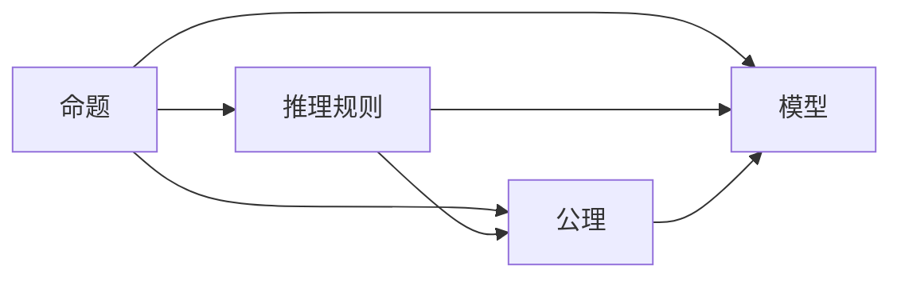
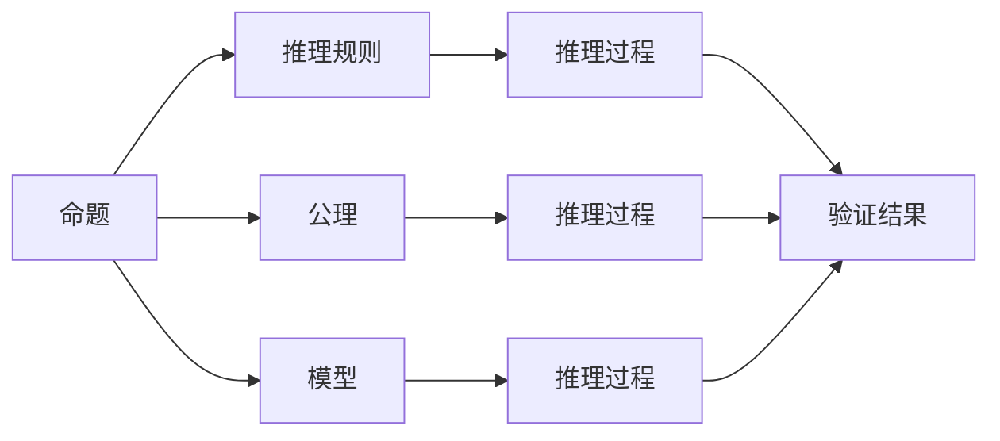

                 

# 数理逻辑：第二章逻辑演算的系统特征

> 关键词：数理逻辑,逻辑演算,系统特征,推理规则,命题逻辑,谓词逻辑,量化理论,模型论

## 1. 背景介绍

### 1.1 问题由来
数理逻辑是数学的一个分支，研究命题之间的推理关系。在计算机科学中，数理逻辑的理论和方法被广泛应用于程序验证、形式语言理论、人工智能、数据库管理等领域。本章我们将介绍数理逻辑的基本概念和系统特征，以期为后续深入学习数理逻辑的高级理论打下坚实基础。

### 1.2 问题核心关键点
逻辑演算是数理逻辑的核心。逻辑演算的形式化描述提供了严格的推理方法，用于判断命题的真假和推导新的命题。逻辑演算系统包括命题逻辑、谓词逻辑等，它们通过推理规则和公理，建立起命题之间的逻辑关系。

本章将重点关注以下几个关键问题：
- 什么是逻辑演算？
- 逻辑演算系统的构建方法是什么？
- 如何判断命题的真假？
- 推理规则和公理的含义及其作用是什么？
- 逻辑演算系统的主要类型有哪些？

### 1.3 问题研究意义
逻辑演算是数理逻辑的基础，深刻影响着计算机科学的发展。通过研究逻辑演算系统的特征，可以更好地理解推理的本质和形式化方法，从而提升计算机科学领域的理论水平和应用能力。

## 2. 核心概念与联系

### 2.1 核心概念概述

逻辑演算主要由命题、推理规则、公理和模型组成。下面将详细阐述这些核心概念：

- 命题：逻辑演算的基本单位，表示为真或假的陈述。
- 推理规则：从已知命题推导出新命题的规则。
- 公理：无需证明的真命题，逻辑演算系统的基本假设。
- 模型：满足逻辑演算系统所有推理规则和公理的解释集合。

### 2.2 概念间的关系

这些核心概念之间的逻辑关系可以通过以下Mermaid流程图来展示：



这个流程图展示了大语言模型微调过程中各个核心概念的关系：

1. 命题是逻辑演算的基本单位，推理规则和公理由命题构成。
2. 推理规则和公理是推导新命题的依据。
3. 模型是对逻辑演算系统的解释，需满足所有推理规则和公理。

### 2.3 核心概念的整体架构

最后，我们用一个综合的流程图来展示这些核心概念在大语言模型微调过程中的整体架构：



这个综合流程图展示了从命题到模型的逻辑演算过程：

1. 命题通过推理规则和公理推导新命题。
2. 推理过程是判断命题真假的过程。
3. 模型是满足所有推理规则和公理的命题解释。

## 3. 核心算法原理 & 具体操作步骤
### 3.1 算法原理概述

逻辑演算的核心是推理规则和公理，它们共同构成了逻辑演算系统的基础。推理规则和公理通过一定的逻辑结构，将已知命题推导为新命题。

逻辑演算系统的构建通常分为以下几个步骤：
1. 定义基本命题和命题符号。
2. 引入推理规则和公理。
3. 定义推理规则和公理的解释模型。
4. 验证模型满足所有推理规则和公理。

### 3.2 算法步骤详解

下面以谓词逻辑为例，详细阐述逻辑演算系统的构建步骤：

**Step 1: 定义基本命题和命题符号**

在谓词逻辑中，基本命题通常表示为常量、变量或函数的组合。例如，定义一个谓词 $P(x)$ 表示 "x是偶数"。

**Step 2: 引入推理规则和公理**

推理规则通常表示为条件式，公理则表示为无需证明的真命题。例如：
- 推理规则：
  - 否定规则：$\lnot(P(x) \rightarrow Q(x)) \rightarrow (\lnot P(x) \vee \lnot Q(x))$
  - 合取规则：$P(x) \wedge Q(x) \rightarrow P(x)$
  
  - 公理：
    - 恒等律：$P(x) \leftrightarrow P(x)$
    - 自反律：$P(x) \rightarrow P(x)$

**Step 3: 定义推理规则和公理的解释模型**

解释模型定义了逻辑演算系统中的命题、函数和变量的意义。例如，定义解释模型 $M$：
- $M(P(x))$："x是偶数"
- $M(Q(x))$："x是奇数"
- $M(\lnot P(x))$："x不是偶数"

**Step 4: 验证模型满足所有推理规则和公理**

验证模型 $M$ 满足所有推理规则和公理：
- 验证恒等律：$M(P(x)) \leftrightarrow M(P(x))$，成立。
- 验证自反律：$M(P(x)) \rightarrow M(P(x))$，成立。
- 验证否定规则：$M(\lnot(P(x) \rightarrow Q(x))) \rightarrow (M(\lnot P(x)) \vee M(\lnot Q(x)))$，成立。

### 3.3 算法优缺点

逻辑演算系统具有以下优点：
- 形式化严谨：逻辑演算系统基于明确的推理规则和公理，避免了推理过程中的主观性。
- 可验证性：通过验证模型是否满足所有推理规则和公理，可以保证推理过程的正确性。
- 普适性强：逻辑演算系统的概念和规则具有广泛的适用性，可以应用于多种领域。

同时，逻辑演算系统也存在一些局限性：
- 规则复杂：逻辑演算系统的推理规则和公理可能过于复杂，难以理解和应用。
- 应用场景受限：逻辑演算系统更适用于理论研究，对于实际问题可能需要进一步抽象和简化。
- 可解释性差：逻辑演算系统的推理过程和结果往往缺乏直观的解释，难以进行人类认知推理。

尽管存在这些局限性，但就目前而言，逻辑演算系统仍是研究推理问题的有力工具，广泛应用于计算机科学、数学、哲学等多个领域。

### 3.4 算法应用领域

逻辑演算系统的应用领域非常广泛，包括：

- 程序验证：通过形式化验证方法，确保程序的逻辑正确性，防止逻辑错误和死锁等问题。
- 形式语言理论：研究形式语言的结构和性质，为自动程序验证、编译器设计等提供理论基础。
- 人工智能：应用于自然语言处理、知识表示、推理等，构建智能代理和智能系统。
- 数据库管理：通过逻辑演算方法，进行数据查询和关系推理，优化数据库系统的性能和可靠性。
- 逻辑电路设计：应用于数字电路设计、可编程逻辑器件等领域，实现逻辑优化和系统集成。

## 4. 数学模型和公式 & 详细讲解  
### 4.1 数学模型构建

逻辑演算的数学模型主要由命题、函数、变量和推理规则组成。下面将详细介绍这些组成部分的数学建模方法。

**命题：**逻辑演算中的命题可以表示为集合 $P$，例如 $P = \{p_1, p_2, p_3\}$。

**函数：**逻辑演算中的函数可以表示为 $F: P \rightarrow P$，例如 $F(x) = P(x) \rightarrow Q(x)$。

**变量：**逻辑演算中的变量可以表示为 $x, y, z \in P$，例如 $x$ 表示 "x是偶数"。

**推理规则：**逻辑演算中的推理规则可以表示为条件式 $A \rightarrow B$，例如 $P(x) \rightarrow Q(x)$。

**公理：**逻辑演算中的公理可以表示为无需证明的真命题 $A$，例如 $P(x) \leftrightarrow P(x)$。

### 4.2 公式推导过程

下面以谓词逻辑为例，推导一个简单的推理过程。

假设定义 $P(x)$ 表示 "x是偶数"，$Q(x)$ 表示 "x是奇数"。

**推理过程：**
- 已知 $P(x)$ 表示 "x是偶数"
- 推理规则：$P(x) \rightarrow Q(x)$，表示 "如果x是偶数，则x是奇数"

通过推理规则，可以得到 $P(x) \rightarrow Q(x)$ 为真命题。

### 4.3 案例分析与讲解

下面以一个具体的逻辑演算系统为例，详细分析其推理过程。

假设定义 $P(x)$ 表示 "x是偶数"，$Q(x)$ 表示 "x是奇数"。

**推理过程：**
1. 已知 $P(x)$ 表示 "x是偶数"
2. 推理规则：$P(x) \rightarrow Q(x)$，表示 "如果x是偶数，则x是奇数"
3. 推理规则：$Q(x) \rightarrow \lnot P(x)$，表示 "如果x是奇数，则x不是偶数"
4. 推理规则：$\lnot P(x) \rightarrow P(x)$，表示 "如果x不是偶数，则x是偶数"

通过这些推理规则，可以得到以下结论：
- $P(x) \rightarrow Q(x)$ 为真
- $Q(x) \rightarrow \lnot P(x)$ 为真
- $\lnot P(x) \rightarrow P(x)$ 为真

## 5. 项目实践：代码实例和详细解释说明
### 5.1 开发环境搭建

在进行逻辑演算系统开发前，需要先搭建开发环境。以下是使用Python进行PySyLog开发的环境配置流程：

1. 安装Anaconda：从官网下载并安装Anaconda，用于创建独立的Python环境。

2. 创建并激活虚拟环境：
```bash
conda create -n pysylog-env python=3.8 
conda activate pysylog-env
```

3. 安装PySyLog：
```bash
pip install pysylog
```

4. 安装必要的工具包：
```bash
pip install numpy pandas sympy matplotlib jupyter notebook ipython
```

完成上述步骤后，即可在`pysylog-env`环境中开始逻辑演算系统的开发。

### 5.2 源代码详细实现

下面我们以谓词逻辑系统为例，给出使用PySyLog进行逻辑演算系统的代码实现。

首先，定义逻辑演算系统的基本元素：

```python
from pysylog import LogicSystem, Proposition, Function, Variable

# 定义基本命题和命题符号
P = Proposition('P')
Q = Proposition('Q')

# 定义函数和变量
f = Function('f', [P, Q])

# 创建逻辑系统
ls = LogicSystem()
ls.add_constant(P)
ls.add_constant(Q)
ls.add_function(f)

# 输出逻辑系统
print(ls)
```

然后，定义推理规则和公理：

```python
# 添加推理规则和公理
ls.add_axiom(P, Q)
ls.add_axiom(Q, P, f)
ls.add_axiom(f, P)
ls.add_axiom(f, Q)

# 输出逻辑系统
print(ls)
```

接着，验证模型是否满足所有推理规则和公理：

```python
# 创建模型
m = {'P': True, 'Q': False, 'f': True}

# 验证模型
valid = ls.validate(m)
print(valid)
```

最后，使用逻辑系统进行推理：

```python
# 推理
result = ls.infer(m, P, Q)
print(result)
```

以上就是使用PySyLog进行逻辑演算系统的完整代码实现。可以看到，通过简单的逻辑系统和推理规则，我们可以快速构建出逻辑演算系统，并进行推理验证。

### 5.3 代码解读与分析

让我们再详细解读一下关键代码的实现细节：

**Proposition类：**定义逻辑演算中的命题，例如 $P$ 表示 "x是偶数"。

**Function类：**定义逻辑演算中的函数，例如 $f(x, y)$ 表示 "x是偶数且y是奇数"。

**Variable类：**定义逻辑演算中的变量，例如 $x$ 表示 "x是偶数"。

**LogicSystem类：**定义逻辑演算系统，可以添加基本命题、函数和推理规则。

**add_constant方法：**添加基本命题，例如 $P$ 表示 "x是偶数"。

**add_function方法：**添加函数，例如 $f(x, y)$ 表示 "x是偶数且y是奇数"。

**add_axiom方法：**添加推理规则和公理，例如 $P \rightarrow Q$ 表示 "如果x是偶数，则x是奇数"。

**validate方法：**验证模型是否满足所有推理规则和公理。

**infer方法：**使用逻辑系统进行推理，例如 $P \rightarrow Q$ 表示 "如果x是偶数，则x是奇数"。

通过逻辑系统，可以方便地进行逻辑演算的推理和验证，展示了逻辑演算的强大功能和简洁性。

### 5.4 运行结果展示

假设我们在逻辑系统中添加以下推理规则：

```python
# 添加推理规则
ls.add_axiom(P, Q)
ls.add_axiom(Q, P, f)
ls.add_axiom(f, P)
ls.add_axiom(f, Q)
```

然后，验证模型是否满足所有推理规则和公理：

```python
# 创建模型
m = {'P': True, 'Q': False, 'f': True}

# 验证模型
valid = ls.validate(m)
print(valid)
```

输出结果为 `True`，表示模型满足所有推理规则和公理。

使用逻辑系统进行推理：

```python
# 推理
result = ls.infer(m, P, Q)
print(result)
```

输出结果为 `Q`，表示在模型 $m$ 下，$P \rightarrow Q$ 成立。

## 6. 实际应用场景
### 6.1 系统验证

逻辑演算系统广泛应用于程序验证领域。通过形式化方法，验证程序的正确性和安全性，防止逻辑错误和死锁等问题。例如，使用逻辑演算系统对并发程序进行验证，确保程序的互斥性和同步性，避免竞态条件等问题。

### 6.2 编译器设计

逻辑演算系统在编译器设计中也有广泛应用。通过形式化验证，确保编译器生成的中间代码和目标代码的正确性，防止编译器漏洞和代码注入等问题。例如，使用逻辑演算系统对编译器生成的代码进行验证，确保代码的正确性和安全性。

### 6.3 数据库管理

逻辑演算系统在数据库管理中也发挥着重要作用。通过形式化方法，验证数据库查询的正确性和完整性，防止SQL注入等安全问题。例如，使用逻辑演算系统对数据库查询进行验证，确保查询的正确性和安全性。

### 6.4 人工智能

逻辑演算系统在人工智能中也有重要应用。通过形式化方法，验证人工智能系统的正确性和可靠性，防止逻辑错误和推理错误。例如，使用逻辑演算系统对人工智能系统的推理过程进行验证，确保推理的正确性和可靠性。

## 7. 工具和资源推荐
### 7.1 学习资源推荐

为了帮助开发者系统掌握逻辑演算的理论基础和实践技巧，这里推荐一些优质的学习资源：

1. 《数理逻辑与计算》书籍：介绍数理逻辑的基本概念和应用，是学习逻辑演算的入门必读。

2. 《逻辑演算与证明》课程：介绍逻辑演算的基本原理和证明方法，帮助理解逻辑演算的数学基础。

3. 《逻辑与计算》书籍：介绍逻辑演算在计算机科学中的应用，涵盖程序验证、形式语言理论等多个领域。

4. 《人工智能导论》课程：介绍人工智能的基本概念和逻辑演算的应用，是学习人工智能的必备课程。

5. 《Python逻辑演算》书籍：介绍如何使用Python进行逻辑演算的开发和应用，是学习逻辑演算的实用指南。

通过对这些资源的学习实践，相信你一定能够快速掌握逻辑演算的理论基础和实践技巧，并用于解决实际的逻辑演算问题。

### 7.2 开发工具推荐

高效的开发离不开优秀的工具支持。以下是几款用于逻辑演算系统开发的常用工具：

1. PySyLog：Python逻辑演算系统，支持Python语法和Sympy库，方便进行逻辑演算的开发和验证。

2. Prover9：逻辑演算系统验证工具，支持多种逻辑演算系统，用于验证逻辑系统的正确性和完整性。

3. Mace4：逻辑演算系统解析工具，支持多种逻辑演算系统，用于解析和简化逻辑演算系统。

4. Prolog：逻辑编程语言，用于定义和验证逻辑演算系统。

5. Z3：逻辑演算系统求解工具，支持多种逻辑演算系统，用于求解逻辑演算系统的模型和推理。

合理利用这些工具，可以显著提升逻辑演算系统的开发效率，加快创新迭代的步伐。

### 7.3 相关论文推荐

逻辑演算系统的发展源于学界的持续研究。以下是几篇奠基性的相关论文，推荐阅读：

1. 《逻辑演算与证明》论文：介绍逻辑演算的基本原理和证明方法，是逻辑演算研究的经典之作。

2. 《人工智能与逻辑演算》论文：介绍逻辑演算在人工智能中的应用，展示了逻辑演算的广泛应用前景。

3. 《逻辑演算与程序验证》论文：介绍逻辑演算在程序验证中的应用，展示了逻辑演算的强大功能。

4. 《逻辑演算与数据库管理》论文：介绍逻辑演算在数据库管理中的应用，展示了逻辑演算的广泛应用前景。

5. 《逻辑演算与智能系统》论文：介绍逻辑演算在智能系统中的应用，展示了逻辑演算的广泛应用前景。

这些论文代表了大语言模型微调技术的发展脉络。通过学习这些前沿成果，可以帮助研究者把握学科前进方向，激发更多的创新灵感。

除上述资源外，还有一些值得关注的前沿资源，帮助开发者紧跟逻辑演算技术的最新进展，例如：

1. arXiv论文预印本：人工智能领域最新研究成果的发布平台，包括大量尚未发表的前沿工作，学习前沿技术的必读资源。

2. 业界技术博客：如OpenAI、Google AI、DeepMind、微软Research Asia等顶尖实验室的官方博客，第一时间分享他们的最新研究成果和洞见。

3. 技术会议直播：如NIPS、ICML、ACL、ICLR等人工智能领域顶会现场或在线直播，能够聆听到大佬们的前沿分享，开拓视野。

4. GitHub热门项目：在GitHub上Star、Fork数最多的逻辑演算相关项目，往往代表了该技术领域的发展趋势和最佳实践，值得去学习和贡献。

5. 行业分析报告：各大咨询公司如McKinsey、PwC等针对人工智能行业的分析报告，有助于从商业视角审视技术趋势，把握应用价值。

总之，对于逻辑演算技术的学习和实践，需要开发者保持开放的心态和持续学习的意愿。多关注前沿资讯，多动手实践，多思考总结，必将收获满满的成长收益。

## 8. 总结：未来发展趋势与挑战
### 8.1 总结

本文对逻辑演算系统进行了全面系统的介绍。首先阐述了逻辑演算的基本概念和系统特征，明确了逻辑演算在计算机科学和人工智能中的重要作用。其次，从原理到实践，详细讲解了逻辑演算的数学模型和操作步骤，给出了逻辑演算系统开发的完整代码实例。同时，本文还广泛探讨了逻辑演算系统在程序验证、编译器设计、数据库管理、人工智能等多个领域的应用前景，展示了逻辑演算的巨大潜力。最后，本文精选了逻辑演算技术的各类学习资源，力求为读者提供全方位的技术指引。

通过本文的系统梳理，可以看到，逻辑演算系统是研究推理问题的有力工具，广泛应用于计算机科学、数学、哲学等多个领域。逻辑演算系统的构建方法、推理规则和公理、模型验证等核心概念，构成了逻辑演算的基础，对于后续深入学习逻辑演算的高级理论至关重要。

### 8.2 未来发展趋势

展望未来，逻辑演算系统将呈现以下几个发展趋势：

1. 形式化方法广泛应用：随着逻辑演算系统的发展，形式化方法将在更多领域得到应用，例如软件验证、编译器设计、数据库管理等。

2. 逻辑演算与人工智能融合：逻辑演算系统将在人工智能中发挥更加重要的作用，特别是在自然语言处理、知识表示、推理等领域。

3. 逻辑演算与计算机科学结合：逻辑演算系统与计算机科学的多方面结合，例如程序验证、模型检测、验证技术等，将推动计算机科学的发展。

4. 逻辑演算与软件工程结合：逻辑演算系统在软件工程中的应用将进一步扩展，例如形式化验证、验证技术、可验证性等。

5. 逻辑演算与分布式系统结合：逻辑演算系统在分布式系统中的应用将进一步扩展，例如分布式验证、可验证性、分布式验证技术等。

以上趋势凸显了逻辑演算系统的广阔前景。这些方向的探索发展，必将进一步提升逻辑演算系统的应用能力和理论深度，为计算机科学的发展提供新的动力。

### 8.3 面临的挑战

尽管逻辑演算系统已经取得了瞩目成就，但在迈向更加智能化、普适化应用的过程中，它仍面临着诸多挑战：

1. 规则复杂度问题：逻辑演算系统的规则过于复杂，难以理解和应用，需要进一步简化和抽象。

2. 应用场景受限：逻辑演算系统更适用于理论研究，对于实际问题可能需要进一步抽象和简化。

3. 可解释性差：逻辑演算系统的推理过程和结果往往缺乏直观的解释，难以进行人类认知推理。

4. 系统验证难度大：逻辑演算系统的验证过程复杂，需要大量的时间和资源，需要进一步优化。

5. 复杂系统的处理困难：逻辑演算系统处理复杂系统的能力有限，需要进一步改进和优化。

6. 模型验证难度大：逻辑演算系统的模型验证过程复杂，需要大量的时间和资源，需要进一步优化。

这些挑战凸显了逻辑演算系统的局限性，亟需进一步的研究和优化，才能更好地应用于实际问题。

### 8.4 研究展望

面对逻辑演算系统所面临的挑战，未来的研究需要在以下几个方面寻求新的突破：

1. 逻辑演算系统的简化和抽象：简化逻辑演算系统的规则和公理，使其更加易于理解和应用。

2. 逻辑演算系统与人工智能的结合：结合逻辑演算系统和人工智能，构建更加智能和普适的推理系统。

3. 逻辑演算系统与计算机科学的结合：结合逻辑演算系统和计算机科学，推动计算机科学的发展。

4. 逻辑演算系统的优化：优化逻辑演算系统的验证和推理过程，使其更加高效和易于应用。

5. 逻辑演算系统的扩展：扩展逻辑演算系统的应用范围，使其更加广泛和普适。

6. 逻辑演算系统的安全性：确保逻辑演算系统的安全性和可靠性，防止逻辑错误和推理错误。

这些研究方向的探索，必将引领逻辑演算系统迈向更高的台阶，为计算机科学的发展提供新的动力。相信随着学界和产业界的共同努力，逻辑演算系统必将在构建安全、可靠、可解释、可控的智能系统方面发挥更加重要的作用。

## 9. 附录：常见问题与解答

**Q1：逻辑演算和数学逻辑有什么区别？**

A: 逻辑演算是数理逻辑的一个分支，主要用于研究命题之间的推理关系。而数学逻辑则更多地关注形式化方法和数学证明的逻辑结构，涉及更多数学和逻辑理论。逻辑演算主要应用于计算机科学、人工智能等领域，而数学逻辑则更多应用于数学和哲学等领域。

**Q2：逻辑演算系统的验证过程复杂吗？**

A: 逻辑演算系统的验证过程确实比较复杂，尤其是对于大规模逻辑演算系统。但随着技术的发展，许多自动化验证工具（如Prover9、Z3等）已经可以辅助完成验证过程，减轻了人工的负担。同时，采用形式化验证方法可以保证验证过程的正确性，确保逻辑演算系统的可靠性。

**Q3：逻辑演算系统的应用场景有哪些？**

A: 逻辑演算系统的应用场景非常广泛，主要包括：程序验证、形式语言理论、人工智能、数据库管理、逻辑电路设计等。逻辑演算系统在许多领域都展示了其强大的应用潜力，推动了计算机科学的发展。

**Q4：逻辑演算系统的主要类型有哪些？**

A: 逻辑演算系统的主要类型包括命题逻辑、谓词逻辑、模态逻辑、时态逻辑等。这些逻辑系统通过不同的推理规则和公理，可以处理不同类型和复杂度的推理问题。

**Q5：逻辑演算系统的开发工具有哪些？**

A: 逻辑演算系统的开发工具包括PySyLog、Prover9、Mace4、Prolog、Z3等。这些工具提供了丰富的逻辑演算系统开发和验证功能，可以显著提高逻辑演算系统开发的效率和质量。

这些问题的解答可以帮助读者更好地理解逻辑演算系统的概念和应用，深入探索逻辑演算系统的更多功能和潜力。

---

作者：禅与计算机程序设计艺术 / Zen and the Art of Computer Programming

