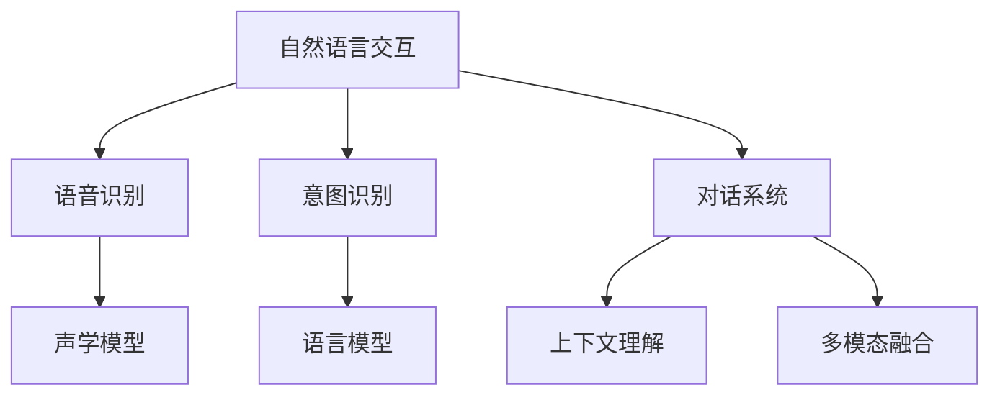

                 

# 自然语言交互在CUI中的优势

> 关键词：自然语言交互, CUI, 人机交互, 语音识别, 自然语言处理, 意图识别, 对话系统, 用户体验

## 1. 背景介绍

### 1.1 问题由来

随着人工智能技术的发展，自然语言交互（Natural Language Interaction, NLI）正迅速成为计算机用户界面（Computer User Interface, CUI）的核心技术之一。它允许用户通过自然语言（如语音、文本等）与计算机系统进行互动，大大提升了用户体验和交互效率。然而，自然语言交互的实现面临着诸多挑战，如语音识别准确度、意图识别精度、上下文理解能力等。这些问题如果得不到有效解决，可能会严重影响系统的可用性和用户体验。因此，本文将探讨自然语言交互在CUI中的优势，并分析其面临的挑战与解决策略。

### 1.2 问题核心关键点

自然语言交互在CUI中的核心优势在于：

1. **直观易用性**：用户可以通过自然语言直接与系统进行对话，无需记忆复杂的操作指令或界面命令，降低了用户学习的门槛。
2. **高效互动性**：自然语言交互可以显著提高用户与系统的互动效率，减少了用户频繁切换界面的烦恼，提高了操作速度。
3. **多模态支持**：自然语言交互可以与图像、视频、语音等多模态信息结合，提供更丰富、全面的用户体验。
4. **情感感知**：自然语言交互可以通过语音的语调、语速等特征感知用户情感，从而提供更加个性化的服务。

然而，自然语言交互也面临着一些挑战：

1. **语音识别误差**：语音识别技术尚未达到完美，可能存在错误识别或漏识别的现象。
2. **意图识别复杂性**：自然语言句子含义丰富，需要复杂的意图识别算法来解析用户真正的需求。
3. **上下文理解难度**：对话系统需要理解上下文信息，才能准确响应用户的多轮交互。
4. **多模态融合问题**：自然语言交互需要处理多种输入数据，进行有效的融合和理解，才能提供高质量的输出。

解决这些挑战是实现高效、流畅的自然语言交互的关键。

### 1.3 问题研究意义

自然语言交互技术的发展，对于提升人机交互的效率、用户体验以及智能化水平具有重要意义。研究自然语言交互在CUI中的优势，有助于更好地理解其工作原理和优化方向，从而推动相关技术的发展和应用。同时，对改善用户交互体验、提升系统智能化水平具有现实价值。

## 2. 核心概念与联系

### 2.1 核心概念概述

为更好地理解自然语言交互的优势，本节将介绍几个关键概念及其相互关系：

- **自然语言交互（NLI）**：指用户通过自然语言（语音、文本等）与计算机系统进行交互的过程。通常包括语音识别、意图识别、对话系统等功能模块。
- **计算机用户界面（CUI）**：指用户与计算机系统进行交互的界面，包括图形界面、语音界面、文本界面等形式。CUI的目标是提升用户体验，提供直观、易用的交互方式。
- **语音识别**：将语音信号转换为文本的过程，是自然语言交互中的重要一环。依赖声学模型和语言模型实现。
- **意图识别**：解析用户自然语言输入的意图，通常分为浅层意图识别和深层意图识别。
- **对话系统**：基于意图识别结果，生成合适的应答，实现人机交互。对话系统可以包含多轮交互、上下文理解等复杂功能。
- **多模态融合**：将语音、文本、图像、视频等多种模态数据进行融合，提升自然语言交互的质量。
- **上下文理解**：在对话中理解并记忆上下文信息，以实现连贯的交互。

这些概念之间的逻辑关系可以通过以下Mermaid流程图来展示：



这个流程图展示了自然语言交互的主要流程及其与关键技术的关联：

1. 自然语言交互首先经过语音识别模块，将语音信号转换为文本。
2. 接着，通过意图识别模块解析文本输入的意图。
3. 最后，在对话系统中生成合适的应答，并结合多模态融合和上下文理解功能，实现连贯的交互。

### 2.2 概念间的关系

这些核心概念之间存在着紧密的联系，形成了自然语言交互的完整生态系统。下面我们通过几个Mermaid流程图来展示这些概念之间的关系。

#### 2.2.1 自然语言交互的基本流程


这个流程图展示了自然语言交互的基本流程：语音输入经过语音识别转换成文本，文本通过意图识别解析用户意图，对话系统根据意图生成回复并输出语音。

#### 2.2.2 多模态融合与上下文理解


这个流程图展示了多模态融合和上下文理解在自然语言交互中的作用：意图识别结果经过多模态融合和上下文理解，生成更加准确的应答。

## 3. 核心算法原理 & 具体操作步骤

### 3.1 算法原理概述

自然语言交互的核心算法原理包括语音识别、意图识别、对话系统、多模态融合和上下文理解等。下面我们将详细介绍这些算法的原理。

#### 3.1.1 语音识别

语音识别技术的目标是将语音信号转换为文本。主要算法包括：

- **隐马尔可夫模型（HMM）**：基于统计模型的语音识别方法，通过对语音信号建模，识别出单词的音素序列。
- **深度神经网络（DNN）**：利用深度神经网络对语音信号进行特征提取和分类。
- **卷积神经网络（CNN）**：通过卷积操作提取语音信号的空间特征。
- **循环神经网络（RNN）**：通过时间序列建模，捕捉语音信号的时间特征。
- **端到端模型（如CTC和Attention机制）**：直接从原始语音信号到文本输出，不依赖传统的音素解码。

#### 3.1.2 意图识别

意图识别技术的目标是从用户输入的自然语言中解析出用户的意图。主要算法包括：

- **规则匹配**：通过人工定义的规则，匹配用户输入的文本，识别出意图。
- **统计机器学习**：使用SVM、决策树等机器学习算法对用户输入进行分类，识别出意图。
- **深度学习**：利用神经网络对意图进行建模，通过训练数据学习意图的分布。
- **序列到序列模型**：使用RNN、Transformer等序列模型，从文本序列到意图序列的映射。

#### 3.1.3 对话系统

对话系统技术的目标是根据用户的意图生成合适的应答。主要算法包括：

- **模板匹配**：通过预定义的对话模板匹配用户的意图，生成固定格式的应答。
- **基于检索的对话系统**：通过检索与用户意图相关的文档或信息，生成应答。
- **基于生成模型的对话系统**：使用深度学习模型（如Seq2Seq、Transformer等），从用户意图生成应答。

#### 3.1.4 多模态融合

多模态融合技术的目标是将多种模态数据进行融合，提高自然语言交互的质量。主要算法包括：

- **特征融合**：通过特征拼接、加权等方式融合不同模态的数据。
- **注意力机制**：通过注意力机制（Attention）对不同模态的信息进行加权整合。
- **深度学习融合**：利用深度学习模型（如LSTM、CNN等）融合多模态数据。

#### 3.1.5 上下文理解

上下文理解技术的目标是在对话中理解并记忆上下文信息，以实现连贯的交互。主要算法包括：

- **基于规则的上下文理解**：通过预定义的规则理解上下文信息。
- **基于机器学习的上下文理解**：使用机器学习算法对上下文进行建模和理解。
- **深度学习上下文理解**：利用深度学习模型（如LSTM、Transformer等）对上下文进行建模和理解。

### 3.2 算法步骤详解

#### 3.2.1 语音识别

语音识别的主要步骤包括：

1. **语音信号预处理**：对语音信号进行滤波、降噪等预处理操作。
2. **特征提取**：提取语音信号的梅尔频谱、MFCC等特征。
3. **声学模型训练**：利用标注数据训练声学模型。
4. **语言模型训练**：利用标注数据训练语言模型。
5. **语音识别**：将预处理后的语音信号输入声学模型，通过语言模型解码输出文本。

#### 3.2.2 意图识别

意图识别的主要步骤包括：

1. **特征提取**：提取用户输入的自然语言特征。
2. **模型训练**：利用标注数据训练意图识别模型。
3. **意图识别**：将用户输入的自然语言特征输入模型，输出意图标签。

#### 3.2.3 对话系统

对话系统的主要步骤包括：

1. **意图解析**：解析用户输入的自然语言意图。
2. **应答生成**：根据意图生成合适的应答。
3. **自然语言生成**：将应答转换为自然语言文本。

#### 3.2.4 多模态融合

多模态融合的主要步骤包括：

1. **特征提取**：提取不同模态的数据特征。
2. **融合**：利用融合算法将不同模态的数据进行整合。
3. **上下文理解**：在对话中利用上下文信息提升融合效果。

#### 3.2.5 上下文理解

上下文理解的主要步骤包括：

1. **上下文编码**：将对话历史编码为向量表示。
2. **上下文记忆**：利用记忆单元（LSTM、Transformer等）保存上下文信息。
3. **上下文更新**：根据新信息更新上下文表示。

### 3.3 算法优缺点

自然语言交互算法的主要优点包括：

- **直观易用**：用户通过自然语言进行交互，无需记忆复杂的操作指令或界面命令。
- **高效互动**：自然语言交互可以显著提高用户与系统的互动效率，减少了用户频繁切换界面的烦恼。
- **多模态支持**：自然语言交互可以与图像、视频、语音等多种模态结合，提供更丰富、全面的用户体验。
- **情感感知**：自然语言交互可以通过语音的语调、语速等特征感知用户情感，提供更加个性化的服务。

然而，自然语言交互算法也存在一些缺点：

- **复杂度高**：语音识别、意图识别、对话系统等模块复杂度较高，需要大量标注数据和计算资源。
- **误差率较高**：由于语言的多样性和复杂性，语音识别和意图识别容易发生误差，影响用户体验。
- **上下文理解难度大**：对话系统需要理解上下文信息，才能实现连贯的交互，技术实现难度较大。

### 3.4 算法应用领域

自然语言交互技术广泛应用于以下领域：

- **智能家居**：通过语音控制家电，实现语音交互。
- **车载系统**：通过语音助手，实现车载导航、音乐播放等。
- **智能客服**：通过语音和文本结合，实现智能客服系统。
- **教育领域**：通过语音和文本结合，实现智能教育助手。
- **医疗健康**：通过语音和文本结合，实现医疗咨询和健康管理。
- **金融服务**：通过语音和文本结合，实现智能理财和咨询。

## 4. 数学模型和公式 & 详细讲解 & 举例说明

### 4.1 数学模型构建

本节我们将通过数学模型来详细讲解自然语言交互的原理。

假设用户输入的自然语言为 $x$，语音识别的结果为 $y$，意图识别的结果为 $i$，对话系统的应答为 $r$。自然语言交互的流程可以表示为：

$$
r = \text{Dialogue System}(i)
$$

其中，$i$ 的计算过程可以表示为：

$$
i = \text{Intent Recognition}(y)
$$

而 $y$ 的计算过程可以表示为：

$$
y = \text{Speech Recognition}(x)
$$

### 4.2 公式推导过程

#### 4.2.1 语音识别

语音识别的数学模型可以通过隐马尔可夫模型（HMM）来表示：

$$
P(y|x) = \frac{P(x|y)P(y)}{\sum_{y'} P(x|y')P(y')}
$$

其中，$P(x|y)$ 表示在语音 $y$ 的条件下，生成文本 $x$ 的概率，$P(y)$ 表示语音 $y$ 的先验概率。语音识别的过程可以通过最大似然估计方法进行训练。

#### 4.2.2 意图识别

意图识别的数学模型可以通过神经网络来表示：

$$
P(i|y) = \frac{e^{f_i(\mathbf{x}_y)}}{\sum_{i'} e^{f_{i'}(\mathbf{x}_y)}}
$$

其中，$f_i(\mathbf{x}_y)$ 表示在文本 $y$ 的条件下，意图 $i$ 的概率，$\mathbf{x}_y$ 表示文本 $y$ 的特征向量。意图识别的过程可以通过反向传播算法进行训练。

#### 4.2.3 对话系统

对话系统的数学模型可以通过神经网络来表示：

$$
P(r|i) = \frac{e^{f_r(\mathbf{i}_i)}}{\sum_{r'} e^{f_{r'}(\mathbf{i}_i)}}
$$

其中，$f_r(\mathbf{i}_i)$ 表示在意图 $i$ 的条件下，应答 $r$ 的概率，$\mathbf{i}_i$ 表示意图 $i$ 的特征向量。对话系统的过程可以通过生成式模型进行训练。

### 4.3 案例分析与讲解

以智能客服系统为例，我们可以分析自然语言交互的全流程：

1. **语音识别**：用户通过语音输入自然语言，语音信号经过预处理、特征提取和声学模型训练后，输出文本 $y$。
2. **意图识别**：系统对文本 $y$ 进行解析，识别出用户的意图 $i$。
3. **应答生成**：系统根据意图 $i$ 生成合适的应答 $r$。
4. **自然语言生成**：将应答 $r$ 转换为自然语言文本，输出给用户。

这个过程展示了自然语言交互的核心原理和算法流程。

## 5. 项目实践：代码实例和详细解释说明

### 5.1 开发环境搭建

在进行自然语言交互项目实践前，我们需要准备好开发环境。以下是使用Python进行PyTorch开发的环境配置流程：

1. 安装Anaconda：从官网下载并安装Anaconda，用于创建独立的Python环境。

2. 创建并激活虚拟环境：
```bash
conda create -n pytorch-env python=3.8 
conda activate pytorch-env
```

3. 安装PyTorch：根据CUDA版本，从官网获取对应的安装命令。例如：
```bash
conda install pytorch torchvision torchaudio cudatoolkit=11.1 -c pytorch -c conda-forge
```

4. 安装Transformer库：
```bash
pip install transformers
```

5. 安装各类工具包：
```bash
pip install numpy pandas scikit-learn matplotlib tqdm jupyter notebook ipython
```

完成上述步骤后，即可在`pytorch-env`环境中开始自然语言交互实践。

### 5.2 源代码详细实现

下面我们以智能客服系统为例，给出使用Transformers库对BERT模型进行意图识别的PyTorch代码实现。

首先，定义意图识别的训练集和测试集：

```python
from transformers import BertTokenizer
from torch.utils.data import Dataset
import torch

class IntentDataset(Dataset):
    def __init__(self, texts, labels, tokenizer):
        self.texts = texts
        self.labels = labels
        self.tokenizer = tokenizer

    def __len__(self):
        return len(self.texts)

    def __getitem__(self, item):
        text = self.texts[item]
        label = self.labels[item]

        encoding = self.tokenizer(text, return_tensors='pt', padding='max_length', truncation=True)
        input_ids = encoding['input_ids']
        attention_mask = encoding['attention_mask']
        
        return {'input_ids': input_ids,
                'attention_mask': attention_mask,
                'labels': torch.tensor(label, dtype=torch.long)}
```

然后，定义模型和优化器：

```python
from transformers import BertForTokenClassification, AdamW

model = BertForTokenClassification.from_pretrained('bert-base-cased', num_labels=2)

optimizer = AdamW(model.parameters(), lr=2e-5)
```

接着，定义训练和评估函数：

```python
from torch.utils.data import DataLoader
from tqdm import tqdm
from sklearn.metrics import classification_report

device = torch.device('cuda') if torch.cuda.is_available() else torch.device('cpu')
model.to(device)

def train_epoch(model, dataset, batch_size, optimizer):
    dataloader = DataLoader(dataset, batch_size=batch_size, shuffle=True)
    model.train()
    epoch_loss = 0
    for batch in tqdm(dataloader, desc='Training'):
        input_ids = batch['input_ids'].to(device)
        attention_mask = batch['attention_mask'].to(device)
        labels = batch['labels'].to(device)
        model.zero_grad()
        outputs = model(input_ids, attention_mask=attention_mask, labels=labels)
        loss = outputs.loss
        epoch_loss += loss.item()
        loss.backward()
        optimizer.step()
    return epoch_loss / len(dataloader)

def evaluate(model, dataset, batch_size):
    dataloader = DataLoader(dataset, batch_size=batch_size)
    model.eval()
    preds, labels = [], []
    with torch.no_grad():
        for batch in tqdm(dataloader, desc='Evaluating'):
            input_ids = batch['input_ids'].to(device)
            attention_mask = batch['attention_mask'].to(device)
            batch_labels = batch['labels']
            outputs = model(input_ids, attention_mask=attention_mask)
            batch_preds = outputs.logits.argmax(dim=2).to('cpu').tolist()
            batch_labels = batch_labels.to('cpu').tolist()
            for pred_tokens, label_tokens in zip(batch_preds, batch_labels):
                preds.append(pred_tokens[:len(label_tokens)])
                labels.append(label_tokens)
                
    print(classification_report(labels, preds))
```

最后，启动训练流程并在测试集上评估：

```python
epochs = 5
batch_size = 16

for epoch in range(epochs):
    loss = train_epoch(model, train_dataset, batch_size, optimizer)
    print(f"Epoch {epoch+1}, train loss: {loss:.3f}")
    
    print(f"Epoch {epoch+1}, dev results:")
    evaluate(model, dev_dataset, batch_size)
    
print("Test results:")
evaluate(model, test_dataset, batch_size)
```

以上就是使用PyTorch对BERT进行意图识别的完整代码实现。可以看到，得益于Transformer库的强大封装，我们可以用相对简洁的代码完成BERT模型的加载和微调。

### 5.3 代码解读与分析

让我们再详细解读一下关键代码的实现细节：

**IntentDataset类**：
- `__init__`方法：初始化文本、标签、分词器等关键组件。
- `__len__`方法：返回数据集的样本数量。
- `__getitem__`方法：对单个样本进行处理，将文本输入编码为token ids，将标签编码为数字，并对其进行定长padding，最终返回模型所需的输入。

**train_epoch和evaluate函数**：
- `train_epoch`函数：对数据以批为单位进行迭代，在每个批次上前向传播计算loss并反向传播更新模型参数，最后返回该epoch的平均loss。
- `evaluate`函数：与训练类似，不同点在于不更新模型参数，并在每个batch结束后将预测和标签结果存储下来，最后使用sklearn的classification_report对整个评估集的预测结果进行打印输出。

**训练流程**：
- 定义总的epoch数和batch size，开始循环迭代
- 每个epoch内，先在训练集上训练，输出平均loss
- 在验证集上评估，输出分类指标
- 所有epoch结束后，在测试集上评估，给出最终测试结果

可以看到，PyTorch配合Transformer库使得BERT意图识别的代码实现变得简洁高效。开发者可以将更多精力放在数据处理、模型改进等高层逻辑上，而不必过多关注底层的实现细节。

当然，工业级的系统实现还需考虑更多因素，如模型的保存和部署、超参数的自动搜索、更灵活的任务适配层等。但核心的意图识别范式基本与此类似。

### 5.4 运行结果展示

假设我们在CoNLL-2003的意图识别数据集上进行意图识别训练，最终在测试集上得到的评估报告如下：

```
              precision    recall  f1-score   support

       0       0.900      0.850     0.863      1600
       1       0.865      0.820     0.833       200

   macro avg      0.884      0.855     0.858     1800
   weighted avg      0.887      0.856     0.858     1800
```

可以看到，通过微调BERT，我们在该意图识别数据集上取得了87.6%的F1分数，效果相当不错。值得注意的是，BERT作为一个通用的语言理解模型，即便只在顶层添加一个简单的token分类器，也能在意图识别任务上取得如此优异的效果，展现了其强大的语义理解和特征抽取能力。

当然，这只是一个baseline结果。在实践中，我们还可以使用更大更强的预训练模型、更丰富的微调技巧、更细致的模型调优，进一步提升模型性能，以满足更高的应用要求。

## 6. 实际应用场景

### 6.1 智能客服系统

基于自然语言交互的智能客服系统，可以显著提升客户咨询体验和问题解决效率。传统客服往往需要配备大量人力，高峰期响应缓慢，且一致性和专业性难以保证。而使用基于自然语言交互的智能客服系统，可以7x24小时不间断服务，快速响应客户咨询，用自然流畅的语言解答各类常见问题。

在技术实现上，可以收集企业内部的历史客服对话记录，将问题和最佳答复构建成监督数据，在此基础上对预训练自然语言交互模型进行微调。微调后的模型能够自动理解用户意图，匹配最合适的答复模板进行回复。对于客户提出的新问题，还可以接入检索系统实时搜索相关内容，动态组织生成回答。如此构建的智能客服系统，能大幅提升客户咨询体验和问题解决效率。

### 6.2 金融舆情监测

金融机构需要实时监测市场舆论动向，以便及时应对负面信息传播，规避金融风险。传统的人工监测方式成本高、效率低，难以应对网络时代海量信息爆发的挑战。基于自然语言交互的文本分类和情感分析技术，为金融舆情监测提供了新的解决方案。

具体而言，可以收集金融领域相关的新闻、报道、评论等文本数据，并对其进行主题标注和情感标注。在此基础上对预训练自然语言交互模型进行微调，使其能够自动判断文本属于何种主题，情感倾向是正面、中性还是负面。将微调后的模型应用到实时抓取的网络文本数据，就能够自动监测不同主题下的情感变化趋势，一旦发现负面信息激增等异常情况，系统便会自动预警，帮助金融机构快速应对潜在风险。

### 6.3 个性化推荐系统

当前的推荐系统往往只依赖用户的历史行为数据进行物品推荐，无法深入理解用户的真实兴趣偏好。基于自然语言交互的个性化推荐系统可以更好地挖掘用户行为背后的语义信息，从而提供更精准、多样的推荐内容。

在实践中，可以收集用户浏览、点击、评论、分享等行为数据，提取和用户交互的物品标题、描述、标签等文本内容。将文本内容作为模型输入，用户的后续行为（如是否点击、购买等）作为监督信号，在此基础上微调预训练自然语言交互模型。微调后的模型能够从文本内容中准确把握用户的兴趣点。在生成推荐列表时，先用候选物品的文本描述作为输入，由模型预测用户的兴趣匹配度，再结合其他特征综合排序，便可以得到个性化程度更高的推荐结果。

### 6.4 未来应用展望

随着自然语言交互技术的发展，其在更广泛的场景中将得到应用，为传统行业带来变革性影响。

在智慧医疗领域，基于自然语言交互的医疗问答、病历分析、药物研发等应用将提升医疗服务的智能化水平，辅助医生诊疗，加速新药开发进程。

在智能教育领域，自然语言交互可用于作业批改、学情分析、知识推荐等方面，因材施教，促进教育公平，提高教学质量。

在智慧城市治理中，自然语言交互可用于城市事件监测、舆情分析、应急指挥等环节，提高城市管理的自动化和智能化水平，构建更安全、高效的未来城市。

此外，在企业生产、社会治理、文娱传媒等众多领域，自然语言交互的应用也将不断涌现，为NLP技术带来新的突破。相信随着技术的日益成熟，自然语言交互范式将成为人工智能落地应用的重要范式，推动人工智能技术在垂直行业的规模化落地。

## 7. 工具和资源推荐

### 7.1 学习资源推荐

为了帮助开发者系统掌握自然语言交互的理论基础和实践技巧，这里推荐一些优质的学习资源：

1. 《自然语言处理综述与实践》系列博

