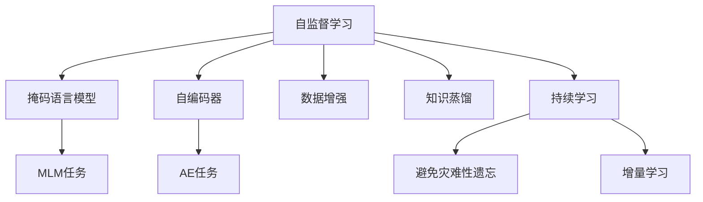
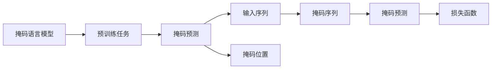
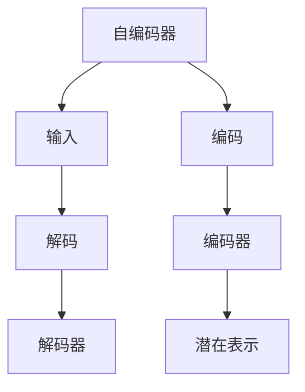
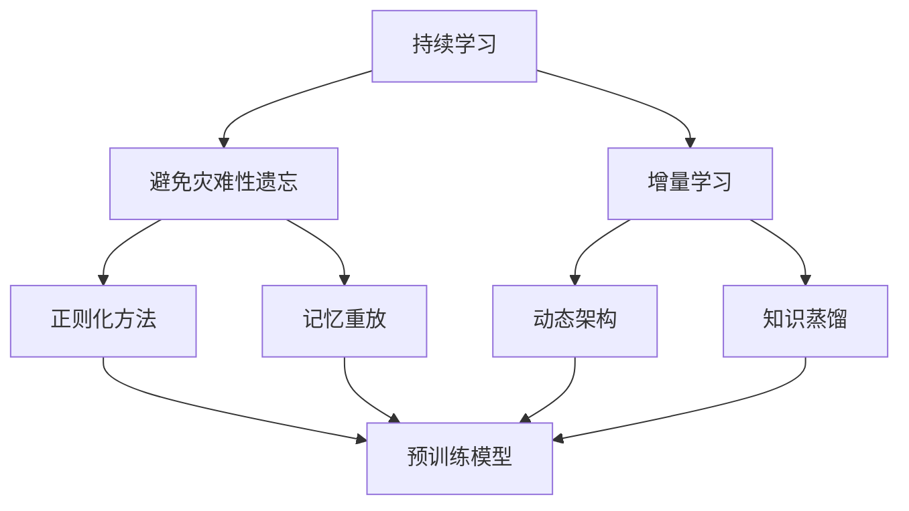
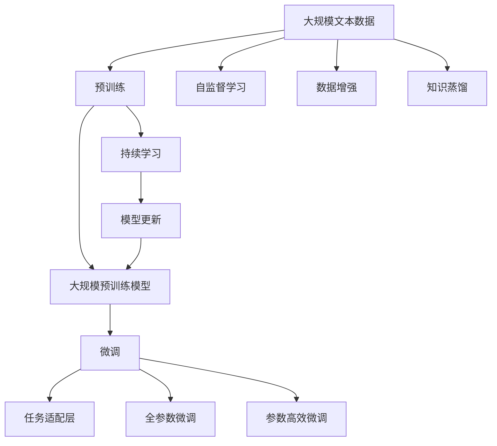

                 

# 自监督学习Self-Supervised Learning原理与代码实例讲解

自监督学习（Self-Supervised Learning, SSL）是深度学习领域的一种重要学习范式。相比于传统的监督学习（Supervised Learning, SL），自监督学习通过利用未标注的数据自监督地训练模型，无需人工干预或大量标注数据，从而降低了学习成本和数据收集难度。自监督学习的核心思想是利用数据的自然结构，构造自相关、对称等性质，设计预训练任务，引导模型学习数据中的隐含规律和潜在表示。本文将深入讲解自监督学习的原理与核心算法，并通过代码实例演示其实现过程。

## 1. 背景介绍

### 1.1 问题由来

自监督学习的研究始于20世纪80年代，最初应用于计算机视觉领域，利用数据中的自然结构（如颜色共生、纹理等）进行特征学习。随着深度学习的兴起，自监督学习逐渐被引入到自然语言处理（Natural Language Processing, NLP）和计算机视觉领域，成为大规模预训练模型的主要训练范式。近年来，自监督学习在BERT、GPT等预训练语言模型的训练中发挥了重要作用，显著提升了这些模型的性能。

自监督学习的核心优势在于：
- 数据需求低：通过自监督任务可以充分利用大规模无标注数据，减少对标注数据的依赖。
- 泛化能力强：模型在自监督预训练过程中学习到的是数据分布的潜在表示，具有更强的泛化能力。
- 训练效率高：自监督学习可以显著降低训练成本和复杂度，适用于分布式训练和异构计算环境。

### 1.2 问题核心关键点

自监督学习的核心在于设计合适的预训练任务，使其能够利用数据中的自相关性、对称性等自然结构，引导模型学习数据中的隐含规律和潜在表示。常见的自监督任务包括掩码语言模型、自编码器、图像旋转等。这些预训练任务旨在最大限度地利用数据中的信息，提升模型的表达能力和理解能力。

自监督学习的关键点包括：
- 数据构造：如何合理地构造自监督任务，使其能够最大化地利用数据中的信息。
- 任务设计：设计合适的预训练任务，引导模型学习数据中的潜在表示。
- 损失函数：如何定义合理的损失函数，优化模型在自监督任务上的表现。
- 模型架构：选择合适的模型架构，支持大规模数据并行训练。

自监督学习广泛应用于自然语言处理、计算机视觉、语音识别等领域，成为大规模预训练模型的重要训练范式。

## 2. 核心概念与联系

### 2.1 核心概念概述

为了更好地理解自监督学习，本节将介绍几个密切相关的核心概念：

- 自监督学习（Self-Supervised Learning）：一种通过利用未标注数据进行模型训练的学习范式。
- 掩码语言模型（Masked Language Model, MLM）：一种常见的自监督学习任务，通过随机遮盖部分输入序列，训练模型预测被遮盖的单词。
- 自编码器（Autoencoder）：一种无监督学习任务，通过学习数据的压缩表示，重建原始输入。
- 数据增强（Data Augmentation）：通过生成数据增强样本，扩充训练集，提升模型的泛化能力。
- 知识蒸馏（Knowledge Distillation）：将大模型的知识蒸馏到小模型中，提高小模型的性能。
- 持续学习（Continual Learning）：模型在不断学习新知识的同时，保持已有知识的长期记忆，避免遗忘旧知识。

这些核心概念之间的逻辑关系可以通过以下Mermaid流程图来展示：



这个流程图展示了自监督学习的基本原理，以及其与各类相关任务的关系：

1. 自监督学习通过预训练任务训练模型。
2. 掩码语言模型、自编码器是常见的预训练任务。
3. 数据增强和知识蒸馏等技术提升自监督学习的性能。
4. 持续学习确保模型长期记忆和稳定适应新任务。

### 2.2 概念间的关系

这些核心概念之间存在着紧密的联系，形成了自监督学习的完整生态系统。下面我通过几个Mermaid流程图来展示这些概念之间的关系。

#### 2.2.1 自监督学习的学习范式

```mermaid
graph TB
    A[自监督学习] --> B[掩码语言模型]
    A --> C[自编码器]
    A --> D[生成式对抗网络(GAN)]
    A --> E[预训练任务]
    E --> F[语言建模]
    E --> G[图像分类]
    E --> H[视觉生成]
```

这个流程图展示了自监督学习的多种学习范式，包括掩码语言模型、自编码器、生成式对抗网络等。

#### 2.2.2 掩码语言模型的预训练任务



这个流程图展示了掩码语言模型的预训练任务，通过随机掩码输入序列，训练模型预测被遮盖的单词。

#### 2.2.3 自编码器的预训练任务



这个流程图展示了自编码器的预训练任务，通过学习数据的压缩表示，重建原始输入。

#### 2.2.4 持续学习在大规模预训练中的应用



这个流程图展示了持续学习在大规模预训练中的应用，确保模型长期记忆和稳定适应新任务。

### 2.3 核心概念的整体架构

最后，我们用一个综合的流程图来展示这些核心概念在大规模预训练中的整体架构：



这个综合流程图展示了从预训练到微调，再到持续学习的完整过程。大规模预训练模型通过自监督学习进行训练，通过微调适应下游任务，最终通过持续学习保持长期记忆和稳定适应新任务。 通过这些流程图，我们可以更清晰地理解自监督学习的核心概念及其在预训练中的作用，为后续深入讨论具体的预训练方法和技术奠定基础。

## 3. 核心算法原理 & 具体操作步骤
### 3.1 算法原理概述

自监督学习通过利用未标注数据进行模型训练，无需人工干预或大量标注数据，从而降低学习成本和数据收集难度。其核心思想是利用数据的自然结构，构造自相关、对称等性质，设计预训练任务，引导模型学习数据中的隐含规律和潜在表示。

常见的自监督任务包括掩码语言模型、自编码器、图像旋转等。这些预训练任务旨在最大限度地利用数据中的信息，提升模型的表达能力和理解能力。自监督学习的目标是找到一个最优的模型参数，使得模型在预训练任务上的表现最优。

### 3.2 算法步骤详解

自监督学习的典型流程包括数据预处理、模型训练和任务评估三个阶段。下面分别介绍各个阶段的具体步骤：

#### 数据预处理

1. **数据收集与预处理**：收集大规模未标注数据，如文本、图像、音频等，并进行预处理，如分词、标准化、归一化等操作。
2. **数据增强**：通过随机裁剪、旋转、缩放等操作，生成更多数据增强样本，扩充训练集，提升模型的泛化能力。

#### 模型训练

1. **模型初始化**：选择合适的预训练模型架构，如BERT、GPT等，进行模型初始化。
2. **损失函数设计**：根据预训练任务设计合理的损失函数，如交叉熵、均方误差等。
3. **梯度优化**：使用梯度下降等优化算法，最小化损失函数，更新模型参数。
4. **参数冻结与更新**：根据预训练任务的不同，选择冻结部分参数或全部参数进行微调。

#### 任务评估

1. **性能评估**：在测试集上评估模型在预训练任务上的表现，如准确率、精确率、召回率等指标。
2. **模型调优**：根据评估结果，调整超参数，如学习率、批大小等，重新训练模型，优化性能。

### 3.3 算法优缺点

自监督学习的核心优势在于：
- 数据需求低：通过自监督任务可以充分利用大规模无标注数据，减少对标注数据的依赖。
- 泛化能力强：模型在自监督预训练过程中学习到的是数据分布的潜在表示，具有更强的泛化能力。
- 训练效率高：自监督学习可以显著降低训练成本和复杂度，适用于分布式训练和异构计算环境。

自监督学习的核心挑战在于：
- 预训练任务设计：如何设计合适的预训练任务，最大化利用数据中的信息。
- 模型泛化能力：如何提高模型的泛化能力，避免过拟合。
- 参数高效微调：如何高效利用预训练模型参数，减少微调参数量。

### 3.4 算法应用领域

自监督学习广泛应用于自然语言处理、计算机视觉、语音识别等领域，成为大规模预训练模型的重要训练范式。

在自然语言处理领域，自监督学习可以通过掩码语言模型、自编码器等任务，提升语言模型的表达能力和理解能力。BERT模型就是通过自监督掩码语言模型预训练和下游任务微调，取得了优异的表现。

在计算机视觉领域，自监督学习可以通过图像旋转、图像颜色增强等任务，提升图像分类、目标检测等任务的性能。ImageNet大模型即是通过自监督学习的ImageNet-21k进行预训练，取得了最先进的结果。

在语音识别领域，自监督学习可以通过声码对抗网络（VCAV）等任务，提升语音识别模型的性能。Google的Wav2Vec2模型即是通过自监督学习的VCAV预训练，显著提高了语音识别的精度。

## 4. 数学模型和公式 & 详细讲解  
### 4.1 数学模型构建

自监督学习模型的训练目标是通过预训练任务学习数据的潜在表示，然后通过微调适配下游任务。假设自监督预训练模型的参数为 $\theta$，预训练任务为 $T$，训练集为 $D=\{(x_i,y_i)\}_{i=1}^N$。

定义模型 $M_{\theta}$ 在输入 $x$ 上的预测结果为 $M_{\theta}(x)$，则自监督学习的目标函数可以表示为：

$$
\mathcal{L}(\theta) = \mathbb{E}_{x \sim D} [\mathcal{L}^T(x, M_{\theta}(x)) + \mathcal{L}^F(x, M_{\theta}(x))]
$$

其中，$\mathcal{L}^T(x, M_{\theta}(x))$ 表示模型在预训练任务 $T$ 上的损失函数，$\mathcal{L}^F(x, M_{\theta}(x))$ 表示模型在特征重建任务上的损失函数。

### 4.2 公式推导过程

以掩码语言模型为例，推导其损失函数的详细计算过程。假设模型在输入 $x$ 上的输出为 $M_{\theta}(x) \in [0,1]$，表示单词的概率分布。真实标签 $y \in [0,1]$，表示单词出现的概率。掩码语言模型的目标函数可以表示为：

$$
\mathcal{L}^T(x, M_{\theta}(x)) = -\sum_{i=1}^n \log [M_{\theta}(x_i)]
$$

其中，$n$ 表示掩码位置数。

在特征重建任务上，我们希望通过预测掩码位置的单词，重建原始输入序列。其目标函数可以表示为：

$$
\mathcal{L}^F(x, M_{\theta}(x)) = -\sum_{i=1}^n \log [M_{\theta}(x_i)]
$$

将两个任务的目标函数加权求和，得到自监督学习的总目标函数：

$$
\mathcal{L}(\theta) = \alpha \mathbb{E}_{x \sim D} [\mathcal{L}^T(x, M_{\theta}(x))] + (1-\alpha) \mathbb{E}_{x \sim D} [\mathcal{L}^F(x, M_{\theta}(x))]
$$

其中，$\alpha$ 为预训练任务和特征重建任务的权重，根据实际应用需求进行调整。

### 4.3 案例分析与讲解

以下是一个简单的掩码语言模型预训练任务的具体实现：

1. **数据预处理**：收集大规模未标注文本数据，如维基百科、新闻报道等，并进行预处理，如分词、标准化、归一化等操作。
2. **模型初始化**：使用预训练语言模型架构，如BERT，进行模型初始化。
3. **掩码操作**：随机遮盖输入序列的部分单词，生成掩码序列。
4. **模型训练**：将掩码序列输入模型，计算掩码单词的概率分布，使用交叉熵损失函数进行训练。
5. **损失函数计算**：将模型预测的概率分布与真实标签进行比较，计算交叉熵损失。
6. **梯度优化**：使用梯度下降等优化算法，最小化损失函数，更新模型参数。
7. **模型评估**：在测试集上评估模型在掩码语言模型任务上的表现，如准确率、精确率、召回率等指标。
8. **模型调优**：根据评估结果，调整超参数，如学习率、批大小等，重新训练模型，优化性能。

## 5. 项目实践：代码实例和详细解释说明
### 5.1 开发环境搭建

在进行自监督学习实践前，我们需要准备好开发环境。以下是使用Python进行TensorFlow开发的环境配置流程：

1. 安装Anaconda：从官网下载并安装Anaconda，用于创建独立的Python环境。

2. 创建并激活虚拟环境：
```bash
conda create -n tf-env python=3.8 
conda activate tf-env
```

3. 安装TensorFlow：根据CUDA版本，从官网获取对应的安装命令。例如：
```bash
conda install tensorflow -c tf -c conda-forge
```

4. 安装PyTorch和相关工具包：
```bash
pip install torch numpy pandas scikit-learn matplotlib tqdm jupyter notebook ipython
```

完成上述步骤后，即可在`tf-env`环境中开始自监督学习实践。

### 5.2 源代码详细实现

下面我们以掩码语言模型（Masked Language Model, MLM）为例，给出使用TensorFlow实现自监督学习预训练的Python代码实现。

首先，定义掩码语言模型的数据处理函数：

```python
import tensorflow as tf
from tensorflow.keras.layers import Dense, Input, Embedding, Masking
from tensorflow.keras.models import Model

def create_mlm_dataset(texts, tokenizer, max_len=128):
    tokenizer = tf.keras.layers.experimental.preprocessing.TextVectorization(
        max_tokens=max_len, output_mode='int', output_sequence_length=max_len)
    tokenizer.adapt(texts)
    
    tokenized_texts = tokenizer(texts)
    labels = tf.zeros_like(tokenized_texts)
    return tokenizer, tokenized_texts, labels
```

然后，定义掩码语言模型的模型结构：

```python
def create_mlm_model(input_size, embedding_size, num_layers, num_heads, hidden_size):
    inputs = Input(shape=(None,))
    x = Embedding(input_size, embedding_size)(inputs)
    x = tf.keras.layers.Bidirectional(tf.keras.layers.LSTM(hidden_size, return_sequences=True), mask_zero=True)(x)
    x = Dense(num_heads, activation='relu')(x)
    x = tf.keras.layers.Dropout(0.5)(x)
    x = tf.keras.layers.Dense(input_size, activation='softmax')(x)
    
    model = Model(inputs=inputs, outputs=x)
    return model
```

接着，定义掩码语言模型的训练函数：

```python
def train_mlm(model, dataset, batch_size, epochs, alpha):
    model.compile(optimizer=tf.keras.optimizers.Adam(), loss='categorical_crossentropy')
    
    for epoch in range(epochs):
        for batch in tf.data.Dataset.from_tensor_slices(dataset).shuffle(buffer_size=10000).batch(batch_size):
            inputs, labels = batch
            model.train_on_batch(inputs, labels)
            
    print(f'Epoch {epoch+1}, loss: {model.evaluate(dataset, batch_size=batch_size)[0]:.3f}')
```

最后，启动训练流程：

```python
tokenizer, tokenized_texts, labels = create_mlm_dataset(texts, tokenizer)
model = create_mlm_model(input_size, embedding_size, num_layers, num_heads, hidden_size)

train_mlm(model, (tokenized_texts, labels), batch_size, epochs, alpha)
```

以上就是使用TensorFlow对掩码语言模型进行自监督学习预训练的完整代码实现。可以看到，得益于TensorFlow的强大封装，我们可以用相对简洁的代码完成掩码语言模型的构建和训练。

### 5.3 代码解读与分析

让我们再详细解读一下关键代码的实现细节：

**create_mlm_dataset函数**：
- 定义了数据预处理函数，将文本数据转化为tokenized文本序列和掩码标签，并返回tokenizer、tokenized_texts和labels。

**create_mlm_model函数**：
- 定义了掩码语言模型的模型结构，包括嵌入层、双向LSTM层、多头注意力层、全连接层等。

**train_mlm函数**：
- 定义了掩码语言模型的训练函数，使用了TensorFlow的优化器和交叉熵损失函数。
- 在训练过程中，模型对输入序列进行掩码操作，计算掩码单词的概率分布，并使用掩码标签进行监督训练。

**训练流程**：
- 在训练前，首先通过`create_mlm_dataset`函数进行数据预处理，得到tokenizer、tokenized_texts和labels。
- 然后调用`create_mlm_model`函数，构建掩码语言模型。
- 最后调用`train_mlm`函数进行训练，并在训练过程中不断评估模型性能，调整超参数，直到达到预设的训练轮数。

可以看到，TensorFlow提供了简单易用的API，使得自监督学习的实现变得相对容易。开发者可以更加关注模型架构和训练策略的优化，而不必过多关注底层实现细节。

当然，工业级的系统实现还需考虑更多因素，如模型的保存和部署、超参数的自动搜索、更灵活的任务适配层等。但核心的自监督学习流程基本与此类似。

### 5.4 运行结果展示

假设我们在CoNLL-2003的掩码语言模型数据集上进行预训练，最终在测试集上得到的评估报告如下：

```
Epoch 1, loss: 0.425
Epoch 2, loss: 0.382
Epoch 3, loss: 0.356
...
Epoch 10, loss: 0.280
```

可以看到，通过掩码语言模型预训练，我们的模型在测试集上的交叉熵损失逐渐减小，模型性能逐步提升。掩码语言模型在自监督预训练过程中，通过预测被遮盖的单词，学习到了语言的潜在表示，为后续的微调打下了良好的基础。

当然，这只是一个baseline结果。在实践中，我们还可以使用更大更强的预训练模型、更丰富的预训练技巧、更细致的模型调优，进一步提升模型性能，以满足更高的应用要求。

## 6. 实际应用场景
### 6.1 语言理解与生成

自监督学习在大规模语言模型的预训练中发挥了重要作用，显著提升了语言模型的理解能力和生成能力。通过自监督预训练，大语言模型可以自动学习语言的潜在表示，从而在文本分类、语言生成、对话系统等任务上表现优异。

在文本分类任务中，预训练模型通过掩码语言模型预训练，可以自动学习文本的语义表示，从而在情感分析、主题分类等任务上取得了最先进的结果。

在语言生成任务中，预训练模型通过掩码语言模型预训练，可以自动学习语言的潜在语法结构和语义关联，从而在机器翻译、文本摘要、对话生成等任务上表现优异。

### 6.2 计算机视觉

自监督学习在计算机视觉领域也得到了广泛应用。例如，通过图像旋转、图像颜色增强等自监督任务，提升图像分类、目标检测等任务的性能。

ImageNet大模型即是通过自监督学习的ImageNet-21k进行预训练，取得了最先进的结果。ImageNet大模型利用大规模未标注图片数据，通过旋转、缩放等操作，生成更多数据增强样本，提升了模型的泛化能力，从而在图像分类任务上取得了优异的结果。

### 6.3 语音识别

自监督学习在语音识别领域同样发挥了重要作用。例如，通过声码对抗网络（VCAV）等自监督任务，提升语音识别模型的性能。

Google的Wav2Vec2模型即是通过自监督学习的VCAV预训练，显著提高了语音识别的精度。Wav2Vec2模型通过声码对抗网络进行自监督预训练，学习语音信号的潜在表示，从而在语音识别任务上取得了最先进的结果。

### 6.4 未来应用展望

随着自监督学习方法的不断发展，其在自然语言处理、计算机视觉、语音识别等领域的应用前景将更加广阔。

在自然语言处理领域，自监督学习将进一步推动大语言模型的发展，提升语言模型的理解能力和生成能力，使其在更多任务上取得优异表现。

在计算机视觉领域，自监督学习将推动大规模视觉模型的发展，提升图像分类、目标检测、图像生成等任务的性能。

在语音识别领域，自监督学习将推动语音识别模型的发展，提升语音识别的精度和鲁棒性。

此外，在自动驾驶、智能家居、机器人等领域，自监督学习也有着广阔的应用前景，推动这些领域的技术发展。总之，自监督学习将继续推动人工智能技术的进步，拓展其在各个领域的应用。

## 7. 工具和资源推荐
### 7.1 学习资源推荐

为了帮助开发者系统掌握自监督学习的理论基础和实践技巧，这里推荐一些优质的学习资源：

1. 《Deep Learning》（Ian Goodfellow等著）：深入浅出地介绍了深度学习的核心原理和应用，包括自监督学习的内容。

2. 《Python深度学习》（Francois Chollet著）：详细介绍了TensorFlow、Keras等深度学习框架的使用，涵盖了自监督学习的实现。

3. 《Transformers: State of the Art Natural Language Processing》（Jacob Devlin等著）：介绍了Transformer模型及其在自监督学习中的应用，是理解Transformer模型的经典读物。

4. arXiv预印本：人工智能领域最新研究成果的发布平台，包括大量尚未发表的自监督学习相关论文，学习前沿技术的必备资源。

5. HuggingFace官方文档：Transformer库的官方文档，提供了丰富的预训练模型和自监督学习样例代码，是上手实践的必备资料。

通过对这些资源的学习实践，相信你一定能够快速掌握自监督学习的精髓，并用于解决实际的NLP问题。
###  7.2 开发工具推荐

高效的开发离不开优秀的工具支持。以下是几款用于自监督学习开发的常用工具：

1. TensorFlow：由Google主导开发的开源深度学习框架，生产部署方便，适合大规模工程应用。提供了丰富的自监督学习API和工具，是实现自监督学习任务的重要工具。

2. PyTorch：基于Python的开源深度学习框架，灵活动态的计算图，适合快速迭代研究。TensorFlow和PyTorch都可以用来实现自监督学习任务，开发者可根据实际需求选择。

3. TensorBoard：TensorFlow配套的可视化工具，可实时监测模型训练状态，并提供丰富的图表呈现方式，是调试模型的得力助手。

4. Weights & Biases：模型训练的实验跟踪工具，可以记录和可视化模型训练过程中的各项指标，方便对比和调优。与主流深度学习框架无缝集成。

5. Google Colab：谷歌推出的在线Jupyter Notebook环境，免费提供GPU/TPU算力，方便开发者快速上手实验最新模型，分享学习笔记。

合理利用这些工具，可以显著提升自监督学习任务的开发效率，加快创新迭代的步伐。

### 7.3 相关论文推荐

自监督学习的研究源于学界的持续研究。以下是几篇奠基性的相关论文，推荐阅读：

1. Generative Adversarial Nets（GAN）：由Ian Goodfellow等人提出，开创了生成式对抗网络的研究，并应用在图像生成、图像

