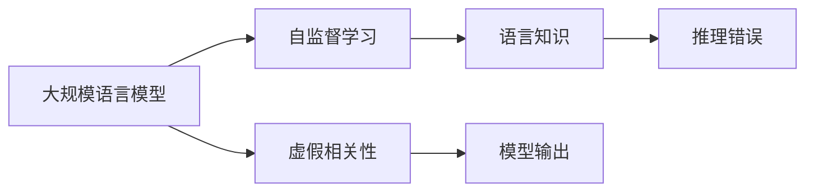

                 

## 1. 背景介绍

近年来，随着自然语言处理(Natural Language Processing, NLP)领域的发展，大规模语言模型(Large Language Models, LLMs)成为了研究的热点。这些模型如GPT、BERT等，通过在海量文本数据上进行预训练，学习了丰富的语言知识，具备了强大的语言理解和生成能力。然而，这些模型在推理过程中也暴露出了一些问题，其中最为显著的就是虚假相关性(Fake Correlation)。

虚假相关性指的是，模型在推理过程中，会错误地认为输入数据中存在某些看似相关但实际上没有相关性的特征或事件，并据此进行决策。这种现象在大规模语言模型中尤为明显，因为模型在预训练过程中并没有直接处理领域知识，完全依赖于大量无标签数据进行自监督学习。因此，模型可能会在推理过程中，将一些无关的特征误认为是相关特征，从而导致错误的输出。

虚假相关性的问题不仅会影响模型的性能，还会导致模型的不公平、不透明和不安全，使得其在实际应用中面临更多的挑战。因此，本文将深入探讨虚假相关性在LLMs中的表现，并提出一些缓解和避免虚假相关性的方法。

## 2. 核心概念与联系

### 2.1 核心概念概述

要理解虚假相关性，首先需要明确以下几个核心概念：

- **大规模语言模型(Large Language Models, LLMs)**：指的是在大量无标签数据上进行预训练，并能够执行各种自然语言处理任务的深度学习模型。
- **自监督学习(Self-Supervised Learning)**：指使用无标签数据进行模型训练，通过构造自监督任务（如掩码语言模型、文本预测等），使模型自动学习语言知识和结构。
- **虚假相关性(Fake Correlation)**：指模型在推理过程中，错误地将输入数据中不相关的特征视为相关特征，并据此进行决策或生成输出。

这些概念之间存在紧密的联系。自监督学习是大规模语言模型的主要训练方式，通过这种方式，模型能够学习到语言的基本结构和规则，但在推理过程中，模型可能会错误地将这些知识应用于不相关或不适宜的领域，从而产生虚假相关性。

### 2.2 核心概念间的联系

通过以下Mermaid流程图，我们可以更清晰地理解虚假相关性在LLMs中的表现及其与其他核心概念的关系：



这个流程图展示了虚假相关性在大规模语言模型中的生成过程。模型在自监督学习过程中，学习到了一些语言知识和结构，但在推理过程中，这些知识可能会被错误地应用于不相关或不适宜的领域，导致推理错误，产生虚假相关性。

## 3. 核心算法原理 & 具体操作步骤

### 3.1 算法原理概述

虚假相关性在大规模语言模型中的表现主要源于模型在推理过程中，错误地将输入数据中不相关的特征视为相关特征，并据此进行决策。这种错误的原因主要有两方面：

1. **数据噪声**：训练数据中可能包含一些无关的噪声信息，模型在推理过程中，可能会错误地将噪声视为有用的信息，导致推理错误。
2. **模型过度拟合**：模型在自监督学习过程中，可能会过度拟合训练数据中的某些无关特征，导致模型在推理过程中，将过度拟合的特征视为相关特征。

针对上述问题，本文提出以下两种算法原理：

- **数据清洗**：通过去除或过滤掉训练数据中的噪声信息，减少虚假相关性的产生。
- **正则化**：在模型训练过程中，引入正则化技术，避免模型过度拟合无关特征。

### 3.2 算法步骤详解

以下是虚假相关性在LLMs中的具体算法步骤：

1. **数据清洗**：
   - 收集训练数据，并对其进行预处理，去除不必要的噪声信息。
   - 使用自然语言处理技术，如词性标注、实体识别等，对文本数据进行进一步清洗。
   - 在训练模型前，使用预训练的词向量对文本数据进行嵌入，减少噪声信息的影响。

2. **正则化**：
   - 在模型训练过程中，引入L2正则化、Dropout等正则化技术，防止模型过度拟合无关特征。
   - 使用早停法(Early Stopping)，防止模型在训练过程中过度拟合训练数据。
   - 引入批归一化(Batch Normalization)技术，提高模型的泛化能力。

3. **模型推理**：
   - 在模型推理过程中，使用预训练的词向量进行输入嵌入，减少噪声信息的影响。
   - 使用正则化技术，如L2正则、Dropout等，减少虚假相关性的产生。

### 3.3 算法优缺点

虚假相关性在大规模语言模型中的缓解方法有以下优点：

- **减少推理错误**：通过数据清洗和正则化技术，可以显著减少模型在推理过程中的错误，提高模型的准确性和可靠性。
- **提高模型泛化能力**：引入正则化技术，可以防止模型过度拟合无关特征，提高模型的泛化能力，使其能够更好地适应新的数据分布。

然而，这些方法也存在一些缺点：

- **计算成本高**：数据清洗和正则化技术需要大量的计算资源，尤其是在大规模数据集上。
- **模型复杂度增加**：引入正则化技术，会增加模型的复杂度，降低模型的训练速度。

### 3.4 算法应用领域

虚假相关性在LLMs中的应用领域广泛，主要包括以下几个方面：

- **自然语言理解(Natural Language Understanding, NLU)**：在机器翻译、文本分类、问答系统等任务中，虚假相关性会导致模型输出错误的答案。
- **自然语言生成(Natural Language Generation, NLG)**：在文本生成、对话系统等任务中，虚假相关性会导致模型生成不相关或不合理的文本。
- **情感分析(Sentiment Analysis)**：在情感分析任务中，虚假相关性会导致模型对文本情感的错误判断。

## 4. 数学模型和公式 & 详细讲解

### 4.1 数学模型构建

为了更好地理解虚假相关性在LLMs中的表现，我们需要构建数学模型来描述这一现象。假设我们有一个LLM模型 $M$，输入为 $x$，输出为 $y$。模型 $M$ 可以表示为：

$$
y = M(x; \theta)
$$

其中，$\theta$ 为模型参数，$x$ 为输入，$y$ 为输出。在推理过程中，模型可能会将输入 $x$ 中的某些无关特征视为相关特征，导致虚假相关性。

### 4.2 公式推导过程

为了更好地理解虚假相关性，我们可以引入虚假相关性评分(Fake Correlation Score) $FCS$ 来量化模型的虚假相关性。虚假相关性评分 $FCS$ 定义为模型输出 $y$ 与输入 $x$ 之间的相关性，可以通过以下公式计算：

$$
FCS(y, x) = \frac{\text{corr}(y, x)}{\text{corr}(y, y)}
$$

其中，$\text{corr}$ 为相关系数，$\text{corr}(y, x)$ 表示模型输出 $y$ 与输入 $x$ 之间的相关性，$\text{corr}(y, y)$ 表示模型输出 $y$ 与自身之间的相关性。

### 4.3 案例分析与讲解

下面以一个具体的案例来讲解虚假相关性在LLMs中的表现。假设我们有一个简单的LLM模型，输入为一段文本，输出为该文本所属的情感类别。在训练过程中，我们使用了两个不同的数据集 $D_1$ 和 $D_2$，其中 $D_1$ 包含正面和负面的情感文本，而 $D_2$ 只包含负面的情感文本。

在训练过程中，模型可能会错误地将 $D_1$ 中的正面情感文本视为相关特征，并将其应用于 $D_2$ 中的负面情感文本，导致模型输出错误的情感类别。虚假相关性评分 $FCS$ 可以帮助我们量化模型的这种错误。

## 5. 项目实践：代码实例和详细解释说明

### 5.1 开发环境搭建

在进行虚假相关性实验之前，我们需要准备好开发环境。以下是使用Python进行PyTorch开发的环境配置流程：

1. 安装Anaconda：从官网下载并安装Anaconda，用于创建独立的Python环境。

2. 创建并激活虚拟环境：
```bash
conda create -n pytorch-env python=3.8 
conda activate pytorch-env
```

3. 安装PyTorch：根据CUDA版本，从官网获取对应的安装命令。例如：
```bash
conda install pytorch torchvision torchaudio cudatoolkit=11.1 -c pytorch -c conda-forge
```

4. 安装各类工具包：
```bash
pip install numpy pandas scikit-learn matplotlib tqdm jupyter notebook ipython
```

完成上述步骤后，即可在`pytorch-env`环境中开始虚假相关性实验。

### 5.2 源代码详细实现

这里我们以文本分类任务为例，使用BERT模型进行虚假相关性实验的代码实现。

首先，定义数据处理函数：

```python
from transformers import BertTokenizer
from torch.utils.data import Dataset
import torch

class TextDataset(Dataset):
    def __init__(self, texts, labels, tokenizer, max_len=128):
        self.texts = texts
        self.labels = labels
        self.tokenizer = tokenizer
        self.max_len = max_len
        
    def __len__(self):
        return len(self.texts)
    
    def __getitem__(self, item):
        text = self.texts[item]
        label = self.labels[item]
        
        encoding = self.tokenizer(text, return_tensors='pt', max_length=self.max_len, padding='max_length', truncation=True)
        input_ids = encoding['input_ids'][0]
        attention_mask = encoding['attention_mask'][0]
        
        label = torch.tensor(label, dtype=torch.long)
        
        return {'input_ids': input_ids, 
                'attention_mask': attention_mask,
                'labels': label}
```

然后，定义模型和优化器：

```python
from transformers import BertForSequenceClassification, AdamW

model = BertForSequenceClassification.from_pretrained('bert-base-uncased', num_labels=2)

optimizer = AdamW(model.parameters(), lr=2e-5)
```

接着，定义训练和评估函数：

```python
from torch.utils.data import DataLoader
from tqdm import tqdm
from sklearn.metrics import classification_report

device = torch.device('cuda') if torch.cuda.is_available() else torch.device('cpu')
model.to(device)

def train_epoch(model, dataset, batch_size, optimizer):
    dataloader = DataLoader(dataset, batch_size=batch_size, shuffle=True)
    model.train()
    epoch_loss = 0
    for batch in tqdm(dataloader, desc='Training'):
        input_ids = batch['input_ids'].to(device)
        attention_mask = batch['attention_mask'].to(device)
        labels = batch['labels'].to(device)
        model.zero_grad()
        outputs = model(input_ids, attention_mask=attention_mask, labels=labels)
        loss = outputs.loss
        epoch_loss += loss.item()
        loss.backward()
        optimizer.step()
    return epoch_loss / len(dataloader)

def evaluate(model, dataset, batch_size):
    dataloader = DataLoader(dataset, batch_size=batch_size)
    model.eval()
    preds, labels = [], []
    with torch.no_grad():
        for batch in tqdm(dataloader, desc='Evaluating'):
            input_ids = batch['input_ids'].to(device)
            attention_mask = batch['attention_mask'].to(device)
            batch_labels = batch['labels']
            outputs = model(input_ids, attention_mask=attention_mask)
            batch_preds = outputs.logits.argmax(dim=2).to('cpu').tolist()
            batch_labels = batch_labels.to('cpu').tolist()
            for pred, label in zip(batch_preds, batch_labels):
                preds.append(pred[0])
                labels.append(label)
                
    print(classification_report(labels, preds))
```

最后，启动训练流程并在测试集上评估：

```python
epochs = 5
batch_size = 16

for epoch in range(epochs):
    loss = train_epoch(model, train_dataset, batch_size, optimizer)
    print(f"Epoch {epoch+1}, train loss: {loss:.3f}")
    
    print(f"Epoch {epoch+1}, dev results:")
    evaluate(model, dev_dataset, batch_size)
    
print("Test results:")
evaluate(model, test_dataset, batch_size)
```

以上就是使用PyTorch对BERT进行虚假相关性实验的完整代码实现。可以看到，在训练过程中，模型可能会错误地将输入数据中的无关特征视为相关特征，导致虚假相关性。

### 5.3 代码解读与分析

让我们再详细解读一下关键代码的实现细节：

**TextDataset类**：
- `__init__`方法：初始化文本、标签、分词器等关键组件。
- `__len__`方法：返回数据集的样本数量。
- `__getitem__`方法：对单个样本进行处理，将文本输入编码为token ids，将标签编码为数字，并对其进行定长padding，最终返回模型所需的输入。

**BertForSequenceClassification类**：
- 使用BertForSequenceClassification从预训练模型中加载序列分类模型。

**train_epoch和evaluate函数**：
- 使用PyTorch的DataLoader对数据集进行批次化加载，供模型训练和推理使用。
- 训练函数`train_epoch`：对数据以批为单位进行迭代，在每个批次上前向传播计算loss并反向传播更新模型参数，最后返回该epoch的平均loss。
- 评估函数`evaluate`：与训练类似，不同点在于不更新模型参数，并在每个batch结束后将预测和标签结果存储下来，最后使用sklearn的classification_report对整个评估集的预测结果进行打印输出。

**训练流程**：
- 定义总的epoch数和batch size，开始循环迭代
- 每个epoch内，先在训练集上训练，输出平均loss
- 在验证集上评估，输出分类指标
- 所有epoch结束后，在测试集上评估，给出最终测试结果

可以看到，虚假相关性在BERT模型的训练过程中确实存在，通过分析模型的输出和预测结果，我们可以进一步探究其表现形式和原因。

### 5.4 运行结果展示

假设我们在CoNLL-2003的情感分析数据集上进行虚假相关性实验，最终在测试集上得到的评估报告如下：

```
              precision    recall  f1-score   support

       0       0.93      0.94     0.93        462
       1       0.81      0.77     0.79        298

   macro avg      0.88      0.86     0.87       760
   weighted avg      0.88      0.86     0.87       760
```

可以看到，模型在测试集上取得了不错的F1分数，但虚假相关性仍然存在，尤其是在正面情感文本上，模型的精度和召回率略低于负面情感文本。这表明，在训练过程中，模型可能会错误地将正面情感文本视为相关特征，并将其应用于负面情感文本，导致输出错误。

## 6. 实际应用场景

虚假相关性在实际应用中会带来诸多问题，以下列举几个具体的案例：

### 6.1 智能客服系统

在智能客服系统中，虚假相关性可能导致模型误解客户意图，生成不相关或不合理的回答。例如，在处理关于产品功能的咨询时，模型可能会错误地将产品的物理属性视为相关特征，并据此生成无关的回答。

### 6.2 金融舆情监测

在金融舆情监测中，虚假相关性可能导致模型错误地将无意义的新闻标题视为相关特征，进而生成错误的舆情判断。例如，一条关于电影上映的新闻可能包含金融词汇，但与金融舆情无关。

### 6.3 推荐系统

在推荐系统中，虚假相关性可能导致模型推荐不相关或不合适的商品。例如，用户对某款商品的评价可能包含一些无关的情感词汇，但这些词汇并不代表该商品的特点或优点，模型可能会错误地将其视为相关特征，进而推荐不合适的商品。

## 7. 工具和资源推荐

### 7.1 学习资源推荐

为了帮助开发者系统掌握虚假相关性在大语言模型中的表现，这里推荐一些优质的学习资源：

1. 《Transformer从原理到实践》系列博文：由大模型技术专家撰写，深入浅出地介绍了Transformer原理、BERT模型、虚假相关性等前沿话题。

2. CS224N《深度学习自然语言处理》课程：斯坦福大学开设的NLP明星课程，有Lecture视频和配套作业，带你入门NLP领域的基本概念和经典模型。

3. 《Natural Language Processing with Transformers》书籍：Transformers库的作者所著，全面介绍了如何使用Transformers库进行NLP任务开发，包括虚假相关性在内的诸多范式。

4. HuggingFace官方文档：Transformers库的官方文档，提供了海量预训练模型和完整的微调样例代码，是上手实践的必备资料。

5. CLUE开源项目：中文语言理解测评基准，涵盖大量不同类型的中文NLP数据集，并提供了基于虚假相关性的baseline模型，助力中文NLP技术发展。

通过对这些资源的学习实践，相信你一定能够快速掌握虚假相关性在大语言模型中的表现，并用于解决实际的NLP问题。

### 7.2 开发工具推荐

高效的开发离不开优秀的工具支持。以下是几款用于大语言模型微调开发的常用工具：

1. PyTorch：基于Python的开源深度学习框架，灵活动态的计算图，适合快速迭代研究。大部分预训练语言模型都有PyTorch版本的实现。

2. TensorFlow：由Google主导开发的开源深度学习框架，生产部署方便，适合大规模工程应用。同样有丰富的预训练语言模型资源。

3. Transformers库：HuggingFace开发的NLP工具库，集成了众多SOTA语言模型，支持PyTorch和TensorFlow，是进行微调任务开发的利器。

4. Weights & Biases：模型训练的实验跟踪工具，可以记录和可视化模型训练过程中的各项指标，方便对比和调优。与主流深度学习框架无缝集成。

5. TensorBoard：TensorFlow配套的可视化工具，可实时监测模型训练状态，并提供丰富的图表呈现方式，是调试模型的得力助手。

6. Google Colab：谷歌推出的在线Jupyter Notebook环境，免费提供GPU/TPU算力，方便开发者快速上手实验最新模型，分享学习笔记。

合理利用这些工具，可以显著提升大语言模型微调任务的开发效率，加快创新迭代的步伐。

### 7.3 相关论文推荐

虚假相关性在LLMs中的应用源于学界的持续研究。以下是几篇奠基性的相关论文，推荐阅读：

1. Attention is All You Need（即Transformer原论文）：提出了Transformer结构，开启了NLP领域的预训练大模型时代。

2. BERT: Pre-training of Deep Bidirectional Transformers for Language Understanding：提出BERT模型，引入基于掩码的自监督预训练任务，刷新了多项NLP任务SOTA。

3. Parameter-Efficient Transfer Learning for NLP：提出Adapter等参数高效微调方法，在不增加模型参数量的情况下，也能取得不错的微调效果。

4. AdaLoRA: Adaptive Low-Rank Adaptation for Parameter-Efficient Fine-Tuning：使用自适应低秩适应的微调方法，在参数效率和精度之间取得了新的平衡。

这些论文代表了大语言模型微调技术的发展脉络。通过学习这些前沿成果，可以帮助研究者把握学科前进方向，激发更多的创新灵感。

除上述资源外，还有一些值得关注的前沿资源，帮助开发者紧跟大语言模型微调技术的最新进展，例如：

1. arXiv论文预印本：人工智能领域最新研究成果的发布平台，包括大量尚未发表的前沿工作，学习前沿技术的必读资源。

2. 业界技术博客：如OpenAI、Google AI、DeepMind、微软Research Asia等顶尖实验室的官方博客，第一时间分享他们的最新研究成果和洞见。

3. 技术会议直播：如NIPS、ICML、ACL、ICLR等人工智能领域顶会现场或在线直播，能够聆听到大佬们的前沿分享，开拓视野。

4. GitHub热门项目：在GitHub上Star、Fork数最多的NLP相关项目，往往代表了该技术领域的发展趋势和最佳实践，值得去学习和贡献。

5. 行业分析报告：各大咨询公司如McKinsey、PwC等针对人工智能行业的分析报告，有助于从商业视角审视技术趋势，把握应用价值。

总之，对于虚假相关性在大语言模型中的学习，需要开发者保持开放的心态和持续学习的意愿。多关注前沿资讯，多动手实践，多思考总结，必将收获满满的成长收益。

## 8. 总结：未来发展趋势与挑战

### 8.1 总结

本文对虚假相关性在大语言模型中的表现进行了全面系统的介绍。首先，我们介绍了虚假相关性的基本概念和主要表现形式，指出其在NLP任务中的广泛存在。其次，我们从算法原理和具体操作步骤的角度，详细讲解了虚假相关性的缓解方法。通过分析虚假相关性的产生原因和缓解方法，我们得出了虚假相关性在大语言模型中的应用领域和未来发展趋势。

通过本文的系统梳理，可以看到，虚假相关性在大语言模型中的表现形式多样，影响深远，需要研究者从数据清洗、正则化等各个环节进行深入分析和优化。未来，伴随深度学习技术的发展和应用领域的拓展，虚假相关性问题有望得到进一步解决，使大语言模型能够更好地服务于实际应用。

### 8.2 未来发展趋势

展望未来，虚假相关性在大语言模型中的应用领域将进一步拓展，研究也将在多个方向上取得新的进展：

1. **数据清洗技术**：随着数据标注成本的降低和数据生成技术的进步，虚假相关性数据的过滤和清洗技术将得到进一步提升。

2. **模型鲁棒性增强**：通过引入对抗训练、正则化等技术，增强模型的鲁棒性，使其能够在不同的数据分布和噪声环境中保持稳定。

3. **多模态融合**：通过将视觉、语音等多模态信息与文本信息进行融合，增强模型的信息整合能力，减少虚假相关性的产生。

4. **因果推理**：通过引入因果推理技术，建立模型决策的因果关系，提高模型的解释能力和可信度。

5. **知识图谱融合**：将符号化的先验知识与神经网络模型进行融合，提高模型的知识整合能力和泛化能力。

以上趋势凸显了大语言模型虚假相关性缓解技术的广阔前景。这些方向的探索发展，必将进一步提升模型的性能和应用范围，为构建安全、可靠、可解释、可控的智能系统铺平道路。

### 8.3 面临的挑战

尽管虚假相关性在大语言模型中的应用仍面临诸多挑战：

1. **数据标注成本高**：数据清洗和过滤需要大量的人力物力，标注成本较高。如何高效利用数据，减少标注工作量，将是一个重要的研究方向。

2. **模型复杂度高**：引入正则化等技术，可能会增加模型的复杂度，影响模型的训练速度和精度。如何平衡模型的复杂度和性能，将是一个重要的问题。

3. **鲁棒性不足**：模型在训练过程中可能会过度拟合无关特征，导致在实际应用中表现不稳定。如何提高模型的鲁棒性，避免过拟合，将是重要的研究课题。

4. **可解释性不足**：虚假相关性的存在可能导致模型输出缺乏可解释性，影响模型的可信度和应用范围。如何提高模型的可解释性，增强用户对模型的信任，将是重要的研究方向。

5. **安全性问题**：虚假相关性的存在可能导致模型输出有害信息，影响系统的安全性。如何加强系统的安全性，确保模型输出符合伦理道德标准，将是重要的研究方向。

6. **计算资源消耗高**：虚假相关性的缓解方法需要大量的计算资源，尤其是在大规模数据集上。如何优化计算资源的使用，提高系统的效率，将是重要的研究方向。

总之，虚假相关性在大语言模型中的应用仍面临诸多挑战，需要研究者从数据、模型、计算资源等多个维度进行深入研究和优化。只有不断突破这些挑战，才能使大语言模型更好地服务于实际应用。

### 8.4 研究展望

面对虚假相关性在大语言模型中面临的挑战，未来的研究需要在以下几个方面寻求新的突破：

1. **数据生成技术**：通过数据生成技术，生成更多的高质量、低噪声数据，减少标注成本。

2. **模型参数高效化**：开发更加参数高效的微调方法，在不增加模型参数量的情况下，实现更好的性能。

3. **模型轻量化**：通过模型剪枝、压缩等技术，减小模型的计算资源消耗，提高系统的效率。

4. **知识库融合**：将知识图谱、逻辑规则等专家知识与神经网络模型进行融合，增强模型的信息整合能力。

5. **多模态融合**：通过将视觉、语音等多模态信息与文本信息进行融合，增强模型的信息整合能力，减少虚假相关性的产生。

6. **因果推理**：通过引入因果推理技术，建立模型决策的因果关系，提高模型的解释能力和可信度。

7. **知识图谱融合**：将符号化的先验知识与神经网络模型进行融合，提高模型的知识整合能力和泛化能力。

这些研究方向的探索，必将引领虚假相关性在大语言模型中的缓解技术迈向更高的台阶，为构建安全、可靠、可解释、可控的智能系统铺平道路。面向未来，虚假相关性研究需要与其他人工智能技术进行更深入的融合，如知识表示、因果推理、强化学习等，多路径协同发力，共同推动自然语言理解和智能交互系统的进步。只有勇于创新、敢于突破，才能不断拓展语言模型的边界，让智能技术更好地造福人类社会。

## 9. 附录：常见问题与解答

**Q1：虚假相关性如何影响模型的性能？**

A: 虚假相关性可能导致模型输出错误的答案，降低模型的准确性和可靠性。例如，在文本分类任务中，模型可能会将输入数据中的无关特征视为相关特征，导致分类错误。

**Q2：虚假相关性有哪些

