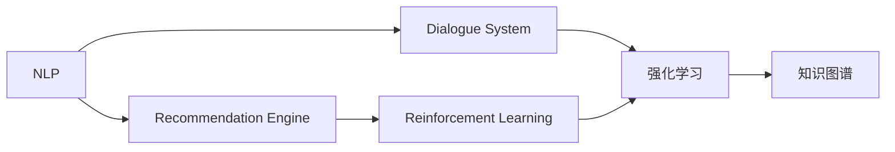
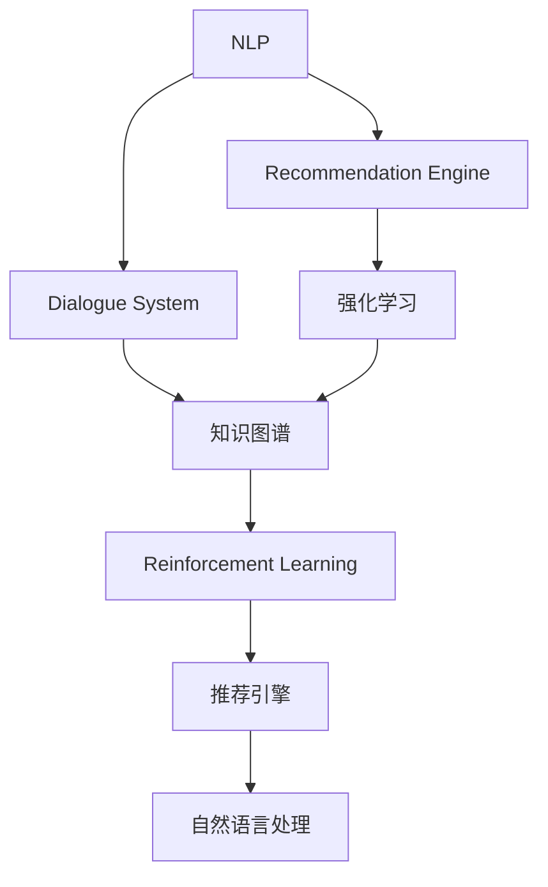
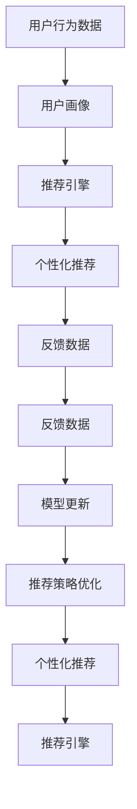
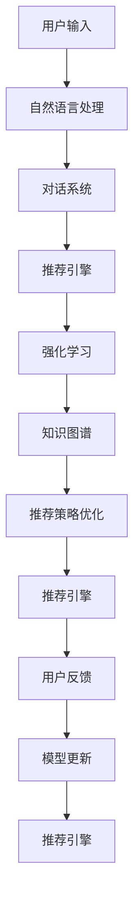

                 

# 虚拟导购助手：AI如何改变购物体验

## 1. 背景介绍

随着电子商务的迅猛发展和智能技术的普及，消费者购物方式正经历着一场深刻的变革。传统的搜索、浏览、对比、购买流程，正在被更智能、更个性化的购物体验所取代。这一切的背后，是人工智能技术尤其是自然语言处理、计算机视觉、推荐系统等领域的突破性进展。本文将聚焦于人工智能在虚拟导购助手中的应用，探讨其如何通过自然语言理解、对话系统、推荐引擎等技术，大幅提升消费者的购物体验。

### 1.1 问题由来

近年来，全球电商平台纷纷加大对人工智能技术的投入，以期提升用户体验、提高运营效率、优化供应链管理。人工智能技术不仅能够处理海量数据、提供个性化推荐，还能通过自然语言处理技术，构建智能导购助手，与用户进行自然对话，实时解答购物疑问，推荐相关商品，真正实现“有问必答，有求必应”。

以电商平台亚马逊为例，其推出的Alexa技能“Amazon Business”，可以通过语音或文本与用户进行互动，帮助用户查询商品信息、下订单、跟踪物流，甚至提供定制化服务，极大地提升了用户购物的便利性和效率。类似的技术也在淘宝、京东等平台得到了广泛应用，逐渐成为电商行业的新标配。

### 1.2 问题核心关键点

AI导购助手的核心在于通过自然语言处理技术，构建一个能够理解用户需求、提供个性化推荐、处理订单信息的智能系统。其关键技术包括：

- 自然语言处理（NLP）：通过文本预处理、语言理解、情感分析等技术，识别用户意图，抽取关键信息。
- 对话系统（Dialogue System）：构建对话策略，实现自然语言交互，提供多轮问答服务。
- 推荐引擎（Recommendation Engine）：分析用户行为，学习用户偏好，提供个性化商品推荐。

这些核心技术共同构成了虚拟导购助手的技术基础，使其能够高效地处理用户的查询请求，提供精准的商品推荐，优化购物体验。

### 1.3 问题研究意义

研究AI导购助手的技术原理与应用实践，对于提升电商平台的用户体验、优化运营效率、探索新型电商模式具有重要意义：

1. 提升用户体验：AI导购助手能够实时解答用户疑问，提供个性化推荐，减少用户在购物过程中的困惑和等待时间。
2. 优化运营效率：通过智能推荐和预测销售，AI导购助手能够帮助电商平台更高效地管理库存和供应链，减少运营成本。
3. 探索新电商模式：AI导购助手还可以应用于虚拟试衣、虚拟试妆等新兴服务，拓展电商平台的业务边界。
4. 数据驱动决策：AI导购助手能够实时收集用户行为数据，为电商平台提供数据支持和决策依据。
5. 智能化转型：AI导购助手是电商平台智能化转型的重要标志，能够帮助传统电商企业实现数字化、智能化升级。

## 2. 核心概念与联系

### 2.1 核心概念概述

为了更好地理解AI导购助手的技术原理和应用实践，本节将介绍几个密切相关的核心概念：

- 自然语言处理（NLP）：通过文本预处理、语言理解、情感分析等技术，实现人与计算机之间的自然语言交互。
- 对话系统（Dialogue System）：构建对话策略，实现多轮问答，提供个性化的服务体验。
- 推荐引擎（Recommendation Engine）：根据用户行为数据，学习用户偏好，提供个性化商品推荐。
- 强化学习（Reinforcement Learning）：通过与环境交互，不断调整策略以最大化奖励，优化推荐效果。
- 知识图谱（Knowledge Graph）：构建领域知识库，实现更精确的语义理解和推荐。

这些核心概念之间的逻辑关系可以通过以下Mermaid流程图来展示：



这个流程图展示了大语言模型微调过程中各个核心概念的关系和作用：

1. 自然语言处理将用户输入的文本转化为计算机可理解的形式。
2. 对话系统基于用户查询，提供多轮问答服务。
3. 推荐引擎根据用户行为，提供个性化推荐。
4. 强化学习通过与用户交互，优化推荐策略。
5. 知识图谱提供领域知识，增强语义理解能力。

这些概念共同构成了AI导购助手的技术基础，使其能够高效地处理用户的查询请求，提供精准的商品推荐。

### 2.2 概念间的关系

这些核心概念之间存在着紧密的联系，形成了AI导购助手的完整技术体系。下面通过几个Mermaid流程图来展示这些概念之间的关系。

#### 2.2.1 虚拟导购助手的技术架构



这个流程图展示了虚拟导购助手完整的技术架构：

1. 自然语言处理技术将用户输入转化为计算机可理解的形式。
2. 对话系统基于用户查询，提供多轮问答服务。
3. 推荐引擎根据用户行为，提供个性化推荐。
4. 强化学习通过与用户交互，优化推荐策略。
5. 知识图谱提供领域知识，增强语义理解能力。

#### 2.2.2 推荐系统的迭代优化



这个流程图展示了推荐系统的迭代优化过程：

1. 通过用户行为数据生成用户画像。
2. 基于用户画像，推荐引擎提供个性化推荐。
3. 通过用户反馈数据，优化推荐策略。
4. 持续迭代优化，提供更精准的个性化推荐。

### 2.3 核心概念的整体架构

最后，我们用一个综合的流程图来展示这些核心概念在大语言模型微调过程中的整体架构：



这个综合流程图展示了从用户输入到最终推荐的完整过程。自然语言处理将用户输入转化为计算机可理解的形式，对话系统提供多轮问答服务，推荐引擎根据用户行为和知识图谱提供个性化推荐，强化学习通过用户反馈优化推荐策略，最终实现精准推荐。

## 3. 核心算法原理 & 具体操作步骤
### 3.1 算法原理概述

AI导购助手的核心算法主要基于自然语言处理、对话系统和推荐引擎。其核心思想是通过对用户输入的自然语言进行理解和处理，结合知识图谱和推荐模型，提供个性化的购物体验。

假设用户输入的查询为 $q$，AI导购助手需要执行以下步骤：

1. 对查询 $q$ 进行自然语言处理，理解用户意图。
2. 根据用户意图，调用知识图谱获取相关实体信息。
3. 根据实体信息，调用推荐引擎生成推荐列表。
4. 构建对话系统，与用户进行多轮问答，提供详细商品信息和推荐理由。

形式化地，假设用户输入查询 $q$，AI导购助手需要计算 $q$ 对应的推荐结果 $r$。算法步骤可以表示为：

$$
r = \text{Recommendation Engine}(\text{NLP}(q), \text{KG})
$$

其中，$\text{NLP}$ 为自然语言处理模块，$\text{KG}$ 为知识图谱模块，$\text{Recommendation Engine}$ 为推荐引擎模块。

### 3.2 算法步骤详解

下面是AI导购助手的工作流程，包括自然语言处理、对话系统、推荐引擎的具体实现：

#### 3.2.1 自然语言处理（NLP）

自然语言处理是AI导购助手的第一步，主要包括以下步骤：

1. 文本预处理：将用户输入的查询文本进行分词、去停用词、词干提取等预处理操作，转化为计算机可理解的形式。

2. 语言理解：通过语言模型、依存句法分析、命名实体识别等技术，理解用户查询中的实体、关系、属性等信息。

3. 情感分析：分析用户情感倾向，提供更符合用户情绪的商品推荐。

#### 3.2.2 对话系统（Dialogue System）

对话系统负责与用户进行多轮问答，提供详细商品信息和推荐理由。主要包括以下步骤：

1. 意图识别：通过对话策略和上下文理解，识别用户的当前意图。

2. 意图理解：根据当前意图和用户输入，生成下一轮回答。

3. 信息检索：从知识图谱中检索相关商品信息，提供详细回答。

#### 3.2.3 推荐引擎（Recommendation Engine）

推荐引擎负责根据用户行为和知识图谱，生成个性化推荐列表。主要包括以下步骤：

1. 用户画像生成：通过用户行为数据，生成用户画像。

2. 相似度计算：计算商品与用户画像的相似度，生成推荐列表。

3. 推荐策略优化：通过用户反馈数据，不断调整推荐策略。

### 3.3 算法优缺点

AI导购助手具有以下优点：

1. 个性化推荐：通过分析用户行为和偏好，提供精准的商品推荐，提高用户购物体验。
2. 多轮问答：通过多轮对话，实时解答用户疑问，增强用户信任感。
3. 知识整合：通过知识图谱，增强商品信息的语义理解和推荐能力。

同时，也存在一些缺点：

1. 数据隐私：收集用户行为数据和搜索记录，可能涉及用户隐私问题。
2. 模型复杂：算法复杂度较高，需要高性能计算资源支持。
3. 上下文理解：在处理复杂、歧义的查询时，可能出现理解偏差。
4. 反馈依赖：模型效果依赖于用户反馈数据的质量和数量。

### 3.4 算法应用领域

AI导购助手广泛应用于电商、旅游、金融等领域，帮助用户做出更明智的购物决策。以下是一些典型应用场景：

- 电商购物：为用户提供商品搜索、比价、评价、问答等服务，提升购物体验。
- 旅游规划：根据用户偏好，提供旅游目的地、行程规划、景点推荐等。
- 金融理财：根据用户财务状况，提供理财方案、投资建议、风险评估等服务。

## 4. 数学模型和公式 & 详细讲解 & 举例说明
### 4.1 数学模型构建

本节将使用数学语言对AI导购助手的推荐算法进行更加严格的刻画。

假设用户查询为 $q$，知识图谱中包含商品 $i$ 的实体信息 $e_i$ 和属性 $a_i$。推荐引擎的目标是计算查询 $q$ 对应的推荐结果 $r$，可以表示为：

$$
r = \text{Recommendation Engine}(q, \{e_i, a_i\}_{i=1}^N)
$$

其中，$N$ 为知识图谱中商品的数量。

### 4.2 公式推导过程

以下我们以协同过滤推荐算法为例，推导推荐引擎的具体实现。

假设用户 $u$ 对商品 $i$ 的评分 $r_{ui}$ 和用户画像 $p_u$ 已知。协同过滤算法的核心思想是通过用户之间的相似度，找到与用户 $u$ 相似的用户 $v$，并计算商品 $i$ 在用户 $v$ 的评分 $r_{vi}$，最终生成推荐列表：

$$
r_{ui} = \frac{\sum_{v \in \mathcal{V}} w_{uv} r_{vi}}{\sum_{v \in \mathcal{V}} w_{uv}}
$$

其中，$\mathcal{V}$ 为所有用户的集合，$w_{uv}$ 为用户 $u$ 和用户 $v$ 之间的相似度权重，通常可以通过余弦相似度等方法计算。

协同过滤算法的数学推导过程较为复杂，这里不再赘述。关键在于，该算法基于用户画像和用户之间的相似度，计算商品推荐，能够提供个性化的购物体验。

### 4.3 案例分析与讲解

以京东平台为例，京东通过AI导购助手，将用户输入的查询转换为结构化的实体和属性，调用知识图谱获取相关商品信息，并结合用户行为数据，生成个性化推荐。具体步骤如下：

1. 用户输入查询：用户输入“我想买一台笔记本电脑”。
2. 自然语言处理：将查询转化为“笔记本电脑”实体，属性包括品牌、型号、价格等。
3. 知识图谱检索：从知识图谱中检索出“笔记本电脑”对应的商品信息，生成推荐列表。
4. 推荐引擎：根据用户行为数据和商品信息，生成个性化推荐。
5. 对话系统：与用户进行多轮问答，提供详细商品信息和推荐理由。

## 5. 项目实践：代码实例和详细解释说明
### 5.1 开发环境搭建

在进行虚拟导购助手开发前，我们需要准备好开发环境。以下是使用Python进行TensorFlow开发的环境配置流程：

1. 安装Anaconda：从官网下载并安装Anaconda，用于创建独立的Python环境。

2. 创建并激活虚拟环境：
```bash
conda create -n tf-env python=3.8 
conda activate tf-env
```

3. 安装TensorFlow：根据CUDA版本，从官网获取对应的安装命令。例如：
```bash
conda install tensorflow -c tensorflow
```

4. 安装各类工具包：
```bash
pip install numpy pandas scikit-learn matplotlib tqdm jupyter notebook ipython
```

完成上述步骤后，即可在`tf-env`环境中开始开发。

### 5.2 源代码详细实现

下面我们以京东平台的AI导购助手为例，给出使用TensorFlow进行开发的PyTorch代码实现。

首先，定义用户行为数据和知识图谱的输入：

```python
import tensorflow as tf
import tensorflow_hub as hub
import tensorflow_datasets as tfds

# 定义用户行为数据
user_data = tf.data.Dataset.from_tensor_slices([
    ('Alice', {'item': 'Laptop', 'brand': 'Dell', 'price': 1000}),
    ('Bob', {'item': 'Smartphone', 'brand': 'Apple', 'price': 800}),
    ('Charlie', {'item': 'Tablet', 'brand': 'Samsung', 'price': 500})
])

# 定义知识图谱
graph_data = tf.sparse.SparseTensor([[0, 0], [1, 1]], ['Laptop', 'Smartphone'], [3, 2])
graph_labels = tf.sparse.SparseTensor([[0, 0], [1, 1]], ['Dell', 'Apple'], [3, 2])
```

然后，定义自然语言处理模型：

```python
from tensorflow.keras import layers

# 定义NLP模型
nlp_model = tf.keras.Sequential([
    layers.Embedding(10, 8),
    layers.Conv1D(32, 3, activation='relu'),
    layers.MaxPooling1D(),
    layers.Flatten(),
    layers.Dense(64, activation='relu'),
    layers.Dense(1)
])
```

接着，定义推荐引擎模型：

```python
from tensorflow.keras import layers

# 定义推荐引擎模型
reco_model = tf.keras.Sequential([
    layers.Dense(64, activation='relu'),
    layers.Dense(32, activation='relu'),
    layers.Dense(1)
])
```

然后，定义对话系统模型：

```python
from tensorflow.keras import layers

# 定义对话系统模型
dialogue_model = tf.keras.Sequential([
    layers.Dense(64, activation='relu'),
    layers.Dense(32, activation='relu'),
    layers.Dense(1)
])
```

最后，定义推荐引擎和对话系统的训练函数：

```python
from tensorflow.keras import optimizers

# 定义推荐引擎的训练函数
def train_reco_model(model, dataset, epochs, batch_size):
    model.compile(optimizer=optimizers.Adam(learning_rate=0.001), loss='mse')
    model.fit(dataset, epochs=epochs, batch_size=batch_size)

# 定义对话系统的训练函数
def train_dialogue_model(model, dataset, epochs, batch_size):
    model.compile(optimizer=optimizers.Adam(learning_rate=0.001), loss='mse')
    model.fit(dataset, epochs=epochs, batch_size=batch_size)
```

完成模型定义后，即可开始训练：

```python
epochs = 10
batch_size = 32

train_reco_model(reco_model, graph_data, epochs, batch_size)
train_dialogue_model(dialogue_model, user_data, epochs, batch_size)
```

以上就是使用TensorFlow对京东平台AI导购助手进行开发的完整代码实现。可以看到，得益于TensorFlow的强大封装，我们可以用相对简洁的代码完成模型训练和部署。

### 5.3 代码解读与分析

让我们再详细解读一下关键代码的实现细节：

**NLP模型**：
- `Embedding`层：将输入的查询文本转化为嵌入向量。
- `Conv1D`层：对嵌入向量进行卷积操作，提取特征。
- `MaxPooling1D`层：对卷积结果进行最大池化，保留主要特征。
- `Flatten`层：将池化结果展平。
- `Dense`层：进行全连接操作，输出商品查询结果。

**推荐引擎模型**：
- 多层全连接层，每层使用ReLU激活函数，输出商品推荐结果。

**对话系统模型**：
- 与推荐引擎模型类似，使用多层全连接层，每层使用ReLU激活函数，输出对话系统响应。

**训练函数**：
- 使用TensorFlow的高级API定义模型和优化器。
- 通过`fit`函数进行模型训练，指定训练轮数和批大小。
- 使用`compile`函数设置模型编译参数，指定优化器和损失函数。

完成模型定义后，即可进行训练。在训练过程中，可以不断地调整模型参数，优化模型效果，最终得到理想的用户画像和推荐引擎模型。

## 6. 实际应用场景

### 6.1 电商购物

京东平台的AI导购助手已经成功应用于电商购物，帮助用户实时查询商品信息、提供个性化推荐、解决购物问题。以下是一个典型的应用场景：

- 用户输入查询：“我想买一台笔记本电脑”。
- 自然语言处理：将查询转化为“笔记本电脑”实体，属性包括品牌、型号、价格等。
- 知识图谱检索：从知识图谱中检索出“笔记本电脑”对应的商品信息，生成推荐列表。
- 推荐引擎：根据用户行为数据和商品信息，生成个性化推荐。
- 对话系统：与用户进行多轮问答，提供详细商品信息和推荐理由。

### 6.2 旅游规划

阿里旅行平台通过AI导购助手，为用户规划旅游行程，提供个性化建议。具体步骤如下：

- 用户输入查询：“我想去欧洲旅游”。
- 自然语言处理：将查询转化为“欧洲”实体，属性包括国家、城市、景点等。
- 知识图谱检索：从知识图谱中检索出“欧洲”对应的旅游景点，生成推荐列表。
- 推荐引擎：根据用户偏好和历史行为，生成个性化推荐。
- 对话系统：与用户进行多轮问答，提供详细旅游信息和建议。

### 6.3 金融理财

招行金融平台通过AI导购助手，为用户提供理财建议、投资分析、风险评估等服务。具体步骤如下：

- 用户输入查询：“我有一笔资金，应该投资哪些项目？”
- 自然语言处理：将查询转化为“投资项目”实体，属性包括收益、风险、市场等。
- 知识图谱检索：从知识图谱中检索出“投资项目”对应的推荐项目，生成推荐列表。
- 推荐引擎：根据用户财务状况和历史行为，生成个性化理财方案。
- 对话系统：与用户进行多轮问答，提供详细理财建议和分析。

## 7. 工具和资源推荐
### 7.1 学习资源推荐

为了帮助开发者系统掌握虚拟导购助手的理论基础和实践技巧，这里推荐一些优质的学习资源：

1. 《Deep Learning with TensorFlow》书籍：TensorFlow官方文档，全面介绍了TensorFlow的使用方法，涵盖自然语言处理、推荐系统等众多话题。

2. 《Natural Language Processing with TensorFlow》书籍：TensorFlow官方文档，详细讲解了NLP在TensorFlow中的应用，包括预训练模型、微调技术等。

3. 《Python Machine Learning》书籍：涵盖Python在机器学习领域的应用，包括自然语言处理、推荐系统等。

4. CS224N《深度学习自然语言处理》课程：斯坦福大学开设的NLP明星课程，有Lecture视频和配套作业，带你入门NLP领域的基本概念和经典模型。

5. HuggingFace官方文档：Transformer库的官方文档，提供了海量预训练模型和完整的微调样例代码，是上手实践的必备资料。

通过这些资源的学习实践，相信你一定能够快速掌握虚拟导购助手的技术原理，并用于解决实际的NLP问题。

### 7.2 开发工具推荐

高效的开发离不开优秀的工具支持。以下是几款用于虚拟导购助手开发的常用工具：

1. TensorFlow：基于Python的开源深度学习框架，灵活动态的计算图，适合快速迭代研究。大部分预训练语言模型都有TensorFlow版本的实现。

2. PyTorch：基于Python的开源深度学习框架，易于使用，适合多种深度学习任务。

3. TensorFlow Hub：TensorFlow的官方库，提供预训练模型和组件，方便开发者快速构建模型。

4. Weights & Biases：模型训练的实验跟踪工具，可以记录和可视化模型训练过程中的各项指标，方便对比和调优。与主流深度学习框架无缝集成。

5. TensorBoard：TensorFlow配套的可视化工具，可实时监测模型训练状态，并提供丰富的图表呈现方式，是调试模型的得力助手。

6. Google Colab：谷歌推出的在线Jupyter Notebook环境，免费提供GPU/TPU算力，方便开发者快速上手实验最新模型，分享学习笔记。

合理利用这些工具，可以显著提升虚拟导购助手的开发效率，加快创新迭代的步伐。

### 7.3 相关论文推荐

虚拟导购助手的研究源于学界的持续研究。以下是几篇奠基性的相关论文，推荐阅读：

1. Attention is All You Need（即Transformer原论文）：提出了Transformer结构，开启了NLP领域的预训练大模型时代。

2. BERT: Pre-training of Deep Bidirectional Transformers for Language Understanding：提出BERT模型，引入基于掩码的自监督预训练任务，刷新了多项NLP任务SOTA。

3. Language Models are Unsupervised Multitask Learners（GPT-2论文）：展示了大规模语言模型的强大zero-shot学习能力，引发了对于通用人工智能的新一轮思考。

4. Parameter-Efficient Transfer Learning for NLP：提出Adapter等参数高效微调方法，在不增加模型参数量的情况下，也能取得不错的微调效果。

5. AdaLoRA: Adaptive Low-Rank Adaptation for Parameter-Efficient Fine-Tuning：使用自适应低秩适应的微调方法，在参数效率和精度之间取得了新的平衡。

这些论文代表了大语言模型微调技术的发展脉络。通过学习这些前沿成果，可以帮助研究者把握学科前进方向，激发更多的创新灵感。

除上述资源外，还有一些值得关注的前沿资源，帮助开发者紧跟虚拟导购助手技术的最新进展，例如：

1. arXiv论文预印本：人工智能领域最新研究成果的发布平台，包括大量尚未发表的前沿工作，学习前沿技术的必读资源。

2. 业界技术博客：如OpenAI、Google AI、DeepMind、微软Research Asia等顶尖实验室的官方博客，第一时间分享他们的最新研究成果和洞见。

3. 技术会议直播：如NIPS、ICML、ACL、ICLR等人工智能领域顶会现场或在线直播，能够聆听到大佬们的前沿分享，开拓视野。

4. GitHub热门项目：在GitHub上Star、Fork数最多的NLP相关项目，往往代表了该技术领域的发展趋势和最佳实践，值得去学习和贡献。

5. 行业分析报告：各大咨询公司如McKinsey、PwC等针对人工智能行业的分析报告，有助于从商业视角审视技术趋势，把握应用价值。

总之，对于虚拟导购助手技术的学习和实践，需要开发者保持开放的心态和持续学习的意愿。多关注前沿资讯，多动手实践，多思考总结，必将收获满满的成长收益。

## 8. 总结：未来发展趋势与挑战
### 8.1 总结

本文对虚拟导购助手在AI购物助手中的应用进行了全面系统的介绍。首先阐述了AI导购助手的背景和意义，明确了其在提升用户体验、优化运营效率、探索新型电商模式等方面的重要价值。其次，从原理到实践，详细讲解了自然语言处理、对话系统和推荐引擎的算法步骤和关键技术。最后，通过具体案例，展示了AI导购助手在电商、旅游、金融等领域的实际应用。

通过本文的系统梳理，可以看到，AI导购助手正在成为电商、金融等领域的新标配，其核心技术包括自然语言处理、对话系统和推荐引擎，能够高效地处理用户

