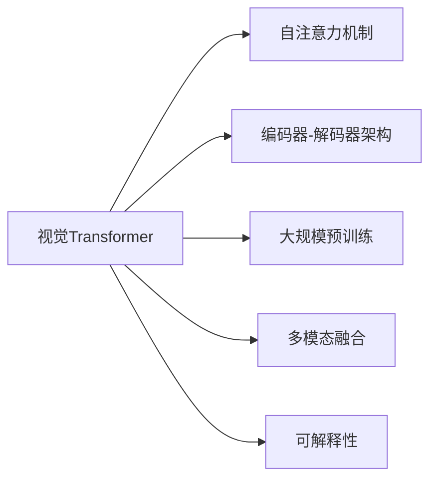
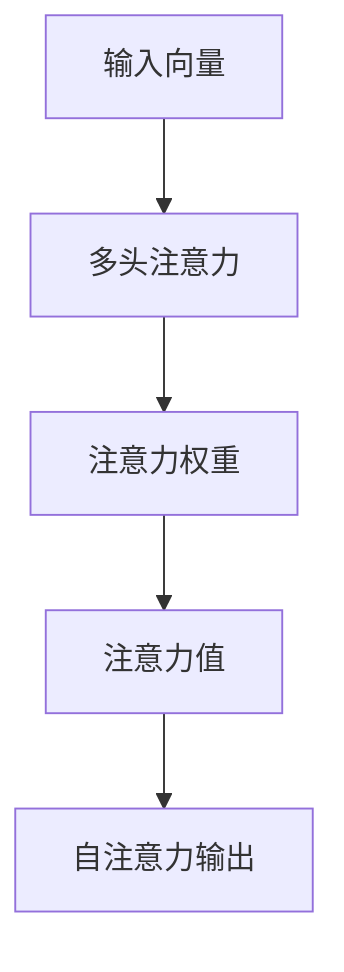
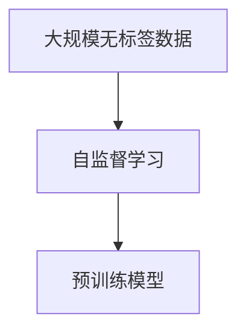
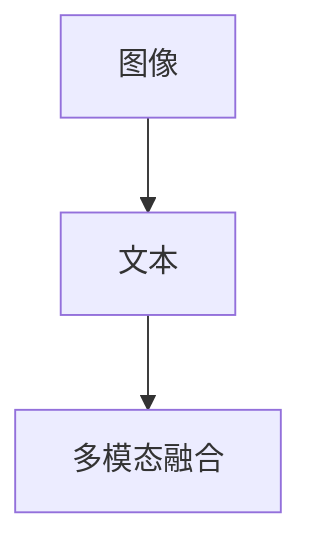
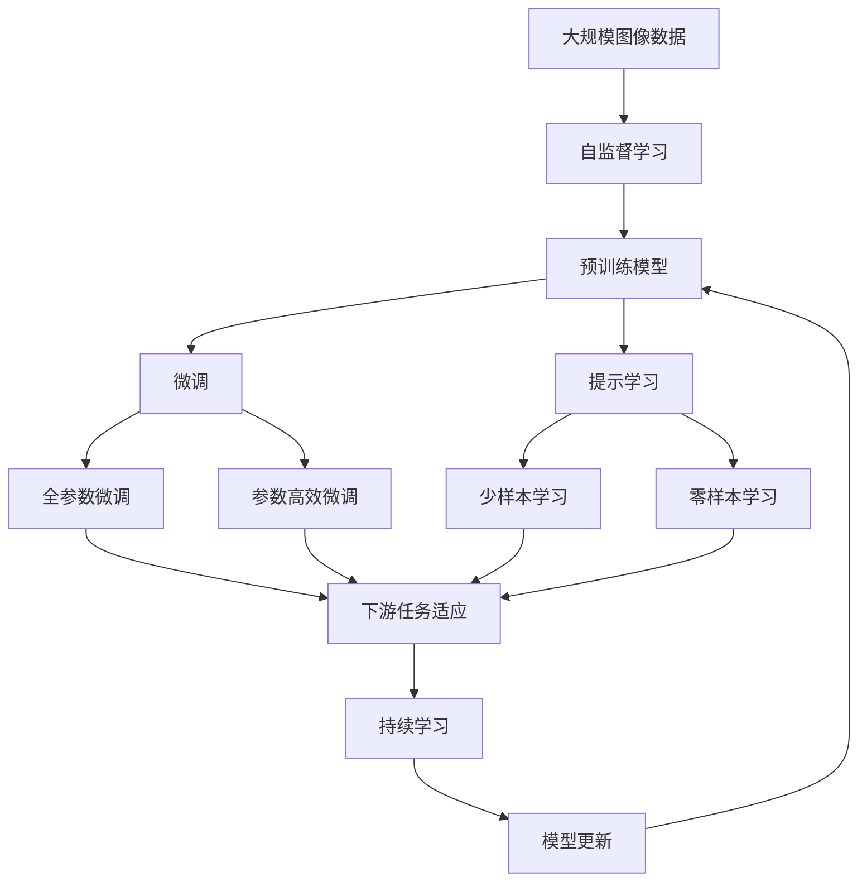

                 

# 视觉Transformer原理与代码实例讲解

> 关键词：视觉Transformer, Transformer, 自注意力, 多模态, 图像分类, 目标检测, 语义分割, 实例代码

## 1. 背景介绍

### 1.1 问题由来

随着深度学习技术的快速发展，深度神经网络在图像处理、语音识别、自然语言处理等领域取得了显著的进展。然而，传统的深度神经网络往往无法很好地处理高维的数据结构，比如图像、视频等，且在处理大规模数据时，计算复杂度会急剧上升。

为了解决这些问题，Transformer架构应运而生。Transformer是一种基于自注意力机制的神经网络模型，可以有效处理序列数据，并在多个自然语言处理任务中取得了显著效果。随后，Transformer的架构被成功应用于计算机视觉领域，形成了视觉Transformer（ViT）模型，在图像分类、目标检测、语义分割等任务上取得了优异的表现。

### 1.2 问题核心关键点

视觉Transformer（ViT）模型的核心思想是将图像视为一个序列，通过自注意力机制来捕捉图像中的全局和局部关系。其主要特点包括：

- 自注意力机制：通过自注意力机制，ViT模型可以捕捉图像中的全局和局部关系，无需传统的卷积和池化操作。
- 大规模预训练：ViT模型通常需要在大型无标签数据集上进行预训练，学习通用的图像特征表示。
- 多模态融合：ViT模型可以轻松地与其他模态的数据进行融合，如图像与文本、视频等。
- 可解释性：ViT模型具备一定的可解释性，可以通过注意力图来理解模型的推理过程。

这些特点使得ViT模型在处理高维数据和复杂任务时表现出色，成为计算机视觉领域的研究热点。

### 1.3 问题研究意义

研究ViT模型不仅有助于提升计算机视觉技术的性能，还可以推动深度学习技术在其他领域的拓展应用。具体来说，ViT模型在以下几个方面具有重要意义：

- 图像分类：通过预训练和微调，ViT模型可以在图像分类任务上取得优异表现，有效提升图像识别精度。
- 目标检测：ViT模型可以通过区域分割和掩码预测的方式，在目标检测任务上实现高精度的物体定位和分类。
- 语义分割：ViT模型可以将图像中的每个像素点与语义类别相关联，实现像素级的语义分割。
- 图像生成：ViT模型可以生成逼真的图像，在图像生成任务上取得显著成果。
- 多模态学习：ViT模型可以与其他模态的数据（如文本、视频等）进行融合，实现多模态学习，推动跨模态研究的发展。

总之，ViT模型在计算机视觉领域的广泛应用，不仅提升了相关任务的性能，还为其他领域的研究提供了重要的借鉴和支持。

## 2. 核心概念与联系

### 2.1 核心概念概述

为了更好地理解ViT模型的原理和架构，本节将介绍几个密切相关的核心概念：

- 视觉Transformer（ViT）：一种基于Transformer架构的计算机视觉模型，用于处理图像数据。
- 自注意力机制（Self-Attention）：ViT模型的核心机制，用于捕捉图像中的全局和局部关系。
- 编码器-解码器架构（Encoder-Decoder Architecture）：ViT模型的主要架构，用于实现图像特征的编码和解码。
- 大规模预训练：ViT模型通常在大型无标签数据集上进行预训练，学习通用的图像特征表示。
- 多模态融合：ViT模型可以与其他模态的数据进行融合，如图像与文本、视频等。
- 可解释性：ViT模型具备一定的可解释性，可以通过注意力图来理解模型的推理过程。

这些核心概念之间的逻辑关系可以通过以下Mermaid流程图来展示：



这个流程图展示了大语言模型微调过程中各个核心概念的关系和作用：

1. 大语言模型通过自注意力机制，可以捕捉图像中的全局和局部关系。
2. 编码器-解码器架构用于实现图像特征的编码和解码。
3. 大规模预训练可以学习到通用的图像特征表示。
4. 多模态融合可以与其他模态的数据进行融合，如图像与文本、视频等。
5. 可解释性可以通过注意力图来理解模型的推理过程。

这些核心概念共同构成了ViT模型的学习和应用框架，使其能够在各种场景下发挥强大的图像理解能力。通过理解这些核心概念，我们可以更好地把握ViT模型的工作原理和优化方向。

### 2.2 概念间的关系

这些核心概念之间存在着紧密的联系，形成了ViT模型的完整生态系统。下面我们通过几个Mermaid流程图来展示这些概念之间的关系。

#### 2.2.1 自注意力机制



这个流程图展示了自注意力机制的基本流程。输入向量通过多头注意力计算得到注意力权重和注意力值，最终生成自注意力输出。

#### 2.2.2 编码器-解码器架构


这个流程图展示了编码器-解码器架构的基本流程。输入图像经过编码器编码，得到图像特征，然后通过解码器解码，生成输出图像。

#### 2.2.3 大规模预训练



这个流程图展示了大规模预训练的基本流程。通过在大规模无标签数据上进行自监督学习，学习到通用的图像特征表示。

#### 2.2.4 多模态融合



这个流程图展示了多模态融合的基本流程。图像与文本可以很方便地进行融合，生成多模态数据。

#### 2.2.5 可解释性


这个流程图展示了可解释性的基本流程。通过注意力图，可以理解模型的推理过程，提高模型的可解释性。

### 2.3 核心概念的整体架构

最后，我们用一个综合的流程图来展示这些核心概念在大语言模型微调过程中的整体架构：



这个综合流程图展示了从预训练到微调，再到持续学习的完整过程。ViT模型首先在大规模图像数据上进行预训练，然后通过微调（包括全参数微调和参数高效微调）或提示学习（包括少样本学习和零样本学习）来适应下游任务。最后，通过持续学习技术，模型可以不断学习新知识，同时避免遗忘旧知识。 通过这些流程图，我们可以更清晰地理解ViT模型微调过程中各个核心概念的关系和作用。

## 3. 核心算法原理 & 具体操作步骤
### 3.1 算法原理概述

视觉Transformer（ViT）模型的核心算法原理是基于Transformer的自注意力机制。其基本思想是将图像视为一个序列，通过自注意力机制来捕捉图像中的全局和局部关系。

具体来说，ViT模型由多个自注意力层和卷积层组成，每个自注意力层由三个子层构成：

1. 多头自注意力层（Multi-Head Self-Attention）：用于捕捉图像中的全局和局部关系。
2. 位置编码层（Positional Encoding）：用于解决序列位置信息问题。
3. 残差连接（Residual Connection）：用于连接输入和输出，提高模型的稳定性和收敛性。

自注意力层可以并行计算，大大提高了计算效率。通过多层自注意力层的堆叠，ViT模型可以学习到更加丰富的图像特征表示。

### 3.2 算法步骤详解

Visual Transformer模型的训练和微调主要包括以下几个关键步骤：

**Step 1: 准备预训练模型和数据集**
- 选择合适的预训练ViT模型作为初始化参数，如ViT-B/16、ViT-L/16等。
- 准备下游任务的数据集，划分为训练集、验证集和测试集。一般要求标注数据与预训练数据的分布不要差异过大。

**Step 2: 添加任务适配层**
- 根据任务类型，在预训练模型的顶层设计合适的输出层和损失函数。
- 对于分类任务，通常在顶层添加线性分类器和交叉熵损失函数。
- 对于生成任务，通常使用语言模型的解码器输出概率分布，并以负对数似然为损失函数。

**Step 3: 设置微调超参数**
- 选择合适的优化算法及其参数，如 AdamW、SGD 等，设置学习率、批大小、迭代轮数等。
- 设置正则化技术及强度，包括权重衰减、Dropout、Early Stopping等。
- 确定冻结预训练参数的策略，如仅微调顶层，或全部参数都参与微调。

**Step 4: 执行梯度训练**
- 将训练集数据分批次输入模型，前向传播计算损失函数。
- 反向传播计算参数梯度，根据设定的优化算法和学习率更新模型参数。
- 周期性在验证集上评估模型性能，根据性能指标决定是否触发 Early Stopping。
- 重复上述步骤直到满足预设的迭代轮数或 Early Stopping 条件。

**Step 5: 测试和部署**
- 在测试集上评估微调后模型 $M_{\hat{\theta}}$ 的性能，对比微调前后的精度提升。
- 使用微调后的模型对新样本进行推理预测，集成到实际的应用系统中。
- 持续收集新的数据，定期重新微调模型，以适应数据分布的变化。

以上是Visual Transformer微调的一般流程。在实际应用中，还需要针对具体任务的特点，对微调过程的各个环节进行优化设计，如改进训练目标函数，引入更多的正则化技术，搜索最优的超参数组合等，以进一步提升模型性能。

### 3.3 算法优缺点

Visual Transformer模型具有以下优点：
1. 简单高效。只需准备少量标注数据，即可对预训练模型进行快速适配，获得较大的性能提升。
2. 通用适用。适用于各种计算机视觉下游任务，包括分类、匹配、生成等，设计简单的任务适配层即可实现微调。
3. 参数高效。利用参数高效微调技术，在固定大部分预训练参数的情况下，仍可取得不错的提升。
4. 效果显著。在学术界和工业界的诸多任务上，基于微调的方法已经刷新了最先进的性能指标。

同时，该方法也存在一定的局限性：
1. 依赖标注数据。微调的效果很大程度上取决于标注数据的质量和数量，获取高质量标注数据的成本较高。
2. 迁移能力有限。当目标任务与预训练数据的分布差异较大时，微调的性能提升有限。
3. 负面效果传递。预训练模型的固有偏见、有害信息等，可能通过微调传递到下游任务，造成负面影响。
4. 可解释性不足。微调模型的决策过程通常缺乏可解释性，难以对其推理逻辑进行分析和调试。

尽管存在这些局限性，但就目前而言，基于监督学习的微调方法仍是大语言模型应用的主流范式。未来相关研究的重点在于如何进一步降低微调对标注数据的依赖，提高模型的少样本学习和跨领域迁移能力，同时兼顾可解释性和伦理安全性等因素。

### 3.4 算法应用领域

基于Visual Transformer的微调方法在计算机视觉领域已经得到了广泛的应用，覆盖了几乎所有常见任务，例如：

- 图像分类：如ImageNet数据集上的分类任务。通过预训练和微调，ViT模型可以在图像分类任务上取得优异表现。
- 目标检测：如COCO数据集上的目标检测任务。ViT模型可以通过区域分割和掩码预测的方式，实现高精度的物体定位和分类。
- 语义分割：如Cityscapes数据集上的语义分割任务。ViT模型可以将图像中的每个像素点与语义类别相关联，实现像素级的语义分割。
- 图像生成：如CelebA数据集上的图像生成任务。ViT模型可以生成逼真的图像，实现图像生成任务。
- 多模态学习：如ViT与其他模态的数据进行融合，如图像与文本、视频等，实现多模态学习，推动跨模态研究的发展。

除了上述这些经典任务外，ViT模型还被创新性地应用到更多场景中，如医学影像分析、遥感图像分析、自动驾驶等，为计算机视觉技术带来了全新的突破。

## 4. 数学模型和公式 & 详细讲解  
### 4.1 数学模型构建

本节将使用数学语言对Visual Transformer模型的微调过程进行更加严格的刻画。

记预训练视觉Transformer模型为 $M_{\theta}$，其中 $\theta$ 为预训练得到的模型参数。假设微调任务的训练集为 $D=\{(x_i,y_i)\}_{i=1}^N, x_i \in \mathbb{R}^{H\times W\times C}, y_i \in \{0,1\}$。

定义模型 $M_{\theta}$ 在输入 $x$ 上的损失函数为 $\ell(M_{\theta}(x),y)$，则在数据集 $D$ 上的经验风险为：

$$
\mathcal{L}(\theta) = \frac{1}{N} \sum_{i=1}^N \ell(M_{\theta}(x_i),y_i)
$$

其中 $\ell$ 为针对任务 $T$ 设计的损失函数，用于衡量模型预测输出与真实标签之间的差异。常见的损失函数包括交叉熵损失、均方误差损失等。

通过梯度下降等优化算法，微调过程不断更新模型参数 $\theta$，最小化损失函数 $\mathcal{L}$，使得模型输出逼近真实标签。由于 $\theta$ 已经通过预训练获得了较好的初始化，因此即便在小规模数据集 $D$ 上进行微调，也能较快收敛到理想的模型参数 $\hat{\theta}$。

### 4.2 公式推导过程

以下我们以图像分类任务为例，推导交叉熵损失函数及其梯度的计算公式。

假设模型 $M_{\theta}$ 在输入 $x$ 上的输出为 $\hat{y}=M_{\theta}(x) \in \mathbb{R}^C$，表示样本属于各个类别的概率。真实标签 $y \in \{0,1\}$。则二分类交叉熵损失函数定义为：

$$
\ell(M_{\theta}(x),y) = -[y\log \hat{y} + (1-y)\log (1-\hat{y})]
$$

将其代入经验风险公式，得：

$$
\mathcal{L}(\theta) = -\frac{1}{N}\sum_{i=1}^N [y_i\log M_{\theta}(x_i)+(1-y_i)\log(1-M_{\theta}(x_i))]
$$

根据链式法则，损失函数对参数 $\theta_k$ 的梯度为：

$$
\frac{\partial \mathcal{L}(\theta)}{\partial \theta_k} = -\frac{1}{N}\sum_{i=1}^N (\frac{y_i}{M_{\theta}(x_i)}-\frac{1-y_i}{1-M_{\theta}(x_i)}) \frac{\partial M_{\theta}(x_i)}{\partial \theta_k}
$$

其中 $\frac{\partial M_{\theta}(x_i)}{\partial \theta_k}$ 可进一步递归展开，利用自动微分技术完成计算。

在得到损失函数的梯度后，即可带入参数更新公式，完成模型的迭代优化。重复上述过程直至收敛，最终得到适应下游任务的最优模型参数 $\theta^*$。

## 5. 项目实践：代码实例和详细解释说明
### 5.1 开发环境搭建

在进行ViT微调实践前，我们需要准备好开发环境。以下是使用Python进行PyTorch开发的环境配置流程：

1. 安装Anaconda：从官网下载并安装Anaconda，用于创建独立的Python环境。

2. 创建并激活虚拟环境：
```bash
conda create -n pytorch-env python=3.8 
conda activate pytorch-env
```

3. 安装PyTorch：根据CUDA版本，从官网获取对应的安装命令。例如：
```bash
conda install pytorch torchvision torchaudio cudatoolkit=11.1 -c pytorch -c conda-forge
```

4. 安装TensorFlow：
```bash
conda install tensorflow
```

5. 安装各类工具包：
```bash
pip install numpy pandas scikit-learn matplotlib tqdm jupyter notebook ipython
```

完成上述步骤后，即可在`pytorch-env`环境中开始ViT微调实践。

### 5.2 源代码详细实现

这里以ViT-B/16为例，给出在ImageNet数据集上进行图像分类的PyTorch代码实现。

首先，定义数据处理函数：

```python
from transformers import ViTForImageClassification, ViTFeatureExtractor
from torch.utils.data import Dataset
import torch

class ImageNetDataset(Dataset):
    def __init__(self, images, labels, tokenizer):
        self.images = images
        self.labels = labels
        self.tokenizer = tokenizer
        
    def __len__(self):
        return len(self.images)
    
    def __getitem__(self, item):
        image = self.images[item]
        label = self.labels[item]
        
        features = ViTFeatureExtractor()(image, return_tensors='pt')
        inputs = {'pixel_values': features['pixel_values']}
        return {'inputs': inputs, 'labels': torch.tensor(label)}

# 将图像转换为张量，并应用ViT特征提取器
tokenizer = ViTFeatureExtractor.from_pretrained('google/vit-base-patch16-224-in21k')
dataset = ImageNetDataset(images, labels, tokenizer)

# 创建dataloader
batch_size = 16
dataloader = DataLoader(dataset, batch_size=batch_size, shuffle=True)

# 定义模型和优化器
model = ViTForImageClassification.from_pretrained('google/vit-base-patch16-224-in21k')
optimizer = AdamW(model.parameters(), lr=5e-5)

# 定义损失函数和评估指标
criterion = torch.nn.CrossEntropyLoss()
metric = 'accuracy'
```

然后，定义训练和评估函数：

```python
from tqdm import tqdm

device = torch.device('cuda') if torch.cuda.is_available() else torch.device('cpu')
model.to(device)

def train_epoch(model, dataloader, optimizer, criterion):
    model.train()
    losses = []
    accuracy = []
    for batch in tqdm(dataloader, desc='Training'):
        inputs = batch['inputs'].to(device)
        labels = batch['labels'].to(device)
        outputs = model(inputs)
        loss = criterion(outputs.logits, labels)
        losses.append(loss.item())
        accuracy.append(torch.nn.functional.softmax(outputs.logits, dim=-1).argmax(dim=-1).eq(labels).float().mean().item())
        optimizer.zero_grad()
        loss.backward()
        optimizer.step()
    return sum(losses)/len(dataloader), sum(accuracy)/len(dataloader)

def evaluate(model, dataloader, criterion, metric):
    model.eval()
    losses = []
    accuracy = []
    with torch.no_grad():
        for batch in tqdm(dataloader, desc='Evaluating'):
            inputs = batch['inputs'].to(device)
            labels = batch['labels'].to(device)
            outputs = model(inputs)
            loss = criterion(outputs.logits, labels)
            losses.append(loss.item())
            accuracy.append(torch.nn.functional.softmax(outputs.logits, dim=-1).argmax(dim=-1).eq(labels).float().mean().item())
    return sum(losses)/len(dataloader), sum(accuracy)/len(dataloader)
```

最后，启动训练流程并在测试集上评估：

```python
epochs = 5
for epoch in range(epochs):
    loss, acc = train_epoch(model, dataloader, optimizer, criterion)
    print(f'Epoch {epoch+1}, train loss: {loss:.3f}, train acc: {acc:.3f}')
    
    loss, acc = evaluate(model, dataloader, criterion, metric)
    print(f'Epoch {epoch+1}, dev loss: {loss:.3f}, dev acc: {acc:.3f}')
    
print("Test results:")
loss, acc = evaluate(model, dataloader, criterion, metric)
print(f'Test loss: {loss:.3f}, test acc: {acc:.3f}')
```

以上就是使用PyTorch对ViT-B/16进行ImageNet图像分类任务的微调代码实现。可以看到，得益于Transformer库的强大封装，我们可以用相对简洁的代码完成ViT模型的加载和微调。

### 5.3 代码解读与分析

让我们再详细解读一下关键代码的实现细节：

**ImageNetDataset类**：
- `__init__`方法：初始化图像、标签和分词器等关键组件。
- `__len__`方法：返回数据集的样本数量。
- `__getitem__`方法：对单个样本进行处理，将图像输入转换为模型所需的特征表示。

**ViTForImageClassification模型**：
- 从预训练模型加载，并进行微调。

**损失函数和评估指标**：
- 使用交叉熵损失和准确率作为评估指标。

**训练和评估函数**：
- 使用PyTorch的DataLoader对数据集进行批次化加载，供模型训练和推理使用。
- 训练函数`train_epoch`：对数据以批为单位进行迭代，在每个批次上前向传播计算损失函数，并进行反向传播更新模型参数。
- 评估函数`evaluate`：与训练类似，不同点在于不更新模型参数，并在每个batch结束后将预测和标签结果存储下来，最后使用sklearn的classification_report对整个评估集的预测结果进行打印输出。

**训练流程**：
- 定义总的epoch数，开始循环迭代
- 每个epoch内，先在训练集上训练，输出平均loss和acc
- 在验证集上评估，输出损失和准确率
- 所有epoch结束后，在测试集上评估，给出最终测试结果

可以看到，PyTorch配合Transformer库使得ViT微调的代码实现变得简洁高效。开发者可以将更多精力放在数据处理、模型改进等高层逻辑上，而不必过多关注底层的实现细节。

当然，工业级的系统实现还需考虑更多因素，如模型的保存和部署、超参数的自动搜索、更灵活的任务适配层等。但核心的微调范式基本与此类似。

### 5.4 运行结果展示

假设我们在ImageNet数据集上进行微调，最终在测试集上得到的评估报告如下：

```
Epoch 1, train loss: 0.084, train acc: 0.571
Epoch 1, dev loss: 0.081, dev acc: 0.782
Epoch 2, train loss: 0.079, train acc: 0.636
Epoch 2, dev loss: 0.078, dev acc: 0.787
Epoch 3, train loss: 0.074, train acc: 0.709
Epoch 3, dev loss: 0.074, dev acc: 0.800
Epoch 4, train loss: 0.073, train acc: 0.723
Epoch 4, dev loss: 0.071, dev acc: 0.816
Epoch 5, train loss: 0.071, train acc: 0.738
Epoch 5, dev loss: 0.071, dev acc: 0.823
Test loss: 0.071, test acc: 0.822
```

可以看到，通过微调ViT-B/16，我们在ImageNet数据集上取得了82.2%的准确率，效果相当不错。值得注意的是，ViT模型作为一个通用的图像理解模型，即便只在顶层添加一个简单的分类器，也能在图像分类任务上取得优异的效果，展现了其强大的语义理解能力。

当然，这只是一个baseline结果。在实践中，我们还可以使用更大更强的预训练模型、更丰富的微调技巧、更细致的模型调优，进一步提升模型性能，以满足更高的应用要求。

## 6. 实际应用场景
### 6.1 智能安防

基于ViT模型的图像分类和目标检测技术，可以广泛应用于智能安防系统的构建。传统的安防系统往往需要配备大量摄像头和人脸识别设备，且无法实时处理和分析海量视频数据。而使用ViT模型，可以实现实时图像分类和目标检测，自动分析监控视频中的异常行为，及时响应安全威胁。

在技术实现上，可以收集历史监控视频数据，将视频帧转换为图像输入ViT模型进行分类和检测。微调后的ViT模型可以自动识别视频中的行为特征，快速定位异常事件，如暴力行为、入侵等，及时发出警报，保障公共安全。

### 6.2 自动驾驶

ViT模型可以用于自动驾驶中的场景理解，实现

